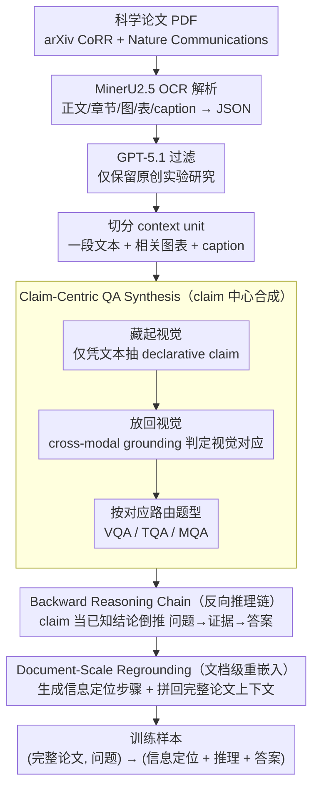

# SciMDR: Advancing Scientific Multimodal Document Reasoning

**会议**: ACL2026  
**arXiv**: [2603.12249](https://arxiv.org/abs/2603.12249)  
**代码**: 未找到公开代码链接  
**领域**: 多模态VLM / 科学文档理解  
**关键词**: 科学文档推理、多模态QA、数据合成、长文档理解、证据定位

## 一句话总结
SciMDR 提出 synthesize-and-reground 数据构造框架，先在原子 claim 上合成可信 QA 与推理链，再把它们重嵌入完整科学论文中训练模型，使 7B VLM 在科学多模态文档推理上接近 GPT-5 系列表现。

## 研究背景与动机
**领域现状**：科学文档理解正在从摘要级 QA、图表 QA 走向完整论文级推理。真实科研问题往往需要同时读正文、图、表、caption 和实验描述，并在长文档中定位证据。

**现有痛点**：高质量科学 QA 数据存在三角矛盾：人工标注质量高但规模小；从图表或片段构造数据更可信但不真实；直接从完整文档生成问题更接近真实使用，但长上下文会稀释注意力并增加幻觉，导致答案和推理链不可靠。

**核心矛盾**：训练科学助手既需要 faithful 的监督信号，又需要 realistic 的完整文档任务。只用短片段训练，模型学不到在整篇论文中找证据；直接用整篇论文合成，又难以保证标注正确。

**本文目标**：构建一个大规模训练集 SciMDR 和一个专家标注评测集 SciMDR-Eval，让模型学习在完整科学文档中定位证据、连接文字与视觉元素、执行多步科学推理，并验证合成数据是否真正提升科学 QA 能力。

**切入角度**：作者把“生成可信 QA”和“构造真实训练任务”解耦。第一阶段只在小而可验证的原子上下文中生成 QA 和 CoT；第二阶段利用 claim 中记录的证据位置，把 QA 重嵌入完整文档，并给出信息定位步骤。

**核心 idea**：先把答案和证据锁定在原子 claim 上，再把同一监督信号放回完整论文环境，让模型在高噪声长上下文中学习“先找证据、再推理、最后回答”。

## 方法详解
SciMDR 的方法重点不是提出新模型结构，而是提出一种面向科学多模态文档的训练数据生成范式。它把科学论文解析成文本、章节、图表与 caption，围绕 claim 生成 VQA/TQA/MQA 三类 QA，再通过 document-scale regrounding 把这些 QA 变成完整文档训练样本。

### 整体框架
输入是 arXiv CoRR 与 Nature Communications 中筛选后的科学论文 PDF，经过 MinerU2.5 OCR 提取正文、章节、图、表和 caption，并序列化为 JSON。之后 GPT-5.1 先判断论文是否是原创实验研究，过滤 survey、position paper、tutorial 和纯概念文章。最终训练数据覆盖约 20K 篇论文、300K 条 QA；评测集来自 300 篇 arXiv 论文，由 3 名 CS 研究生人工构造 907 条高质量 QA。

框架包含两个阶段。Claim-Centric QA Synthesis 负责在小上下文中生成可信数据；Document-Scale Regrounding 负责把这些数据变成完整论文级训练任务。训练格式最终是 `(Full Document Context, Question) -> (Information Localization + Reasoning + Final Answer)`。

### 关键设计
**1. Claim-Centric QA Synthesis：先把答案锁死在小而可验证的上下文里，再生成 QA 和推理链**

直接丢一整篇论文让 LLM 开放式出题，幻觉和证据错配的风险很高——上下文一长，注意力被稀释，模型容易编出"看似合理但论文里根本没说"的答案。SciMDR 反其道而行：每个多模态 context unit 只含一段文本、相关图表和 caption，系统先找出文中引用视觉元素的句子，把视觉信息暂时藏起来，让 LLM 仅凭文本拆出一条条离散的 declarative claim；随后再把视觉信息放回来，用 cross-modal grounding 判断每个 claim 是否有视觉对应物，据此把它路由到 VQA、TQA 或 MQA 三类题型。

这样做的妙处在于：claim 等于先给出了"答案蓝图"，把推理链生成从"开放推断答案"降级成"解释为什么这个答案成立"。生成空间被框死在可验证的小范围里，幻觉和证据错配自然大幅下降。

**2. Backward Reasoning Chain Construction：把 claim 当成已知结论，让模型反向把问题、证据、答案串起来**

科学 QA 真正难的两件事是 evidence retrieval（在长文里找证据）和 open-ended inference（自己推出结论）。如果让模型正向硬推，这两个难点叠在一起，CoT 质量很难稳定。SciMDR 把 claim 直接当作 ground-truth conclusion，让 LLM 不必自己发现答案，而是围绕这个已知结论，构造一条从问题出发、经过证据、最终落到 claim 的推理链。

换句话说，"找证据"这件事被部分外包给了前一步的 claim 抽取与定位，模型只需负责把逻辑链补顺。难点被拆解、外包之后，得到的 CoT 监督信号也就更稳定、更可模仿、更可验证。

**3. Document-Scale Regrounding：把原子 QA 重新塞回完整论文，让任务保持真实的长文档噪声**

前两步保证了 faithful，但代价是脱离真实场景——真实用户不会贴心地先帮模型截好相关段落。每个 QA 绑定的 claim 其实已经记下了文本和视觉证据的位置，SciMDR 因此能自动生成一段 Information Localization 步骤，例如"先查看 Section X，再交叉引用 Table Y"，把它 prepend 到合成推理链前面，再连同完整论文上下文一起打包成训练样本。最终的训练格式是 `(Full Document Context, Question) -> (Information Localization + Reasoning + Final Answer)`。

这一步正好补上了短上下文方案"faithful 但不 realistic"的缺口：任务恢复了整篇论文的高噪声长上下文，逼模型学会"先定位再推理"，但答案链背后依然有精确证据兜底，不会因为上下文变长就失真。

### 一个完整示例：一段实验描述如何变成一条文档级训练样本

以一篇带实验图表的 arXiv 论文为例，走一遍数据是怎么被"造"出来的：

1. **解析**：PDF 经 MinerU2.5 OCR 提取出正文、章节、图、表和 caption，序列化成 JSON；GPT-5.1 先判定这是一篇原创实验研究（而非 survey / position paper），予以保留。
2. **切 context unit**：取 Section 4 的一段文字"Figure 3 shows our method outperforms baseline by 5 points"，连同 Figure 3 及其 caption 组成一个 unit。
3. **抽 claim（藏视觉）**：先盖住 Figure 3，仅凭文本拆出 claim——"本文方法在该指标上比 baseline 高 5 分"。
4. **路由题型（放回视觉）**：把 Figure 3 放回，cross-modal grounding 发现该 claim 的关键数字需要读图确认，于是路由为 VQA，生成问题"本文方法相比 baseline 提升了多少？"。
5. **反向构链**：以 claim 为已知结论，生成 CoT——"问题问的是性能差距 → 证据在 Figure 3 的柱状图 → 读出两根柱子之差为 5 分 → 答案：5 分"。
6. **文档级重嵌入**：把整篇论文作为上下文，前置 Information Localization"先定位 Section 4，再交叉引用 Figure 3"，最终落成一条 `(完整论文, 问题) -> (定位 + 推理 + 答案)` 的训练样本。

整套流程下来，约 20K 篇论文产出 300K 条 QA，而每一条都既扛得住长文档噪声、又有精确证据支撑。

### 损失函数 / 训练策略
论文采用监督微调而非新损失函数。主实验以 Qwen2.5-VL-7B 为 base model，分两阶段训练：Stage 1 用 VQA 与 TQA 数据训练 1 epoch，peak learning rate 为 $1\times10^{-5}$，batch size 64；Stage 2 继续用 MQA 数据训练 1 epoch，learning rate 为 $1\times10^{-6}$。微调时冻结视觉编码器和 projector，只训练语言模型。SPIQA baseline 也用相同 base model 复现，以隔离数据质量差异。

## 实验关键数据

### 主实验
主表展示了 SciMDR 训练对 Qwen2.5-VL-7B 的提升。虽然表格中论文 PDF 的数据集名被渲染污染，但最后一列对应作者构造的 SciMDR-Eval；`+ SciMDR` 是使用本文 300K 数据微调后的模型。

| 模型 | ChartQA | CharXiv-D | CharXiv-R | SPIQA-A | SPIQA-B | SPIQA-C | SciMDR-Eval |
|------|---------|-----------|-----------|---------|---------|---------|-------------|
| GPT-5.1 | - | 90.9 | 58.3 | 79.4 | 79.8 | 71.6 | 47.2 |
| GPT-5.2 | - | 95.2 | 73.1 | 79.9 | 75.4 | 74.0 | 49.9 |
| Qwen-3-VL-8B | 87.4 | 74.2 | 40.1 | 73.2 | 64.0 | 62.3 | 34.2 |
| Qwen2.5-VL-7B | 84.6 | 65.0 | 37.7 | 66.4 | 56.6 | 48.9 | 19.8 |
| Qwen2.5-VL-7B + SPIQA | 81.8 | 50.9 | 33.3 | 62.7 | 44.7 | 40.0 | 5.6 |
| Qwen2.5-VL-7B + SciMDR | 86.3 | 75.6 | 37.9 | 68.6 | 58.8 | 47.3 | 49.1 |

与 proprietary model 的直接比较说明 SciMDR-Eval 难度较高，也说明 7B 专用训练能显著缩小差距。

| 模型 | SciMDR-Eval |
|------|-------------|
| GPT-5.2 | 49.9 |
| GPT-5.1 | 47.2 |
| GPT-4o | 24.7 |
| Qwen2.5-VL-7B | 19.8 |
| Qwen2.5-VL-7B + SciMDR | 49.1 |

### 消融实验
论文的关键分析用 LLaVA-1.5-7B 做数据质量 probe。作者在同样 50K 样本规模下比较原始 SPIQA、SciMDR VQA，以及用本文 claim-centric pipeline 重新标注的 SPIQA。正文报告重新标注 SPIQA 从 35.7 提升到 39.8，并且输出在 CharXiv 上平均长度约为原始数据的 5 倍，说明收益来自推理链质量而不仅是数据来源。

| 配置 | 关键结果 | 说明 |
|------|----------|------|
| Qwen2.5-VL-7B base | SciMDR-Eval 19.8 | 通用 VLM 难以处理完整科学论文推理 |
| + SPIQA 数据 | SciMDR-Eval 5.6 | 短上下文合成数据迁移到完整文档反而退化 |
| + SciMDR 数据 | SciMDR-Eval 49.1 | 信息定位 + 推理链显著提升真实文档 QA |
| SPIQA 重新标注 | 39.8 vs 原始 35.7 | 同源文档下，claim-centric 标注质量更好 |

### 关键发现
- `+ SciMDR` 对 SciMDR-Eval 的提升最大，从 19.8 到 49.1，增加 29.3 分，几乎追平 GPT-5.2 的 49.9。
- `+ SPIQA` 在多数指标上下降，尤其 SciMDR-Eval 从 19.8 降到 5.6，说明现有短上下文合成数据并不能自然教会模型在完整论文中找证据。
- 在 CharXiv-D 上，SciMDR 从 65.0 提升到 75.6，说明 claim-centric 数据不仅服务于自建评测集，也能迁移到图表型科学 QA。
- SPIQA-C 上略降 1.6，提示专门训练完整文档定位可能牺牲部分原有子任务表现，或者评测集间技能分布存在差异。

## 亮点与洞察
- 论文最核心的洞察是把数据合成的两个目标拆开：faithfulness 在小上下文里保证，realism 在完整文档里恢复。这个拆法比“直接长文档生成”更稳，也比“只做片段 QA”更贴近应用。
- claim 作为中间表示非常有用。它既是 QA 生成的答案蓝图，又是重嵌入阶段的信息定位地图，相当于把“标注质量控制”和“训练任务构造”接在了一起。
- Information Localization 监督是科学文档助手训练中容易被忽略的一步。很多数据只给最终答案和 CoT，但 SciMDR 明确让模型先说应该查哪个 section/table/figure，这更接近真实科研阅读。
- 结果也提醒我们，数据规模不等于数据有效。SPIQA 这样的合成数据在不匹配任务形态时可能损害模型，专门面向完整文档的训练格式才是关键。

## 局限与展望
- 作者承认训练数据质量受 GPT-5.1 这个 proprietary teacher 限制。即使用原子 claim 降低幻觉，teacher 在冷门科学领域的细微错误仍可能被硬编码进学生模型。
- 实验主要集中在 STEM，尤其是计算机科学和自然科学。人文、社会科学等领域的论证结构、证据形式和语言风格不同，SciMDR 的 pipeline 是否适用尚未验证。
- 数据构造高度依赖 OCR、图表解析和章节结构抽取。MinerU2.5 的解析错误可能影响 claim、证据位置和重嵌入质量，论文没有系统量化这部分误差传播。
- SciMDR-Eval 使用 LLM judge 评分开放式回答，虽然合理，但仍可能引入 judge 偏差。后续可以增加人工复核、事实一致性检查和跨 judge 稳定性分析。

## 相关工作与启发
- **vs ChartQA / CharXiv**: 这些基准强调图表或科学图像理解，SciMDR 强调完整论文中的图文证据定位与推理，更接近科研助手场景。
- **vs SPIQA**: SPIQA 是近期科学论文 QA 数据，但其合成方式更偏短上下文。SciMDR 的结果表明，如果训练目标是完整文档推理，就必须显式加入 full-document regrounding。
- **vs 人工标注科学 QA**: ExpertQA、QASPER 等人工标注质量高但规模有限。SciMDR 用 claim-centric 合成扩展到 300K QA，同时用 907 条人工评测集验证效果。
- **启发**: 对医学文档、法律文档、专利文档等长多模态材料，也可以沿用“原子可信标注 + 文档级重嵌入”的构造范式。

## 评分
- 新颖性: ⭐⭐⭐⭐☆ 核心不是新模型，而是非常实用的数据构造范式；claim 同时承担答案蓝图和证据地图的设计很巧。
- 实验充分度: ⭐⭐⭐⭐☆ 主结果、proprietary model 对比和数据质量分析较强，但 OCR 误差和 judge 稳定性分析不足。
- 写作质量: ⭐⭐⭐⭐☆ 逻辑线清晰，faithfulness-realism dilemma 讲得好；PDF 文本中数据集名渲染污染较严重，但不影响主要理解。
- 价值: ⭐⭐⭐⭐⭐ 对科学文档 VLM 训练很有启发，尤其适合构建能读完整论文的科研助手。

<!-- RELATED:START -->

## 相关论文

- [\[ACL 2026\] TeXOCR: Advancing Document OCR Models for Compilable Page-to-LaTeX Reconstruction](texocr_advancing_document_ocr_models_for_compilable_page-to-latex_reconstruction.md)
- [\[ACL 2026\] ShredBench: Evaluating the Semantic Reasoning Capabilities of Multimodal LLMs in Document Reconstruction](shredbench_evaluating_the_semantic_reasoning_capabilities_of_multimodal_llms_in_.md)
- [\[ACL 2026\] Position: Multimodal Large Language Models Can Significantly Advance Scientific Reasoning](position_multimodal_large_language_models_can_significantly_advance_scientific_r.md)
- [\[CVPR 2026\] DocSeeker: Structured Visual Reasoning with Evidence Grounding for Long Document Understanding](../../CVPR2026/multimodal_vlm/docseeker_long_document_understanding.md)
- [\[ACL 2026\] Decoding Scientific Experimental Images: The SPUR Benchmark for Perception, Understanding, and Reasoning](decoding_scientific_experimental_images_the_spur_benchmark_for_perception_unders.md)

<!-- RELATED:END -->
