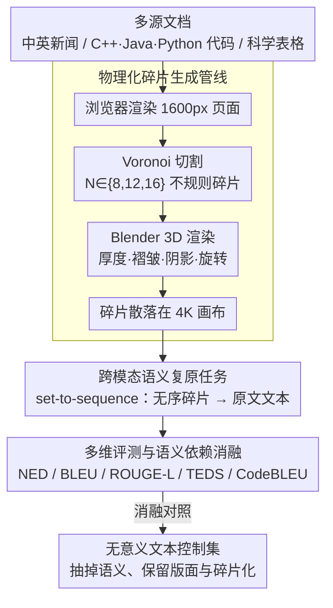

# ShredBench: Evaluating the Semantic Reasoning Capabilities of Multimodal LLMs in Document Reconstruction

**会议**: ACL2026 Findings  
**arXiv**: [2604.23813](https://arxiv.org/abs/2604.23813)  
**代码**: https://github.com/ythere-y/ShredBench  
**领域**: 多模态VLM / 文档理解 / 多模态推理  
**关键词**: 文档重建, MLLM评测, 碎片化文档, 语义推理, OCR鲁棒性

## 一句话总结
ShredBench 构造了一个“把文档撕碎后让多模态大模型复原内容”的评测基准，证明当前 MLLM 即使在常规 OCR 上很强，也普遍缺乏把视觉碎片、阅读顺序和语义上下文合在一起推理的能力。

## 研究背景与动机
**领域现状**：多模态大模型在文档理解任务上已经覆盖 OCR、表格解析、信息抽取和图文问答等场景，常见评测大多假设输入文档清晰、完整、排版稳定。模型只需要在高分辨率图像里读文字、解析布局，再输出结构化内容。

**现有痛点**：真实文档处理并不总是面对完美扫描件。纸张可能被撕裂、遮挡、折叠或打乱，模型不仅要识别局部文字，还要推断碎片之间的顺序关系。现有 OCR 或文档解析基准通常只测“看清楚了没有”，很少测“能否把断裂的视觉证据和语言常识拼起来”。

**核心矛盾**：碎片文档重建介于视觉拼图和语言推理之间。传统 jigsaw 更依赖边缘匹配，而文档碎片经常是白底黑字、边界信息稀疏，真正可用的线索反而是语法、语义、代码结构和表格二维布局。MLLM 是否能把这些线索融合，是一个尚未被系统评测的问题。

**本文目标**：作者希望构造一个自动化、可扩展、可控污染风险的评测集，覆盖自然语言、代码和表格，并通过不同碎片数量观察模型能力如何随结构破坏程度退化。

**切入角度**：论文把文档复原定义成 set-to-sequence 任务：输入是一组无序碎片图像，输出是原始文档文本。这样既保留了视觉输入的复杂性，又能用文本相似度和结构指标进行可重复评测。

**核心 idea**：用可控物理渲染管线生成碎片化文档，让模型必须依靠跨碎片语义桥接而不是干净 OCR 或简单边缘匹配完成复原。

## 方法详解

### 整体框架
ShredBench 的流程可以分成三步。第一步收集多源文档，包括英文新闻、中文新闻、C++/Java/Python 代码和科学表格；第二步把原始内容渲染成高分辨率页面，并用 Voronoi 切割与 3D 物理渲染生成不规则碎片；第三步把散落碎片作为单张视觉输入交给 MLLM，让模型输出尽可能接近原始文档的文本或表格内容。

数据集共包含 756 个文档，每个文档生成 8、12、16 三种碎片粒度。作者特别强调数据源可以灵活替换为最新或未见文本，以降低训练集污染对评测有效性的影响。

### 关键设计

**1. 物理化碎片生成管线：把撕裂痕迹做得真实到无法靠像素边缘作弊**

普通矩形裁剪会保留过强的像素连续性，模型只要把相邻边缘的笔画对齐就能绕过语义推理。ShredBench 因此把生成过程做得尽量“物理”：先用浏览器把文本渲染成 1600px 宽的页面，再随机采样 $N \in \{8,12,16\}$ 个 Voronoi 种子点把图像切成不规则碎片，最后送进 Blender 加上纸张厚度、褶皱、阴影和随机旋转，输出散落在 4K 画布上的碎片集合。Voronoi 切割让碎片边界不规则、互不平行，3D 渲染再抹掉低级的像素连续线索，模型想拼回原文就只能依赖文字、语法和版面语义，而不是边缘匹配——这正是基准想逼出来的能力。

**2. 跨模态语义复原任务：不要求拼出坐标，只看最终文本对不对**

如果让模型显式预测每片的位置，任务就退化成几何拼图，又会被低级匹配绕过去。ShredBench 把它定义成 set-to-sequence：给定无序碎片集合 $\mathcal{I}=\{f_1,\dots,f_N\}$，模型只需输出与原始文档 $D$ 内容一致的文本 $\hat{T}$，不显式预测碎片坐标，而是用最终文本质量来反映隐式拼接能力。这样一道题同时压上 OCR、阅读顺序、语言先验、代码语法和表格二维布局多重约束，比单纯的文档 OCR 更能暴露 MLLM 在全局推理上的短板。

**3. 多维评测与语义依赖消融：用“无意义文本”控制集证明模型靠的是语义而非拼图**

光看复原分数还说不清模型到底在做语义推理还是视觉拼图。评测一侧普通文本用 NED、BLEU、ROUGE-L，表格额外加 TEDS，代码在附录补 CodeBLEU；诊断一侧则构造“无意义文本”控制集——保持版面和字符长度不变，只把真实语义抽掉。逻辑很直接：若模型真靠视觉边缘拼图，无意义文本不应明显变差；而实测各模型在控制集上大幅掉点，反证它们成功时主要吃的是语义先验，纯视觉匹配远远不够。

### 损失函数 / 训练策略
这篇论文不提出新训练方法，而是做 benchmark 与评测。推理时采用统一 zero-shot 提示，要求模型忽略物理噪声并逐字复原内容；温度设为 0 或 API 支持的最低值，输出再经过统一后处理，以保证指标主要反映复原内容而不是格式噪声。

## 实验关键数据

### 主实验
整体结果显示，Gemini 3 Pro 和 Gemini 3 Flash 明显领先，但即便最强模型也会随碎片数增加而退化。开源模型和专用 OCR 模型在碎片复原上整体较弱，说明“能 OCR”并不等于“能重建”。

| 模型 | 8片 NED↓ / BLEU↑ / ROUGE↑ | 12片 NED↓ / BLEU↑ / ROUGE↑ | 16片 NED↓ / BLEU↑ / ROUGE↑ | 观察 |
|------|---------------------------|----------------------------|----------------------------|------|
| Gemini 3 Pro | 0.33 / 0.51 / 0.83 | 0.37 / 0.48 / 0.81 | 0.41 / 0.44 / 0.76 | 全局最强，碎片增加时退化相对平缓 |
| Gemini 3 Flash | 0.34 / 0.47 / 0.82 | 0.40 / 0.44 / 0.77 | 0.44 / 0.41 / 0.74 | 接近 Pro，表格场景甚至更强 |
| Qwen-VL-Plus | 0.59 / 0.26 / 0.58 | 0.63 / 0.22 / 0.53 | 0.65 / 0.20 / 0.50 | 中等水平，碎片增多后明显掉点 |
| GLM-4.6v | 0.67 / 0.20 / 0.45 | 0.70 / 0.17 / 0.40 | 0.71 / 0.15 / 0.37 | 能恢复部分语义，但全局顺序不稳 |
| DeepSeek-OCR | 0.86 / 0.02 / 0.12 | 0.87 / 0.01 / 0.09 | 0.87 / 0.01 / 0.10 | 专用 OCR 遇到碎片化输入几乎失效 |

不同文档类型的表现也很有启发。代码中 Java 和 C++ 的平均 NED 优于 Python，作者认为大括号、分号等显式结构提供了更多复原锚点；表格场景里 Gemini 3 Flash 的 NED 为 0.49，反而优于 Gemini 3 Pro 的 0.59，说明语义优先的模型未必最擅长刚性二维布局。

### 消融实验
附录的语义消融直接回答了模型是否只是在做视觉拼图。作者构造 50 个无意义文本文档，保留版式、字符长度和碎片化流程，在 16 片条件下重新评测。

| 模型 | 真实英文 ROUGE↑ | 无意义文本 ROUGE↑ | ROUGE 下降 | 真实英文 NED↓ | 无意义文本 NED↓ | 解释 |
|------|----------------|-------------------|------------|---------------|------------------|------|
| Gemini 3 Pro | 0.73 | 0.33 | -0.40 | 0.35 | 0.65 | 最强模型也高度依赖语义桥接 |
| Gemini 3 Flash | 0.67 | 0.29 | -0.38 | 0.41 | 0.71 | 无语义时视觉线索不足以复原 |
| Qwen-VL-Plus | 0.38 | 0.13 | -0.25 | 0.65 | 0.75 | 中等模型同样明显退化 |
| GLM-4.6v | 0.30 | 0.18 | -0.12 | 0.70 | 0.74 | 原本语义利用较弱，下降幅度较小 |
| GPT-5.1 | 0.15 | 0.08 | -0.07 | 0.80 | 0.81 | 整体复原能力偏弱，控制集差距较小 |

### 关键发现
- 碎片数量是稳定的难度旋钮：Gemini 3 Pro 从 8 片到 16 片 NED 只增加 0.08，而 Qwen-VL-Plus 增加约 0.14，说明强模型的退化曲线更平缓。
- 中文新闻比英文新闻更难，原因既有汉字信息密度高、单字被切断后语义损失大的问题，也有 BLEU/ROUGE 对中文分词边界更敏感的问题。
- 代码复原失败主要来自行顺序错误和内容遗漏，尤其是窄条碎片容易被模型当成视觉噪声忽略。
- 语义消融说明模型不是简单通过边缘拼图完成任务；没有真实语义后，各模型收敛到相似的低性能区间。

## 亮点与洞察
- 这篇论文把“文档理解鲁棒性”从噪声、模糊、旋转推进到结构破坏层面，任务设定非常自然，也比传统 OCR 基准更接近真实受损文档处理。
- 数据生成管线设计得比较聪明：用可替换文本源降低污染风险，用 3D 渲染削弱视觉捷径，用三种碎片粒度形成连续难度梯度。
- 对代码和表格的分析很有价值，因为它说明语义推理不是万能的。代码需要语法约束，表格需要二维结构约束，未来模型可能需要显式结构搜索或约束解码。
- “无意义文本”消融是最关键的洞察：当前 MLLM 的成功高度依赖语言先验，但当语义被移除时，纯视觉拼接能力依然薄弱。

## 局限与展望
- 数据仍然是合成的，虽然使用了物理渲染，但真实碎纸可能包含遮挡、折叠、污渍、纸张材质变化和扫描角度偏差。
- 评测主要关注最终文本相似度，没有显式评价碎片排序或几何重建过程，因此难以区分模型是先拼后读，还是边读边猜。
- 表格和代码的指标仍有不完美之处，字符串指标会惩罚格式差异，结构指标又未必覆盖语义等价。
- 后续可以把 ShredBench 与搜索式重排、OCR 候选图、程序语法检查器或表格结构解析器结合，构造更强的多阶段文档复原系统。

## 相关工作与启发
- **vs OmniDocBench / WildDoc**: 这些基准关注完整文档的解析或自然场景文档鲁棒性，ShredBench 则把输入结构彻底打乱，强调跨碎片语义桥接。
- **vs Jigsaw-Puzzles / RePAIR**: 传统重建任务更依赖视觉或几何匹配，ShredBench 的核心在于文本、代码和表格语义对拼接的约束。
- **vs 纯 OCR 模型**: DeepSeek-OCR 和 Hunyuan-OCR 在普通文本识别上可能强，但在碎片输入上表现很差，说明文档复原需要全局推理模块。
- **启发**: 对自动化研究系统而言，未来处理论文扫描件、破损表格或低质量 PDF 时，可以把“结构破坏鲁棒性”作为文档解析模型的重要评测维度。

## 评分
- 新颖性: ⭐⭐⭐⭐☆ 基准任务新颖且设定清晰，把碎片化文档作为 MLLM 语义推理探针很有辨识度。
- 实验充分度: ⭐⭐⭐⭐⭐ 覆盖 756 文档、4 类场景、3 种碎片粒度、14 个模型，并有语义消融和代码结构指标补充。
- 写作质量: ⭐⭐⭐⭐☆ 论文逻辑顺畅，图表信息密集；部分模型命名和未来时间线略显设定化，但不影响主线理解。
- 价值: ⭐⭐⭐⭐⭐ 对文档理解、OCR 鲁棒性、多模态推理和真实世界损坏文档恢复都有直接参考价值。

<!-- RELATED:START -->

## 相关论文

- [\[NeurIPS 2025\] MME-VideoOCR: Evaluating OCR-Based Capabilities of Multimodal LLMs in Video Scenarios](../../NeurIPS2025/multimodal_vlm/mme-videoocr_evaluating_ocr-based_capabilities_of_multimodal_llms_in_video_scena.md)
- [\[ACL 2026\] TeXOCR: Advancing Document OCR Models for Compilable Page-to-LaTeX Reconstruction](texocr_advancing_document_ocr_models_for_compilable_page-to-latex_reconstruction.md)
- [\[CVPR 2026\] VisRes Bench: On Evaluating the Visual Reasoning Capabilities of VLMs](../../CVPR2026/multimodal_vlm/visres_bench_on_evaluating_the_visual_reasoning_capabilities_of_vlms.md)
- [\[ACL 2026\] SciMDR: Advancing Scientific Multimodal Document Reasoning](scimdr_advancing_scientific_multimodal_document_reasoning.md)
- [\[ACL 2025\] Chart-based Reasoning: Transferring Capabilities from LLMs to VLMs](../../ACL2025/multimodal_vlm/chart-based_reasoning_transferring_capabilities_from_llms_to_vlms.md)

<!-- RELATED:END -->
