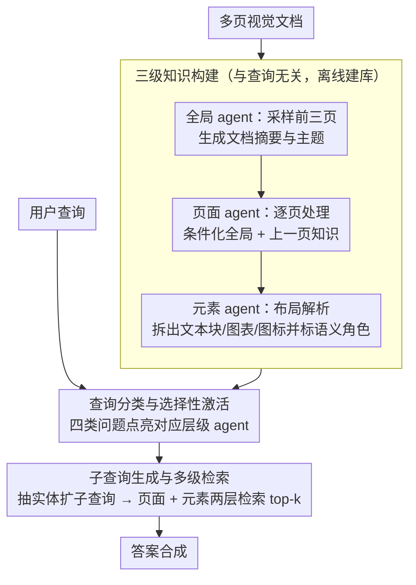

# SlideAgent: Hierarchical Agentic Framework for Multi-Page Visual Document Understanding

**会议**: ACL 2026  
**arXiv**: [2510.26615](https://arxiv.org/abs/2510.26615)  
**代码**: [SlideAgent](https://SlideAgent.github.io/)  
**领域**: Information Retrieval / Document Understanding  
**关键词**: 多页文档理解, 层次化智能体, 视觉文档问答, 幻灯片理解, 元素级推理

## 一句话总结

提出 SlideAgent，一个层次化智能体框架，通过全局、页面、元素三级专用 agent 构建结构化知识表示，显著提升多页视觉文档（尤其是幻灯片）的细粒度理解能力。

## 研究背景与动机

**领域现状**：多页视觉文档（如财务报告、学术演示文稿、技术手册）广泛存在于金融、科学、教育等高风险领域。这些文档不仅包含文本，还依赖版面布局、图标、颜色编码和跨页引用来传达信息。

**现有痛点**：当前多模态大语言模型(MLLMs)在处理多页视觉文档时面临三大挑战：(1) **细粒度推理不足** — MLLMs 倾向于整体性处理每页，忽略元素级细节（如图表中的具体数据段）；(2) **领域特定视觉语义缺失** — 预训练主要基于自然图像，对文档中的专业图表、图标含义和空间布局理解不足；(3) **依赖元数据** — 很多系统依赖干净的文档元数据（如图表位置标注、层级标签），但现实中这些信息经常缺失或损坏。

**核心矛盾**：MLLM 在对整页进行整体推理时可能出错（如误数图表中的类别），但当把相关图表裁剪出来后却能正确识别——说明模型具备推理能力，只是缺乏有效的细粒度信息提取机制。

**本文目标**：构建一个无需依赖文档元数据、能同时处理多页多模态文档的通用智能体框架，通过层次化知识构建和选择性 agent 激活实现精准的文档理解。

**核心idea**：借鉴人类信息处理模型，将文档理解分解为全局（整体主题）、页面（单页特征+跨页关系）、元素（图表/文本块/图标的细粒度解析）三个层级，各级配备专用 agent，在知识构建和推理两个阶段协同工作。

## 方法详解

### 整体框架

SlideAgent 分为两个阶段运作：(1) **知识构建阶段** — 自顶向下地构建层次化、与查询无关的知识库 $\mathcal{K}=\{\mathcal{K}_g, \mathcal{K}_p, \mathcal{K}_e\}$；(2) **推理阶段** — 根据用户查询分类并选择性激活对应层级的 agent，进行多级检索和答案合成。整个框架是模型无关的，可搭配 GPT-4o 或 InternVL3-8B 等不同骨干模型。

### 关键设计

**1. 三级知识构建：把文档拆成全局-页面-元素三层，各派一个专用 agent 离线建库**

MLLM 整页处理时容易漏掉元素级细节（比如数错图表里的类别数），可一旦把那张图表裁出来单独问又能答对——说明缺的是细粒度信息提取，而不是推理能力本身。SlideAgent 因此自顶向下建一套与查询无关的层次知识库 $\mathcal{K}=\{\mathcal{K}_g, \mathcal{K}_p, \mathcal{K}_e\}$。全局 agent $\mathcal{M}_g$ 采样前三页生成文档级摘要和主题；页面 agent $\mathcal{M}_p$ 顺序处理每页，且条件化于全局知识和上一页知识，$\mathcal{K}_p^i = \mathcal{M}_p(v_i, \mathcal{K}_g^{(0)}, \mathcal{K}_p^{i-1})$，从而把顺序上下文和跨页关联带进来；元素 agent $\mathcal{M}_e$ 再用布局解析把每页拆成文本块、图表、图标等元素，给每个元素标上语义角色和功能描述。三层互补——全局给主题框架、页面给跨页连贯、元素给细粒度空间与内容，缺任意一层都会丢掉一类信息。

**2. 查询分类与选择性激活：先判断问题要哪一层信息，只点亮对应的 agent**

不同问题需要的粒度天差地别，一律把三级 agent 全开既费算力，又会把无关层的输出当噪声引进来。SlideAgent 因此先给查询分四类：全局理解只激活全局 agent，事实查询激活页面+元素 agent，多跳推理激活全部，布局/视觉关系类只激活元素 agent；分不出来的兜底默认全开。这样在效率和准确性之间取了个平衡——简单问题轻装上阵，复杂问题才动用全套层级。

**3. 子查询生成与多级检索：把短查询扩成多条子查询，再在页面和元素两层精准检索**

用户原始查询往往很短，直接拿去检索语义覆盖不足、噪声大，多跳问题尤其容易漏掉关键证据页。SlideAgent 先从查询里抽关键实体生成若干子查询，再把原始查询和子查询拼起来联合检索 top-k 页面及其元素，检索器可换稀疏的 BM25、稠密的 SFR 或多模态的 COLPALI。子查询把一个笼统问题的语义摊开成多个具体落点，因此在需要跨多页凑证据的多跳场景里收益最明显。

### 一个完整示例：一条跨页多跳问题怎么被回答

以“第三季度营收比第一季度增长了多少？”这种典型多跳查询为例，走一遍框架：

- **建库阶段（离线、与问题无关，已提前跑完）**：全局 agent 读前三页判断“这是某公司财报”；页面 agent 逐页记下“第 4 页是 Q1 营收柱状图”“第 9 页是 Q3 营收表”等页面知识；元素 agent 把这两页的柱状图、表格、数字标注拆成带语义角色的元素。
- **查询分类**：系统判定这是多跳推理，激活全部三级 agent。
- **子查询生成**：抽出实体后扩成“Q1 营收是多少”“Q3 营收是多少”两条子查询。
- **多级检索**：原查询 + 两条子查询联合检索，命中第 4 页和第 9 页及其营收元素。
- **答案合成**：模型分别从两页元素读出具体数值，再做差、算百分比给出答案。整页直接问时模型容易数错或把两页读串，拆到元素级后这一步就稳了。

### 损失函数 / 训练策略

本文采用无需训练的方案——所有 agent 基于现有 MLLM 通过提示工程实现，无需额外训练或微调。知识构建阶段使用精心设计的提示模板引导各级 agent 生成结构化知识。全局知识通过 refine 步骤（单次全字段重写）确保从所有页面综合全局信息，减少对前几页的偏差。

## 实验关键数据

### 主实验

| 数据集 | 指标 | SlideAgent(GPT-4o) | GPT-4o | 提升 |
|--------|------|------|----------|------|
| SlideVQA | Overall | 84.9 | 77.0 | +7.9% |
| TechSlides | Overall | 70.9 | 63.4 | +7.5% |
| FinSlides | Overall | 85.5 | 80.0 | +5.5% |
| InfoVQA | Overall | 79.6 | 69.0 | +10.6% |
| SlideVQA (InternVL3) | Overall | 72.7 | 63.0 | +9.8% |

### 消融实验

| 配置 | 关键指标(Overall) | 说明 |
|------|---------|------|
| w/o Page Agent | -6.3 (GPT-4o) | 下降最大，页面级推理对跨页连贯性至关重要 |
| w/o Element Agent | -4.6 (GPT-4o) | 细粒度推理对数值问题尤为关键 |
| w/o Global Agent | -2.8 (GPT-4o) | 下降最小，因低层 agent 已部分嵌入全局上下文 |
| w/o Subquery | -5.0 (GPT-4o) | 检索场景下影响尤其显著 |

### 关键发现
- 层次化知识构建不仅提升 QA 性能，还显著改善页面级检索效果（文本检索器 SFR 获得 +6.4 MRR 提升）
- 多跳推理类查询获得最大提升（+9.8%），证明结构化知识引导对复杂推理的价值
- 在提供 ground-truth 页面的 oracle 设置下仍有 +7.7% 提升，说明元素级检索本身就有独立价值
- 仅12.5%的错误可归因于 OCR/解析失败，大部分错误来自问题歧义和答案标注问题

## 亮点与洞察
- **层次化分治策略**：借鉴人类认知的"全局-页面-元素"三级处理模型，既系统又直觉，在工程上也便于模块化扩展
- **无需训练的即插即用设计**：完全基于提示工程和现有 MLLM，对任何骨干模型均可直接应用
- **元素级推理的必要性**：通过 Figure 1 的直观案例展示了 MLLM 在整页推理中的失败和元素级裁剪后的成功，非常具有说服力
- **知识构建对检索的增益**：生成的结构化知识（页面描述和子查询）不仅用于 QA，还作为检索的增强信号，实现一举两得
- **模型无关性**：在 GPT-4o 和 InternVL3-8B 两种截然不同的骨干模型上均获得一致的显著提升

## 局限与展望
- 元素边界依赖 OCR 和布局解析工具，解析质量可能因工具而异
- 全局知识初始化仅采样前三页，可能对长文档的代表性不足，未来可探索基于内容的页面选择
- 主要使用文本检索器(SFR)，多模态检索器的潜力有待进一步挖掘
- 未处理多轮对话场景，扩展到交互式文档问答是重要方向
- 知识构建阶段的计算开销较高，需要为每页单独调用 MLLM

## 相关工作与启发
- **vs ViDoRAG**：ViDoRAG 也采用多 agent 架构，但 SlideAgent 的三级层次设计和元素级解析更为细致，在所有数据集上全面超越
- **vs VDocRAG**：VDocRAG 结合检索和推理但缺少元素级分解，SlideAgent 在数值推理(Num)上优势尤为明显
- **vs COLPALI**：纯多模态检索方法，SlideAgent 展示了文本检索+结构化知识的组合可以匹敌甚至超越多模态检索

## 评分
- 新颖性: ⭐⭐⭐⭐ 层次化 agent + 元素级推理的组合设计在文档理解领域较为新颖
- 实验充分度: ⭐⭐⭐⭐⭐ 4个数据集、15+基线模型、详尽的消融和错误分析
- 写作质量: ⭐⭐⭐⭐ 结构清晰，案例分析直观，方法描述严谨
- 价值: ⭐⭐⭐⭐ 框架通用性强，对企业级文档理解场景有直接应用价值

<!-- RELATED:START -->

## 相关论文

- [\[ACL 2026\] TeXOCR: Advancing Document OCR Models for Compilable Page-to-LaTeX Reconstruction](texocr_advancing_document_ocr_models_for_compilable_page-to-latex_reconstruction.md)
- [\[CVPR 2026\] VCU-Bridge: Hierarchical Visual Connotation Understanding via Semantic Bridging](../../CVPR2026/multimodal_vlm/vcu-bridge_hierarchical_visual_connotation_understanding_via_semantic_bridging.md)
- [\[CVPR 2026\] Mimic Human Cognition, Master Multi-Image Reasoning: A Meta-Action Framework for Enhanced Visual Understanding](../../CVPR2026/multimodal_vlm/mimic_human_cognition_master_multi-image_reasoning_a_meta-action_framework_for_e.md)
- [\[CVPR 2025\] MARTEN: Visual Question Answering with Mask Generation for Multi-Modal Document Understanding](../../CVPR2025/multimodal_vlm/marten_visual_question_answering_with_mask_generation_for_multi-modal_document_u.md)
- [\[CVPR 2026\] Agentic Video Summarization via Self-Reflecting Multimodal Understanding](../../CVPR2026/multimodal_vlm/agentic_video_summarization_via_self-reflecting_multimodal_understanding.md)

<!-- RELATED:END -->
