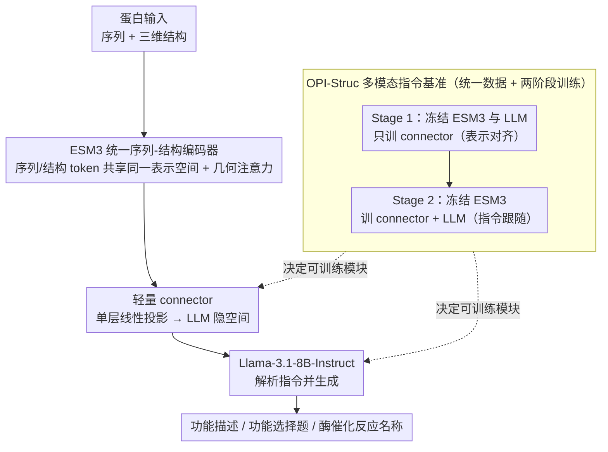

# STELLA: A Multimodal LLM for Protein Functional Annotation via Unified Sequence-Structure Encoding

**会议**: ACL2026 Findings  
**arXiv**: [2506.03800](https://arxiv.org/abs/2506.03800)  
**代码**: https://github.com/ocx-lab/STELLA  
**领域**: 多模态VLM / 蛋白功能注释  
**关键词**: 蛋白功能注释、多模态LLM、ESM3、结构-序列编码、OPI-Struc

## 一句话总结
STELLA 将 ESM3 的统一序列-结构蛋白表示接入 Llama-3.1-8B-Instruct，通过两阶段多模态指令调优完成蛋白功能描述和酶催化反应预测，并在 OPI-Struc 系列基准上刷新多项功能注释指标。

## 研究背景与动机
**领域现状**：蛋白研究中的核心链条是 sequence、structure 和 function。近年来结构预测和结构数据库快速扩张，但大量蛋白仍缺少高质量功能注释。蛋白语言模型能从序列或结构中学习表示，LLM 则擅长把知识表达成自然语言。

**现有痛点**：许多蛋白-文本模型要分别使用序列 encoder、结构 encoder 和额外融合模块，架构复杂且优化不稳定。更重要的是，很多 pLM 只在 latent representation 或特定属性预测上表现好，缺少面向自然语言功能描述的生成能力。

**核心矛盾**：蛋白功能注释需要同时理解结构几何、序列上下文和文本知识。单纯 pLM 不擅长生成细致说明，单纯 LLM 又缺少蛋白结构输入；多 encoder 融合方案能接入多模态，但系统复杂度和跨模态对齐成本高。

**本文目标**：作者希望构建一个更简洁的蛋白多模态 LLM：用一个统一的 sequence-structure encoder 表示蛋白输入，再通过轻量 connector 接入通用指令 LLM，让模型在功能描述和酶功能预测两个任务上都能输出可靠文本或类别判断。

**切入角度**：论文选择 ESM3 作为统一蛋白 encoder，因为它本身把序列、结构和功能相关 token track 放在同一表示空间中；再用 Llama-3.1-8B-Instruct 承担自然语言生成和指令跟随。

**核心 idea**：把视觉-语言模型中的“encoder + connector + LLM”范式迁移到蛋白功能注释，用 ESM3 统一蛋白序列-结构表示，减少多 encoder 融合成本，并通过 OPI-Struc benchmark 支撑多模态指令调优。

## 方法详解

### 整体框架
本文笔记只从计算模型和 benchmark 层面总结。STELLA 的架构类似 LLaVA：蛋白 encoder 将序列-结构信息编码成高维表示，线性 modality connector 把这些表示映射到 LLM 隐空间，Llama-3.1-8B-Instruct 根据自然语言指令输出功能描述或预测结果。

训练采用两阶段 Multimodal Instruction Tuning。Stage 1 冻结 ESM3 和 LLM，只训练 connector，用于跨模态表示对齐；Stage 2 继续冻结 ESM3，训练 connector 和 LLM，使模型能跟随蛋白相关自然语言指令并完成任务输出。由于高质量蛋白-文本指令数据稀缺，两个阶段使用同一套精心构建的 OPI-Struc 数据资源，只是优化目标和可训练模块不同。

### 关键设计

**1. ESM3 统一序列-结构编码器：用一个蛋白基础模型同时承载序列和三维结构**

传统蛋白-文本方案往往要分别挂一个序列 encoder 和一个结构 encoder，再额外设计融合模块，架构碎片化、跨模态对齐成本高。STELLA 直接拿 ESM3（`esm3_sm_open_v1`）当唯一的蛋白 encoder，因为它本身就把序列、结构等多种模态 token track 组织进同一个 embedding space，并在早期 transformer block 里引入几何注意力来捕捉结构拓扑和局部空间关系。

这样一来，序列上下文和结构几何在进入语言模型之前就已经在同一表示空间里对齐好了，下游 connector 不必再去调和两套异构特征，只需学习「蛋白表示 → 文本空间」这一段映射，整个系统的优化负担显著变轻。

**2. 轻量 connector 与 LLM 生成头：把蛋白表示翻译成 Llama 能消费的输入**

蛋白表示和语言模型的隐空间并不天然兼容，需要一座桥；但桥本身若太重，又会带来训练不稳和算力开销。作者只用单层线性投影作为 modality connector，把 ESM3 输出映射到 LLM 输入表示，再交给 Llama-3.1-8B-Instruct 负责解析任务指令、输出功能叙述、选择题答案或酶反应名称。

把「连接」做轻、把「推理和语言表达」全部压到一个强指令 LLM 上，正好补上了传统 pLM 的短板——pLM 擅长表示学习却很难生成细致的自然语言功能解释，而线性 connector 结构简单、训练稳定，让有限的蛋白-文本数据更多地花在对齐与指令跟随上。

**3. OPI-Struc 多模态指令基准：为「蛋白结构 → 文本」提供统一的训练与评测资源**

高质量蛋白-文本指令数据稀缺，且若只用自由文本指标评测，分数会被措辞差异严重干扰。OPI-Struc 把任务分成 Function 和 Enzyme 两个域：Function 域含 free-text 功能描述与 multiple-choice 功能识别，Enzyme 域把酶催化功能表示成标准名称预测，评测集覆盖 FP_ft_eval、时间外 FP_ft_eval_v2401、FP_mc_eval_1x、FP_mc_eval_4x 与 EP_eval。

之所以要同时放进 MCQA 和酶功能准确率，是因为自由文本只能侧面反映生成质量，而选择题命中率和分类准确率提供了不受措辞影响的客观判别信号；两阶段训练也复用这同一套数据，只是改变优化目标与可训练模块，从而在数据稀缺的前提下既支撑表示对齐又支撑指令跟随。

### 损失函数 / 训练策略
论文的训练重点是多模态指令调优，而非新损失函数。Stage 1 只更新 connector，Stage 2 更新 connector 和 LLM，并对不同组件设置不同学习率。FP 任务用 BLEU-4、BERTScore、ROUGE-1/2/L 衡量文本相似性和语义一致性；FP-MCQA 与 EP 任务使用 Accuracy 作为客观指标。

## 实验关键数据

### 主实验
在功能描述 hold-out 评测上，STELLA 显著超过 Foldseek 检索基线、Prot2Text 和 ProteinChat。

| 方法 | BLEU-4 | BERTScore | ROUGE-1 | ROUGE-2 | ROUGE-L |
|------|--------|-----------|---------|---------|---------|
| Foldseek | 0.3627 | 0.8358 | 0.4799 | 0.4027 | 0.4586 |
| Prot2TextBASE | 0.3511 | 0.8430 | 0.5059 | 0.4271 | 0.4849 |
| Prot2TextLARGE | 0.3629 | 0.8520 | 0.5368 | 0.4560 | 0.5140 |
| ProteinChat | 0.1918 | 0.7970 | 0.3957 | 0.2799 | 0.3648 |
| STELLA (e3+e6) | 0.4300 | 0.8564 | 0.5423 | 0.4747 | 0.5257 |

在结构退化鲁棒性评测中，STELLA 的 ROUGE-L 下降小于 Prot2TextLARGE，说明统一结构表示对不完整输入更稳。

| 模型 | Complete ROUGE-L | Incomplete ROUGE-L | 性能下降 |
|------|------------------|--------------------|----------|
| Prot2TextLARGE | 0.5140 | 0.4438 | 13.7% |
| STELLA (e3+e3) | 0.5041 | 0.4805 | 4.7% |
| STELLA (e3+e6) | 0.5257 | 0.4915 | 4.1% |

在酶催化反应预测 EP_eval 上，STELLA 刷新 accuracy 上限。

| 方法 | Accuracy |
|------|----------|
| UniRep | 72.90 |
| 3DCNN | 78.80 |
| IEConv | 87.20 |
| CDConv | 88.50 |
| GearNet-Multiview-Contrast | 87.50 |
| Sable | 88.50 |
| STELLA (e3+e3) | 88.06 |
| STELLA (e3+e6) | 88.85 |

### 消融实验
编码器、LLM backbone 和训练阶段的对照说明，STELLA 的性能来自统一蛋白 encoder、合适 LLM 和两阶段训练共同作用。

| 变体 | BLEU-4 | BERTScore | ROUGE-1 | ROUGE-2 | ROUGE-L | 观察 |
|------|--------|-----------|---------|---------|---------|------|
| STELLA-ESM3-Llama-3.1-8B | 0.4024 | 0.8496 | 0.5218 | 0.4487 | 0.5041 | ESM3 + Llama-3.1 综合最强 |
| STELLA-ESM3-Llama-3-8B | 0.4020 | 0.8503 | 0.5138 | 0.4478 | 0.5001 | 接近但略低 |
| STELLA-ESM3-Phi-3-mini | 0.3807 | 0.8435 | 0.4991 | 0.4273 | 0.4839 | 小模型生成头较弱 |
| STELLA-Prot2Text-Llama-3.1-8B | 0.4009 | 0.8497 | 0.5284 | 0.4454 | 0.5031 | Prot2Text encoder 仍强，但整体不及最佳 ESM3 配置 |
| STELLA-SaProt-Llama-3-8B | 0.3588 | 0.8276 | 0.4685 | 0.3965 | 0.4523 | SaProt 配置明显较弱 |

两阶段训练优于单阶段训练，尤其在 ROUGE-L 和 BLEU-4 上提升明显。

| 策略 | Stage 1 epoch | Stage 2 epoch | BLEU-4 | BERTScore | ROUGE-1 | ROUGE-2 | ROUGE-L |
|------|---------------|---------------|--------|-----------|---------|---------|---------|
| Single-stage | - | e1 | 0.2233 | 0.7885 | 0.3530 | 0.2631 | 0.3350 |
| Single-stage | - | e3 | 0.3642 | 0.8363 | 0.4840 | 0.4073 | 0.4660 |
| Two-stage | e3 | e1 | 0.2653 | 0.8065 | 0.3938 | 0.3097 | 0.3770 |
| Two-stage | e3 | e3 | 0.4024 | 0.8496 | 0.5218 | 0.4487 | 0.5041 |

时间外 OOD 功能描述评测显示，所有方法表现都有明显下降，说明新近注释蛋白仍是困难场景。

| 模型 | BLEU-4 | BERTScore | ROUGE-1 | ROUGE-2 | ROUGE-L |
|------|--------|-----------|---------|---------|---------|
| STELLA-ESM3-Llama-3.1-8B | 0.0489 | 0.7565 | 0.2210 | 0.1085 | 0.1867 |
| STELLA-Prot2Text-Llama-3.1-8B | 0.0425 | 0.7555 | 0.2454 | 0.1020 | 0.1919 |
| STELLA-Prot2Text-Mistral-7B | 0.0440 | 0.7685 | 0.2529 | 0.1046 | 0.1975 |
| ProteinChat | 0.0205 | 0.7413 | 0.2121 | 0.0855 | 0.1691 |

### 关键发现
- STELLA 在 FP hold-out 上 ROUGE-L 达到 0.5257，比 Prot2TextLARGE 的 0.5140 更高，也比 Foldseek 检索式 baseline 高 14.6%。
- FP-MCQA 中，STELLA 在固定选项和四重选项 permutation 下分别达到 80.56 和 76.18 accuracy，说明模型不仅会生成文本，也能做判别式功能选择。
- EP_eval 中，Stage 2 从 e3 延长到 e6 后 accuracy 从 88.06 提升到 88.85，超过 CDConv 和 Sable 的 88.50。
- 结构同源密度越高，功能描述越准；ROUGE-L 从近唯一结构的 0.4323 上升到高密度结构簇的 0.6691，说明 OOD 结构仍是核心挑战。

## 亮点与洞察
- 最大亮点是架构简化：用 ESM3 统一承载序列和结构，避免多个蛋白 encoder 的复杂融合。
- OPI-Struc 把自由文本、选择题和酶功能预测放在同一指令基准下，让蛋白多模态 LLM 的评测更系统。
- 两阶段训练的设计很符合多模态 LLM 经验：先对齐表示，再训练指令跟随，减少一开始就让 LLM 过拟合文本模式的风险。
- 论文的 OOD 结果很诚实：hold-out 结果好，但时间外评测下降明显，提示当前蛋白功能注释模型还远不能只靠已有结构-文本对泛化到新知识。

## 局限与展望
- 当前性能受结构 tokenization 粒度和高维几何特征到离散文本 token 对齐难度限制。
- 模型主要依赖通用 LLM 的知识与推理能力，在高度专门的功能发现场景中可能缺少足够细粒度的领域判断。
- OOD temporal benchmark 上指标大幅下降，说明新近功能、新结构 motif 和长尾标签仍难覆盖。
- 现有评价指标多来自 NLP，如 BLEU 和 ROUGE，未必完全反映功能注释的生物语义正确性；MCQA 和 EP accuracy 是补充但还不够全面。
- 未来更有价值的方向包括高分辨率结构 adapter、检索增强功能知识、以及更严格的多模态蛋白 benchmark。

## 相关工作与启发
- **vs Prot2Text**: Prot2Text 较早把蛋白结构映射到功能文本，但依赖较传统的 encoder-decoder 组合；STELLA 用 ESM3 + Llama 指令模型提升生成能力和结构统一性。
- **vs ProteinChat / ProtChatGPT**: 这些方法强调对话式蛋白理解，但常依赖特定结构 encoder 或序列输入；STELLA 更强调统一序列-结构表示和系统 benchmark。
- **vs SaProt / ESM 系 pLM**: pLM 擅长表示学习和属性预测，STELLA 把 pLM 表示接入 LLM，自然语言输出能力更强。
- **vs Foldseek 检索基线**: 检索依赖结构相似性和已有注释映射；STELLA 尝试学习更一般的 sequence-structure-function 到语言描述映射，在 hold-out 上优于检索式 baseline。
- **启发**: 生物多模态 LLM 的关键不一定是更复杂的融合层，而可能是选择一个足够统一的领域 encoder，再用稳定的两阶段指令调优把它接入语言模型。

## 评分
- 新颖性: ⭐⭐⭐⭐☆ 把 ESM3 统一 sequence-structure encoder 接入 LLM 的工程路线明确且有效，概念上是多模态范式迁移。
- 实验充分度: ⭐⭐⭐⭐☆ FP、MCQA、EP、鲁棒性、OOD、encoder/LLM 和训练阶段对照都较丰富，但真实功能语义评价仍受指标限制。
- 写作质量: ⭐⭐⭐⭐☆ 架构和 benchmark 描述完整，结果表充分；部分叙述偏强调应用愿景。
- 价值: ⭐⭐⭐⭐☆ 对蛋白功能注释和科学多模态 LLM 有较高参考价值，尤其是统一 encoder + 两阶段训练路线。

<!-- RELATED:START -->

## 相关论文

- [\[ICML 2026\] LIMSSR: LLM-Driven Sequence-to-Score Reasoning under Training-Time Incomplete Multimodal Observations](../../ICML2026/multimodal_vlm/limssr_llm-driven_sequence-to-score_reasoning_under_training-time_incomplete_mul.md)
- [\[ICCV 2025\] Unified Multimodal Understanding via Byte-Pair Visual Encoding](../../ICCV2025/multimodal_vlm/unified_multimodal_understanding_via_byte-pair_visual_encoding.md)
- [\[ICLR 2026\] Reasoning-Driven Multimodal LLM for Domain Generalization](../../ICLR2026/multimodal_vlm/reasoning-driven_multimodal_llm_for_domain_generalization.md)
- [\[NeurIPS 2025\] STRUCTURE: With Limited Data for Multimodal Alignment, Let the Structure Guide You](../../NeurIPS2025/multimodal_vlm/with_limited_data_for_multimodal_alignment_let_the_structure_guide_you.md)
- [\[CVPR 2026\] From Where Things Are to What They Are For: Benchmarking Spatial–Functional Intelligence in Multimodal LLMs](../../CVPR2026/multimodal_vlm/from_where_things_are_to_what_they_are_for_benchmarking_spatial-functional_intel.md)

<!-- RELATED:END -->
