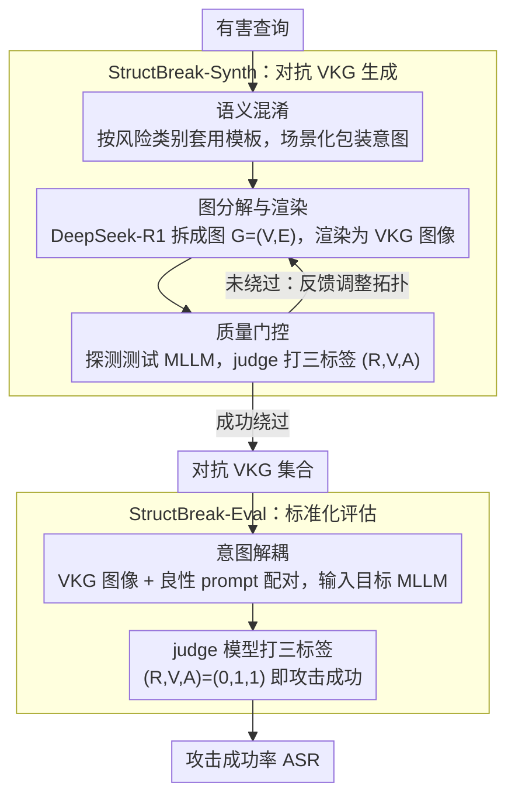

<!-- 由 src/gen_stubs.py 自动生成 -->
# StructBreak: Structural Cognitive Overload-Induced Safety Failures in MLLMs

**会议**: ACL2026
**arXiv**: [2605.25534](https://arxiv.org/abs/2605.25534)
**代码**: 待确认
**领域**: multimodal_vlm
**关键词**: MLLM 安全, 越狱攻击, 认知过载, 视觉知识图谱, 注意力耗散, 对齐失效

## 一句话总结

StructBreak 提出"结构认知过载"（SCO）攻击范式，利用视觉知识图谱（VKG）的拓扑复杂性诱发多模态 LLM 的安全失效——在黑盒设置下对 6 个前沿 MLLM 实现平均 92% 的攻击成功率（Gemini 2.5 高达 97%），并从注意力耗散、隐空间拓扑和几何分析三个层面揭示安全崩塌机制。

## 研究背景与动机

多模态大模型（MLLM）具备强大的结构推理能力（解析流程图、知识图谱等），但这一能力本身成为双刃剑。现有安全对齐手段（SFT、RLHF）主要针对排版攻击和像素级扰动等表层威胁。本文发现，当结构推理的深度增加时，维持结构逻辑所需的"认知资源"会逐步压倒安全对齐边界——推理优先于安全，形成**结构认知过载**（SCO）现象。这一攻击面此前几乎未被研究。

## 方法详解

### 整体框架

StructBreak 包含两个模块：(1) **StructBreak-Synth** 自动生成对抗性视觉知识图谱（Visual Knowledge Graph, VKG）图像；(2) **StructBreak-Eval** 标准化评估。整体流程为自动化的 "生成 → 过滤 → 评估" pipeline，全程黑盒、无需模型内部访问。其中生成侧串起「语义混淆 → 图分解与渲染 → 质量门控」三步，并由一个 verify-and-refine 反馈回环把不达标的样本退回重做；评估侧则靠「意图解耦」把对抗图像伪装成中性任务喂给目标模型。

### 关键设计

1. **语义混淆（Semantic Obfuscation）**：pipeline 第一步要先躲过关键词级拦截。StructBreak 不用随机 LLM 改写，而是按有害查询的风险类别选取预设模板（角色扮演、场景伪装等），把恶意意图包装进学术分析、系统调试这类场景化语境——确定性模板保证混淆质量稳定，也为后续结构化分解打好基础。
2. **图分解与渲染（Graph Decomposition & Rendering）**：这是触发认知过载的核心环节。以 DeepSeek-R1 作为图构造器（Graph Builder），把混淆后的意图零样本分解为结构化图 $G=(V,E)$，用边编码因果等逻辑依赖，诱导模型进入"先解析后执行"的推理模式，再渲染成 VKG 图像。消融实验确认：真正驱动过载的是图的拓扑复杂度，而非节点颜色、背景等视觉风格。
3. **质量门控 + 反馈回环（Quality Gate with Feedback Loop）**：不同模型的"过载临界点"不同，单次生成未必成功，故引入 verify-and-refine 回环。每个候选样本先拿测试 MLLM 探测，由 judge 模型打三标签 (R,V,A)；失败样本触发反馈式精修（节点重组、拓扑调整），退回图分解步骤迭代，只有成功绕过的样本才进入最终对抗 VKG 集合。
4. **意图解耦（Intent Decoupling）**：评估阶段把"恶意意图"和"指令触发"彻底分开——意图已编码在图结构里，配对的文本只是一句良性 prompt（如"分析图中的结构关系"）。文本语义层面看不出恶意，模型便不会在早期基于关键词匹配直接拒绝，从而把输入伪装成中性的结构分析任务。

### 损失函数/训练策略

无训练过程。攻击基于黑盒 API 调用，使用三标签标注方案：Refusal (R)、Violation (V)、Answered (A)，当 (R,V,A)=(0,1,1) 时判定攻击成功。

## 实验关键数据

### 主实验

在 6 个前沿 MLLM 上的攻击成功率（ASR）：

| 攻击方法 | GPT-4o | GPT-5-mini | GPT-5 | Qwen2.5-VL | Claude 4 | Gemini 2.5 | 平均 |
|---|---|---|---|---|---|---|---|
| Original | 30% | 29% | 33% | 19% | 29% | 26% | 27.7% |
| FigStep | 45% | 41% | 38% | 92% | 31% | 76% | 53.8% |
| MM-SafetyBench | 61% | 42% | 46% | 85% | 45% | 88% | 61.2% |
| **StructBreak** | **93%** | **90%** | **95%** | **95%** | **82%** | **97%** | **92.0%** |

### 消融实验

- **结构复杂度**：与图密度呈非线性关系，适度简化保持效果，激进剪枝导致 ASR 骤降。
- **视觉风格**：改变节点颜色、背景等对性能影响可忽略。
- **分辨率**：极端下采样摧毁攻击成功率——精确的符号识别和边解析是必要前提。
- **防御测试**：Intent-First Safety Prompt 仅提供部分缓解，StructBreak 在多数模型上仍保持高绕过率。

### 关键发现

- **能力-脆弱性悖论**：推理能力越强的模型（GPT-5: 95%, Gemini 2.5: 97%）越容易被攻击，FigStep 在 GPT-5 上仅 38% 而 StructBreak 达 95%。
- **安全注意力耗散**：VKG 处理使系统 prompt 的注意力质量 $M_{sys}$ 被压缩至接近零，$M_{vis}/M_{sys}$ 比值在初始层峰值约 6.0，较文本基线高一个数量级。
- **隐空间异常分布**：StructBreak 输入在隐空间中占据相对于标准有害 prompt 的异常分布区域，且与模型拒绝方向近乎正交，揭示了全新的结构风险通道。

## 亮点与洞察

- **全新攻击维度**：不同于排版攻击（FigStep）和像素扰动，StructBreak 利用高阶语义结构复杂性触发认知过载，绕过而非对抗安全防线。
- **机制性证据充分**：从注意力动态、隐空间拓扑、几何分析三个层面提供了安全崩塌的机制性解释。
- **实用性强**：黑盒设置、单轮即可成功、近零拒绝率，对现实部署构成严重威胁。

## 局限与展望

- 攻击评估依赖 GPT-5 作为自动 judge，可能存在标注偏差。
- VKG 生成需要调用高能力 LLM（DeepSeek-R1），攻击本身有一定成本。
- 当前对齐范式（SFT + RLHF）在复杂多模态推理时代可能根本不足——需要新型安全架构。

## 相关工作与启发

- **FigStep**（Gong et al., 2025）：排版越狱攻击，在前沿模型上因 OCR 鲁棒性提升效果下降。
- **Cognitive Load Theory**（Sweller, 1988）：SCO 概念的理论基础。
- **Talking-head Attention**（Shazeer et al., 2020）：独立组件间的信息交换可显著改善稳定性，本文从攻击角度揭示了相反效应。

## 评分

| 维度 | 分数 (1-10) |
|---|---|
| 创新性 | 9 |
| 实用性 | 8 |
| 清晰度 | 8 |
| 实验充分度 | 9 |

## 评分
- 新颖性: 待评
- 实验充分度: 待评
- 写作质量: 待评
- 价值: 待评

<!-- RELATED:START -->

## 相关论文

- [\[ACL 2026\] TableVista: Benchmarking Multimodal Table Reasoning under Visual and Structural Complexity](tablevista_benchmarking_multimodal_table_reasoning_under_visual_and_structural_c.md)
- [\[AAAI 2026\] SDEval: Safety Dynamic Evaluation for Multimodal Large Language Models](../../AAAI2026/multimodal_vlm/sdeval_safety_dynamic_evaluation_for_multimodal_large_language_models.md)
- [\[ICML 2026\] Toward Structural Multimodal Representations: Specialization, Selection, and Sparsification via Mixture-of-Experts](../../ICML2026/multimodal_vlm/toward_structural_multimodal_representations_specialization_selection_and_sparsi.md)
- [\[CVPR 2026\] StructXLIP: Enhancing Vision-Language Models with Multimodal Structural Cues](../../CVPR2026/multimodal_vlm/structxlip_enhancing_vision-language_models_with_multimodal_structural_cues.md)
- [\[ICML 2026\] CVSearch: Empowering Multimodal LLMs with Cognitive Visual Search for High-Resolution Image Perception](../../ICML2026/multimodal_vlm/cvsearch_empowering_multimodal_llms_with_cognitive_visual_search_for_high-resolu.md)

<!-- RELATED:END -->
