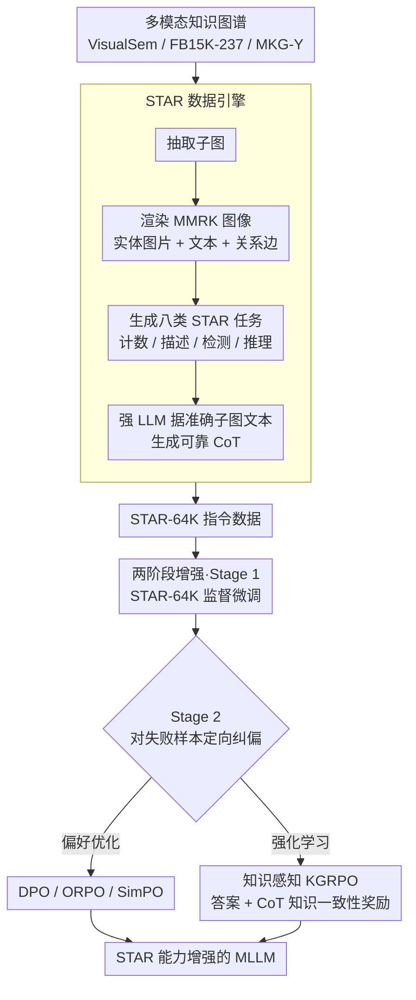

# Structured and Abstractive Reasoning on Multi-modal Relational Knowledge Images

**会议**: ACL2026 Findings  
**arXiv**: [2510.21828](https://arxiv.org/abs/2510.21828)  
**代码**: https://github.com/zjukg/STAR  
**领域**: 多模态VLM / 知识图谱 / 结构化推理  
**关键词**: MMRK图像, STAR任务, 多模态知识图谱, KGRPO, 合成指令数据  

## 一句话总结
这篇论文提出面向多模态关系知识图像的 STAR 数据引擎和两阶段训练框架，用 STAR-64K 合成数据、CoT 标注与知识感知 KGRPO 显著提升 MLLM 对抽象结构化知识图像的理解和推理能力。

## 研究背景与动机
**领域现状**：多模态大模型已经能处理自然图像、图表、OCR、视觉数学题等任务，许多 benchmark 也在测试“抽象视觉信息”的理解能力，例如图表、示意图、数学图形和结构化文档。

**现有痛点**：多模态关系知识图像仍然很少被系统研究。这类图像不是普通照片，而是把实体、文本描述、图片和关系边组织成节点-边结构，要求模型同时识别实体、理解边类型、追踪图结构，并在此基础上做推理。

**核心矛盾**：MLLM 的视觉理解能力越来越强，但它们常被训练在自然场景和通用图表上；而 MMRK 图像的关键语义来自人为定义的高阶关系。模型如果只“看见节点”，却不能把节点之间的关系当作知识结构处理，就会在计数、错误检测、实体补全和关系推理上失败。

**本文目标**：作者要补齐两个缺口：一是没有大规模高质量 MMRK 指令数据，二是没有专门针对 STAR 能力的训练与评测协议。

**切入角度**：论文把现成多模态知识图谱转成可视化子图，再从子图生成八类任务与可靠 CoT。这样既避免人工标注成本，也能把图结构的真实答案、推理路径和视觉呈现绑定起来。

**核心 idea**：用多模态知识图谱自动合成 STAR-64K，再用 SFT + 偏好/RL 优化训练 MLLM，其中 KGRPO 额外奖励 CoT 中的知识正确性，以减少结构推理时的幻觉。

## 方法详解
这篇论文实际贡献是一个完整栈：数据引擎、训练协议、评测任务、强化学习策略和系统实验。

如果只看模型训练，容易低估它的价值；真正重要的是作者把“抽象结构化视觉知识”变成了可规模化生成、可训练、可评测的任务族。

### 整体框架
输入数据来自三个公开多模态知识图谱：VisualSem、FB15K-237 和 MKG-Y。

每个知识图谱可以写成实体集合、关系集合、三元组集合、实体图像集合与实体文本描述集合的组合。

数据引擎从图谱中抽取子图，将实体的图片和文本连同关系边一起可视化，形成 MMRK 图像。

然后引擎围绕同一类 MMRK 图像生成八类 STAR 任务：实体计数、关系计数、图像实体计数、三元组计数、子图描述、错误检测、实体推理、关系推理。

对于需要推理路径的任务，作者不直接让弱 MLLM 从图像中硬生成 CoT，而是利用可视化前的准确子图文本作为提示，让强 LLM 生成更可靠的 thought process 和答案。

训练分两阶段进行：第一阶段用 STAR-64K 做监督微调，建立基础 STAR 能力；第二阶段针对模型失败样本构造偏好数据或使用 RL 继续优化。

评测时不仅看最终答案，还看 CoT 质量；任务 5 的描述用相似度评分，其他任务用准确率和 CoT judge 评价。

### 关键设计

**1. STAR 数据引擎：把 MMKG 的实体、关系、图像和文本批量变成可训练的指令数据**

直接人工标注 MMRK 图像既慢又难保证结构正确，而 MMRK 图像的关键语义恰恰来自人为定义的高阶关系，一旦标错，模型学到的就是错误的结构知识。引擎因此把现成的多模态知识图谱当作真相源：先从 VisualSem、FB15K-237、MKG-Y 抽取子图，把实体图片、实体文本和关系边一起渲染成 MMRK 图像，再围绕同一类图像生成八类 STAR 任务（实体计数、关系计数、图像实体计数、三元组计数、子图描述、错误检测、实体推理、关系推理）的问题与答案。

CoT 的生成是这一步的点睛之笔：作者不让弱 MLLM 对着图像硬编推理链，而是把可视化之前那份准确的子图结构文本作为提示喂给强 LLM，让它产出 thought process 和答案。这样图像、结构、答案、推理依据天然对齐，reasoning trace 与真实三元组一致，从源头上压住了 CoT 的幻觉。

**2. 两阶段 STAR 能力增强：先学会任务格式，再针对失败样本定向纠偏**

SFT 是能力注入最关键的一步，但它只在平均意义上拟合数据，对复杂图推理里的幻觉、错误 CoT 和困难样本无能为力。于是 Stage 1 用 STAR-64K 做监督微调，目标是最大化「给定图像和问题后生成答案」的概率，建立基础 STAR 能力；Stage 2 再针对 Stage 1 之后仍然失败的训练样本做定向优化。

Stage 2 给出两条路线：一条是 DPO/ORPO/SimPO 等偏好优化，用 gold answer 当 preferred、模型自己的错误输出当 unpreferred；另一条是 GRPO/KGRPO，用组内多样采样的结果配合奖励函数优化推理行为。两条路线都把训练信号从「平均拟合」升级成「针对错误样本的纠偏」，这正是结构化图推理最缺的一环。

**3. 知识感知 KGRPO：在答案奖励之外，显式奖励 CoT 里的事实知识是否正确**

MMRK 推理的失败常常不是「算错一个数」，而是在 CoT 里编造一条不存在的关系或误读了某个节点；普通 GRPO 只盯最终结果，压不住这种过程性幻觉。KGRPO 在 GRPO 的答案奖励之外加一项 knowledge-informed reward，用黄金知识配合 CoT judge 检查推理链里涉及的实体、关系和三元组是否与图结构一致。

换句话说，模型不仅要答对，还得沿着正确的知识路径答对——把结构知识一致性作为硬约束写进训练目标后，CoT 中的关系幻觉被直接惩罚，这也是后面实验里 KGRPO 平均分明显高过 DPO 和普通 GRPO 的原因。

### 损失函数 / 训练策略
SFT 阶段采用 next-token prediction，训练 MLLM 在图像和问题条件下生成答案与 CoT。

Stage 1 训练 3 个 epoch，使用 LoRA，最大序列长度 8192，BF16，AdamW 和 cosine scheduler。

Stage 2 的 PA 数据来自 Stage 1 后模型失败的训练实例：正确答案作为正样本，错误生成作为负样本。

KGRPO 继承 GRPO 的组内相对优势思想，但奖励函数同时包含最终答案质量和 CoT 中知识事实的一致性。

评估阶段使用 Qwen2.5-VL-72B 作为 judge，给 CoT 或非结构化输出打分。

这种策略把“视觉图像理解”“知识结构一致性”和“推理路径质量”绑在一起，避免只优化一个表层答案指标。

## 实验关键数据

### 主实验
主表显示，两阶段训练对 Qwen2.5-VL-3B/7B 的 STAR 平均表现提升很大，KGRPO 在 Stage 2 中最强。

| 模型 / 设置 | Task#1 ACC | Task#2 ACC | Task#3 ACC | Task#5 Score | Task#8 ACC | AVG |
|-------------|------------|------------|------------|--------------|------------|-----|
| GPT-4v | 37.75 | 41.25 | 14.00 | 59.25 | 39.13 | 33.11 |
| GPT-4o-mini | 67.50 | 72.25 | 29.88 | 69.13 | 23.00 | 40.72 |
| Qwen2.5-VL-3B Zero-shot | 18.25 | 20.13 | 3.50 | 57.71 | 38.25 | 25.56 |
| Qwen2.5-VL-3B S1 Full | 42.75 | 67.00 | 57.13 | 59.94 | 56.00 | 53.24 |
| Qwen2.5-VL-3B S2 KGRPO | 75.00 | 85.38 | 68.63 | 71.51 | 68.57 | 63.64 |
| Qwen2.5-VL-7B Zero-shot | 6.13 | 12.25 | 0.13 | 68.62 | 42.88 | 21.24 |
| Qwen2.5-VL-7B S1 Full | 64.88 | 92.75 | 71.37 | 75.71 | 71.52 | 66.98 |
| Qwen2.5-VL-7B S2 KGRPO | 79.88 | 94.88 | 79.50 | 77.19 | 74.48 | 73.06 |

这个表最有意思的现象是，3B/7B 模型经过专门训练后可以超过更强闭源模型在 STAR 上的零样本表现，说明任务缺口主要来自数据和训练协议，而不只是模型规模。

### 消融实验
作者从模态贡献角度验证了 MMRK 图像中实体图片和实体文本都重要，其中文本信息影响通常更大。

| Backbone / 配置 | Task#1 | Task#2 | Task#3 | Task#4 | Task#5 | Task#6 | Task#7 | Task#8 |
|-----------------|--------|--------|--------|--------|--------|--------|--------|--------|
| Qwen2.5-VL-7B w/o ent. images | 55.50 | 75.88 | 48.62 | 26.63 | 67.99 | 32.00 | 52.63 | 65.75 |
| Qwen2.5-VL-7B w/o ent. texts | 59.13 | 74.62 | 47.88 | 25.37 | 67.90 | 34.87 | 41.50 | 68.12 |
| Qwen2.5-VL-7B full dataset | 64.88 | 92.75 | 71.37 | 27.62 | 75.71 | 55.87 | 67.50 | 80.13 |
| Qwen2.5-VL-32B w/o ent. images | 49.75 | 83.25 | 42.25 | 29.88 | 66.05 | 29.63 | 42.50 | 68.00 |
| Qwen2.5-VL-32B w/o ent. texts | 58.25 | 82.25 | 41.00 | 25.88 | 65.61 | 28.63 | 46.25 | 66.88 |
| Qwen2.5-VL-32B full dataset | 67.75 | 93.63 | 63.13 | 27.50 | 75.07 | 54.00 | 73.50 | 81.75 |

另一个关键分析来自训练设置对比：混合多任务训练通常优于单任务训练，CoT prompt 去掉后五个 backbone 都下降，说明 STAR 不只是视觉识别任务，而是需要显式结构化思考。

| 配置 | 关键指标 | 说明 |
|------|----------|------|
| S1 Single-task | Qwen2.5-VL-7B AVG 66.06 | 单任务能提升目标任务，但跨任务迁移弱 |
| S1 Full STAR-64K | Qwen2.5-VL-7B AVG 66.98 | 混合任务带来更稳的结构化能力 |
| S2 DPO | Qwen2.5-VL-7B AVG 68.84 | 偏好优化改善困难样本 |
| S2 GRPO | Qwen2.5-VL-7B AVG 69.91 | RL 进一步提升推理表现 |
| S2 KGRPO | Qwen2.5-VL-7B AVG 73.06 | 知识奖励带来最强平均效果 |

### 关键发现
- 现有 MLLM 零样本处理 MMRK 图像明显不足，很多模型可以识别视觉元素，却不能稳定做关系级推理。
- SFT 是最大增益来源，说明 STAR-64K 数据本身非常关键；Stage 2 的 KGRPO 则进一步减少 CoT 幻觉和困难样本错误。
- 多任务混合训练比只训练单一 STAR 任务更有迁移性，尤其对复杂推理任务更明显。
- 实体文本的贡献通常大于实体图片，但去掉任一模态都会削弱表现，说明 MMRK 图像的语义确实是多模态融合的。
- Task#1 和 Task#4 的 scaling pattern 比较特殊，前者偏基础实体识别，后者受复杂计数和图结构干扰，不完全随数据量线性改善。

## 亮点与洞察
- 论文把多模态知识图谱从“KG completion 数据源”转化成“抽象视觉推理 benchmark”，这个视角很有价值。它让 MLLM 不再只处理自然图像，而要读懂人类组织出来的结构化知识图。
- STAR 数据引擎的强点是答案可验证、CoT 可从真实子图生成。相比让 LLM 直接看图编推理，这种做法更能控制幻觉源头。
- KGRPO 的思路很值得迁移：如果任务答案来自结构化知识，RL reward 就不应只看最终 label，而应检查推理过程里的实体和关系是否真实。
- 小模型经专门训练超过 GPT-4o 零样本表现，说明很多“抽象视觉推理能力”并非神秘涌现，而是训练分布覆盖不足。

## 局限与展望
- 数据源主要是通用百科型 MMKG，专业领域图谱、科学知识图谱、医学知识图谱等并未充分覆盖。
- 八类任务虽然系统，但仍是固定模板族，真实知识图像中的任务需求可能更开放，例如路径解释、反事实编辑、跨图对齐和多跳证据引用。
- KGRPO 实验受算力限制，主要在 8B 以下模型上做 RL，对更大模型的训练效率和稳定性还需要验证。
- CoT judge 使用强 MLLM 自动评分，虽然可规模化，但在细粒度知识错误上仍可能漏判。
- 图像渲染方式本身可能影响结果，例如节点布局、文本密度、边遮挡都会改变模型难度，未来可以把 layout robustness 纳入评测。

## 相关工作与启发
- **vs M3STR**: M3STR 更偏评测 MLLM 对多模态结构化知识的理解，本文进一步提供数据引擎和训练框架，目标从“测能力”扩展到“提升能力”。
- **vs MM-Instruct**: MM-Instruct 也做抽象图像合成，但本文聚焦关系知识图像，任务结构和答案可验证性更强。
- **vs ChartQA / MathVista / MMMU**: 这些 benchmark 测图表、数学图和多学科视觉知识，本文则测试实体-关系图中的结构化抽象推理，错因更接近知识图谱推理而不是视觉感知。
- **vs 普通 GRPO**: 普通 GRPO 对结果优化有效，但在 STAR 中容易忽略 CoT 中的关系幻觉。KGRPO 的启发是：推理任务的 reward 应该包含中间知识一致性。

## 评分
- 新颖性: ⭐⭐⭐⭐⭐ MMRK 图像上的 STAR 数据引擎和 KGRPO 结合很有新意，任务定义也清楚。
- 实验充分度: ⭐⭐⭐⭐☆ 主实验覆盖 8 个开源 MLLM 和多种训练策略，RL 大模型规模验证略受限。
- 写作质量: ⭐⭐⭐⭐☆ 结构完整，表格扎实，但任务编号和大量 ACC/CoT 指标阅读成本较高。
- 价值: ⭐⭐⭐⭐⭐ 对多模态知识图谱、VLM 评测和结构化推理训练都有直接参考价值。

<!-- RELATED:START -->

## 相关论文

- [\[ACL 2026\] Leave My Images Alone: Preventing Multi-Modal Large Language Models from Analyzing Unauthorized Images](leave_my_images_alone_preventing_multi-modal_large_language_models_from_analyzin.md)
- [\[CVPR 2026\] StaR-KVQA: Structured Reasoning Traces for Implicit-Knowledge Visual Question Answering](../../CVPR2026/multimodal_vlm/star-kvqa_structured_reasoning_traces_for_implicit-knowledge_visual_question_ans.md)
- [\[CVPR 2026\] Hierarchical Attacks for Multi-Modal Multi-Agent Reasoning](../../CVPR2026/multimodal_vlm/hierarchical_attacks_for_multi-modal_multi-agent_reasoning.md)
- [\[ICML 2025\] Core Knowledge Deficits in Multi-Modal Language Models](../../ICML2025/multimodal_vlm/core_knowledge_deficits_in_multi-modal_language_models.md)
- [\[CVPR 2026\] Relational Visual Similarity](../../CVPR2026/multimodal_vlm/relational_visual_similarity.md)

<!-- RELATED:END -->
