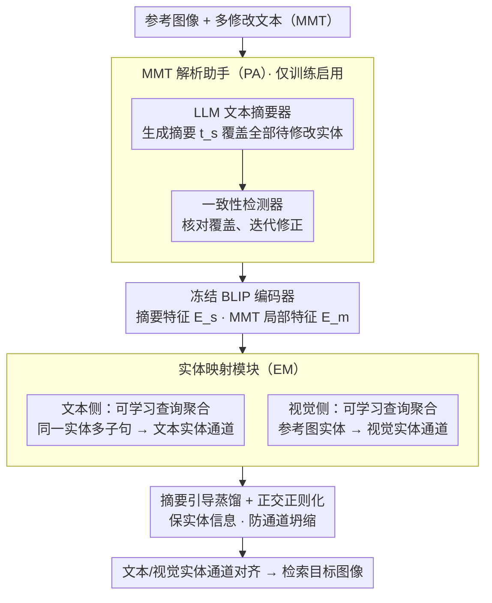

# TEMA: Anchor the Image, Follow the Text for Multi-Modification Composed Image Retrieval

**会议**: ACL 2026  
**arXiv**: [2604.21806](https://arxiv.org/abs/2604.21806)  
**代码**: [https://github.com/lee-zixu/ACL26-TEMA/](https://github.com/lee-zixu/ACL26-TEMA/)  
**领域**: 图像检索 / 多模态  
**关键词**: 组合图像检索, 多修改文本, 实体映射, 细粒度检索, 视觉语言预训练

## 一句话总结

本文提出 TEMA（Text-oriented Entity Mapping Architecture），首个面向多修改文本的组合图像检索（CIR）框架，通过 MMT 解析助手（PA）增强修改实体覆盖、实体映射模块（EM）解决子句-实体对齐问题，并构建了 M-FashionIQ 和 M-CIRR 两个多修改基准数据集，在原始和多修改场景中均取得最优性能。

## 研究背景与动机

**领域现状**：组合图像检索（CIR）使用"参考图像 + 修改文本"的多模态查询来检索目标图像。现有方法在简短修改文本（仅覆盖少量显著变化）的设定下已取得显著进展。

**现有痛点**：现有 CIR 设定存在两个与实际应用高度相关的局限：(1) 实体覆盖不足——当多个实体需要修改时，训练信号集中于显著区域，遗漏部分实体（修改文本中明确引用待修改实体的比例很小）；(2) 子句-实体错位——实际应用中，多个修改子句可能约束同一实体（如同时修改裙子的下摆、肩部装饰和腰带），或单个子句约束多个同类实体（如将三只金毛改为哈士奇）。

**核心矛盾**：现有 CIR 模型在面对多修改需求时性能急剧下降（实验显示明显的性能断崖），根因是训练时缺乏多修改标注，模型无法建立"一对多"的子句-实体对应关系。

**本文目标**：(1) 构建贴近真实场景的多修改 CIR 基准数据集；(2) 设计首个同时适应简单修改和多修改场景的 CIR 框架。

**切入角度**：从数据和模型两个层面同时解决问题——用 MLLM 生成多修改文本（MMT）并经人工审核构建数据集，同时设计专门的模块来处理多实体覆盖和子句聚合。

**核心 idea**：通过 LLM 生成的摘要提取待修改实体列表，用可学习查询将同一实体的多个修改子句聚合为统一表示，并与视觉侧的对应实体对齐。

## 方法详解

### 整体框架

TEMA 由两个核心组件构成：(1) MMT 解析助手（PA），包含 LLM 文本摘要器和一致性检测器，用于在训练时提取待修改实体并进行实体覆盖检查（推理时禁用）；(2) MMT 导向的实体映射模块（EM），通过文本和视觉实体映射，在摘要指导下聚合同一实体的多个 MMT 子句。底层使用 BLIP 作为特征提取骨干。

### 关键设计

**1. MMT 解析助手（PA）：把稀疏分散的待修改实体显式拎成一张清单**

多修改文本里待修改的实体往往零散藏在长句各处，模型训练时很容易只盯住显著区域、漏掉其余实体——这正是"实体覆盖不足"的根源。PA 的做法是让 LLM（gpt-3.5-turbo）为每条 MMT 生成一段摘要 $t_s$，硬性要求这段摘要把所有待修改实体都点到；摘要特征 $\mathbf{E}_s = \Phi_\mathbb{T}(t_s)$ 再由冻结的 BLIP 文本编码器提取，作为下游实体映射的清晰指导信号。

光让 LLM 写摘要还不够，它可能漏写或多写实体，于是 PA 内置一个一致性检测器（同样是 LLM），逐条核对摘要是否恰好覆盖 MMT 中全部待修改实体、且不夹带多余实体，不通过就迭代修正。这样得到的实体清单干净可靠。值得注意的是 PA 只在训练时启用，推理阶段直接禁用，从而避免线上对 LLM 的额外依赖和延迟。

**2. MMT 导向的实体映射模块（EM）：用可学习查询把"一对多"的子句聚合到同一实体通道**

现实里多条修改子句常常约束同一个实体（同时改裙子的下摆、肩部装饰、腰带），或一条子句约束多个同类实体，直接拿全局特征根本区分不开这些需求。EM 引入一组可学习查询 $\mathbf{a}_q = \{a_1, ..., a_k\}$，把它与摘要特征 $\mathbf{E}_s$、MMT 局部特征 $\mathbf{E}_m^l$ 一起喂进 Transformer：

$$\hat{\mathbf{a}}_q = \text{Transformer}([\mathbf{E}_s, \mathbf{E}_m^l, \mathbf{a}_q])$$

由于摘要已经囊括所有待修改实体且描述最精简，可学习查询能在摘要指导下、借助注意力把"肩部装饰改为蕾丝"和"下摆改为不规则"这类分散子句自适应地聚合进同一实体通道。视觉侧用同样方式聚合参考图像中的视觉实体特征 $\hat{\mathbf{b}}_q$，于是文本实体和视觉实体在通道层面一一对齐，子句-实体错位的问题被显式拆解。

**3. 摘要引导蒸馏 + 正交正则化：保证实体信息不丢、各通道不塌**

EM 聚合时有两个隐患：生成的文本 token 可能丢掉部分实体信息，多个可学习查询通道又可能坍缩到同一个实体上。摘要引导蒸馏针对前者，让 EM 产出的文本 token 与 PA 解析出的待修改实体清单紧密对齐，确保实体信息被完整保留；正交正则化针对后者，约束不同查询通道彼此正交、各自关注不同实体，避免通道冗余。两条约束一起，EM 才能稳定维持"一个通道对应一个实体"的干净映射。

### 损失函数 / 训练策略

使用 BLIP 作为骨干并冻结图像编码器，AdamW 优化器（学习率 2e-5），batch size 64，特征维度 256，可学习查询通道数 $N=3$。损失函数包含三部分：基于批次的分类损失（对比学习）、摘要引导蒸馏损失和正交正则化损失。PA 模块仅在训练时使用，推理时禁用。全部实验在单张 NVIDIA A40 48GB GPU 上完成。

## 实验关键数据

### 主实验

**M-FashionIQ 和 M-CIRR 数据集上的性能（R@K %）**

| 方法 | M-FashionIQ Avg R@10 | M-FashionIQ Avg R@50 | M-CIRR Avg |
|------|---------------------|---------------------|------------|
| TIRG | 9.20 | 18.05 | 22.83 |
| BLIP4CIR | 40.99 | 62.44 | 70.92 |
| BLIP4CIR+Bi | 40.78 | 62.05 | 72.54 |
| Candidate | 47.38 | 66.71 | 72.75 |
| **TEMA（Ours）** | **50.59** | **72.09** | **75.76** |

### 消融实验

| 配置 | M-FashionIQ R@10 | Δ | M-CIRR Avg | Δ |
|------|-----------------|---|------------|---|
| Full TEMA | 50.59 | - | 75.76 | - |
| w/o PA | 47.80 | -2.79 | 71.59 | -4.17 |
| w/o CD（一致性检测） | 49.14 | -1.45 | 73.87 | -1.89 |
| w/o EM | 45.41 | -5.18 | 70.99 | -4.77 |
| w/o EM_txt | 46.11 | -4.48 | 71.20 | -4.56 |
| w/o EM_img | 46.17 | -4.42 | 71.64 | -4.12 |
| w/o Summ（蒸馏） | 49.40 | -1.19 | 74.16 | -1.60 |
| w/o Ortho（正交） | 49.38 | -1.21 | 75.02 | -0.74 |

### 关键发现

- EM 模块贡献最大：去除后 R@10 下降 5.18，说明子句-实体对齐是多修改 CIR 的核心瓶颈
- 文本侧和视觉侧的实体映射同等重要，去除任一侧都导致约 4.5 的下降
- PA 的一致性检测器贡献显著（去除后掉 1.45），说明 LLM 摘要的幻觉问题确实影响下游性能
- BLIP 骨干的 VLP 方法显著优于传统 ResNet+LSTM 架构，说明预训练的语言理解能力在多修改场景至关重要
- TEMA 在原始 CIR 数据集（FashionIQ、CIRR）上同样取得了最佳性能，未因多修改设计而牺牲简单场景的性能

## 亮点与洞察

- 问题定义精准——首次形式化了多修改 CIR 的两个核心挑战（实体覆盖不足和子句-实体错位），并提供了对应的数据和模型解决方案
- "训练时用 PA 增强，推理时禁用"的设计很实用——避免了推理时对 LLM 的依赖，保持了高效性
- 可学习查询作为"实体代理"的设计可迁移到其他需要多实体聚合的多模态任务

## 局限与展望

- 受 BLIP 文本编码器 token 长度限制，无法使用 CLIP 骨干，限制了与更多方法的公平对比
- 可学习查询通道数 $N$ 固定为 3，对于实体数量变化较大的场景可能不够灵活
- 数据集构建依赖 MLLM 生成，可能存在系统性偏差
- 未来可探索动态通道数分配和端到端的实体发现机制

## 相关工作与启发

- **vs BLIP4CIR**: BLIP4CIR 使用全局特征组合，无法处理多实体场景；TEMA 通过 EM 模块实现细粒度实体级别的对齐
- **vs FineCIR**: FineCIR 解析修改语义但不保证覆盖所有待修改实体，TEMA 通过 PA 的一致性检测显式确保实体覆盖
- **vs Cola/MagicLens**: 这些工作关注多对象干扰，但未解决多修改子句的聚合问题

## 评分

- 新颖性: ⭐⭐⭐⭐ 首次提出多修改 CIR 问题并提供完整的数据+模型解决方案
- 实验充分度: ⭐⭐⭐⭐⭐ 四个数据集、详尽消融、多基线对比，非常全面
- 写作质量: ⭐⭐⭐⭐ 问题定义清晰，方法流程图直观
- 价值: ⭐⭐⭐⭐ 填补了多修改 CIR 的空白，数据集和方法都有较强的实用价值

<!-- RELATED:START -->

## 相关论文

- [\[CVPR 2026\] ReCALL: Recalibrating Capability Degradation for MLLM-based Composed Image Retrieval](../../CVPR2026/multimodal_vlm/recall_recalibrating_capability_degradation_for_mllm-based_composed_image_retrie.md)
- [\[CVPR 2026\] Self-guided Semantic Inspection for Zero-Shot Composed Image Retrieval](../../CVPR2026/multimodal_vlm/self-guided_semantic_inspection_for_zero-shot_composed_image_retrieval.md)
- [\[CVPR 2026\] ConeSep: Cone-based Robust Noise-Unlearning Compositional Network for Composed Image Retrieval](../../CVPR2026/multimodal_vlm/conesep_cone-based_robust_noise-unlearning_compositional_network_for_composed_im.md)
- [\[CVPR 2025\] CoLLM: A Large Language Model for Composed Image Retrieval](../../CVPR2025/multimodal_vlm/collm_a_large_language_model_for_composed_image_retrieval.md)
- [\[CVPR 2026\] STiTch: Semantic Transition and Transportation in Collaboration for Training-Free Zero-Shot Composed Image Retrieval](../../CVPR2026/multimodal_vlm/stitch_semantic_transition_and_transportation_in_collaboration_for_training-free.md)

<!-- RELATED:END -->
