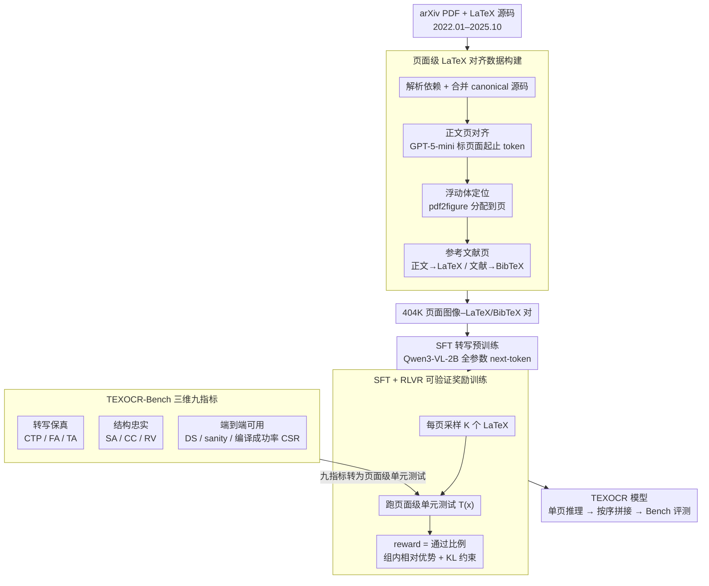

# TeXOCR: Advancing Document OCR Models for Compilable Page-to-LaTeX Reconstruction

**会议**: ACL2026  
**arXiv**: [2604.22880](https://arxiv.org/abs/2604.22880)  
**代码**: 待确认（论文页面有 Data & Models / Code 锚点，但当前缓存与 arXiv abs 未保留具体链接）  
**领域**: 文档OCR / 强化学习  
**关键词**: Page-to-LaTeX、文档OCR、可编译LaTeX、RLVR、单元测试奖励

## 一句话总结
这篇论文把科学 PDF OCR 从“转成文本/Markdown”推进到“重建可零人工编译的页面级 LaTeX”，提出 TEXOCR-Bench、TEXOCR-Train 和 SFT+RLVR 两阶段训练，让一个 Qwen3-VL-2B 派生模型在结构一致性、引用有效性和编译成功率上显著优于同规模开源基线。

## 研究背景与动机
**领域现状**：科学论文仍大量以 PDF 传播，但真正可复用的研究资产往往是 LaTeX 源码：它保留公式、表格、章节、引用、浮动体和编号结构，也能重新编译、编辑和接入出版流程。近年的文档 OCR 已从传统模块化管线转向 MLLM 端到端识别，很多系统能把 PDF 转成 plain text 或 Markdown。

**现有痛点**：Markdown 级 OCR 对“看起来像文本”已经有帮助，但科学文档的很多错误不是表面字符错几个这么简单。一个漏掉的右括号、错误的环境边界、损坏的 `\ref{}` 标签、错位的表格列分隔符，都可能让整篇 LaTeX 不能编译，或者更糟糕地静默改变引用和编号语义。

**核心矛盾**：现有 OCR 评测多关注局部转写相似度，而可用 LaTeX 要求全局不变量：章节层级要对、浮动体要落到合理页面、公式和表格语法要闭合、label-reference 链接要能解析、最终项目要能无人工干预编译。单纯 SFT 学会“像 LaTeX 的字符串”，不等于学会这些可执行约束。

**本文目标**：作者要建立一个能评估 page-level PDF-to-LaTeX 的 benchmark，构造大规模页面对齐训练集，并验证可验证奖励能否把模型从 token imitation 推向 functional correctness。

**切入角度**：论文把 LaTeX 重建看成“带单元测试的 OCR”问题。评测侧定义九个指标覆盖转写、结构和端到端可用性；训练侧把这些指标改写成 page-level pass/fail unit tests，用 RLVR 直接奖励可编译、可解析、引用一致的输出。

**核心 idea**：用 LaTeX 编译器和结构检查器作为可验证监督，把 OCR 模型训练目标从“生成相似文本”改成“生成能通过文档单元测试的 LaTeX 项目”。

## 方法详解
TeXOCR 的方法由三个部分组成：TEXOCR-Bench 用来定义任务和评测；TEXOCR-Train 用来提供大规模页面级监督；TEXOCR 模型训练则先用 SFT 学转写，再用 RLVR 针对 LaTeX 单元测试做强化优化。

### 整体框架
输入是一页科学 PDF 的渲染图像，输出是该页对应的 LaTeX 或 BibTeX 片段。训练时，作者从 arXiv 收集 2022 年 1 月到 2025 年 10 月的 LaTeX 源码包和 PDF，解析 `.tex` 依赖、合并源文件、恢复章节/图表结构，再把 PDF 切成单页截图并与 LaTeX 片段对齐。模型以 Qwen3-VL-2B 为基础，先在 404K 个 page image-LaTeX pair 上全参数 SFT，再在单页样本上采样多组输出，用自动构造的单元测试给 reward，做 group-relative policy optimization 风格更新。

评测时，所有模型都按统一 page-level inference 协议处理：每一页独立生成 LaTeX，随后按文档顺序拼接，再计算九个指标和最终 Overall score。作者还比较了 single-image、multi-image、merged 多页图三种推理粒度，发现单页图最稳定。

### 关键设计

**1. 三维九指标的 TEXOCR-Bench：把"能不能用"拆成可量化的工程约束**

科学文档 OCR 真正的风险常常藏在"看起来差不多但根本不能用"的地方——正文 OCR 得分很高，却因为一个漏掉的环境边界或损坏的 `\ref{}` 让整篇无法编译。为此 benchmark 把质量拆成三个维度九个指标，逼模型不能只靠正文转写蒙混过关：转写保真（Transcription Fidelity）含复杂文本保留 CTP、公式准确率 FA、表格准确率 TA；结构忠实（Structural Faithfulness）含章节准确率 SA、引用覆盖 CC、引用有效性 RV；端到端可用（End-to-End Usability）含文档级相似度 DS、基础 sanity check 和编译成功率 CSR。

关键在于评测不是逐页打分了事，而是把页面输出按文档顺序合并成完整项目，再跑结构解析和标准 LaTeX 编译。于是 section、citation、float、formula、table 乃至 compiler 这些工程约束都被纳入考核——一个只会写"像 LaTeX 的字符串"但编不过的模型，在 CSR 上会被直接打回原形。

**2. 页面级 LaTeX 对齐数据构建：先解决源码顺序与显示顺序的天然错位**

LaTeX 源码的书写顺序和 PDF 的显示顺序经常对不上，尤其 figure/table 这类浮动体——若不显式处理这种页面-源码错位，模型会学到错误映射，后面再强的训练目标也救不回来。数据构建因此分类处理：先解析 LaTeX 源码依赖、合并成 canonical source；正文页用 GPT-5-mini 辅助识别页面起止 token，与源码片段对齐；图表等浮动体用 pdf2figure 在全局 PDF 中定位后再分配到最合适的页面；参考文献页则把 body 区域继续用 LaTeX 监督、reference 区域转成 BibTeX 监督。这样得到的每一个单页样本，其图像与 LaTeX/BibTeX 目标才是真正对齐、可供监督的。

**3. SFT + RLVR 的可验证奖励训练：把"能不能编译"变成训练信号**

普通的 token loss 表达不了"这段 LaTeX 能不能编译""这个 label 是否存在""表格列是否闭合"这类离散约束，所以单纯 SFT 学出来的只是字符层面的相似。训练因此分两步走：SFT 阶段用标准 next-token prediction 先学会高保真转写，目标可概括为最大化 $\log \pi_\theta(y_t \mid x,p,y_{<t})$；RLVR 阶段则对每页采样 $K$ 个 completion，让每个输出跑一遍页面级测试集合 $T(x)$，reward 取通过测试的比例：

$$R(x,y)=|T(x)|^{-1}\sum_{\tau\in T(x)}\mathbb{I}[\tau(y)=\text{pass}]$$

优化时使用组内相对 advantage，并加 KL 约束让策略不偏离 SFT reference。这套可验证奖励把编译、引用、结构等可程序化检查的离散约束直接变成梯度信号，恰好补上 token loss 顾不到的部分。

### 损失函数 / 训练策略
训练分两阶段。Stage I 对 Qwen3-VL-2B 做全参数 SFT，训练 1 个 epoch，学习率 $1e-5$，每个样本由单页 PDF 截图、格式说明 prompt 和对应 LaTeX/BibTeX 目标组成。Stage II 在 SFT 模型上做 RLVR：每页采样 $K$ 个输出，执行转写、结构和可用性三组二值单元测试，reward 为通过比例，并用 group-relative advantage 更新策略，同时加 KL penalty 维持输出风格稳定。作者还分析了 group size $K\in\{4,8,12,16,20,24\}$，发现更大的 $K$ 能降低方差，让 RLVR 收益更稳定。

## 实验关键数据

### 主实验
TEXOCR-Bench 本身包含 2,135 个专家标注文档；TEXOCR-Train 包含 57K 篇论文、404K 个页面图像-LaTeX/BibTeX 对，覆盖 181K 图像、231K 表格和 488K 公式。主实验评测 21 个前沿 MLLM/OCR 模型，包括 GPT-5.3、Qwen3-VL、Qwen2.5-VL、InternVL、DeepSeek-OCR、olmOCR-2、Infinity-Parser、Pixtral、Mistral-Small、LLaVA-OneVision、Phi 系列等。

| 模型 | Structural Avg | Usability Avg | Transcription Avg | CSR | Overall | 主要结论 |
|------|----------------|---------------|-------------------|-----|---------|----------|
| GPT-5.3 | 78.2 | 84.6 | 72.7 | 82.7 | 78.5 | 闭源最稳，整体第一 |
| TEXOCR (SFT + RLVR) | 83.1 | 68.4 | 73.5 | 45.2 | 75.0 | 开源最强，结构忠实度最高 |
| TEXOCR (SFT) | 74.0 | 66.0 | 70.1 | 44.3 | 70.0 | SFT 已显著强于同尺寸基座，但结构约束不足 |
| Qwen3-VL-32B | 55.5 | 74.7 | 76.1 | 58.9 | 68.8 | 大模型转写强，但引用/结构不稳定 |
| Qwen3-VL-8B | 39.4 | 74.6 | 72.1 | 59.0 | 62.2 | 文本与公式尚可，结构分低 |
| Qwen3-VL-2B | 24.3 | 68.5 | 63.8 | 57.4 | 52.2 | 未针对 LaTeX 训练时结构能力很弱 |
| olmOCR-2-7B | 14.8 | 66.2 | 61.4 | 36.5 | 47.5 | Markdown/PDF OCR 强项不能直接迁移到可编译 LaTeX |
| DeepSeek-OCR | 1.5 | 59.5 | 31.5 | 50.1 | 30.8 | 常输出 Markdown 风格文本，LaTeX 结构几乎无效 |

RLVR 的收益集中在结构和可用性上。SFT 到 SFT+RLVR 的 Overall 从 70.0 提到 75.0；Structural Avg 从 74.0 提到 83.1，Reference Validity 从 74.1 提到 86.8，Citation Coverage 从 74.5 提到 85.9。这说明可验证奖励确实能让模型更重视 label、reference、section 这类 token loss 不容易稳定优化的约束。

### 消融实验
单元测试 reward 的消融很直接：去掉某一类测试，对应能力下降，且 Overall 从 75.0 掉到约 70-71。尤其去掉 Structural Faithfulness 单元测试后，结构平均分从 83.1 降到 73.1；去掉 Transcription Fidelity 后，公式准确率从 58.4 降到 53.4，复杂文本保留从 72.8 降到 65.6。

| RLVR 配置 | Structural Avg | Usability Avg | Transcription Avg | CSR | Overall | 说明 |
|-----------|----------------|---------------|-------------------|-----|---------|------|
| SFT+RLVR | 83.1 | 68.4 | 73.5 | 45.2 | 75.0 | 完整单元测试奖励 |
| w/o Transcription Fidelity | 77.4 | 67.5 | 68.9 | 48.9 | 71.3 | 转写相关 CTP/FA/TA 明显下降 |
| w/o Structural Faithfulness | 73.1 | 67.2 | 70.6 | 46.4 | 70.3 | section、citation、reference 受损最大 |
| w/o End-to-End Usability | 75.1 | 66.5 | 70.1 | 46.3 | 70.5 | 文档相似度和整体可用性下降 |

推理粒度消融说明，当前任务虽然最终是 document-centric，但简单把多页一起喂给模型反而更差。multi-image 会产生跨页干扰，merged image 会损失分辨率和视觉清晰度。

| 模型 | Single-Image | Multi-Image | Merged | 结论 |
|------|--------------|-------------|--------|------|
| Qwen3-VL-2B | 52.2 | 39.1 | 36.9 | 单页推理保留局部布局，明显更稳 |
| GPT-5.3 | 78.5 | 56.9 | 42.6 | 即使闭源强模型也受多页干扰和分辨率损失影响 |

错误分析把常见失败归纳为五类：页面开头/结尾段落截断，数学公式符号或定界符错误，表格列分隔和多行单元损坏，citation/reference 缺失或格式错误，以及由上述问题引起的编译失败。这些错误恰好对应 TEXOCR-Bench 与 RLVR reward 覆盖的重点。

### 关键发现
- 可编译 LaTeX 重建比 Markdown OCR 难得多。很多模型能保留正文，却在 section、citation、reference 和 table syntax 上崩掉。
- RLVR 的作用不是简单提高文本相似度，而是把模型推向 LaTeX invariants：闭合环境、合法引用、稳定编号和可编译片段。
- GPT-5.3 仍是 Overall 第一，但 TEXOCR (SFT+RLVR) 在结构忠实度平均分上超过它，说明针对性训练能弥补小模型容量劣势。
- Compilation Success Rate 是非常严格的指标。TEXOCR 的 CSR 只有 45.2，GPT-5.3 为 82.7，说明 page-level LaTeX OCR 距离可靠自动出版仍有明显空间。
- 单页推理目前优于多页输入，但这也是局限：文档级一致性仍未真正解决。

## 亮点与洞察
- 论文最大的贡献是把文档 OCR 的目标定义得更“工程真实”。很多 OCR benchmark 到 Markdown 就结束，但科研工作流需要的是能被 LaTeX 编译器接受、能维护引用语义的源文件。
- 用 unit tests 做 RLVR reward 非常自然。LaTeX 是少数能自动验证语法、引用、表格和公式结构的生成任务之一，这让强化学习不必依赖脆弱的偏好模型。
- 数据构建里对 float placement 的处理很关键。图表在源码和 PDF 中位置错位是 LaTeX 的基本特性，如果不解决这一点，page-to-LaTeX 监督会天然带噪。
- 评测维度设计可迁移到其他“生成可执行文档/代码”的任务。比如 notebook OCR、HTML/CSS 还原、CAD 脚本重建，都可以用相似的结构指标 + 可执行测试奖励。

## 局限与展望
- 论文仍以 page-level reconstruction 为主。真实 LaTeX 项目有跨页结构、全局宏、共享 bibliography、长距离引用和跨页浮动体，单页拼接很难完全保证全局一致。
- CSR 对实际可用性很重要，但也可能受编译环境、宏包缺失和 preamble 策略影响。不同出版模板或自定义命令会让任务更复杂。
- 数据主要来自 arXiv 和若干公开扫描来源，对非英语论文、复杂出版模板、手写批注和低质量扫描的覆盖仍需扩大。
- RLVR reward 是 pass/fail 单元测试，信号稀疏。后续可以结合可微渲染相似度、编译日志定位、局部修复器，让奖励更细粒度。
- 代码/数据链接在当前缓存和 arXiv abs 页面中没有明确保留，复现实验还需要等待作者发布或从论文 HTML 锚点进一步确认。

## 相关工作与启发
- **vs PDF-to-Markdown OCR**: READoc、OmniDocBench、olmOCRBench 等主要评估文本/Markdown 抽取，本文进一步要求 LaTeX 结构、引用和编译成功，因此更接近科学出版工作流。
- **vs formula/table LaTeX transcription**: CMER-Bench、Table2LaTeX-RL 聚焦局部元素，TeXOCR 把公式、表格、章节、引用和全文编译统一到页面级文档重建。
- **vs olmOCR2 / DianJin-OCR-R1 的 RL 思路**: 这些工作已用任务特定或可验证奖励改善 OCR，一般面向阅读顺序、表格或 Markdown；本文把 verifiable reward 扩展到可编译 LaTeX 不变量。
- **vs 通用 MLLM OCR**: Qwen、InternVL、LLaVA、Phi 等模型具备强视觉文本识别能力，但没有针对 LaTeX 工程约束训练时，结构指标会明显落后。

## 评分
- 新颖性: ⭐⭐⭐⭐☆ Page-to-LaTeX 本身不是全新，但 benchmark、训练集和 RLVR 单元测试奖励组合得很完整。
- 实验充分度: ⭐⭐⭐⭐⭐ 21 个模型、九指标、训练消融、推理粒度和错误分析都覆盖到，证据链很扎实。
- 写作质量: ⭐⭐⭐⭐☆ 任务动机和系统设计清楚，部分代码/数据链接在文本缓存中不够明确。
- 价值: ⭐⭐⭐⭐⭐ 对科学文档 OCR、可执行文档生成和 RLVR 应用都很有价值，尤其适合作为后续 PDF-to-LaTeX 的基准起点。

<!-- RELATED:START -->

## 相关论文

- [\[ACL 2026\] SciMDR: Advancing Scientific Multimodal Document Reasoning](scimdr_advancing_scientific_multimodal_document_reasoning.md)
- [\[ACL 2026\] SlideAgent: Hierarchical Agentic Framework for Multi-Page Visual Document Understanding](slideagent_hierarchical_agentic_framework_for_multi-page_visual_document_underst.md)
- [\[ACL 2026\] ShredBench: Evaluating the Semantic Reasoning Capabilities of Multimodal LLMs in Document Reconstruction](shredbench_evaluating_the_semantic_reasoning_capabilities_of_multimodal_llms_in_.md)
- [\[CVPR 2026\] Reading or Reasoning? Format Decoupled Reinforcement Learning for Document OCR](../../CVPR2026/multimodal_vlm/reading_or_reasoning_format_decoupled_reinforcement_learning_for_document_ocr.md)
- [\[AAAI 2026\] Seeing Justice Clearly: Handwritten Legal Document Translation with OCR and Vision-Language Models](../../AAAI2026/multimodal_vlm/seeing_justice_clearly_handwritten_legal_document_translation_with_ocr_and_visio.md)

<!-- RELATED:END -->
