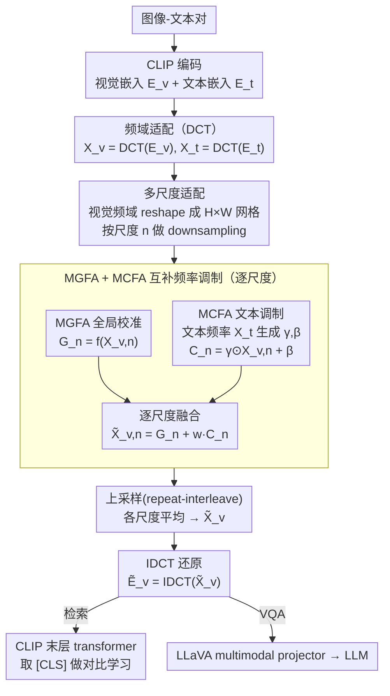

# Text-Guided Multi-Scale Frequency Representation Adaptation

**会议**: ACL2026  
**arXiv**: [2605.08181](https://arxiv.org/abs/2605.08181)  
**代码**: https://github.com/Kelvin-ywc/FreqAdapter  
**领域**: 多模态VLM / 参数高效微调  
**关键词**: 频域适配、DCT、多尺度特征、文本引导、CLIP/LLaVA

## 一句话总结
这篇论文提出 FreqAdapter：先把 CLIP/LLaVA 的视觉和文本嵌入变换到 DCT 频域，再用文本引导的多尺度全局适配与跨模态调制微调视觉频率表示，以约 0.11% 额外参数在图文检索和 VQA 上稳定优于常见 prompt/adapter 方法。

## 研究背景与动机
**领域现状**：CLIP、LLaVA 等多模态基础模型已经具备强视觉-文本表示能力，但在新数据分布或下游任务上仍需要适配。为了降低训练成本，社区常用 prompt tuning、adapter tuning、LoRA 或视觉提示方法，只更新少量参数来提升图文检索、VQA 等任务表现。

**现有痛点**：多数参数高效微调方法直接在空间域或特征域做统一调整。这有两个问题：一是空间/patch 表示包含大量冗余信息，有限参数容易拟合噪声或局部分布；二是很多方法对所有 token 或所有特征通道一视同仁，没有显式利用视觉信号的多尺度结构，也没有充分让文本语义参与视觉适配。

**核心矛盾**：多模态任务需要同时捕获细节和全局语义，但参数高效微调又不能大幅改动 backbone。如果适配模块过弱，它只能做浅层线性修正；如果模块过强或跨模态交互过多，又可能干扰原模型已经学好的单模态表示。

**本文目标**：作者希望找到一个既轻量又稳定的适配空间，让视觉特征能在文本条件下按频率和尺度被选择性调整，从而减少冗余、增强跨模态对齐，并保持低参数和低 FLOPs。

**切入角度**：论文先用 DCT 分析视觉嵌入的信息分布，发现语义信息在低频成分中更集中：保留 198/768 个低频分量即可达到 0.5 的重建余弦相似度，保留 495 和 626 个分量时相似度超过 0.8 和 0.9。这个观察支持在频域做紧凑适配。

**核心 idea**：把视觉和文本嵌入同时映射到频域，在不同空间尺度上用文本生成调制参数，再把调整后的视觉频率表示通过 IDCT 还原回空间域，作为 plug-and-play 的多模态适配特征。

## 方法详解
FreqAdapter 的基本流程是：CLIP 编码图像和文本得到视觉嵌入与文本嵌入；对二者做 DCT 得到频域表示；在频域里对视觉特征做多尺度聚合；每个尺度上分别经过 MGFA 和 MCFA；再把各尺度输出上采样、平均融合；最后用 IDCT 回到空间域，送入后续 CLIP transformer 或 LLaVA projector。

### 整体框架
给定图像-文本对，CLIP 产生视觉嵌入 $E_v\in\mathbb{R}^{S_v\times D_v}$ 和文本嵌入 $E_t\in\mathbb{R}^{S_t\times D_t}$。FreqAdapter 先计算 $X_v=DCT(E_v)$ 与 $X_t=DCT(E_t)$，在频域得到更紧凑、频带可控的表示。视觉 token 序列会被 reshape 成 $H\times W\times D_v$ 的网格，并在多个尺度上做 downsampling；每个尺度输出先由全局频率适配器校准，再由跨模态频率适配器注入文本引导，最终通过 repeat-interleave 回到原分辨率。所有尺度的输出平均得到 $\tilde{X}_v$，再经 IDCT 得到适配后的视觉特征 $\tilde{E}_v$。

在 CLIP 检索任务中，适配后的视觉嵌入进入最后一层 transformer，再取 `[CLS]` 视觉特征与文本特征做对比学习。在 LLaVA 中，FreqAdapter 可直接插到 CLIP vision encoder 与 LLaVA multimodal projector 之间，把更文本相关的视觉特征送给大语言模型。

### 关键设计

**1. 频域适配而非空间域适配：把有限的参数花在信息密度最高的频率分量上**

空间域 adapter 在有限训练步数下很容易拟合 patch 表示里的局部噪声——视觉嵌入冗余度高，少量参数稍不留神就学歪了。FreqAdapter 改在频域做文章：DCT 是正交变换，能把嵌入从空间/通道形式转成频率系数，而论文的经验观察显示语义信息高度集中在低频分量（保留 198/768 个低频分量即可达到 0.5 的重建余弦相似度）。于是在频域适配相当于对不同频带做更可控的修正，低频结构、高频细节和噪声被自然区分开，参数更新更平滑，训练一轮内就能收敛，而不必对全部高冗余的 patch 表示做无差别更新。

**2. 多尺度适配策略（Multi-Scale Adaptation）：让一个模块同时看清局部细节和全局结构**

图文匹配既要识别局部物体、也要理解整体场景，单一尺度要么只改细节、要么过度平滑，都顾不全。FreqAdapter 把视觉频域网格按尺度 $n$ 做 downsampling 得到 $X_{v,n}$，每个尺度配自己的 MGFA 和 MCFA，输出 $\tilde{X}_{v,n}=G_n+wC_n$，再用 interleave-repeat 恢复到原尺寸，对 $N$ 个尺度取平均。这样不同尺度能按 caption 的语义重点选择不同 receptive field。论文在附录中发现 $N=3$ 效果最好，过大的感受野反而会损失局部信息。

**3. MGFA + MCFA 的互补频率调制：稳定的视觉校准 + 文本条件的跨模态对齐**

只做视觉全局校准会缺文本条件，只做文本调制又可能过度干扰已经学好的视觉表征，两者得搭配着来。MGFA 是个轻量 bottleneck（两层投影加 ReLU），对每个尺度的视觉频率特征做全局变换 $G_n=f(X_{v,n})$，负责稳定校准；MCFA 则从文本频率表示 $X_t$ 预测调制参数 $\gamma,\beta$，对视觉特征做仿射调制 $C_n=\gamma\odot X_{v,n}+\beta$，把文本语义注入视觉频率。最终用权重 $w$ 控制跨模态注入强度（检索任务 $w=0.01$、VQA 任务 $w=1.0$），两个模块相加既保住了视觉表征的稳定性，又拿到了文本条件下的细粒度对齐。

### 损失函数 / 训练策略
FreqAdapter 用 CLIP contrastive loss 在图文对上训练，backbone 基本保持冻结，只优化适配模块。检索实验在 COCO 2017 train 上训练 1 个 epoch，batch size 128，AdamW 学习率 0.001；检索任务的 multimodal weight $w=0.01$，VQA 任务 $w=1.0$。所有 CLIP 实验在单张 A100-40G 上完成。论文还指出较小的跨模态权重通常更适合检索，因为过多文本信息会干扰当前模态的特征提取。

## 实验关键数据

### 主实验
图文检索实验在 COCO 2017 validation 和 Flickr30K validation/test 上评估，指标为 image-to-text 与 text-to-image 的 R@1/R@5/R@10。FreqAdapter 在 CLIP-B/16、CLIP-L/14、CLIP-L/14-336 三个 backbone 上大多优于 CoOp、MaPLe、CLIP-Adapter、MMA 和 LoR-VP。

| Backbone | 方法 | COCO I2T R@1 | COCO T2I R@1 | Flickr30K I2T R@1 | Flickr30K T2I R@1 | 说明 |
|----------|------|--------------|--------------|-------------------|-------------------|------|
| CLIP-B/16 | 原始 CLIP | 51.82 | 32.65 | 85.30 | 62.28 | 未适配基线 |
| CLIP-B/16 | CLIP-Adapter | 56.30 | 41.60 | 83.90 | 71.26 | COCO 提升，Flickr I2T 略损 |
| CLIP-B/16 | FreqAdapter | 57.96 | 43.30 | 86.80 | 73.42 | 检索方向均衡提升 |
| CLIP-L/14 | CLIP-Adapter | 60.38 | 43.18 | 87.30 | 75.76 | 强 adapter 基线 |
| CLIP-L/14 | FreqAdapter | 61.02 | 44.18 | 87.50 | 75.72 | COCO 更强，Flickr 持平或略优 |
| CLIP-L/14-336 | CLIP-Adapter | 60.42 | 44.62 | 90.00 | 77.28 | 高分辨率基线 |
| CLIP-L/14-336 | FreqAdapter | 61.42 | 45.23 | 90.90 | 77.60 | 整体最佳，COCO T2I R@1 提升到 45.23 |

VQA 实验把 CLIP 上训练得到的 FreqAdapter 接入 LLaVA 1.5。结果显示，FreqAdapter 不只是检索 adapter，也能改善视觉问答中的图像理解，尤其在 MM-Vet 上对 13B LLaVA 提升明显。

| Base Model | 方法 | MM-Vet | LLaVA-Bench | 解读 |
|------------|------|--------|-------------|------|
| LLaVA 1.5-7B | w/o prompt | 30.9 | 64.3 | 直接回答基线 |
| LLaVA 1.5-7B | CLIP-Adapter | 27.1 | 61.8 | 分布特化后泛化反而下降 |
| LLaVA 1.5-7B | FreqAdapter | 31.8 | 64.8 | 两个指标都超过 7B 基线 |
| LLaVA 1.5-13B | w/o prompt | 32.8 | 71.9 | 13B 原始基线 |
| LLaVA 1.5-13B | CLIP-Adapter | 32.9 | 64.9 | LLaVA-Bench 明显下降 |
| LLaVA 1.5-13B | FreqAdapter | 37.4 | 72.4 | MM-Vet 明显提升，LLaVA-Bench 也高于原始基线 |
| LLaVA 1.5-13B | API (LLaVA) | 36.6 | 74.8 | FreqAdapter 在 MM-Vet 上超过 API(LLaVA)，但 LLaVA-Bench 仍低 |

### 消融实验
模块消融证明 MGFA 和 MCFA 都有效，其中 MCFA 的跨模态文本调制贡献更大；二者结合最好。该实验使用 CLIP-L/14-336，在 MSCOCO 检索上评估。

| MGFA | MCFA | I2T R@1 | I2T R@5 | I2T R@10 | T2I R@1 | T2I R@5 | T2I R@10 | 结论 |
|------|------|---------|---------|----------|---------|---------|----------|------|
| - | - | 57.34 | 80.38 | 87.64 | 36.08 | 60.70 | 70.66 | 原始 CLIP-L/14-336 |
| - | ✓ | 58.16 | 81.90 | 88.94 | 42.81 | 67.86 | 77.43 | 文本引导调制带来大幅 T2I 提升 |
| ✓ | - | 58.70 | 82.28 | 89.54 | 43.47 | 68.66 | 78.04 | 全局频率校准也有效 |
| ✓ | ✓ | 61.42 | 83.64 | 90.10 | 45.23 | 70.92 | 80.02 | 两个模块互补，整体最优 |

多尺度消融显示 $N=3$ 最合适。$N=1$ 只做单尺度适配，I2T R@1 为 60.18；$N=2$ 提升到 61.32；$N=3$ 达到 61.42 和 T2I R@1 45.23；$N=4$ 反而回落，说明过大的聚合窗口会丢失细节。

| 尺度数 N | I2T R@1 | I2T R@5 | I2T R@10 | T2I R@1 | T2I R@5 | T2I R@10 | 说明 |
|----------|---------|---------|----------|---------|---------|----------|------|
| 1 | 60.18 | 81.78 | 87.50 | 44.08 | 69.80 | 77.28 | 单尺度，细节和全局兼顾不足 |
| 2 | 61.32 | 82.76 | 88.42 | 44.81 | 70.20 | 79.47 | 多尺度开始稳定提升 |
| 3 | 61.42 | 83.64 | 90.10 | 45.23 | 70.92 | 80.02 | 最优配置 |
| 4 | 60.36 | 82.58 | 88.12 | 45.06 | 70.70 | 79.36 | 感受野过大导致信息损失 |

计算量方面，FreqAdapter 的参数与 FLOPs 都很轻。它比 MaPLe 少得多参数，GFLOPs 几乎与 CLIP-Adapter 和 MMA 持平。

| 方法 | 参数量 | 参数占比 | GFLOPs | 说明 |
|------|--------|----------|--------|------|
| CLIP | - | - | 362.5 | backbone |
| CoOp | 16.4k | 0.003% | 370.8 | 参数最少但计算反而高 |
| MaPLe | 798.7k | 0.19% | 362.9 | 参数最多 |
| CLIP-Adapter | 524.3k | 0.12% | 362.5 | 常用 adapter 基线 |
| MMA | 118.7k | 0.03% | 362.7 | 更轻量 |
| FreqAdapter | 476.4k | 0.11% | 362.6 | 参数低于 CLIP-Adapter，额外计算几乎可忽略 |

### 关键发现
- 频域适配比空间域适配更稳定。作者对 SpatialAdapter 的对照显示，空间域方法在一个 epoch 后半段出现过拟合和 loss 回升，而 FreqAdapter 在 COCO 与 Flickr30K 上都更平滑。
- MCFA 是性能跃迁的关键，尤其对 text-to-image 检索提升明显；MGFA 则进一步稳定各频段调整。
- 适度跨模态交互很重要。检索任务中较小 $w=0.01$ 更好，过大的文本注入会干扰当前模态特征。
- FreqAdapter 可以迁移到 LLaVA，但增益并非所有指标都领先 API baseline，说明频域 adapter 对复杂生成式 VQA 的上限仍受 backbone 和 projector 影响。

## 亮点与洞察
- 这篇论文给参数高效微调提供了一个很有意思的“适配空间”视角。以往大家主要比较 prompt、adapter、LoRA 的结构差异，这里强调先换到频域再适配，减少冗余后再做小模块更新。
- DCT + 多尺度的组合很自然。频域负责按频带分解信息，多尺度负责按空间感受野聚合信息，两者刚好对应视觉语义中的“频率”和“区域”两个维度。
- MCFA 的文本条件调制有较强可复用性。对任意 CLIP-like 或 VLM，只要有视觉 token 和文本 token，就可以用文本频率特征生成 $\gamma,\beta$ 去调视觉频率表示。
- 频域适配和空间域适配不是互斥的。附录讨论了 FreqAdapter 与 CLIP-Adapter 融合，显示两类适配可以互补，这给后续 hybrid PEFT 留了空间。

## 局限与展望
- 理论解释还偏经验。论文用信息集中和训练曲线说明频域更稳，但还没有严格证明哪些频率对应哪些语义、为何特定任务最适合 DCT。
- 实验主要围绕 CLIP-based 架构和 LLaVA 1.5，模型规模相对有限。对于更大的 VLM、不同视觉编码器或端到端多模态 LLM，效果需要重新验证。
- 方法依赖文本引导，在只有图像或文本提示质量较差的场景中，MCFA 的调制可能带来错误语义偏置。
- 表格中很多提升是 1-2 个点，虽然稳定但不是压倒性。未来需要更大规模 benchmark、更多随机种子和统计显著性分析。
- DCT 是固定频域基，未必对所有 backbone 的 learned embedding 最优。后续可以探索可学习频域基、wavelet、多分辨谱分解或动态频带选择。

## 相关工作与启发
- **vs CLIP-Adapter**: CLIP-Adapter 在空间/特征输出上加 adapter，本文先把视觉和文本嵌入转到频域，并在频域做全局校准与文本调制，泛化更稳。
- **vs CoOp / MaPLe**: prompt tuning 主要改输入提示或跨模态 prompt，FreqAdapter 改的是视觉频率表示，适合需要细粒度图像特征调整的任务。
- **vs LoRA / LoR-VP**: LoRA 类方法通过低秩参数改变模型权重或视觉提示，FreqAdapter 保持 backbone 不动，用外接频域模块实现 plug-and-play。
- **vs 频域视觉方法**: SpectFormer、VFPT、SFMFusion 等说明频域能改善视觉表示，本文把频域处理扩展到图文跨模态适配，并直接用于 CLIP/LLaVA。

## 评分
- 新颖性: ⭐⭐⭐⭐☆ 频域思想在视觉中已有积累，但用于文本引导的多尺度 VLM adapter 很有新意。
- 实验充分度: ⭐⭐⭐⭐☆ 检索、VQA、模块消融、多尺度、计算量和空间/频域对照都覆盖到，但模型规模和任务类型仍有限。
- 写作质量: ⭐⭐⭐⭐☆ 方法脉络清晰，实验表格完整；理论部分可再深入，部分公式在缓存中排版略乱。
- 价值: ⭐⭐⭐⭐☆ 对参数高效微调和 VLM 适配有启发，尤其适合低成本提升 CLIP-like 模型的检索与感知能力。

<!-- RELATED:START -->

## 相关论文

- [\[CVPR 2026\] Language-guided Frequency Modulation for Large Vision-Language Models](../../CVPR2026/multimodal_vlm/language-guided_frequency_modulation_for_large_vision-language_models.md)
- [\[CVPR 2026\] FlashCache: Frequency-Domain-Guided Outlier-KV-Aware Multimodal KV Cache Compression](../../CVPR2026/multimodal_vlm/flashcache_frequency_kv_cache_compression.md)
- [\[CVPR 2026\] ORION: ORthonormal Text Encoding for Universal VLM Adaptation](../../CVPR2026/multimodal_vlm/orion_orthonormal_text_encoding_for_universal_vlm_adaptation.md)
- [\[ACL 2026\] TRACE: Unleashing Spatial Reasoning in Multimodal Large Language Models via Textual Representation Guided Reasoning](unleashing_spatial_reasoning_in_multimodal_large_language_models_via_textual_rep.md)
- [\[ACL 2026\] AFMRL: Attribute-Enhanced Fine-Grained Multi-Modal Representation Learning in E-commerce](afmrl_attribute-enhanced_fine-grained_multi-modal_representation_learning_in_e-c.md)

<!-- RELATED:END -->
