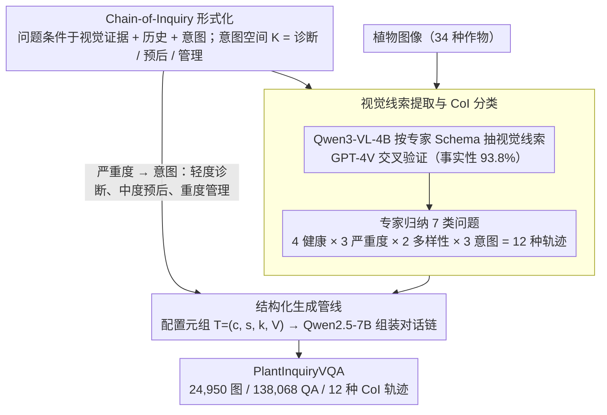

# Thinking Like a Botanist: Challenging Multimodal Language Models with Intent-Driven Chain-of-Inquiry

**会议**: ACL 2026 Findings  
**arXiv**: [2604.20983](https://arxiv.org/abs/2604.20983)  
**代码**: [github.com/syed-nazmus-sakib/PlantInquiryVQA](https://github.com/syed-nazmus-sakib/PlantInquiryVQA)  
**领域**: 医学图像 / 植物病理诊断  
**关键词**: 植物病理VQA、Chain-of-Inquiry、多步视觉推理、诊断推理、多模态评估

## 一句话总结
本文提出PlantInquiryVQA基准和Chain-of-Inquiry（CoI）框架，包含24,950张植物图像和138,068个问答对，模拟植物学家的适应性诊断提问策略，评估18个MLLM在植物病理诊断中的多步视觉推理能力，发现结构化提问显著提升诊断准确性并减少幻觉，但即使最强模型的临床实用性得分仅0.188。

## 研究背景与动机

**领域现状**：VQA数据集是评估多模态推理的核心范式，已扩展到医学影像、科学图像分析等领域。先进的VQA基准现在关注多面板、多选择和视觉-语言接地的问答对。农业视觉领域的数据集（如PlantVillage、PlantDoc）主要针对分类和分割任务，不支持交互式问答推理。

**现有痛点**：当前VQA基准从根本上是"以问题为中心"的——将每张图像视为独立查询的输入，而非目标导向的适应性探询的起点。然而在植物病理学等专业领域，有效的视觉推理不是回答孤立问题，而是从一系列相互依赖的探询中涌现——每个问题都基于先前观察，遵循序列化的叙事轨迹。专家植物学家通过从物种识别→疾病诊断→预后预测的分层、证据驱动提问策略进行整体评估。

**核心矛盾**：LLM在实现Chain-of-Thought推理方面取得了显著进展，但类似的多步探索在VQA数据集设计中尚未被充分探索。CoT通常被视为提示策略或模型架构的隐含能力，而非数据集本身的显式结构需求。

**本文目标**：构建一个数据集级别的Chain-of-Inquiry框架，使问题序列本身反映领域专家的适应性、决策驱动的工作流。

**切入角度**：植物病理学中，每个样本根据其视觉外观获得独特的诊断考虑。症状模糊时，专家优先进行鉴别诊断和比较视觉分析；症状严重时，专家转向疾病管理和预防策略。提问的序列和意图与答案本身同样重要。

**核心 idea**：形式化Chain-of-Inquiry框架，将诊断轨迹建模为条件于视觉线索和认知意图的有序问答序列，根据疾病严重度自动调整提问策略从诊断→预后→管理。

## 方法详解

### 整体框架

这篇论文要解决的是：现有 VQA 基准把每张图当成独立查询的输入，问题彼此孤立，根本测不出专家诊断时那种"一环扣一环"的适应性推理。PlantInquiryVQA 的思路是把数据集本身做成一条诊断链——让问题序列复现植物学家从识别物种、判断病害到给出预后管理的真实工作流。整条构建管线分三步走：先用 VLM 按专家定义的 schema 从植物图像里抠出细粒度视觉线索，再把植物病理知识结构化、把疾病严重度映射到不同的诊断意图，最后由 LLM 根据意图和视觉证据动态拼装对话轨迹。最终数据集覆盖 34 种作物、7 类问题、12 种独特的 CoI 轨迹。

### 关键设计

**1. Chain-of-Inquiry 形式化：把诊断推理写成条件于"意图"的有序对话链**

旧基准的根本问题在于它"以问题为中心"，每个问题都不知道前一个看到了什么。CoI 的破法是把整条诊断轨迹形式化为有序的 T 轮对话 $C(x, v_x) = \langle (q_1, a_1), \ldots, (q_T, a_T) \rangle$，其中每个问题 $q_t$ 都同时条件于视觉证据 $v_x$、先前上下文 $H_{t-1}$ 和一个潜在的诊断意图 $k \in \mathcal{K}$。意图空间被划成三层：诊断（$k_D$，识别健康状态与鉴别诊断）、预后（$k_P$，预测疾病轨迹与因果病因）、管理（$k_M$，处方策略与反事实预防推理）。

关键在于意图不是固定的，而是随病害严重度切换——轻度症状走诊断意图，中度走预后，重度走管理。这背后是一个朴素但被忽视的事实：轻度症状真正难的是鉴别诊断（区分长得像的两种病），而重度损害的人已经不关心是什么病、只想知道怎么补救。把意图显式编进数据集，就能测出模型是否会随证据自适应地切换推理链路，而不是对所有图都套同一套问法。

**2. 视觉线索提取与 CoI 分类：用专家 schema 把"看图"变成结构化诊断特征，并钉死 12 种轨迹**

要让生成的问题站得住脚，第一步得有可靠、结构化的视觉证据，而不是模型自由发挥。论文请了 6 名植物学家（2 名博士 + 4 名研究生）定义"视觉解析 Schema"，覆盖症状学、分布模式、疾病严重度量化三个维度；再用 Qwen3-VL-4B 自动抽取视觉线索（准确率 73.6%）、GPT-4V 交叉验证，最后专家对标记实例和 5000 个随机样本做临床事实性核查（事实性得分 93.8%）。

分类这一层填的是另一个空白：古典植物病理学只描述了诊断的生物学阶段，却没有一套"视觉对话该怎么问"的标准分类法。论文让专家对 600 个随机样本做临床评估、记录他们的真实提问策略，从中归纳出 7 类标准询问（视觉感知与接地、诊断推理、因果推理、风险评估、预后预测、处方推理、反事实推理），再交叉 4 种健康状态 × 3 种严重度 × 2 种实例多样性 × 3 种认知意图，得到 12 种独特的 CoI 轨迹。这样每条生成的链都对得上一个真实存在的诊断场景。

**3. 结构化生成管线：用配置元组解耦，让同一张图也能长出不同难度的推理链**

有了线索和轨迹分类，最后要把它们拼成自然的对话。生成由一个配置元组 $T = (c, s, k_s, V_{cues})$ 驱动——分别是生物条件、严重度、意图和视觉线索；认知目标 $k$ 会根据严重度 $s$ 调节信息密度。然后用 Qwen2.5-7B-Instruct 从问题模板动态组装轨迹，并按需注入特定推理模块（如 temporal_evolution、remediation_strategy）来加深复杂度。

这种解耦的好处是"同图多链"：比如一张叶片图，配成轻度就生成一条偏鉴别诊断的链，配成重度就生成一条偏管理建议的链，即便底层图像相同。正是这个机制让数据集能均匀铺满从常规识别到复杂多步临床推理的整个难度谱，而不是扎堆在简单识别上。

### 评估指标与基准设定

PlantInquiryVQA 是纯评估基准，不训练模型。评测同时用标准词汇指标（F1、BLEU-4、ROUGE-L）和七个领域特定得分：疾病识别（$S_{dis}$）、安全性（$S_{safe}$）、临床实用性（$S_{clin}$）、视觉接地（$S_{vg}$）、视觉特征提取效率（E）、流行度偏差（B）和跨类公平性（F）。其中安全性和临床实用性是把诊断"误判为健康"等高危错误单独拎出来惩罚的关键维度。

## 实验关键数据

### 主实验（18个MLLM表现，关键指标）

| 模型 | F1 | 疾病识别 | 临床实用性 | 安全性 | 视觉接地 |
|------|-----|---------|-----------|--------|---------|
| Gemini-3-Flash | **0.255** | **0.444** | **0.188** | **0.147** | 0.259 |
| Seed-1.6-Flash | 0.226 | 0.344 | 0.120 | 0.075 | 0.394 |
| Grok-4.1-Fast | 0.203 | 0.224 | 0.067 | 0.009 | **0.498** |
| Ministral-3B | 0.166 | 0.189 | 0.059 | 0.020 | 0.372 |

### 消融实验（结构化提问对诊断效率的影响，Guided vs Scaffolded）

| 模型 | Scaffolded效率 | Guided效率 | 效率提升 |
|------|---------------|-----------|---------|
| Gemini-2.5-Flash | 2.60 | 3.67 | +41.15% |
| Qwen2.5-VL-32B | 1.60 | 2.94 | +83.75% |
| Gemma-3-27B | 1.88 | 2.38 | +26.60% |

### 关键发现
- **显著的领域差距**：即使最强模型Gemini-3-Flash，临床实用性仅0.188、安全性仅0.147，远不能满足自主部署要求
- **"看到"不等于"诊断"**：Grok-4.1-Fast的视觉接地最高（0.498）但疾病识别最低（0.224），说明准确描述视觉症状不等于能做出正确诊断
- **结构化提问减少幻觉**：问题引导的诊断比直接诊断在所有严重度下都显著更准确，具体问题迫使模型关注细粒度特征（如病变边缘、光晕存在），约束搜索空间
- **CoI结构是主要驱动因素**：Cascading模式（用模型自身先前回答）保留了Guided模式96.3%的效率和81.7%的诊断准确度，说明结构化提问本身（而非完美记忆）驱动了改善

## 亮点与洞察
- **Chain-of-Inquiry作为数据集级别的结构性约束**：将CoT从提示策略提升为数据集的显式结构需求，这个思路可以推广到任何需要多步推理评估的领域（如医学影像诊断、工程故障排查）。
- **意图驱动的适应性提问**：根据疾病严重度自动调整提问策略（诊断→预后→管理），这种意图-视觉耦合的设计理念可以启发Agent系统的对话策略设计。
- **视觉接地-诊断推理的解耦发现**：揭示了"描述症状"和"做出诊断"是两种可分离的能力，为模型改进指出了具体方向。

## 局限与展望
- 植物病理学通常需要触觉、环境等多感官信息，单帧图像不足以完全复现专家诊断流程
- 即使顶级模型仍会出现"虚假安全"错误（将患病样本误判为健康），目前只能作为决策支持工具而非替代
- 基准仅为英文，限制了对非英语地区小农户的可及性
- 视觉线索提取主要依赖Qwen3-VL-4B自动化完成，部分线索可能不够精确

## 相关工作与启发
- **vs PlantVillage/PlantDoc**：仅支持分类/分割，不支持交互式推理。PlantInquiryVQA提供多步结构化问答
- **vs 医学VQA（PMC-VQA、VQA-RAD）**：聚焦人类医学且是单轮问答，PlantInquiryVQA面向植物病理且是多步链式推理
- **vs BloomVQA**：基于Bloom分类法组织问题但依赖静态分类法，PlantInquiryVQA使问题序列条件于视觉证据和诊断意图

## 评分
- 新颖性: ⭐⭐⭐⭐ CoI框架从提示策略到数据集结构的范式提升是新颖贡献
- 实验充分度: ⭐⭐⭐⭐ 18个模型、完整消融、多种评估指标，但数据集构建部分自动化
- 写作质量: ⭐⭐⭐⭐ 框架设计清晰，实验分析深入，部分表格过多
- 价值: ⭐⭐⭐⭐ 为农业AI诊断推理提供了重要基准，CoI思路有跨领域迁移价值
- 综合: ⭐⭐⭐⭐ 切入角度新颖且实际，揭示了MLLM在专业诊断推理中的真实差距

<!-- RELATED:START -->

## 相关论文

- [\[CVPR 2026\] SeD-UD: An Influence-Driven and Hierarchically-Decoupled Information Bottleneck for Multimodal Intent Recognition](../../CVPR2026/multimodal_vlm/sed-ud_an_influence-driven_and_hierarchically-decoupled_information_bottleneck_f.md)
- [\[AAAI 2026\] Plug-and-Play Clarifier: A Zero-Shot Multimodal Framework for Egocentric Intent Disambiguation](../../AAAI2026/multimodal_vlm/plug-and-play_clarifier_a_zero-shot_multimodal_framework_for_egocentric_intent_d.md)
- [\[ACL 2026\] Enhancing Multimodal Large Language Models for Ancient Chinese Character Evolution Analysis via Glyph-Driven Fine-Tuning](enhancing_multimodal_large_language_models_for_ancient_chinese_character_evoluti.md)
- [\[ICCV 2025\] GRAB: A Challenging GRaph Analysis Benchmark for Large Multimodal Models](../../ICCV2025/multimodal_vlm/grab_a_challenging_graph_analysis_benchmark_for_large_multimodal_models.md)
- [\[CVPR 2026\] Circuit Tracing in Vision-Language Models: Understanding the Internal Mechanisms of Multimodal Thinking](../../CVPR2026/multimodal_vlm/circuit_tracing_in_vision-language_models_understanding_the_internal_mechanisms_.md)

<!-- RELATED:END -->
