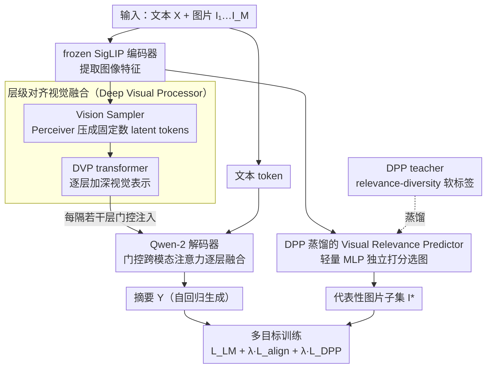

# Towards Visually Grounded Multimodal Summarization via Cross-Modal Transformer and Gated Attention

**会议**: ACL2026 Findings  
**arXiv**: [2605.11753](https://arxiv.org/abs/2605.11753)  
**代码**: https://github.com/abidmeeraj/SPeCTrA-Sum  
**领域**: 多模态VLM / 多模态摘要  
**关键词**: 多模态摘要, 视觉grounding, 图像选择, DPP蒸馏, 门控交叉注意力

## 一句话总结
这篇论文提出 SPeCTrA-Sum，把层级对齐的 Deep Visual Processor、门控跨模态注意力和 DPP 蒸馏的图像选择器合在一起，使多模态摘要不仅保持接近 SOTA 的 ROUGE，还能选出更相关且更多样的支撑图像。

## 研究背景与动机
**领域现状**：多模态摘要要同时处理长文本和配套图片，例如新闻、博客或图文报告。早期方法往往先把图像特征接到文本模型前面，或用 attention 辅助摘要生成；近年的 VLM scaffold 如 LLaVA-OneVision 让图像 token 和语言模型更容易联合使用。

**现有痛点**：简单拼接视觉 token 有两个问题。第一，视觉特征通常来自浅层视觉编码器，而语言模型深层 hidden state 已经过多层语义变换，两者抽象层级不匹配。第二，文档中的图片常有冗余或与摘要无关的内容，全部输入会浪费注意力，也可能引入噪声。

**核心矛盾**：摘要模型需要视觉 grounding，但不是“图像越多越好”。它既要深度融合真正有用的视觉线索，又要选择相关且互补的图片集合；传统文本指标如 ROUGE 又很难直接奖励这种视觉支撑质量。

**本文目标**：作者希望把摘要生成和代表性图像选择放进一个统一框架中训练，使输出 summary 和 selected image subset 同时优化文本质量、视觉相关性和图像多样性。

**切入角度**：论文从两个方向解决问题：用 DVP 让视觉表示随 LLM 层级一起深化，缓解 shallow visual feature 与 deep language representation 的 mismatch；用 DPP teacher 生成 relevance-diversity 平衡的软标签，再蒸馏给轻量 VRP，避免推理时做昂贵的 DPP 选择。

**核心 idea**：不是把图片当成前缀 token 粗暴塞给 LLM，而是在深层语义对齐和输出级图像选择两个层面同时做视觉 grounding。

## 方法详解

### 整体框架
SPeCTrA-Sum 的输入是一篇文本 $X$ 和一组图片 $I_1,...,I_M$，输出是摘要 $Y$ 以及代表性图片子集 $I^*$. 框架以 LLaVA-OneVision 为多模态 scaffold，视觉侧使用 frozen SigLIP encoder，语言侧使用 Qwen-2 causal LM。基础做法会把视觉特征投影到 token embedding space 后与文本拼接；本文在此基础上加入 Vision Sampler、Deep Visual Processor、Layer-Aligned Gated Cross-Attention 和 Visual Relevance Predictor。

训练目标是多任务的：主任务是 autoregressive summarization，辅助任务包括 image-text alignment 和 DPP distillation。推理时，模型一边生成摘要，一边用 VRP 选择更能支撑摘要的图片集合，避免把所有图片都作为等价上下文。

### 关键设计

**1. Deep Visual Processor 与层级对齐融合：让视觉表示跟着语言层一起「变深」**

纯 concatenation 的毛病在于视觉 token 被钉死在前缀位置，进入深层解码时影响越来越弱，可它们本身又只是浅层视觉编码器的输出，抽象层级远低于已经过多层语义变换的 LLM hidden state。DVP 先用 Perceiver-style 的 Vision Sampler 把每张图片的 patch grid 压缩成固定数量的 latent tokens，再让这些 visual latents 穿过一组 transformer blocks，得到逐层加深的视觉表示；随后每隔若干个 decoder layer 插入一个 gated cross-attention，把对应深度的视觉 token 注入到该层的语言 hidden state 里。门控残差从接近零的注入强度起步，意味着模型一开始几乎不动 base LLM，再慢慢学会在合适的层引入视觉信息——视觉表示因此能与语言侧的深度同步，而不是停在最前面被稀释。

**2. DPP 蒸馏的 Visual Relevance Predictor：把集合选择的归纳偏置压进一个轻量打分器**

输出侧的痛点是：只按相关性选图会反复拿到内容雷同的图片，只按多样性又可能把无关图片塞进来。DPP（determinantal point process）天生就建模 relevance-diversity 的 trade-off，所以训练阶段用一个 DPP teacher，根据 image-text relevance、图像间的 RBF diversity 和目标集合大小，为每张图片算出一个 soft inclusion probability。VRP 本身只是一个两层 MLP，输入归一化的图像嵌入，输出图片选择 logit，用 calibrated cross-entropy 加 cardinality regularization 去拟合这些软标签。这样推理时只需对每张图独立打分，不必再跑 $O(K^3)$ 的 DPP 矩阵运算——昂贵的集合归纳偏置在训练期就被蒸馏进了一个几乎零成本的 selector。

**3. 多目标训练把摘要、对齐和选图绑在一起：让视觉 grounding 的收益进入优化目标**

如果只优化文本 n-gram overlap，更强的视觉模块未必提升 ROUGE，甚至可能干扰语言建模，于是「视觉做得更深」这件事就拿不到正反馈。本文用一个多任务总损失把三件事显式绑在一起：

$$L_{MM}=L_{LM}+\lambda_{align}L_{align}+\lambda_{VRP}L_{DPP}$$

其中 $L_{LM}$ 是 teacher-forced 的自回归摘要损失，$L_{align}$ 用 frozen visual embedding 与 decoder 的 mean-pooled representation 做 SigLIP-style 对齐，$L_{DPP}$ 让 VRP 去拟合 DPP teacher 的软标签。三项一起优化，视觉 grounding 的好处（图文一致性、图片集合质量）才被纳入梯度，而不是被纯文本目标淹没。

### 损失函数 / 训练策略
训练使用 batch size 1 和 Adafactor，按 step 控制训练，约 295k steps 对应一个 epoch，不同系统最多训练到 360k steps，并按 validation loss 选最佳模型。附录中说明实验在单张 NVIDIA A100 80GB 上运行，采用 4-bit QLoRA-style quantization。VRP/DPP 相关超参包括最多选 3 张图、RBF bandwidth 0.8、relevance scaling 2.0、目标集合大小 3.0、subset-size regularization 0.3。架构搜索覆盖 Vision Sampler latent 数、深度、DVP 层数、门控层位置和 LoRA rank/alpha。

## 实验关键数据

### 主实验

| 模型 | ROUGE-1 | ROUGE-2 | IP | MaxSim | MMAE | 说明 |
|--------|------|------|------|------|------|------|
| SITA | 43.64 | 20.53 | 76.41 | 33.47 | 3.37 | 图像选择 IP 最高的强基线 |
| ViL-Sum | 44.29 | 20.96 | 66.27 | 32.17 | 3.55 | 文本 ROUGE 最强基线 |
| DIUSum | 42.23 | 19.83 | - | - | - | 近期动态图像使用方法 |
| DVP (ours) | 44.20 | 20.77 | 74.03 | 31.68 | 3.55 | ROUGE 接近 ViL-Sum，IP 明显高于 ViL-Sum |

| 系统 | R-1 | R-2 | BERTScore | IP | CLIPScore | MMAE | PCD |
|------|------|------|------|------|------|------|------|
| OneVision | 43.81 | 20.52 | 89.58 | 74.02 | 70.62 | 3.5447 | 32.66 |
| Vision Sampler | 44.06 | 20.78 | 89.53 | 74.01 | 70.54 | 3.5484 | 32.65 |
| DVP | 44.20 | 20.77 | 89.33 | 74.03 | 70.52 | 3.5521 | 32.81 |

### 消融实验

| 训练设置 | 系统 | R-1 | R-2 | BERTScore | 说明 |
|------|------|------|------|------|------|
| MaskedLM | OneVision | 44.26 | 20.86 | 89.12 | 文本指标最高 |
| MaskedLM | Vision Sampler | 43.89 | 20.61 | 89.54 | 加视觉采样后 ROUGE 下降 |
| MaskedLM | DVP | 43.81 | 20.58 | 89.50 | 深视觉处理在纯文本目标下不自动增益 |

| 人评维度 | Mean (SD) | 评分 >=4 | Exact agreement | Within-one agreement | 解读 |
|------|------|------|------|------|------|
| Text quality | 3.90 (0.69) | 80.1% | 49.0% | 90.0% | 文本连贯性较好 |
| Image relevance | 4.04 (0.80) | 76.8% | 44.3% | 84.0% | 图文相关性最强 |
| Image diversity | 3.89 (0.83) | 73.2% | 43.0% | 82.2% | 多样性略低但仍正向 |
| Overall quality | 4.00 (0.71) | 79.2% | 45.8% | 85.5% | 综合质量稳定 |

| 变体 | 平均延迟 | 延迟开销 | 峰值显存 | 显存开销 | 说明 |
|------|------|------|------|------|------|
| OV baseline | 约 2110 ms | - | 15.80 GB | - | 简单拼接 |
| Vision Sampler | 2120 ms | +0.5% | 16.81 GB | +6.4% | 采样几乎不增延迟 |
| DVP | 2322 ms | +10.0% | 22.56 GB | +42.8% | 视觉深处理显存成本明显 |
| MM-DVP | 2328 ms | +10.3% | 22.57 GB | +42.8% | 多目标训练不额外增加推理成本 |

### 关键发现
- DVP 的文本 ROUGE 几乎追平 ViL-Sum：ROUGE-1 只低 0.09，ROUGE-2 低 0.19，但图像选择 IP 达到 74.03，明显高于 ViL-Sum 的 66.27。
- Multi-objective loss 很关键。MaskedLM 目标下 DVP 的 ROUGE 低于 OneVision，说明更深视觉模块并不会天然提升文本指标；加入 alignment 和 DPP distillation 后，DVP 才体现出综合优势。
- 人评显示 image relevance 平均分最高，为 4.04，说明自动指标之外，用户也能感受到摘要与图片更贴合。
- 多样性指标需要谨慎解释。论文指出如果不做相关性过滤，无关图片会虚高 pairwise cosine distance；DVP 在过滤后仍保持最高 mean/max diversity。
- 成本上 DVP 延迟只增加约 10%，但显存增加 42.8%，这会限制小显存场景部署。

## 亮点与洞察
- 论文抓住了多模态摘要里常被忽略的输出侧问题：不是只生成文字，还要给读者选出支撑摘要的图片。这个任务定义比单纯 text-conditioned-on-images 更接近真实新闻阅读体验。
- DVP 的层级对齐设计很自然。视觉 token 不再只是前缀，而是在不同解码深度持续参与语义融合，适合迁移到图文报告、文档问答和多图推理。
- DPP teacher + VRP student 是一个实用折中：训练时借助集合选择理论表达 relevance-diversity，推理时用轻量网络近似，避免昂贵的 DPP inference。
- 论文对评价指标的反思也很重要。ROUGE 对视觉 grounding 不敏感，diversity 又可能被无关图像虚高，说明多模态摘要需要更细的图文一致性和互补性评测。

## 局限与展望
- 结果主要基于 MSMO，虽然它是经典多模态摘要数据集，但任务形态偏新闻图文。技术报告、社媒长帖、科学文档等场景还需要验证。
- 自动指标仍不充分。ROUGE 看文本重合，IP/CLIPScore/PCD 只能近似视觉质量，无法完整衡量图片是否真正帮助读者理解摘要。
- VRP 推理时是 text-free image scoring，效率高，但也可能错过“图片与当前生成摘要的互补关系”。未来可以探索条件化 VRP 或用户意图感知的选图。
- DVP 显存开销较大，峰值显存从 15.80GB 增到 22.56GB。若要部署到低资源环境，需要蒸馏、稀疏注入或更轻的视觉处理器。
- 论文已指出相似度阈值可能过滤掉有背景价值但不直接相关的图片。后续应同时建模 relevance、diversity 和 complementarity。

## 相关工作与启发
- **vs 早期多模态摘要**: ATG/ATL/HAN 等方法把图像纳入摘要，但融合较浅；本文强调层级视觉处理和输出级图像选择。
- **vs ViL-Sum / SITA**: ViL-Sum 的 ROUGE 更高，SITA 的 IP 更高；SPeCTrA-Sum 的优势是两边都接近强基线，并额外关注 grounding 与 diversity。
- **vs Flamingo 式门控融合**: 本文借鉴 gated cross-attention，但把视觉表示先经 DVP 对齐到 LLM 深层，再做层级注入，目标更偏摘要任务。
- **vs DPP 图像选择**: 传统 DPP 适合集合选择但推理昂贵；本文通过蒸馏把 DPP 的集合归纳偏置压进 VRP，适合端到端系统。
- **启发**: 多模态生成任务如果有“可展示的视觉证据”，就不应只优化生成文本。把 evidence selection 作为联合输出，能让系统更可解释也更贴近产品形态。

## 评分
- 新颖性: ⭐⭐⭐⭐☆ DVP + DPP 蒸馏 + 多目标摘要不是单点全新，但组合方式扎实且任务定义完整。
- 实验充分度: ⭐⭐⭐⭐☆ 有主结果、消融、人评和效率分析；如果加入更多数据集会更强。
- 写作质量: ⭐⭐⭐⭐☆ 方法模块清楚，实验表格丰富；少数指标解释需要读者熟悉 MSMO 评价体系。
- 价值: ⭐⭐⭐⭐☆ 对多图文档摘要、新闻聚合和视觉证据选择都很有参考价值。

<!-- RELATED:START -->

## 相关论文

- [\[ICML 2026\] iVGR: Internalizing Visually Grounded Reasoning for MLLMs with Reinforcement Learning](../../ICML2026/multimodal_vlm/ivgr_internalizing_visually_grounded_reasoning_for_mllms_with_reinforcement_lear.md)
- [\[ACL 2026\] Cross-Modal Taxonomic Generalization in (Vision-) Language Models](cross-modal_taxonomic_generalization_in_vision-_language_models.md)
- [\[ACL 2026\] OMHBench: Benchmarking Balanced and Grounded Omni-Modal Multi-Hop Reasoning](omhbench_benchmarking_balanced_and_grounded_omni-modal_multi-hop_reasoning.md)
- [\[CVPR 2026\] Agentic Video Summarization via Self-Reflecting Multimodal Understanding](../../CVPR2026/multimodal_vlm/agentic_video_summarization_via_self-reflecting_multimodal_understanding.md)
- [\[AAAI 2026\] Rethinking Visual Token Reduction in LVLMs under Cross-Modal Misalignment](../../AAAI2026/multimodal_vlm/rethinking_visual_token_reduction_in_lvlms_under_cross-modal_misalignment.md)

<!-- RELATED:END -->
