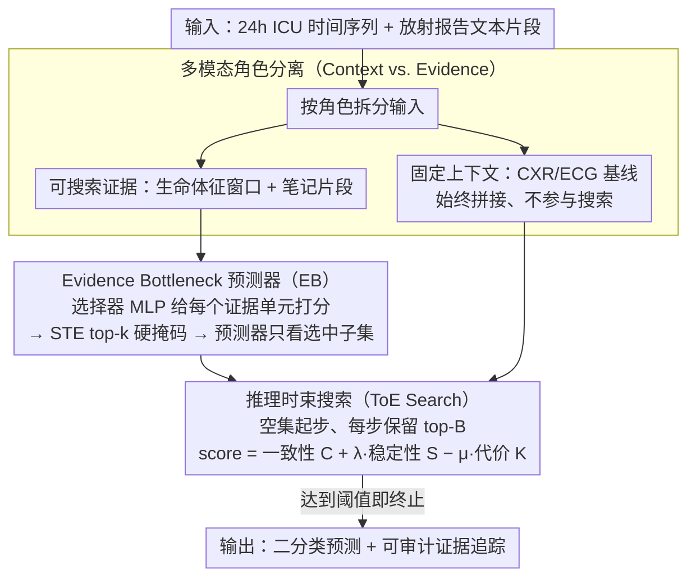

# Tree-of-Evidence: Efficient "System 2" Search for Faithful Multimodal Grounding

**会议**: ACL 2026  
**arXiv**: [2604.07692](https://arxiv.org/abs/2604.07692)  
**代码**: 无  
**领域**: 多模态VLM  
**关键词**: 多模态可解释性, 证据搜索, 临床预测, 束搜索, 概念瓶颈

## 一句话总结

本文提出 Tree-of-Evidence（ToE），一种推理时离散束搜索算法，将多模态模型的可解释性形式化为在粗粒度证据单元（生命体征时间窗口、放射报告片段）上的离散优化问题，仅用 5 个证据单元即可保留全输入模型 98% 以上的 AUROC，同时生成可审计的证据追踪路径。

## 研究背景与动机

**领域现状**：大型多模态模型（LMMs）在医疗等高风险领域取得了 SOTA 表现，但其推理过程不透明。现有可解释性方法包括注意力可视化、梯度显著性、LIME/SHAP 等后验归因方法以及概念瓶颈模型（CBM）。

**现有痛点**：(1) 注意力权重常常不忠实于模型实际决策逻辑；(2) LIME/SHAP 提供的是近似而非保证，且无法给出离散证据选择；(3) CBM 需要预定义概念标注且在推理时是静态的，无法自适应搜索；(4) 现有理据提取方法通常限于单模态（主要是文本），无法捕获跨模态协同依赖。

**核心矛盾**：临床部署要求模型的预测可以明确追溯到具体可验证的证据，但现有方法要么不忠实、要么不支持多模态、要么无法提供审计追踪。

**本文目标**：设计一种推理时搜索算法，能够找到紧凑的多模态证据集合，既能复现全输入预测又能提供可审计的搜索过程。

**切入角度**：借鉴 Tree-of-Thoughts 的审慎分支搜索思想，将可解释性视为离散搜索问题——"System 2"式的多步审慎搜索，而非"System 1"式的单次贪心排序。

**核心 idea**：将多模态输入空间结构化为"全局上下文"（固定先验，如 CXR/ECG 基线）和"可搜索证据"（动态变化的生命体征和笔记），通过训练轻量级 Evidence Bottleneck 评分器并在推理时执行束搜索来找到最紧凑的忠实证据集。

## 方法详解

### 整体框架

ToE 框架分三个阶段：Phase I 独立训练模态特定分类器（时间序列用 BiGRU，文本用冻结 BioClinicalBERT）；Phase II 冻结编码器后训练轻量级 MLP 选择器，通过 STE top-k 掩码学习证据评分；Phase III 在推理时执行束搜索，通过组合决策一致性、概率稳定性和稀疏性三个目标来构建紧凑证据集。输入为 24 小时 ICU 时间序列窗口和放射报告文本片段，输出为二分类预测及其对应的证据追踪。在进入这条管线之前，输入先按「角色」分成两类：CXR/ECG 等基线作为固定上下文始终保留，生命体征窗口和笔记片段才是束搜索真正去挑选的可搜索证据。

### 关键设计

**1. 多模态角色分离（Context vs. Evidence）：把搜索预算只花在会变的信号上**

临床输入里有相当一部分是几乎不动的基线信息（如 CXR/ECG），如果把它们也丢进搜索空间，束搜索就会浪费预算去反复确认这些静态信号。本文据此把输入拆成两类：CXR/ECG 作为固定上下文先验，始终拼接进表示、永远保留；生命体征时间窗口和临床笔记则作为可搜索证据，是束搜索唯一动的部分。这恰好对应临床推理的逻辑——「在患者基线风险已知的前提下，是哪些动态变化解释了结果」，让有限的证据预算集中在真正能区分病例的动态信息上。

**2. Evidence Bottleneck 预测器（EB）：用「选择器-预测器」分离逼出可解释评分**

要让证据评分可信，关键是模型不能在打分之外偷看未被选中的信息。EB 给每个模态都搭一套独立的「选择器-预测器」：选择器 MLP 对每个证据单元 $u_i$ 打分 $s_i = f_\theta(u_i)$，再经 STE（straight-through estimator）做一个可微的 top-k 硬掩码，把分数排在前 $k$ 的证据选出来；预测器只能看到被选中的子集去做预测。两个流分别训练，推理时把各模态的 logit 求和融合。这种分离从结构上堵死了「作弊」——预测器拿不到未选证据，所以选择器的评分必须真的有判别力。代价也很可控：Phase II 只更新约 98K 参数的选择器 MLP，STE 的梯度失配只会影响选中证据的幅度，不影响它们之间的排序。

**3. 推理时束搜索（ToE Search）：把可解释性当成一次「System 2」式的多步审慎搜索**

贪心 top-k 是一次性按分排序，抓不到「单看都不强、组合起来才忠实」的跨模态协同。ToE 改成从空集出发逐步添加证据、每步只保留 top-B 状态的束搜索，评分函数同时权衡三件事：

$$\text{score}(\mathbf{m}) = C(\mathbf{m}) + \lambda S(\mathbf{m}) - \mu K(\mathbf{m})$$

其中 $C$ 是决策一致性（选出的证据要复现全输入的预测类别），$S = 1 - |p_{\text{full}} - p(\mathbf{m})|$ 是概率稳定性（不仅类别对，校准后的概率也要贴近全模型），$K$ 是证据代价（鼓励稀疏）。概率稳定性这一项尤其关键：它要求选出的证据不只是「够用」，还要忠实于模型完整决策的置信度。满足阈值即终止，于是搜索路径本身就是一条可审计的证据追踪。

### 一个完整示例：一个 ICU 死亡率预测病例怎么被搜出证据

以一名 ICU 患者的 24 小时窗口为例。固定上下文（CXR/ECG 基线）先拼进表示、不参与搜索；可搜索证据是若干生命体征时间窗口和几段临床笔记片段。束搜索从空集开始：第一步给每个候选证据单独打 $\text{score}$，若该患者信号清晰（如血压、心率窗口已能让 $p(\mathbf{m})$ 逼近 $p_{\text{full}}$），稳定性项 $S$ 迅速饱和、代价项 $K$ 又压着别多选，于是仅靠 1 个生命体征窗口就过阈值终止——这正对应论文里「简单病例只用生命体征」的现象。若信号模糊，单个生命体征窗口无法把概率拉到全模型水平，搜索会继续扩展，引入临床笔记片段补充，直到一致性 $C$ 和稳定性 $S$ 同时达标。整条搜索路径（先选了哪个窗口、再补哪段文本）就是交付给临床审计的证据追踪。

### 损失函数 / 训练策略

Phase I 使用类别平衡的二元交叉熵独立训练两个模态流。Phase II 冻结编码器仅训练选择器 MLP。推理时不需要训练，仅执行束搜索。

## 实验关键数据

### 主实验

**MIMIC-IV E1: 院内死亡率预测，不同证据预算下的对比**

| 方法 | k=1 AUROC | k=1 Fidelity MAE↓ | k=5 AUROC | k=5 Fidelity MAE↓ |
|------|-----------|-------------------|-----------|-------------------|
| LIME | 0.564 | 0.229 | 0.695 | 0.171 |
| SHAP | 0.764 | 0.123 | 0.801 | 0.039 |
| ToE | **0.783** | **0.096** | **0.800** | **0.040** |
| Full Model | 0.800 | — | 0.800 | — |

### 消融实验

**与 LLM 和 CBM 的对比**

| 方法 | 参数量 | AUROC | AUPRC |
|------|--------|-------|-------|
| Hard CBM (24 concepts) | — | 0.775 | 0.349 |
| Med42-v2-70B | 70B | 0.745 | 0.293 |
| ToE (k=5) | 109M | **0.800** | — |

### 关键发现

- ToE 仅用 5 个证据单元即保留全模型 98%+ AUROC，跨 6 个任务一致
- k=1 时 ToE 比 LIME 降低 56% Fidelity MAE，AUROC 高出 22 个百分点
- 定性分析显示 ToE 自适应搜索：简单病例仅用生命体征，信号模糊时引入文本
- 跨中心验证（eICU 208 家医院）和非医疗领域（LEMMA-RCA）均稳定

## 亮点与洞察

- "System 2 搜索"的类比贴切——将可解释性从被动归因升级为主动搜索，搜索过程本身可审计
- 概率空间稳定性项设计精妙——ICU 场景大部分患者 p 接近 0/1，logit 空间偏差在概率空间影响微小
- 109M 参数的 ToE 超越 70B Med42，说明结构化方法在结构化预测上远优于通用 LLM

## 局限与展望

- 证据单元粒度（1 小时窗口、3 句文本片段）是预设的，不同任务可能需要不同粒度
- 束搜索是启发式最优而非全局最优，但小 k 下与穷举差距 <0.001 AUROC
- 需要先训练模态特定编码器和选择器，不是即插即用的
- 未在图像像素级或波形片段级等更细粒度证据单元上验证

## 相关工作与启发

- **vs LIME/SHAP**: 后者是后验近似无硬选择机制，ToE 在稀疏预算下忠实度显著更高
- **vs Concept Bottleneck Models**: CBM 需预定义概念标注且静态推理，ToE 从学习表示中动态发现证据
- **vs Tree-of-Thoughts**: ToT 在 token 生成空间搜索，ToE 在证据选择空间搜索

## 评分

- 新颖性: ⭐⭐⭐⭐⭐ 首次将推理时束搜索应用于多模态可解释性，框架完整原创
- 实验充分度: ⭐⭐⭐⭐⭐ 3 个数据集 6 个任务 + 跨中心验证 + LLM/CBM 对比
- 写作质量: ⭐⭐⭐⭐ System 1/2 类比清晰，方法描述详尽
- 价值: ⭐⭐⭐⭐ 为高风险领域多模态模型部署提供实用可审计机制

<!-- RELATED:START -->

## 相关论文

- [\[ACL 2026\] Faithful-First Reasoning, Planning, and Acting for Multimodal LLMs](faithful-first_reasoning_planning_and_acting_for_multimodal_llms.md)
- [\[ACL 2025\] VisuoThink: Empowering LVLM Reasoning with Multimodal Tree Search](../../ACL2025/multimodal_vlm/visuothink_empowering_lvlm_reasoning_with_multimodal_tree_search.md)
- [\[CVPR 2026\] DocSeeker: Structured Visual Reasoning with Evidence Grounding for Long Document Understanding](../../CVPR2026/multimodal_vlm/docseeker_long_document_understanding.md)
- [\[ACL 2025\] Evaluating Multimodal Large Language Models on Video Captioning via Monte Carlo Tree Search](../../ACL2025/multimodal_vlm/mcts_video_captioning_eval.md)
- [\[CVPR 2025\] Global-Local Tree Search in VLMs for 3D Indoor Scene Generation](../../CVPR2025/multimodal_vlm/global-local_tree_search_in_vlms_for_3d_indoor_scene_generation.md)

<!-- RELATED:END -->
