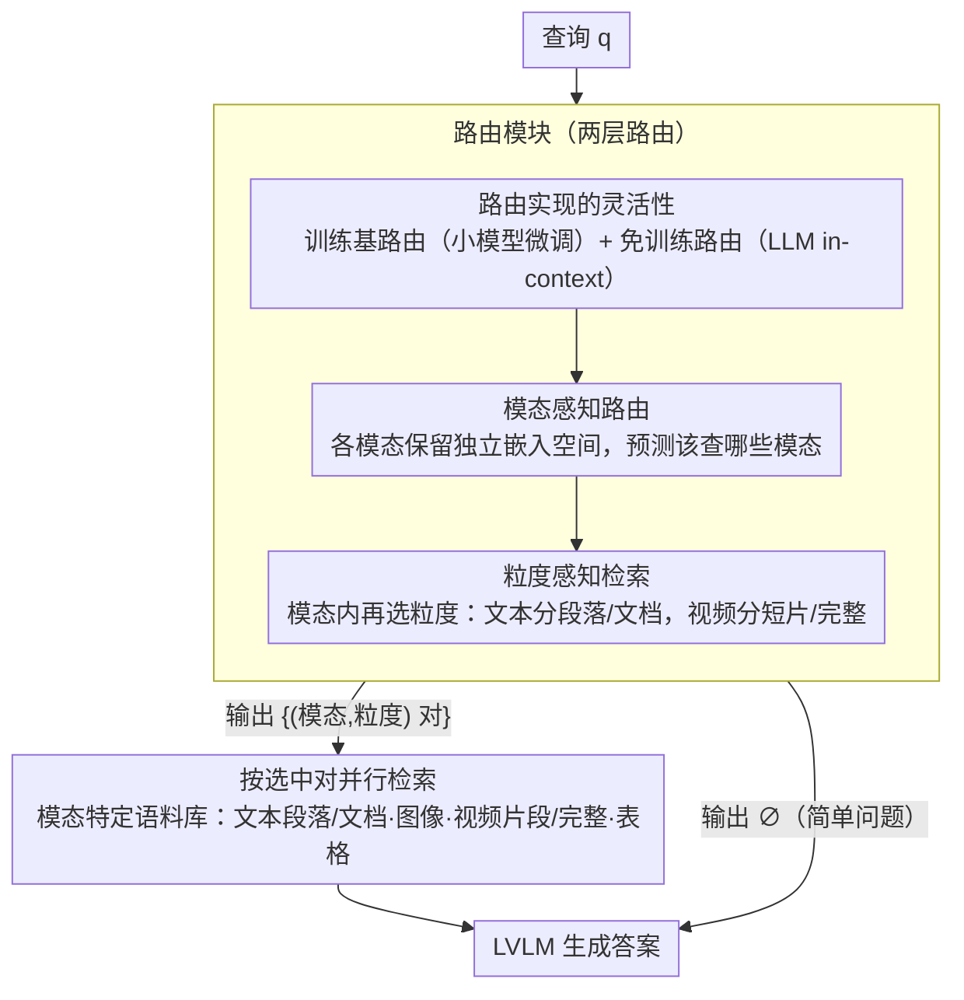

# UniversalRAG: 多模态语料库的检索增强生成

**会议**: ACL 2026  
**arXiv**: [2504.20734](https://arxiv.org/abs/2504.20734)  
**代码**: https://github.com/universalrag  
**领域**: 多模态 VLM / 检索增强生成  
**关键词**: 检索增强生成, 多模态, 路由机制, 模态间隙, 粒度感知检索

## 一句话总结

UniversalRAG 提出一个通用的任意到任意 RAG 框架，通过模态感知路由和粒度感知检索，动态地从异构多模态语料库（文本、图像、视频，不同粒度）中选择最合适的知识源进行检索和生成，避免统一嵌入空间中的模态间隙问题，在 10 个基准上大幅超越单一模态和统一方法。

## 研究背景与动机

**领域现状**：现有 RAG 方法要么仅限于文本语料库，要么扩展到图像/视频等其他模态，但通常是单模态特定的。当需要多模态知识时，最直接的思路是将所有模态的语料库聚合到统一的嵌入空间中。

**现有痛点**：虽然多模态编码器试图对齐不同模态的语义，但在实践中存在"模态间隙"问题——查询倾向于与相同模态的知识项更紧密聚集，导致检索对同模态知识有偏置，遗漏其他模态的相关内容。此外，不同查询对知识的粒度需求不同（简单事实性问题需要段落，复杂分析问题需要完整文档或视频），固定粒度检索往往不够优化。

**核心矛盾**：如何在一个统一框架中处理多模态知识，既避免模态间隙导致的检索偏置，又能根据查询复杂度动态调整检索粒度？

**本文目标**：设计一个"一站式"RAG 框架，能够灵活适应不同模态和粒度的知识需求，同时保持检索效率。

**切入角度**：与其强行所有模态进入统一空间，不如保持模态特定的嵌入空间，通过智能路由动态选择最合适的模态和粒度对。

**核心 idea**：两层路由机制——(1) 模态感知路由：预测查询需要的模态，路由到对应语料库；(2) 粒度感知路由：进一步在每个模态内选择最合适的粒度（段落/文档/表格/片段/完整视频等）。

## 方法详解

### 整体框架

UniversalRAG 的端到端流程分为三个关键阶段：

1. **语料库组织**：根据模态和粒度构建多个独立的语料库。对文本，分别存储段落级和文档级；对视频，存储短片段（3 分钟以内）和完整视频；图像保持原样。每个语料库使用独立的模态特定编码器生成嵌入。
2. **路由决策**：给定查询 $\mathbf{q}$，路由模块 $\mathcal{R}$ 预测最合适的模态-粒度对集合 $\{(m_1, g_1), (m_2, g_2), ...\}$，支持单模态或跨模态检索。路由同时输出"无需检索"选项，用于简单问题。
3. **生成**：从路由选择的语料库中检索相关内容，交给 LVLM 生成最终答案。

### 关键设计

**1. 模态感知路由：与其把所有模态压进统一空间，不如保留各自的嵌入空间再用路由分流**

模态间隙的根源在于：统一编码器被迫把文本、图像、视频这些异构数据对齐到同一个空间，结果查询总是和「同模态」的知识聚得更近，检索因此对同模态有偏置、漏掉别的模态里真正相关的内容。本文用一条理论结果（Proposition 1）说明，当模态偏置 $\alpha$ 相对语义相关度的方差足够大时，模态特定检索严格优于统一空间检索——所以干脆不做数值对齐，让每个模态保留独立的嵌入空间，把「该查哪个模态」交给一个路由器。路由被建模成多标签分类 $\mathcal{R}(\mathbf{q}) = M_{\mathbf{q}} \subseteq \{\text{文本, 图像, 视频, 表格}\}$，推理时对各模态-粒度对的 sigmoid 概率做阈值（通常 0.8），超过阈值的组合并行检索。这样既绕开了跨模态对齐的难题，又因为只是「加一条路由逻辑」而能无缝接入新模态。

**2. 粒度感知检索：同一模态内再按查询复杂度选粒度，避免「过细稀释、过粗混噪」**

固定粒度两头不讨好——粒度太细会把上下文切碎、稀释信息，太粗又会混进无关内容。本文把路由的输出空间从「选模态」扩展到「选模态-粒度对」：

$$\mathcal{R}: Q \to \{\varnothing\} \cup \mathcal{P}\Big(\bigcup_{m \in M} \{m\} \times G_m\Big)$$

其中 $G_m$ 是模态 $m$ 的粒度集（文本分段落/文档，视频分短片/完整）。训练标签按数据集特性自动标注，例如 HybridQA 这类多跳问题标成文档级、NQ 这类事实问题标成段落级，再用多热编码训练路由分类器；论文还用 Proposition 2 证明确实存在「不同查询受益于不同粒度」的情形。输出空间里始终保留 $\varnothing$（无需检索）选项，让简单问题直接走 LVLM 不浪费一次检索。

**3. 路由实现的灵活性：训练基路由和免训练路由两条腿走路**

域内精度和域外泛化往往难两全，本文索性同时提供两种路由。训练基路由用 Qwen3-VL-2B、InternVL3.5-1B 这类小模型，以多标签多热编码加交叉熵微调，推理快、域内准确率能到 95%+，但换到没见过的分布上会明显掉点；免训练路由则直接用 GPT-5 或 Qwen3-VL-8B 做 in-context learning，靠一个含目标描述和少样本示例的提示模板上岗，不更新任何参数，泛化更稳。两者各自的短板正好互补，集成起来就是一个鲁棒的即插即用方案。

### 一个完整示例：一条查询如何被路由到模态与粒度

以 HybridQA 的一个多跳问题为例。查询 $\mathbf{q}$ 进入路由器 $\mathcal{R}$，sigmoid 同时对所有模态-粒度对打分；因为这类问题既要表格事实又要文档级上下文，超过 0.8 阈值的组合可能是 `{(表格), (文本,文档)}`，于是系统并行去表格语料库和文档级文本语料库检索，而不会误投到段落级或视频。检索回来的表格行与文档片段一起交给 LVLM 生成答案。换成 NQ 的一个简单事实问题，路由器只会点亮 `{(文本,段落)}`，单路检索段落即可；而对一个常识问题，路由甚至会输出 $\varnothing$，直接让 LVLM 作答、跳过检索。整条流水线（路由 → 按选中的模态-粒度并行检索 → 生成）就是靠这一次路由决策把查询导向了最合适的知识源。

## 实验关键数据

### 主实验

在 10 个基准上的综合对比（Qwen3-VL-8B-Instruct 作为生成骨干模型）：

| 数据集 | UniversalRAG(训练) | UniRAG(统一) | GME(统一) | 提升 |
|--------|-------------------|-------------|----------|------|
| MMLU | 74.39 | 70.06 | 70.41 | +4.3% |
| NQ | 38.65 EM | 19.30 EM | 20.05 EM | +99.2% |
| HotpotQA | 50.61 F1 | 29.71 F1 | 29.91 F1 | +70.4% |
| HybridQA | 11.05 EM | 2.85 EM | 3.00 EM | +288% |
| MRAG | 23.20 Acc | 19.05 Acc | 19.20 Acc | +21.3% |
| 平均 | 42.40 | 32.93 | 33.88 | **28.7% 相对提升** |

### 消融实验

| 配置 | 模态准确率 | 平均指标 | 说明 |
|------|----------|--------|------|
| 随机路由 | 14.29% | 31.75 | 仅通过概率达到基准 |
| UniRAG（统一空间） | 25.00% | 33.86 | 模态偏置导致检索严重偏颇 |
| UniversalRAG-Qwen3-2B | 95.28% | 42.40 | 路由准确率接近完美 |
| UniversalRAG-GPT-5（免训练） | 68.22% | 41.68 | 泛化更强 |
| Oracle（完美路由） | 100% | 42.45 | 上界 |

### 关键发现

- **模态路由效果**：VLM2Vec-V2 完全依赖文本检索（不论查询是什么），导致视频任务失败；UniversalRAG 自适应地从各模态均衡检索。
- **粒度的边际贡献**：增加粒度层级从 1→2→3→4，性能持续改进，但非严格单调。
- **效率提升**：在大规模语料库上（>1M 条目），UniversalRAG 的端到端延迟低于统一方法，因为模态特定检索避免了在超大统一索引上的搜索。
- **域外泛化**：在 6 个 OOD 数据集上，训练基路由性能下降，但免训练 GPT-5 保持稳定。

## 亮点与洞察

- **模态间隙的理论刻画**：通过 Proposition 1 的形式化分析，严格证明了在足够大的模态偏置下，模态特定检索优于统一空间。这为"为什么路由有效"提供了坚实的理论基础。
- **极简的架构哲学**：不改造底层编码器或引入复杂的对齐机制，而是通过"分而治之"的路由策略优雅地规避模态间隙。这种极简性使框架天然支持新模态的扩展。
- **两层路由的设计巧妙之处**：模态-粒度对的联合预测比分步预测更强大，因为它支持交叉模态的粒度组合（如 HybridQA 同时需要表格和段落）。
- **免训练路由的价值**：通过精心设计的少样本提示，LLM 无需任何参数更新即可充当路由器，且泛化性超越精调小模型。

## 局限与展望

**作者承认的局限**：

- 路由的准确性依赖高质量训练数据，但现有基准缺乏显式的"这个查询应该检索什么模态/粒度"的标签。
- 粒度层级数量受限于标注可用性。论文仅为文本/视频分两层，更精细的多层级粒度需要手工标注。

**自己发现的局限**：

- 路由的延迟虽然常数级，但在极小规模查询上可能相对可观。
- 多模态融合时的信息补充可能被路由限制。
- 在小语言模型（如 2B 参数的路由器）上，路由准确率从 95% 跌至 90% 左右。

## 相关工作与启发

- **vs UniRAG / GME / VLM2Vec-V2**（统一多模态编码）：他们将所有模态强行对齐到单一空间，本文通过实验和理论严格证明了这种方法固有的模态偏置。
- **vs MultiRAG**（多语料库融合）：MultiRAG 简单地从所有语料库检索然后混合，容易引入噪声。UniversalRAG 用显式路由精选。
- **vs Adaptive RAG 系列**（查询复杂度自适应）：Adaptive-RAG、ROWEN 等在单一模态内调整检索策略。UniversalRAG 跨越模态边界。
- **启发**：在多模态系统设计中，"解耦 + 路由"往往胜过"强行统一 + 复杂对齐"；理论驱动的设计能为启发式决策提供信心；免训练方案是快速适应的高效途径。

## 评分

- 新颖性: ⭐⭐⭐⭐⭐ 首次系统化地分析模态间隙并通过路由+粒度的双层设计从根本上解决；理论分析原创性强。
- 实验充分度: ⭐⭐⭐⭐⭐ 10 个基准覆盖 7 种模态，6 种 OOD 数据集验证泛化，3 种 LVLM 骨干模型，训练/免训练双路由对比。
- 写作质量: ⭐⭐⭐⭐ 逻辑清晰，可视化直观；理论部分严谨。
- 价值: ⭐⭐⭐⭐⭐ 解决了 RAG 领域的核心痛点（多模态知识整合），框架普适性强，即插即用。

<!-- RELATED:START -->

## 相关论文

- [\[ACL 2026\] Dynamic Emotion and Personality Profiling for Multimodal Deception Detection](dynamic_emotion_and_personality_profiling_for_multimodal_deception_detection.md)
- [\[ACL 2026\] HierVA: Hierarchical Visual Agent — Managing Contexts in Joint Image-Text Space for Advanced Chart Reasoning](hierarchical_visual_agent_managing_contexts_in_joint_image-text_space_for_advanc.md)
- [\[ACL 2026\] Forest Before Trees: Latent Superposition for Efficient Visual Reasoning](forest_before_trees_latent_superposition_for_efficient_visual_reasoning.md)
- [\[ACL 2026\] Cross-Cultural Expert-Level Art Critique Evaluation with Vision-Language Models](cross-cultural_expert-level_art_critique_evaluation_with_vision-language_models.md)
- [\[ACL 2026\] Do MLLMs Understand Pointing? Benchmarking and Enhancing Referential Reasoning in Egocentric Vision](do_mllms_understand_pointing_benchmarking_and_enhancing_referential_reasoning_in.md)

<!-- RELATED:END -->
