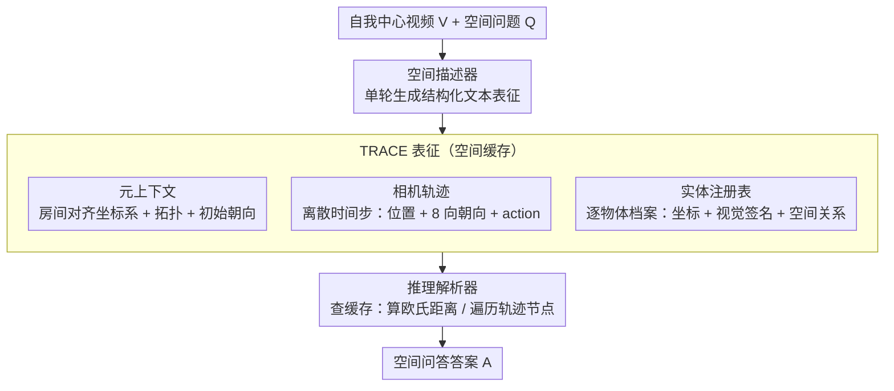

# TRACE: Unleashing Spatial Reasoning in Multimodal Large Language Models via Textual Representation Guided Reasoning

**会议**: ACL 2026  
**arXiv**: [2603.23404](https://arxiv.org/abs/2603.23404)  
**代码**: [https://trace-reasoning.github.io](https://trace-reasoning.github.io)  
**领域**: 多模态VLM / 空间推理  
**关键词**: 空间推理, 多模态大语言模型, 文本表示, 以自我为中心视频, 提示工程

## 一句话总结

本文提出 TRACE（Textual Representation of Allocentric Context from Egocentric Video），一种提示方法，引导多模态大语言模型从自我中心视频中生成结构化的文本 allocentric 3D 环境表示——包括元上下文、相机轨迹和实体注册表——作为中间推理步骤来增强空间问答能力，在 VSI-Bench 和 OST-Bench 上一致超越已有提示策略。

## 研究背景与动机

**领域现状**：现有多模态大语言模型在处理视频理解、图像描述等任务上取得显著进展，但在 3D 空间推理方面表现不佳。认知科学研究表明，人类通过构建 allocentric（以环境为中心的）空间表征来进行 3D 推理，而非直接在像素级别操作。

**现有痛点**：当前 MLLMs 过度依赖 2D 视觉信号，学到了来自隐式空间线索的虚假快捷关联，无法建立 3D 场景的层次化抽象。已有工作要么通过大量空间推理数据进行微调（扩展性差），要么引入额外几何/立体模态（系统复杂度高），都不适用于现成的 MLLMs。

**核心矛盾**：标准 Chain-of-Thought 等推理方法在算术和符号任务上有效，但对复杂空间推理任务往往无效甚至有害——原因在于这些方法生成的推理痕迹无法捕获空间几何结构信息。模型需要显式地基于全局 3D 表征进行推理。

**本文目标**：设计一种纯文本的空间表征方法，作为 MLLMs 的中间推理步骤，无需修改模型架构或增加额外模态，即可增强空间推理能力。

**切入角度**：受人类认知中 allocentric 空间推理的启发——人类在回答空间问题时会心理上将自己置于环境中，构建全局场景布局表征。作者观察到这种 allocentric 表征完全可以用文本描述。

**核心 idea**：让 MLLMs 先生成一份结构化的文本 3D 表征（含元上下文、相机轨迹、实体注册表），作为"空间缓存"加载到上下文窗口中，再基于该缓存进行推理——将空间推理转化为对结构化文本的查询。

## 方法详解

### 整体框架

TRACE 采用单轮生成方式：给定自我中心视频 $V$ 和自然语言问题 $Q$，模型首先作为"空间描述器"生成 TRACE 表征 $G$，然后作为"推理解析器"基于 $G$ 和 $V$ 生成最终答案 $A$。推理过程形式化为 $\hat{A}, \hat{G} = \arg\max P(A|G,V,Q) \cdot P(G|V,Q)$。整个过程在一个前向传递中完成，TRACE 相当于一种结构化的 CoT。

### 关键设计

**1. 元上下文（Meta Context）：先把全局坐标系和房间布局钉死，免得后面算着算着就丢了参考系**

空间推理最常见的翻车方式，就是模型一边走一边忘了"我最初站在哪、朝哪个方向"，于是所有相对位置都失去基准。元上下文针对的正是这一点：它提出一套"房间对齐坐标系"，以观察者起始位置为原点 $[0,0]$，但 $y$ 轴方向不取相机初始朝向（相机一旋转参考系就乱），而是去检测由大型静态物体（如墙、长桌）决定的最显著直线来定向。同时它记录房间拓扑（如"矩形卧室"）、网格方向和观察者初始朝向，作为后续所有空间计算共享的统一框架。用静态结构而非易变的相机朝向锚定坐标轴，是它比朴素 CoT 稳的根本原因。

**2. 相机轨迹（Camera Trajectory）：把观察者的运动路径显式重建成一串可遍历的节点，而不是靠模型对视频的瞬时记忆**

一张静态地图说不清"人怎么走过来的"，但导航和路径规划题恰恰需要这个动态过程。轨迹设计把视频切成离散时间步，每步记录时间戳、估计位置 $[x, y]$ 和相机朝向，并以元上下文里的大型静态物体作为参考点定位。朝向特意只用 8 个离散方向（基数方向），因为让模型估精确角度太难、反而引入噪声；每步还带一个 action 属性来编码相机的运动上下文。重建成这样一串节点后，模型回答导航类问题时可以沿轨迹逐节点"走"一遍，而不必依赖对画面的模糊回忆。

**3. 实体注册表（Entity Registry）：给每个物体建一条带几何属性的结构化档案，逼模型把空间关系落成可计算的约束**

模型数不清椅子、定不准位置，往往是因为它对物体只有笼统印象。注册表为每个实体逐条记录：时间戳（首次出现时间）、视觉签名（外观描述，用于消歧）、度量估计（相对坐标原点的 2D 坐标 $[x,y]$，单位米）、空间关系（与邻近实体的自然语言相对关系）。关键约束是实体必须逐一列出（如 chair_01、chair_02）、不允许分组，以保证精确计数和定位。和 Cognitive Map 那种预测松散网格单元的做法不同，这种带详细属性的档案把空间关系解析成几何约束，时间戳和视觉签名又提供了去重与跨时间消歧的能力——消融里它也是掉点最多的模块，说明这份精细档案正是空间推理的命门。

### 损失函数 / 训练策略

TRACE 是一种纯提示方法，不涉及任何训练或微调。推理在单次前向传递中完成：模型先生成 schema 兼容的 TRACE 表征，将其作为"空间缓存"加载到上下文窗口中，然后基于该缓存通过计算实体坐标间的欧几里得距离或遍历轨迹节点来推导最终答案。

## 实验关键数据

### 主实验

**VSI-Bench 上不同提示方法的平均性能**

| 方法 | Gemini 3 Pro | Qwen2.5-VL-72B | MiMo-VL-7B |
|------|-------------|----------------|------------|
| Direct | 52.61 | 36.28 | 39.79 |
| CoT | 53.65 | 29.78 | 37.49 |
| ToT | 58.88 | 38.06 | 39.14 |
| LtM | 59.52 | 38.01 | 38.34 |
| CM（Cognitive Map） | 59.72 | 35.47 | 36.85 |
| **TRACE（Ours）** | **60.15** | **39.38** | **40.50** |

**OST-Bench 上不同提示方法的总体准确率**

| 方法 | Gemini 3 Pro | Qwen2.5-VL-72B |
|------|-------------|----------------|
| Direct | 69.73 | 61.53 |
| CoT | 69.76 | 60.33 |
| CM | 68.47 | 57.45 |
| **TRACE（Ours）** | **70.36** | **62.68** |

### 消融实验

| 配置 | VSI-Bench Avg | 说明 |
|------|--------------|------|
| Full TRACE | 60.15 | 完整模型 |
| w/o Meta Context | 58.27 | 去除元上下文，掉 1.88 |
| w/o Trajectory | 58.92 | 去除轨迹，掉 1.23 |
| w/o Entity Registry | 57.43 | 去除实体注册表，掉 2.72 |
| Grid only（无结构化属性） | 56.81 | 仅用网格坐标，大幅下降 |

### 关键发现

- CoT 在 Qwen2.5-VL-72B 上反而比 Direct 差 6.5 个点，证实标准推理提示对空间任务可能有害
- TRACE 在所有 3 个基础模型上均取得最佳或接近最佳性能，展现出跨模型的一致性
- Entity Registry 贡献最大——去除后掉点最多，说明精细的物体属性和坐标估计是空间推理的关键
- 在 OST-Bench 的多轮对话设定中，TRACE 同样有效，说明其不局限于单轮问答
- 物体计数和绝对距离估计是最难的任务类型，TRACE 的提升在这些任务上尤为显著

## 亮点与洞察

- 将认知科学中 allocentric 空间认知理论引入 MLLM 提示设计，用文本模拟人类的空间心理表征，这个跨学科思路非常优雅
- TRACE 作为纯提示方法，不需要任何训练数据或模型修改，可直接应用于任何现成 MLLM，实用性极强
- "空间缓存"概念巧妙——将 3D 空间推理转化为对结构化文本的查询，利用了 LLM 最擅长的能力（文本推理）来弥补其最薄弱的能力（3D 感知）

## 局限与展望

- 单次生成 TRACE 的质量完全依赖于 MLLM 的视觉理解能力，如果模型无法准确感知物体位置，后续推理也会出错
- 坐标估计本质上是近似的，对需要精确度量的任务（如绝对距离估计）可能不够准确
- 仅在室内场景（VSI-Bench 和 OST-Bench）上验证，室外开放场景的适用性未知
- 未来可考虑引入迭代修正机制，让模型生成 TRACE 后进行自我验证和修正

## 相关工作与启发

- **vs Cognitive Map（CM）**: CM 使用松散网格单元预测，TRACE 使用详细属性的实体注册表，提供更精细的空间信息
- **vs Thinking in Space**: 后者展示了外化空间表征的好处但需要特定训练，TRACE 通过纯提示方式实现类似效果
- **vs VideoTree/VideoAgent**: 这些方法优化长视频的证据检索，TRACE 专注于让模型显式推理 3D 几何线索

## 评分

- 新颖性: ⭐⭐⭐⭐ 将 allocentric 认知理论转化为结构化提示的思路新颖，但核心仍是一种精心设计的 CoT 变体
- 实验充分度: ⭐⭐⭐⭐ 两个基准、三个模型、全面消融，覆盖较好
- 写作质量: ⭐⭐⭐⭐⭐ 动机清晰，方法直觉，图示质量高
- 价值: ⭐⭐⭐⭐ 为空间推理提供了实用且通用的提示策略，即插即用

<!-- RELATED:START -->

## 相关论文

- [\[CVPR 2026\] Unleashing the Intrinsic Visual Representation Capability of Multimodal Large Language Models](../../CVPR2026/multimodal_vlm/unleashing_the_intrinsic_visual_representation_capability_of_multimodal_large_la.md)
- [\[NeurIPS 2025\] Struct2D: A Perception-Guided Framework for Spatial Reasoning in MLLMs](../../NeurIPS2025/multimodal_vlm/struct2d_a_perception-guided_framework_for_spatial_reasoning_in_mllms.md)
- [\[ACL 2026\] Addressing Overthinking in Large Vision-Language Models via Gated Perception-Reasoning Optimization](addressing_overthinking_in_large_vision-language_models_via_gated_perception-rea.md)
- [\[ACL 2026\] GeoArena: Evaluating Open-World Geographic Reasoning in Large Vision-Language Models](geoarena_evaluating_open-world_geographic_reasoning_in_large_vision-language_mod.md)
- [\[ICLR 2026\] OmniSpatial: Towards Comprehensive Spatial Reasoning Benchmark for Vision Language Models](../../ICLR2026/multimodal_vlm/omnispatial_towards_comprehensive_spatial_reasoning_benchmark_for_vision_languag.md)

<!-- RELATED:END -->
