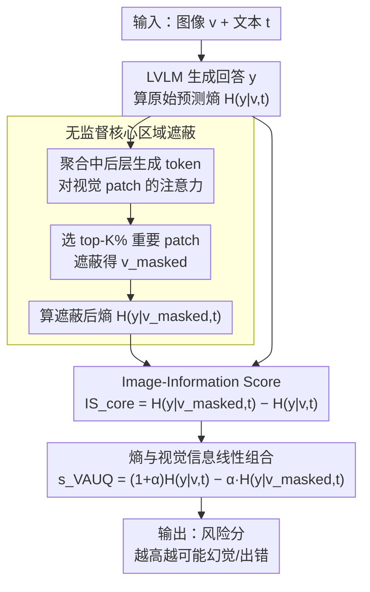

# VAUQ: Vision-Aware Uncertainty Quantification for LVLM Self-Evaluation

**会议**: ACL2026  
**arXiv**: [2602.21054](https://arxiv.org/abs/2602.21054)  
**代码**: https://github.com/deeplearning-wisc/vauq  
**领域**: multimodal_vlm  
**关键词**: LVLM自评估, 不确定性量化, 幻觉检测, 视觉证据, 注意力遮蔽  

## 一句话总结
本文提出 VAUQ，用图像信息分数和注意力驱动的核心区域遮蔽来衡量 LVLM 的回答是否真正依赖视觉证据，从而在无需训练和外部评估器的情况下更可靠地做多模态自评估与幻觉检测。

## 研究背景与动机
**领域现状**：大视觉语言模型已经能完成开放式 VQA、视觉推理和图文对话，但仍频繁产生幻觉。为了在部署时发现不可靠回答，一类方法让模型用自身内部信号做 self-evaluation，例如困惑度、预测熵、语义熵、口头置信度或隐藏状态变化。

**现有痛点**：这些方法大多来自纯语言模型。它们衡量的是模型对文本输出是否自信，却不一定衡量回答是否被图像支持。LVLM 可能因为语言先验非常强而对错误答案很自信，例如看到反常图片时仍按常识回答。此时低熵或高口头置信度只表示“语言上顺”，不表示“视觉上对”。

**核心矛盾**：多模态自评估要同时处理两类不确定性：语言生成本身的不确定性，以及视觉证据是否被正确利用的不确定性。只看输出分布会忽略视觉 grounding；只看视觉注意力又不能判断最终回答是否正确。可靠分数需要把“预测是否不确定”和“图像是否真的降低不确定性”结合起来。

**本文目标**：作者希望设计一个训练-free、label-free、response-level 的 LVLM 自评估分数。它不依赖外部 judge，不需要多次采样，也不只检测单个物体 hallucination，而是判断整个回答是否可能错误或幻觉。

**切入角度**：论文的核心观察是：如果模型的回答真的依赖视觉证据，那么去掉关键视觉区域后，模型对同一回答的预测不确定性应该上升。反过来，如果遮掉图像核心区域后模型仍然很自信，那么这个回答很可能主要来自语言先验，风险更高。

**核心 idea**：用视觉输入带来的熵下降作为 Image-Information Score，再通过中后层视觉注意力找到核心图像区域并遮蔽，把预测熵和核心遮蔽后的图像信息分数组合成 VAUQ 风险分数。

## 方法详解
VAUQ 的目标是给定图像文本输入 $x=(v,t)$ 和模型回答 $y$，输出一个分数 $s(x,y)$，用来判断回答是否可能是 hallucinated 或 incorrect。与需要外部监督的检测器不同，VAUQ 只用同一个 LVLM 的内部概率和注意力信息。

论文先指出纯语言不确定性方法在 ViLP 这类反事实数据上会失败。ViLP 包含 factual 和 counterfactual image，同一个问题在不同图像下需要不同答案。Entropy、Verbalized Confidence、Semantic Entropy、EigenScore 等方法在 counterfactual 图片上明显退化，例如 Entropy 下降 40.9%，EigenScore 下降 26.0%，说明它们被语言先验主导，无法识别“图像和常识冲突”导致的错误。

VAUQ 因此不只问“模型对回答是否自信”，而是问“模型的自信是否来自图像”。它把视觉贡献定义为有图像和无图像时预测熵的差异：如果图像让模型更确定，说明图像提供了信息；如果图像移除后熵几乎不变，说明回答主要靠语言先验。

### 整体框架
整体流程分为四步。第一步，LVLM 在原始图像文本输入上生成回答 $y$，并计算回答 token 的长度归一化预测熵 $H(y|v,t)$。第二步，聚合生成 token 对图像 patch 的注意力，估计哪些视觉 token 是核心证据。第三步，遮蔽 top-K% 的核心视觉 token，得到 $v_{masked}$，再计算 $H(y|v_{masked},t)$。第四步，把原始预测熵和核心区域被遮后的 Image-Information Score 组合成最终自评估分数。

原始 Image-Information Score 可写为 $IS_{blank}=H(y|empty,t)-H(y|v,t)$，其中 $empty$ 表示移除视觉输入。核心区域版本则使用 $IS_{core}=H(y|v_{masked},t)-H(y|v,t)$。最终分数为 $s_{VAUQ}=H(y|v,t)-\alpha\cdot IS_{core}$，也可理解为 $(1+\alpha)H(y|v,t)-\alpha H(y|v_{masked},t)$。分数越高，表示回答越可能不可靠；如果遮掉核心视觉证据后熵显著上升，$IS_{core}$ 较大，分数会被拉低，说明回答更可信。

### 关键设计

**1. Image-Information Score：用"去掉图像后预测不确定性涨多少"来量化这次回答到底吃了多少视觉证据**

纯文本不确定性只能告诉你模型自不自信，却答不上来"这份自信是不是来自图像"——LVLM 完全可能凭强语言先验对错答案信心满满。IS 把视觉贡献定义成有图和无图时同一回答的条件熵之差，原始形式为 $IS_{blank}=H(y|empty,t)-H(y|v,t)$，其中 $empty$ 表示移除视觉输入。如果 $H(y|empty,t)$ 明显高于 $H(y|v,t)$，说明图像确实帮模型压低了不确定性、回答是被看到的内容支撑的；如果两者差距很小，那这份信心多半来自语言先验，风险更高。这一步把"视觉证据是否被用上"从一个含糊的直觉变成了可直接计算的量。

**2. 无监督核心区域遮蔽：不去掉整张图，而是只敲掉模型最依赖的那几块 patch，让 IS 真正测在任务相关证据上**

直接 blank 掉整图会把背景、无关区域和关键证据一锅端，随机遮蔽又会无谓地扰乱输入，两者都让 IS 变脏。核心区域遮蔽的做法是聚合中后层 transformer 里生成 token 对视觉 token 的注意力，得到每个图像 patch 的重要性分数，再选 top-K% 作为核心区域、得到 $v_{masked}$，于是核心版分数写成 $IS_{core}=H(y|v_{masked},t)-H(y|v,t)$。之所以取中后层而非早期层，是因为作者发现早期层难以定位证据、中后层才捕捉得到语义区域。只移除"模型真正依赖的证据"，更接近一次因果干预，因此比读整图注意力更能判断回答是否 grounded——实验里它的定位质量也逼近 ground-truth box oracle。

**3. 熵与视觉信息的线性组合：把"预测有多不确定"和"图像帮了多少忙"拼成一个分数，互相补盲**

只看熵会被语言先验骗过，只看视觉信息又会漏掉模型本身的生成不确定性，两个信号各有盲区。VAUQ 把它们线性组合成最终风险分

$$s_{VAUQ}=H(y|v,t)-\alpha\cdot IS_{core}=(1+\alpha)H(y|v,t)-\alpha H(y|v_{masked},t)$$

预测熵高会推高风险分（模型自己就不确定），核心视觉信息分高则拉低风险分（信心来自视觉证据），超参 $\alpha$ 控制两者权重。分数越高越可能不可靠；反过来，若遮掉核心证据后熵显著上升，$IS_{core}$ 变大、分数被压低，说明回答可信。这种互补设计尤其适合 factual / counterfactual 混在一起的真实分布——熵在 factual split 上准，IS 在需要视觉证据时强，合起来才稳。

### 损失函数 / 训练策略
VAUQ 没有训练损失，是后验 self-evaluation scoring。实现时使用 greedy decoding，最大生成长度 128。为了效率，作者并不真的修改图像像素，而是在计算 $IS_{core}$ 时对 top-K 视觉 token 的注意力权重做 knockout。$\alpha$、遮蔽比例 $K$ 和层范围 $(l_s,l_e)$ 在验证集上选择；实验使用 Python 3.11.11、PyTorch 2.6.0，在单张 80GB A100 上运行，并报告 3 个随机种子的平均结果。

## 实验关键数据

### 主实验
实验覆盖 ViLP、MMVet、VisualCoT 和 CVBench 四个数据集，以及 LLaVA-1.5、Qwen2.5-VL 和 InternVL3.5。指标是 AUROC，越高表示越能区分正确与幻觉回答。下表选取 LLaVA-1.5-7B 和 Qwen2.5-VL-7B 的代表性结果。

| 模型 | 方法 | ViLP | MMVet | VisualCoT | CVBench |
|------|------|------|-------|-----------|---------|
| LLaVA-1.5-7B | Perplexity | 54.6 | 79.3 | 56.2 | 60.3 |
| LLaVA-1.5-7B | Semantic Entropy | 63.7 | 81.3 | 75.1 | 70.2 |
| LLaVA-1.5-7B | VL-Uncertainty | 55.6 | 82.3 | 65.2 | 71.1 |
| LLaVA-1.5-7B | VAUQ | 77.0 | 81.5 | 77.8 | 73.2 |
| Qwen2.5-VL-7B | Perplexity | 55.0 | 76.6 | 56.0 | 64.8 |
| Qwen2.5-VL-7B | Semantic Entropy | 52.0 | 60.1 | 53.3 | 50.9 |
| Qwen2.5-VL-7B | VL-Uncertainty | 57.9 | 69.7 | 62.3 | 69.7 |
| Qwen2.5-VL-7B | VAUQ | 64.1 | 78.3 | 68.0 | 69.8 |

VAUQ 在 LLaVA-1.5-7B 的 ViLP 上比 Semantic Entropy 高 13.4 个百分点，在同一模型上比 VL-Uncertainty 高 21.4 个百分点；在 VisualCoT 上也比 VL-Uncertainty 高 12.6 个百分点。这说明视觉 grounding 信号尤其能补足 counterfactual 和证据定位类任务。

### 消融实验
效率实验显示，VAUQ 比多采样和外部模块方法快很多，同时 AUROC 更高。下表是 ViLP 上平均单样本耗时和 AUC。

| 方法 | LLaVA-1.5-7B Time(s) | LLaVA AUC | Qwen2.5-VL-7B Time(s) | Qwen AUC |
|------|----------------------|-----------|------------------------|----------|
| SVAR | 0.39 | 50.6 | 1.59 | 49.6 |
| Verbalized | 0.58 | 56.3 | 1.82 | 55.3 |
| EigenScore | 5.86 | 63.2 | 8.77 | 53.0 |
| Semantic Entropy | 7.05 | 63.7 | 12.40 | 52.0 |
| VL-Uncertainty | 13.60 | 55.6 | 20.20 | 57.9 |
| VAUQ | 0.73 | 77.0 | 2.16 | 64.1 |

作者还在 VisualCoT 上比较遮蔽策略。随机遮蔽会降低效果，ground-truth box oracle 最强，VAUQ 的注意力核心区域遮蔽接近 oracle，说明中后层注意力能够在无标注条件下近似定位关键证据。附录还报告 HallusionBench，VAUQ 在 LLaVA-1.5-7B 上 AUROC 67.0，超过 VL-Uncertainty 的 65.1；在 Qwen2.5-VL-7B 上 AUROC 74.3，略高于 Semantic Entropy 的 74.0。

| 评估项 | 对比方法 | 结果 | 说明 |
|--------|----------|------|------|
| ViLP AUPRC | Semantic Entropy | 60.2 | 语义熵在类别不均衡下仍弱于 VAUQ |
| ViLP AUPRC | VAUQ | 68.2 | 比 Semantic Entropy 高 8.0 |
| ImageNet-S 定位 | Embedding baseline | 50.4 / 36.1 / 53.9 | 与真实物体区域重合较弱 |
| ImageNet-S 定位 | Attention masking | 69.3 / 46.4 / 77.1 | 注意力核心区域更接近真实物体区域 |
| ViLP / VisualCoT 遮蔽 | Grad-CAM | 76.0 / 76.6 | 可用但需要梯度式显著图 |
| ViLP / VisualCoT 遮蔽 | Attention masking | 77.0 / 77.8 | 训练-free 且略优 |

### 关键发现
- 语言先验是 LVLM 自评估的主要陷阱。传统 entropy 或 verbalized confidence 在反事实图像上会低估风险，因为模型的文本先验让错误答案看起来很流畅。
- 核心区域遮蔽比整图 blank 更合理。整图移除会把背景、无关区域和关键证据一起去掉；注意力遮蔽更直接测试回答是否依赖任务相关区域。
- VAUQ 的效率优势很明显。它只需要常数次额外 forward，不需要生成多条回答，因此复杂度仍是 $O(M)$，而多采样方法是 $O(A\cdot M)$。
- 熵和 IS 是互补信号。Entropy 在 factual split 上较好，但 counterfactual split 上退化；IS 在需要视觉证据时更强，两者组合后更稳定。
- 超参数有一定稳定区间。论文发现 $\alpha$ 在 0.5 到 1.5 附近通常较好；遮蔽比例 $K$ 的中等取值更稳定，例如 CVBench 最优约 $K=30$，MMVet 最优约 $K=40$。

## 亮点与洞察
- VAUQ 的问题定义很到位。它不是再做一个外部幻觉检测器，而是问 LVLM 自己的信心是否真的来自图像。
- Image-Information Score 是一个简单但有解释力的信号。它把“视觉输入是否降低预测不确定性”变成可计算量，直观对应 grounding。
- 核心区域遮蔽让分数更像因果测试。遮掉模型最关注的区域，看回答概率是否受影响，比单纯读注意力权重更接近干预。
- 方法保持 training-free，很适合当作部署时的轻量 reliability layer。它不要求为每个任务标注 hallucination 数据，也不用训练专门 probe。
- 这篇论文提醒我们，多模态自评估不能直接继承 LLM 自评估。视觉证据是否被使用，是 LVLM 独有的可靠性维度。

## 局限与展望
- 依赖全局超参数。作者承认 $\alpha$、遮蔽比例 $K$ 和层范围在不同数据集、模型甚至样本之间可能最优值不同，未来需要样本自适应调参。
- 当前主要评估 instruction-tuned image LVLM。对长链视觉推理、视频理解、agentic multimodal systems 的效果还未验证，尤其是多步推理中视觉贡献可能分布在多个阶段。
- 注意力不总等于证据。附录案例显示，当图像中存在多个显著物体时，注意力可能漏掉部分相关信息，导致核心区域遮蔽不完整。
- 分数不是安全保证。论文的 ethical statement 也强调，VAUQ 只能作为辅助可靠性信号，不能替代人类审查或完整安全机制。
- 需要访问模型内部概率和注意力。对于闭源 LVLM 或只提供文本 API 的系统，VAUQ 不能直接使用，需要寻找黑盒近似版本。

## 相关工作与启发
- **vs Perplexity / Entropy**: 这些方法只看语言输出概率，容易被语言先验误导；VAUQ 额外考察图像移除或核心遮蔽对预测熵的影响。
- **vs Semantic Entropy / EigenScore**: 多采样和隐藏状态方法能捕捉回答多样性，但成本高且不一定知道视觉证据是否被用上；VAUQ 用少量 forward 直接测视觉贡献。
- **vs SVAR / Contextual Lens**: 视觉注意力或表示相似度可以检测 object-level grounding，但对 response-level hallucination 不够直接；VAUQ 把注意力用于干预，再结合输出熵。
- **vs VL-Uncertainty**: VL-Uncertainty 通过视觉和文本扰动后的多响应一致性估计不确定性，适合黑盒但成本高；VAUQ 是白盒、训练-free、少采样的替代方案。
- **启发**: 后续可把 VAUQ 分数用于 selective prediction：高风险回答触发再检索、再观察、拒答或人类复核；也可以和 VCD、对比解码等生成期方法结合，先检测再修正。

## 评分
- 新颖性: ⭐⭐⭐⭐☆ 将预测熵与视觉信息增益结合，思路简洁且针对 LVLM 自评估痛点。
- 实验充分度: ⭐⭐⭐⭐⭐ 覆盖多模型、多数据集、主结果、遮蔽策略、效率、AUPRC、HallusionBench 和定位质量分析。
- 写作质量: ⭐⭐⭐⭐☆ 动机清楚，方法公式直观，HTML 表格转换略影响阅读但论文逻辑完整。
- 价值: ⭐⭐⭐⭐⭐ 训练-free、可解释、效率高，很适合作为多模态系统部署前的可靠性检查信号。

<!-- RELATED:START -->

## 相关论文

- [\[ICLR 2026\] Detecting Misbehaviors of Large Vision-Language Models by Evidential Uncertainty Quantification](../../ICLR2026/multimodal_vlm/detecting_misbehaviors_of_large_vision-language_models_by_evidential_uncertainty.md)
- [\[ACL 2026\] Revisit What You See: Revealing Visual Semantics in Vision Tokens to Guide LVLM Decoding](revisit_what_you_see_revealing_visual_semantics_in_vision_tokens_to_guide_lvlm_d.md)
- [\[ACL 2026\] iReasoner: Trajectory-Aware Intrinsic Reasoning Supervision for Self-Evolving Large Multimodal Models](ireasoner_trajectory-aware_intrinsic_reasoning_supervision_for_self-evolving_lar.md)
- [\[ACL 2026\] VIGNETTE: Socially Grounded Bias Evaluation for Vision-Language Models](vignette_socially_grounded_bias_evaluation_for_vision-language_models.md)
- [\[CVPR 2026\] Uncertainty-Aware Knowledge Distillation for Multimodal Large Language Models](../../CVPR2026/multimodal_vlm/uncertainty-aware_knowledge_distillation_for_multimodal_large_language_models.md)

<!-- RELATED:END -->
