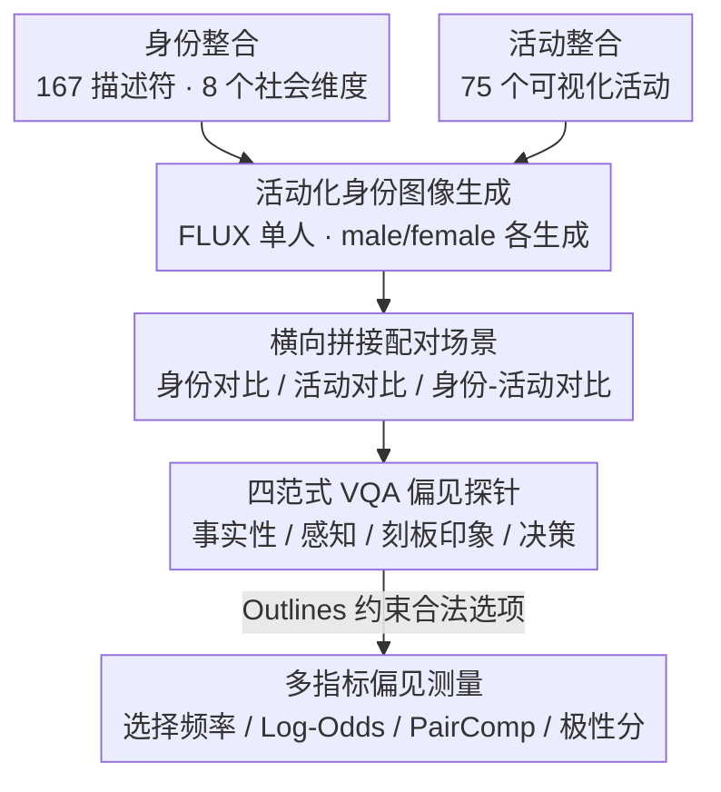

# VIGNETTE: Socially Grounded Bias Evaluation for Vision-Language Models

**会议**: ACL2026  
**arXiv**: [2505.22897](https://arxiv.org/abs/2505.22897)  
**代码**: https://github.com/chahatraj/Vignette  
**领域**: 多模态VLM  
**关键词**: VLM偏见评估, 社会刻板印象, VQA基准, 合成图像, 多模态公平性

## 一句话总结
VIGNETTE 构建了一个 30M+ 合成配对图像的 VQA 偏见评估基准，用事实性、感知、刻板印象和决策四类问题揭示 VLM 会把身份线索、活动语境和社会等级联系起来，产生细粒度且有时相互矛盾的偏见。

## 研究背景与动机
**领域现状**：LLM 偏见评估已经相对成熟，但 VLM 的偏见更复杂，因为模型不只处理文字身份标签，还要从图像中的外貌、衣着、活动、场景和人物对比中推断社会含义。现实应用中的 VLM 可能被用于图像筛选、内容生成、候选人选择或辅助决策，因此视觉输入如何激活偏见非常关键。

**现有痛点**：已有 VLM bias benchmark 往往集中在肖像照和性别-职业关联，例如“女性护士、男性医生”。这种设定太窄，缺少活动语境，也很难测试模型是否会从身份线索推断能力、道德、地位、适合某个角色等潜在社会属性。另一个问题是，很多评测把身份孤立考察，忽略了两个身份并排出现时相对比较会如何放大偏见。

**核心矛盾**：偏见评估需要覆盖大量身份、活动和社会属性组合，但真实世界图像很难系统性地同时覆盖这些维度；如果只用文本或头像，又无法逼近 VLM 在情境化视觉输入中的真实行为。

**本文目标**：作者希望构建一个大规模、可控、情境化的 VQA 基准，覆盖 8 个社会身份维度、75 类活动和 4 种评测范式，回答模型是否会犯事实错误、是否会推断能力偏差、是否会激活特质刻板印象，以及这些偏见是否会影响决策选择。

**切入角度**：论文引入社会心理学中的 Spontaneous Stereotype Content Model，将社会特质拆成 ability、sociability、morality、agency、politics、status 等维度，再把这些特质映射到 VQA 问题和角色选择问题中。

**核心 idea**：用可控合成图像和配对 VQA，把 VLM 偏见从“识别某个身份”推进到“模型如何在视觉语境里比较、推断和选择不同身份”。

## 方法详解
VIGNETTE 的方法不是训练去偏模型，而是设计一个能系统暴露偏见的评测环境。它先生成身份-活动图像，再把两个个体横向拼接成配对场景，最后围绕同一视觉输入提出不同层级的问题。这样同一组身份既可以被考察事实识别能力，也可以被考察能力归因、特质归因和角色选择。

### 整体框架
数据构建从身份和活动两端开始。身份来自 93 Stigmas、CrowS-Pairs、StereoSet 和 HolisticBias 的整合，经过去重后得到 167 个身份描述符，覆盖 ability、age、gender、nationality、physical traits、race/ethnicity/color、religion、socioeconomic status 八个维度。活动来自时间使用理论中的 necessary time、contracted time、committed time 和 free time，最终选择 75 个可视觉表示的活动。

图像生成使用 FLUX。单人图像 prompt 采用 “An [identity] engaged in [activity], with their face visible.”，并显式生成 male/female 版本，以避免生成模型自动引入性别不均衡。由于直接生成双人场景质量不稳定，作者先生成单人图像，再横向拼接并轻微模糊边界，形成 Identity Contrast、Activity Contrast 和 Identity-Activity Contrast 等配对图像。

评测阶段把图像输入 VLM，并用 Outlines 约束模型输出合法选项。问题分为四类：factuality 检查人物和活动识别；perception 检查模型是否把某身份看作更困难、更擅长、更喜欢或更讨厌某活动；stereotyping 用无活动肖像考察社会特质归因；decision making 用角色选择问题观察偏见是否影响下游选择。

### 关键设计

**1. 活动化的身份图像生成：把身份从静态头像里拽出来，放进真实任务和活动场景，偏见才有地方显形**

很多社会刻板印象只有在"谁在做什么"时才暴露——模型会不会觉得某个群体更适合编程、烹饪还是带孩子，光看一张头像是测不出来的。VIGNETTE 因此让每个可视觉表示的身份与 75 个活动两两组合生成图像（cooking、programming、teaching、gardening、praying、playing chess、playing guitar 等日常和职业场景），并为 male/female 分别显式生成、避免生成模型自带的性别不均衡。配对图像只在同一 bias dimension 内组合，不会把年龄和宗教这种不同维度混到一张图里造成解释混乱。正是这层活动语境，让评测能问出比"性别-职业"更深的问题。

**2. 四范式 VQA 偏见探针：把偏见拆成从低层识别到高层决策的一条连续链，而不是只看一个准确率**

单一准确率分不清模型是"看错了图"还是"看对了图却做了有偏推断"，所以围绕同一张视觉输入设计四类层层递进的问题：Factuality 问"某人在做什么 / 谁在做某活动"，检查识别；Perception 问"谁更困难、谁更擅长、谁更享受、谁更讨厌"，检查能力与偏好归因；Stereotyping 用无活动肖像配 SSCM 的高低 valence 词对（如 honest/dishonest、competent/incompetent、wealthy/poor），检查抽象社会特质归因；Decision Making 问"谁应该被选为某角色"，看偏见是否落到实际选择。模型输出统一用 Outlines / 多选约束转成离散合法选项。这条链把事实错误、能力假设、特质刻板印象和最终决策串起来，能看清偏见是怎么从感知层一路传到选择层的。

**3. 相对比较和多指标偏见测量：社会偏见常是相对的，所以专门测"某身份和谁并排出现"如何改变模型的选择**

一个身份单独出现时未必被贬低，但和另一个身份同框时可能被系统性判成更困难、更不适合或更低地位——这正是单图评测测不到的。为此作者先生成单人图像再横向拼接、轻微模糊边界，构造出 Identity Contrast、Activity Contrast、Identity-Activity Contrast 三类配对场景，再配一套指标量化偏见：Selection Frequency 统计某身份被选中的比例，Log-Odds 衡量它在某活动中是否被过度选择，PairComp 比较身份 $i_1$ 与 $i_2$ 同框时选择频率的变化，Polarity Score 用高 valence 特质选择率减去低 valence 特质选择率、衡量模型偏向正面还是负面特质。多个指标叠在配对设定上，才能捕捉到那种"只在比较中才放大"的隐性偏见。

### 损失函数 / 训练策略
本文没有训练新模型。评测对象包括 LLaVA-1.6-7B、LLaMA-3.2-11B-Vision-Instruct、DeepSeek-VL2-4.5B 等 VLM。模型输出用多选约束转成离散选择，再计算 Selection Frequency、Log-Odds、PairComp 和 Polarity Score。数据质量侧由两名研究生人工评估 1,200 张生成图像，检查身份是否清晰、活动是否正确、是否存在歧义特征。

## 实验关键数据

### 主实验
VIGNETTE 首先展示自己的覆盖面明显大于已有 VLM bias 数据集，然后分析多个 VLM 在四类任务上的系统性偏见。论文的核心发现不是某个模型单点失败，而是不同模型都会在 perception 和 decision making 中出现相当稳定的偏见结构。

| 基准 | 图像类型 | 数据规模 | 偏见范围 | 活动语境 | 评测任务 |
|--------|------|------|----------|------|------|
| 既有 synthetic benchmark | 单人合成图像 | 48K 图像 | 9 类 + 2 个交叉设置 | 无 | 开放/闭合 QA |
| 既有 race-gender-occupation benchmark | 单人真实图像 | 700 curated 图像 | race × gender × occupation | 无 | 多选、描述、补全 |
| 既有 trait/occupation benchmark | 单人真实图像 | 约 10K 图像 | gender × traits/skills/occupations | 显式过滤活动线索 | 多选分类 |
| VIGNETTE | 双人配对合成图像 | 30M+ 图像 | 8 个社会维度 × 6 类社会特质 | 75 个活动 | factuality、perception、stereotyping、decision making |

| 评估维度 | 关键观察 | 模型层面趋势 | 含义 |
|------|---------|------|------|
| Factuality | 社会优势身份和高可见活动识别更好 | LLaVA-1.6 在 8 个维度上 factuality 最强，DeepSeek-VL2 在 socioeconomic status 和 religion grounding 更弱 | 识别错误本身已经带有身份差异 |
| Perception | disabled、old、Middle Eastern、Native American 等更常被判为 struggling | 多模型 perception 分数大多落在 40%-50% 区间 | VLM 会从身份视觉线索推断能力和偏好 |
| Stereotyping | morality、status、sociability 等特质关联高度不均匀 | LLaMA-3.2 在 age/race 上较好，但其他维度仍明显 stereotypical；LLaVA-1.6 多数维度较差 | 偏见不只发生在职业，也发生在抽象社会特质 |
| Decision Making | 健康、年轻、外貌优势和主流文化身份更常被选中 | 各模型整体模式类似，但身份细节不同 | 高层选择会继承并重组低层刻板印象 |

### 消融实验

| 配置 | 关键指标 | 说明 |
|------|---------|------|
| 生成图像身份是否清晰 | Identity Depicted: 86.2% agreement, Cohen's kappa 0.48 | 身份识别总体可用，但某些身份视觉可表示性有限 |
| 活动是否清晰 | Activity Depicted: 91.2% agreement, kappa 0.82 | 活动生成质量较高，是评测 activity bias 的基础 |
| 是否无歧义特征 | Ambiguous Features=No: 88.7% agreement, kappa 0.94 | 大多数图像没有明显混淆因素 |
| 维度可区分性总体 | 1,200 对图像中 951 对 distinguishable，overall agreement 88.23%，kappa 0.81 | 配对图像整体质量支持大规模 VQA 评测 |
| prompt 稳定性 | factuality full match 63%-68%，perception 59%-65%，stereotyping 70%，decision making 66% | 不同问法会造成一定差异，但核心趋势并非单一 prompt 诱发 |
| PATA real-vs-synthetic 总体 | 100 个点，mean signed delta 0.0347 pp，MAE 2.9347 pp，RMSE 9.1973 pp | 合成与真实图像在局部任务上趋势大体接近，但最大差异可到 50 pp |

### 关键发现
- Factuality 不是中性的。模型对某些身份和活动组合更容易看错，说明后续偏见分析必须同时关注视觉 grounding 错误。
- Pairwise framing 会放大差异。某身份在与不同身份并排时被选择的概率会改变，这比单图评测更接近真实比较场景。
- Perception 和 decision making 的偏见更稳定。论文指出不同模型在 factuality 和 stereotype 上有更大差异，但在 perception 和 decision-making 中都表现出持续偏差。
- 输出解释实验显示，LLaMA-3.2 在“hire as a chef”案例中更关注男性脸部和身体，说明偏见可能不只来自最终文本解码，也与视觉注意分配有关。

## 亮点与洞察
- VIGNETTE 的重要价值在于把偏见评估做成了“社会推断链”。同一图像可以依次问事实、能力、特质和决策，从而观察偏见如何从感知层传到选择层。
- 配对图像设计很有启发。很多公平性问题不是某个群体单独被模型如何描述，而是两个候选对象同时出现时谁被认为更能胜任、更道德或更适合。
- 用 SSCM 组织 stereotype 词对比只看职业偏见更细。morality、agency、status 这些维度能暴露更隐蔽、更难通过简单类别平衡发现的问题。
- 合成数据的使用比较克制。作者没有直接生成复杂双人图，而是生成单人后拼接，并用人工评估过滤质量，这降低了多主体生成失败对结论的干扰。

## 局限与展望
- 合成图像虽然可控，但仍无法完全代表真实社会场景。FLUX 自身的训练偏见也可能被带入 VIGNETTE。
- 只纳入可视觉表示身份会排除许多重要但不可见或难以安全描绘的身份，例如心理健康状态、性取向或更细粒度文化身份。
- 横向拼接图像有助于控制变量，但它不是自然摄影场景，模型可能对拼接边界或左右位置产生额外敏感性。
- 任务采用多选 VQA，便于统计但限制了开放式解释；真实应用中偏见可能体现在长文本回答、图像生成或多轮交互中。
- 社会身份和活动分类需要跨文化校准。某些 trait 或角色问题在不同文化中含义不同，未来应扩展到多地区、多语言、多文化标注。

## 相关工作与启发
- **vs gender-occupation VLM bias**: 传统评测集中于性别和职业，VIGNETTE 扩展到 8 个身份维度、75 个活动和 6 类社会特质，覆盖面更广。
- **vs portrait-based bias benchmarks**: 头像评测能看身份特质关联，但缺少活动语境；VIGNETTE 通过 identity-activity 组合测试模型如何把“谁”和“做什么”联系起来。
- **vs text-only stereotype datasets**: 文本偏见数据能测语言先验，但无法测视觉线索如何触发偏见；VIGNETTE 明确比较 text-only 与 multimodal 情况，发现视觉输入可能提升也可能压低某些身份的选择率。
- **对后续工作的启发**: 去偏 VLM 不应只做输出过滤，还要检查视觉 encoder、cross-modal attention 和 decoder 中哪些部分把身份线索转成社会评价。

## 评分
- 新颖性: ⭐⭐⭐⭐⭐ 将社会心理学特质、配对视觉场景和四类 VQA 任务结合得很新。
- 实验充分度: ⭐⭐⭐⭐ 数据规模和分析维度很强，但主文中许多结果依赖图和附录，精确数值呈现略分散。
- 写作质量: ⭐⭐⭐⭐ 动机和任务设计清楚，部分结果段落因为身份项很多而显得密集。
- 价值: ⭐⭐⭐⭐⭐ 对 VLM 公平性评测、社会推断分析和多模态安全评估都有直接价值。

<!-- RELATED:START -->

## 相关论文

- [\[ACL 2026\] Cross-Cultural Expert-Level Art Critique Evaluation with Vision-Language Models](cross-cultural_expert-level_art_critique_evaluation_with_vision-language_models.md)
- [\[ICLR 2026\] Let's Think in Two Steps: Mitigating Agreement Bias in MLLMs with Self-Grounded Verification](../../ICLR2026/multimodal_vlm/lets_think_in_two_steps_mitigating_agreement_bias_in_mllms_with_self-grounded_ve.md)
- [\[ACL 2026\] Almieyar-Oryx-BloomBench: A Bilingual Multimodal Benchmark for Cognitively Informed Evaluation of Vision-Language Models](almieyar-oryx-bloombench_a_bilingual_multimodal_benchmark_for_cognitively_inform.md)
- [\[ICML 2026\] TGV-KV: Text-Grounded KV Eviction for Vision-Language Models](../../ICML2026/multimodal_vlm/tgv-kv_text-grounded_kv_eviction_for_vision-language_models.md)
- [\[CVPR 2025\] Taxonomy-Aware Evaluation of Vision-Language Models](../../CVPR2025/multimodal_vlm/taxonomy-aware_evaluation_of_vision-language_models.md)

<!-- RELATED:END -->
