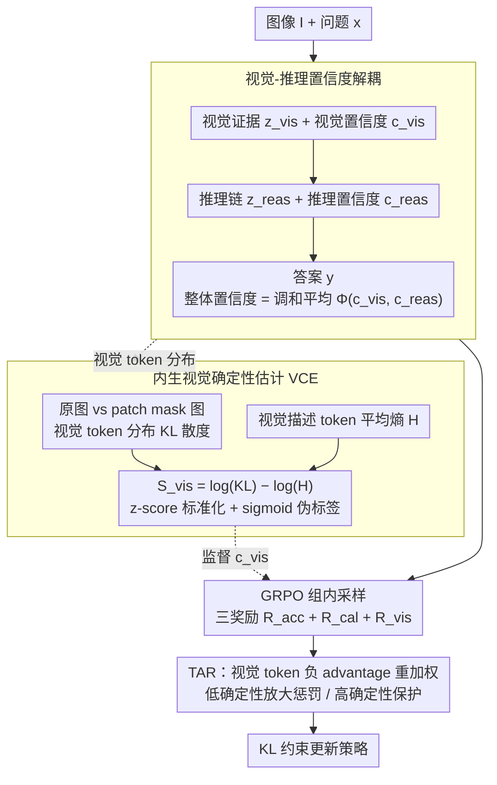

# VL-Calibration: Decoupled Confidence Calibration for Large Vision-Language Models Reasoning

**会议**: ACL2026  
**arXiv**: [2604.09529](https://arxiv.org/abs/2604.09529)  
**代码**: https://github.com/Mr-Loevan/VL-Calibration  
**领域**: multimodal_vlm  
**关键词**: 多模态校准, 置信度解耦, 视觉不确定性, 强化学习, 幻觉抑制

## 一句话总结
VL-Calibration 将 LVLM 的口头置信度拆成视觉置信度和推理置信度，并用图像扰动 KL、token 熵与 token 级优势重加权训练模型，在 13 个视觉推理基准上同时降低 ECE、提升准确率。

## 研究背景与动机
**领域现状**：大视觉语言模型已经能处理数学图表、几何题、常识问答和多学科图文推理，但它们给答案时常常没有可靠的不确定性表达。文本 LLM 中已有一类 verbalized confidence calibration 方法，让模型输出“我有多确信”，再用 SFT、PPO、DPO 或 GRPO 等方式让置信度贴近答案正确率。

**现有痛点**：这些方法直接搬到 LVLM 上会遇到结构性错配。LVLM 的错误既可能来自“看错图”，也可能来自“看对了但推理错”；如果只训练一个整体置信度，模型只能说“我不确定”，却无法说明不确定性来自视觉还是逻辑。此外，多模态模型常受语言先验支配，即使图像证据不足，也可能根据常见文本模式给出高置信答案。

**核心矛盾**：校准目标需要判断答案是否正确，但 LVLM 的答案正确性是视觉感知和后续推理共同作用的结果。单一 Brier-style 置信度把两类错误源混在一起，导致优化信号太粗；而真正需要监督的视觉置信度又缺少人工标注的视觉 rationale 正误标签。

**本文目标**：作者想解决三个子问题：让模型显式区分视觉阶段和推理阶段的置信度；在没有视觉真值标签的情况下构造可训练的视觉确定性信号；在 RL 训练中对视觉不确定导致的幻觉给出更细粒度惩罚。

**切入角度**：论文从一个很朴素但有效的观察出发：如果模型的视觉描述真的依赖图像，那么遮挡图像后输出分布应明显变化；如果模型对视觉描述内部也很确定，token 分布应更尖锐。把“对图像敏感”和“内部低熵”合起来，就能得到一个不需要人工标注的视觉确定性代理。

**核心 idea**：用视觉置信度和推理置信度替代单一置信度，并用内生视觉确定性奖励把视觉置信度对齐到真实感知可靠性。

## 方法详解

### 整体框架
VL-Calibration 的输入是图像 $I$ 和文本问题 $x$，输出不只是答案 $y$，而是一条结构化轨迹：先生成视觉 rationale $z_{vis}$ 与视觉置信度 $c_{vis}$，再生成推理链 $z_{reas}$ 与推理置信度 $c_{reas}$，最后给出答案。整体答案置信度不是另起一个标量，而是由 $c_{vis}$ 与 $c_{reas}$ 合成。

训练流程以 GRPO 为基础。对同一个图文问题采样一组输出，按答案正确性、整体置信度校准、视觉置信度校准三个奖励项计算组内 advantage，再用 KL 约束更新策略。与普通 RLCR 相比，本文没有停留在“答案对就高置信、答案错就低置信”，而是把视觉阶段单独拉出来监督。

方法可以理解成三层：第一层改输出格式，让模型自己暴露两个不确定性源；第二层构造视觉确定性伪标签，给 $c_{vis}$ 找训练目标；第三层在 token 级别调节负 advantage，让低视觉确定性的错误 token 受到更强惩罚。

### 关键设计

**1. 视觉-推理置信度解耦：把一个笼统的口头置信度拆成"看得准不准"和"想得对不对"两端**

LVLM 的错误既可能来自看错图，也可能来自看对了却推理错，但只训练一个整体置信度时，模型最多说"我不确定"，无法定位不确定性来自感知还是逻辑。本文把轨迹显式写成 $\tau=(z_{vis}, c_{vis}, z_{reas}, c_{reas}, y)$：$z_{vis}$ 类似 dense caption 的视觉证据描述并配一个视觉置信度 $c_{vis}$，$z_{reas}$ 是基于该证据的推理链并配推理置信度 $c_{reas}$，答案 $y$ 的整体置信度不是另起一个标量，而是用调和平均合成

$$\Phi(c_{vis},c_{reas})=\frac{2c_{vis}c_{reas}}{c_{vis}+c_{reas}}.$$

之所以选调和平均而非算术平均，是因为它更保守——只要视觉或推理任一端很低，整体置信度就会被拉下来。这恰好契合多模态推理的风险结构："看不清但逻辑很顺"和"看得清但推理不稳"都不该给出高总置信度。

**2. 内生视觉确定性估计 VCE：在没有视觉真值标签时，为 $c_{vis}$ 造一个可训练的伪监督**

视觉置信度真正需要监督，但人工标注视觉 rationale 的正误代价高昂，几乎拿不到。VCE 转而从模型自身抽取两个互补信号来当伪标签。第一是视觉 grounding：对原图和随机 patch mask 后的图像分别计算视觉 rationale token 分布，再求二者的 KL 散度 $D_{KL}$，$D_{KL}$ 越大说明输出确实依赖图像而非凭空生成。第二是内部确定性：计算视觉描述 token 的平均熵 $H$，熵越低表示模型对自己的视觉描述越笃定。最终视觉确定性写成

$$S_{vis}=\log(D_{KL}+\epsilon)-\log(H+\epsilon),$$

再在 batch 内做 z-score 标准化并经 sigmoid 映射到 $[0,1]$。两个信号相减是关键：只看 KL 会奖励"对图像敏感但内部混乱"的输出，只看熵又会奖励语言先验驱动的自信胡说；相减后同时要求"受图像约束"和"内部分布稳定"，log 尺度还压缩了数值范围，利于 RL 训练稳定。

**3. 视觉确定性感知的 token 级优势重加权（TAR）：把惩罚精确打到未 grounding 的视觉 token 上**

标准 GRPO 对一个样本内的所有 token 用同一个 advantage，但多模态错误并不均质——同样在错误样本里，低视觉确定性下还生成具体视觉内容更可能是未 grounding 的猜测，而高确定性 token 即便出现在错误样本里也可能携带有效感知证据。TAR 因此只对视觉 rationale 中且 advantage 为负的 token 额外乘上一个与该 token 视觉确定性相关的权重：低确定性 token 的负 advantage 被放大、受到更强惩罚，高确定性 token 的负 advantage 被减弱、得到保护。这样既精准压制了视觉不确定导致的幻觉，又避免把合理视觉 token 一并压低而损伤模型的视觉能力。

### 损失函数 / 训练策略
训练目标由三项奖励组成：答案准确奖励 $R_{acc}$、整体置信度校准奖励 $R_{cal}$、视觉置信度奖励 $R_{vis}$。其中 $R_{cal}$ 用合成置信度 $\Phi(c_{vis},c_{reas})$ 与答案正确性做 Brier-style 对齐，$R_{vis}$ 用 $c_{vis}$ 与 stop-gradient 后的 $\tilde{S}_{vis}$ 做平方误差惩罚。论文在 ViRL-39K 中抽取 12K 样本构成 VL-Calibration-12K，主要训练 Qwen3-VL-4B/8B，并验证 Qwen3-VL-30B 和 InternVL3.5-4B-MPO 的泛化。

## 实验关键数据

### 主实验
论文在 13 个视觉推理与多学科基准上评估 Accuracy、AUROC 和 Expected Calibration Error。主结论是：VL-Calibration 不只是让模型“更会报置信度”，还同步提升了视觉推理准确率。

| 模型 / 场景 | 指标 | 基线或强基线 | VL-Calibration | 提升 |
|--------|------|------|------|------|
| Qwen3-VL-4B 平均 | ECE ↓ | 0.421 | 0.098 | 降低约 4.3 倍 |
| Qwen3-VL-8B 平均 | ECE ↓ | 0.204 | 0.071 | 降低约 65.2% |
| Qwen3-VL-4B 平均 | Accuracy ↑ | 最强基线 | Ours | +2.3% |
| Qwen3-VL-8B 平均 | Accuracy ↑ | 最强基线 | Ours | +3.0% |
| MMMU-Pro | Accuracy ↑ | 最强基线 | Ours | +2.2% |
| A-OKVQA | ECE ↓ | 0.112 | 0.017 | 校准误差大幅下降 |
| Qwen3-VL-30B | Accuracy / AUROC / ECE | 0.652 / 未强调 / 较高 | 0.803 / 0.767 / 0.082 | 大模型上仍有效 |
| InternVL3.5-4B-MPO | Accuracy / ECE | RLCR 强基线 | 0.689 / 0.103 | 跨架构有效 |

### 消融实验
消融集中在 Qwen3-VL-4B 上，验证“解耦本身”“视觉确定性估计”“token advantage reweighting”分别贡献什么。

| 配置 | ACC ↑ | AUROC ↑ | ECE ↓ | 说明 |
|------|------|------|------|------|
| Qwen3-VL-4B Base | 0.516 | 0.763 | 0.421 | 原始模型过度自信，准确率也低 |
| RLCR | 0.704 | 0.694 | 0.167 | 整体置信度 RL 校准有效，但 AUROC 下降 |
| RLCR + Decoupled | 0.701 | 0.682 | 0.164 | 只改输出格式几乎无收益 |
| + VCE Entropy only | 0.688 | 0.723 | 0.119 | 熵信号改善校准但牺牲准确率 |
| + VCE KL only | 0.709 | 0.721 | 0.124 | 图像扰动信号有效但不够稳 |
| + VCE Entropy + KL | 0.715 | 0.751 | 0.121 | 双信号比单信号更均衡 |
| Ours + TAR | 0.727 | 0.763 | 0.098 | 完整方法最佳，TAR 进一步提升准确率和校准 |

### 关键发现
- 解耦置信度只有在配套视觉监督时才真正生效。单纯让模型输出 $c_{vis}$ 和 $c_{reas}$，但仍按整体答案正确性优化，表现几乎停在 RLCR 水平。
- VCE 的两个组成互补。作者观察到只用熵会出现 entropy collapse，只用 KL 又可能导致 entropy explosion；两者组合既减少校准误差，又保持训练稳定。
- 可靠性图显示，Base 模型在高置信区间严重高估自己，ECE 为 0.421；VL-Calibration 将 ECE 降到 0.098 后，置信度分箱更接近理想对角线。
- 在 DynaMath 去图像的视觉不可回答设置中，本文方法把不可回答样本平均置信度降到 0.218，同时在可回答样本上保持 0.834，confidence gap 达 0.616，高于 Base 的 0.228 和 RLCR 的 0.405。
- VCE 与 Gemini-3-pro-preview 的视觉判断相关性较强，报告 AUROC=0.746、SRCC=0.496、Kendall's Tau=0.370，说明伪标签并非只是在拟合随机噪声。

## 亮点与洞察
- 最大亮点是把校准问题从“答案置信度”推进到“错误来源置信度”。这让 LVLM 的不确定性表达更可诊断，也更适合安全场景中的拒答、复核和人工接管。
- VCE 的构造很实用：它不需要人工标注视觉 rationale，而是用图像扰动和 token 熵从模型自身提取监督。这个思路可以迁移到视频、3D 或文档 VLM，只要能设计合理的输入扰动和内部确定性指标。
- TAR 把校准从样本级推进到 token 级，是一个容易被忽略但很关键的训练细节。多模态幻觉往往由少数视觉描述 token 触发，token 级 advantage 能比样本级奖励更精细地塑形。
- 调和平均是一个简单但贴切的归纳偏置。它把“视觉”和“推理”看作串联系统，两端任何一端不可靠都会降低最终可信度，符合多步视觉推理的风险结构。

## 局限与展望
- 计算开销仍然不小。VCE 需要图像扰动下的额外前向和 token 分布统计，虽然比多采样不确定性方法更直接，但在大规模在线服务中仍需优化。
- 实验覆盖到 Qwen3-VL 4B-30B 和 InternVL3.5-4B，但 70B 以上模型、不同视觉编码器、长视频输入上的行为尚未系统验证。
- 视觉确定性伪标签依赖“扰动后分布变化代表 grounding”这一假设。对于鲁棒视觉编码器或需要细粒度局部证据的任务，KL 信号可能不总是等价于真实视觉理解。
- 作者主要评估 benchmark 层面的校准与准确率。后续可以进一步看人机协作场景：模型能否用视觉置信度触发更合理的追问、拒答或工具调用。
- 当前方法仍需要 RL 训练。未来可以探索轻量 LoRA、test-time calibration head 或 prompt-only 解耦输出，降低部署成本。

## 相关工作与启发
- **vs RLCR**: RLCR 用 GRPO 同时奖励答案正确性和整体 Brier 校准，本文继承这一 RL 思路，但把整体置信度拆成视觉与推理两个可解释维度，并加入视觉伪监督。优势是错误定位更清晰，代价是训练信号和实现更复杂。
- **vs SaySelf / PPO-C / Rewarding Doubt**: 这些方法主要面向文本 LLM 的口头置信度校准，关注“答案对不对”和“置信度准不准”。VL-Calibration 的核心区别是把多模态感知误差显式建模，避免把视觉问题压缩成普通语言不确定性。
- **vs VL-Uncertainty / Self-Consistency**: 采样式不确定性方法通过多次生成估计答案分歧，通用但昂贵。本文用图像扰动 KL 和 token 熵构造内生信号，训练时更直接，也能对齐到 visual confidence token。
- **vs 可靠性图与传统 ECE 校准**: 传统校准多在输出概率或后处理层面工作，本文直接训练模型生成可解释置信度，使校准结果可被用户读到，也能用于后续策略决策。

## 评分
- 新颖性: ⭐⭐⭐⭐☆ 将视觉和推理置信度解耦并配套视觉伪监督，问题切分很到位。
- 实验充分度: ⭐⭐⭐⭐☆ 13 个基准、消融、跨模型和不可回答分析都比较扎实，但超大模型和真实部署场景仍可扩展。
- 写作质量: ⭐⭐⭐⭐☆ 方法链条清楚，公式和分析较完整，少数表格排版信息量较密。
- 价值: ⭐⭐⭐⭐⭐ 对高风险多模态应用很有价值，因为它把“模型错了”进一步拆成“看错了”还是“想错了”。

<!-- RELATED:START -->

## 相关论文

- [\[ACL 2025\] MMBoundary: Advancing MLLM Knowledge Boundary Awareness through Reasoning Step Confidence Calibration](../../ACL2025/multimodal_vlm/mmboundary_reasoning_step_confidence.md)
- [\[ECCV 2024\] Robust Calibration of Large Vision-Language Adapters](../../ECCV2024/multimodal_vlm/robust_calibration_of_large_vision-language_adapters.md)
- [\[ACL 2025\] Don't Miss the Forest for the Trees: Attentional Vision Calibration for Large Vision Language Models](../../ACL2025/multimodal_vlm/dont_miss_the_forest_for_the_trees_attentional_vision_calibration_for_large_visi.md)
- [\[ICLR 2026\] A-TPT: Angular Diversity Calibration Properties for Test-Time Prompt Tuning of Vision-Language Models](../../ICLR2026/multimodal_vlm/a-tpt_angular_diversity_calibration_properties_for_test-time_prompt_tuning_of_vi.md)
- [\[ACL 2026\] PROGRESSLM: Towards Progress Reasoning in Vision-Language Models](progresslm_towards_progress_reasoning_in_vision-language_models.md)

<!-- RELATED:END -->
