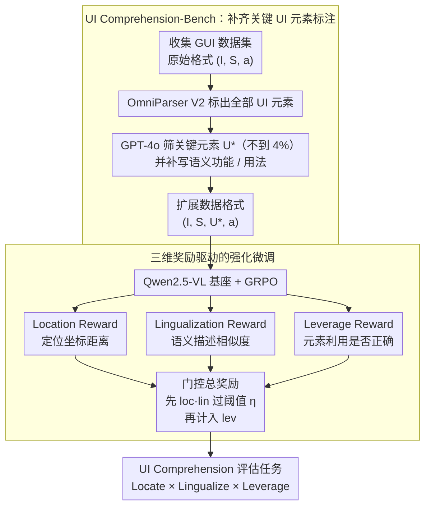

# What's Missing in Screen-to-Action? Towards a UI-in-the-Loop Paradigm for Multimodal GUI Reasoning

**会议**: ACL 2026 Findings  
**arXiv**: [2604.06995](https://arxiv.org/abs/2604.06995)  
**代码**: 无  
**领域**: 多模态VLM / LLM Agent  
**关键词**: GUI推理, UI理解, 强化学习微调, 多模态Agent, UI元素定位

## 一句话总结

本文提出 UILoop（UI-in-the-Loop）范式，将 GUI 推理从传统的"屏幕→动作"重构为"屏幕→UI 元素→动作"的循环过程，通过 UI 元素驱动的强化微调教模型显式地定位、理解和利用关键 UI 元素，在 GUI 推理任务上达到 SOTA 性能。

## 研究背景与动机

**领域现状**：GUI 自动化利用 AI 模拟用户与设备屏幕的交互。当前方法借助 GPT-4o、Qwen-VL 等先进 MLLM 解释用户指令并执行推理，但普遍遵循"Screen-to-Action"范式——从屏幕输入直接生成动作（如点击坐标、输入文本、滚动），是一个黑盒决策过程。

**现有痛点**：现有 GUI Agent 在 UI 元素理解上存在严重缺陷。实验表明先进模型在三个关键维度（UI 元素定位、语义功能描述、实际使用）上的平均得分低于 0.1。当提供正确的 UI 描述时，所有场景下推理性能大幅提升；提供错误描述时失败率显著增加。这说明 UI 元素理解对 GUI 推理至关重要，但被当前范式忽视。

**核心矛盾**：Screen-to-Action 范式将 UI 理解隐式嵌入动作预测中，缺乏对 UI 元素的显式关注。模型经常无法准确定位关键元素、无法理解元素语义和功能（如将滚动条误识别为可点击按钮），导致交互错误和任务失败。

**本文目标**：让模型显式学习 UI 元素的定位、语义功能和实际用法，建立从屏幕理解到动作执行之间的可解释桥梁。

**切入角度**：UI 元素是从屏幕到动作的关键中间表示。通过让模型先识别和理解关键 UI 元素，再基于这些元素做决策，可以同时提升推理准确性和可解释性。

**核心 idea**：将 GUI 推理重构为循环的"屏幕–UI 元素–动作"过程，通过强化学习让模型掌握 UI 元素的 Locate（定位）、Lingualize（语义理解）和 Leverage（利用）三种能力。

## 方法详解

### 整体框架

UILoop 包含两个主要阶段：(1) 数据构建阶段——设计合成管道构建 UI Comprehension-Bench（26K 样本），增强现有 GUI 数据集使其包含关键 UI 元素的定位、语义描述和使用信息；(2) 训练阶段——提出 UI 元素驱动的强化微调（RFT），通过三种专门的奖励函数训练模型掌握 UI 元素。在此基础上，UI Comprehension 评估任务把推理的中间环节也变成可打分的诊断指标。

### 关键设计

**1. UI Comprehension-Bench：给 GUI 推理补上"关键 UI 元素"这层缺失的标注**

现有 GUI 数据集只给屏幕和最终动作，模型学到的是从像素直接跳到坐标的黑盒映射，没有任何 UI 元素级别的中间监督。作者用一条合成管道把这层补回来：先收集 Android Control、OmniAct、GUI-Act 等数据集，用 Set-of-Marks 模型（OmniParser V2）标出屏幕上所有可识别的 UI 元素，再让 GPT-4o 从中筛出对完成当前指令真正有用的关键元素，并补写它们的语义功能描述和实际用法。数据格式因此从原始的 $(I, S, a)$ 扩展为 $(I, S, U^*, a)$，其中 $U^*$ 是关键 UI 元素及其描述。这件事的难度藏在数字里：26K 基准共标了 1,576,068 个 UI 元素，其中只有 57,332 个（不到 4%）是关键元素——在一屏几十上百个控件里挑出那几个有用的，本身就是个高难度定位任务。

**2. 三维奖励驱动的强化微调：把"定位—理解—利用"拆成三个能逐级解锁的奖励**

传统动作预测损失只盯最终动作对不对，无法显式优化 UI 理解。UILoop 在 GRPO 上设计了三个奖励分别对应三种能力：Location Reward 用预测坐标与 GT 的欧氏距离归一化算定位准不准；Lingualization Reward 算预测语义描述与 GT 的文本相似度；Leverage Reward 按动作类型评估元素是否被正确使用（点击类用坐标匹配、输入/滚动类用文本匹配）。三者通过一个带门控的总奖励组合：

$$r = r^{format} + \alpha_1 \cdot r^{loc} \cdot r^{lin} + \alpha_2 \cdot \mathbb{1}_U(r^{loc} \cdot r^{lin}) \cdot r^{lev}$$

关键在指示函数 $\mathbb{1}_U$：只有当定位与理解的乘积 $r^{loc} \cdot r^{lin}$ 越过阈值 $\eta$，利用奖励 $r^{lev}$ 才被计入。这就强制模型先把"找到元素"和"看懂元素"学扎实，再去优化"用对元素"，复刻了人类"先看见→再理解→最后操作"的顺序，避免模型在还没认准元素时就靠猜动作去刷利用奖励。

**3. UI Comprehension 评估任务：让 GUI 推理的中间环节也能被打分**

现有评估只看最终动作准确率，是个黑盒——模型失败了也不知道是定位错、理解错还是利用错。作者把中间过程也变成可测的：Locate 衡量定位准确性、Lingualize 衡量语义功能理解、Leverage 衡量利用准确性，三者相乘得到 Overall $=$ Locate $\times$ Lingualize $\times$ Leverage。用相乘而非相加，意味着任一环节崩了整体就崩，正好对应"三个能力缺一不可"的直觉，也让诊断能精确指到模型在哪一步掉链子。

### 训练策略

使用 Qwen2.5-VL-3B 和 7B 作为基础模型，在 UI Comprehension-Bench 训练集上用 GRPO 进行 RFT，5 个 rollouts，训练 3-6 个 epoch 直到奖励收敛。$\alpha_1 = 4$，$\alpha_2 = 5$，UI 指示器阈值 $\eta = 0.5$，在 8 张 A100 80G GPU 上训练。

## 实验关键数据

### 主实验

| 方法 | ScreenSpot-Pro GR | AndroidControl-High SR |
|------|------------------|----------------------|
| GPT-4o (zero-shot) | 0.8% | 21.2% |
| Qwen2.5-VL-7B (zero-shot) | 17.4% | 47.1% |
| SeeClick | 1.1% | 59.1% |
| OS-Atlas-7B | 18.9% | 29.8% |
| GUI-Owl-7B | 21.3% | 37.5% |
| Qwen2.5-VL-7B* (SFT) | 18.5% | - |
| **UILoop-3B** | - | **63.3%** |
| **UILoop-7B** | **23.6%** | **67.8%** |

| UI Comprehension 指标 | Locate | Lingualize | Leverage | Overall |
|---------------------|--------|-----------|---------|---------|
| GPT-4o | 低 | 低 | 低 | <0.1 |
| Qwen2.5-VL-7B | 低 | 低 | 低 | <0.1 |
| **UILoop-7B** | **显著提升** | **显著提升** | **显著提升** | **SOTA** |

### 消融实验

| 配置 | AndroidControl-High SR | 说明 |
|------|----------------------|------|
| UILoop (Full) | 67.8% | 完整模型 |
| w/o Location Reward | 下降 | 定位不准导致后续步骤出错 |
| w/o Lingualization Reward | 下降 | 语义理解缺失导致误操作 |
| w/o Leverage Reward | 下降 | 元素利用能力退化 |
| 提供正确UI描述 | 大幅提升 | 验证UI理解的重要性 |
| 提供错误UI描述 | 大幅下降 | 验证UI理解的关键性 |

### 关键发现

- **UI 元素理解是 GUI 推理的关键瓶颈**：所有模型（包括 GPT-4o）在 UI 理解三维度上的得分极低（<0.1），但提供正确 UI 信息后推理性能大幅提升，证明"Screen-to-Action"范式的根本缺陷
- **UILoop 在 3B 和 7B 规模上均超越了更大的零样本模型和专门的 GUI Agent**
- **强化学习比监督微调更适合学习 UI 理解**：GRPO 的分组相对优势估计能更好地处理 GUI 推理中的复杂序列决策
- **关键 UI 元素仅占屏幕全部元素的不到 4%**：这说明在大量无关 UI 元素中识别关键元素本身就是一个极具挑战性的任务

## 亮点与洞察

- **范式转变有说服力**："Screen→UI→Action"比"Screen→Action"更符合人类使用界面的认知过程，人类也是先识别关键按钮/输入框，理解其功能后再操作
- **三维奖励的层次化设计巧妙**：$1_U(r^{loc} \cdot r^{lin}) \cdot r^{lev}$ 确保模型必须先学好定位和理解才能开始优化利用能力，模拟了人类"先看→再理解→最后操作"的学习顺序
- **UI Comprehension-Bench 作为基础设施有长期价值**：26K 样本、包含完整 GT UI 元素和可解释推理链，可支持未来 GUI Agent 的系统化评估和改进
- 该思路可迁移到其他领域：任何涉及复杂界面交互的任务（如 IDE 自动化、医疗系统操作）都可受益于显式的中间元素理解

## 局限与展望

- 依赖 GPT-4o 和 OmniParser V2 构建 GT UI 元素，数据质量受限于这些工具的能力
- 仅在 3B 和 7B 规模模型上验证，更大规模模型是否仍需要显式 UI 理解有待验证
- 当前框架处理静态屏幕截图，未考虑动态 UI（动画、视频流）场景
- 评估主要在 Android 和桌面应用上，Web 交互的复杂性（如动态加载、iframe 嵌套）可能带来新挑战

## 相关工作与启发

- **vs Screen-to-Action 方法 (SeeClick, OS-Atlas)**：这些方法专注于改进定位但忽略语义功能和实际用法，UILoop 的三维 UI 理解更全面
- **vs GUI-R1, UI-R1 等 RL 方法**：它们将 RL 用于"Screen-to-Action"范式的动作预测，UILoop 将 RL 用于中间的 UI 理解阶段，解决了更根本的问题
- **vs UI-Vision, ScreenSpot-Pro**：这些是评估基准但仅关注定位，UILoop 的 UI Comprehension-Bench 覆盖定位+语义+利用三个维度

## 评分

- 新颖性: ⭐⭐⭐⭐ 从"Screen→Action"到"Screen→UI→Action"的范式重构有创见，但基本思路较直觉
- 实验充分度: ⭐⭐⭐⭐ 多基准、消融完整，但缺少更多规模和领域的验证
- 写作质量: ⭐⭐⭐⭐ 动机清晰、图表丰富，形式化定义规范
- 价值: ⭐⭐⭐⭐ 26K基准和三维评估体系对GUI Agent社区有实际推动作用

<!-- RELATED:START -->

## 相关论文

- [\[ACL 2025\] Aria-UI: Visual Grounding for GUI Instructions](../../ACL2025/multimodal_vlm/aria-ui_visual_grounding_for_gui_instructions.md)
- [\[AAAI 2026\] MCMoE: Completing Missing Modalities with Mixture of Experts for Incomplete Multimodal Action Quality Assessment](../../AAAI2026/multimodal_vlm/mcmoe_completing_missing_modalities_with_mixture_of_experts_for_incomplete_multi.md)
- [\[ACL 2026\] Beyond Screenshots: Evaluating VLMs' Understanding of UI Animations](beyond_screenshots_evaluating_vlms_understanding_of_ui_animations.md)
- [\[ACL 2026\] Measuring What Matters Beyond Text: Evaluating Multimodal Summaries by Quality, Alignment, and Diversity (MM-Eval)](measuring_what_matters_beyond_text_evaluating_multimodal_summaries_by_quality_al.md)
- [\[ICML 2026\] Calibrated Multimodal Representation Learning with Missing Modalities](../../ICML2026/multimodal_vlm/calibrated_multimodal_representation_learning_with_missing_modalities.md)

<!-- RELATED:END -->
