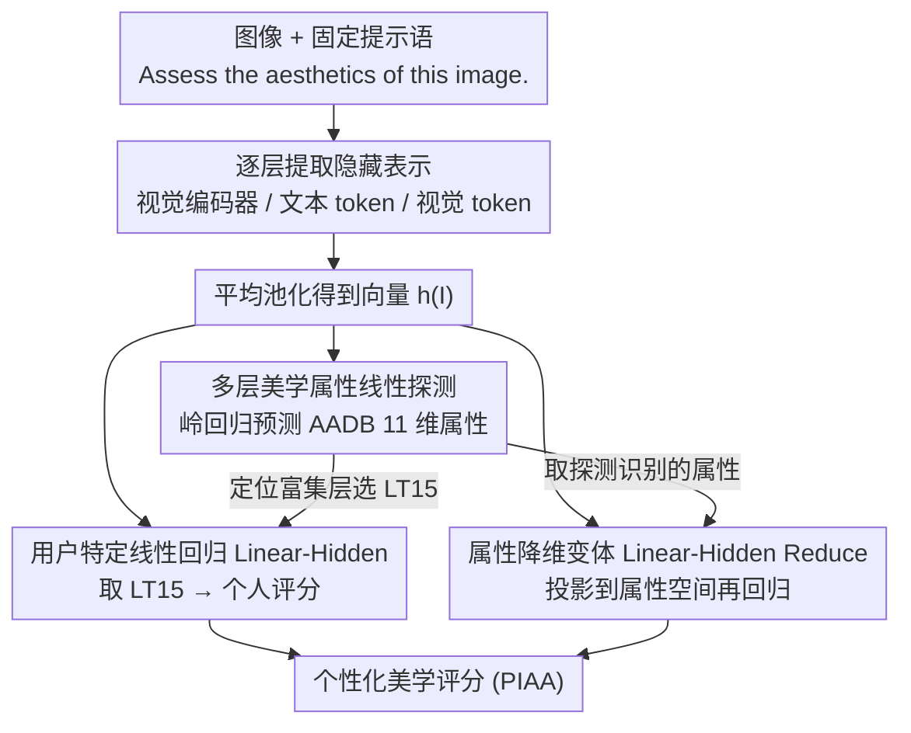

# What Do Vision-Language Models Encode for Personalized Image Aesthetics Assessment?

**会议**: ACL 2026 Findings  
**arXiv**: [2604.11374](https://arxiv.org/abs/2604.11374)  
**代码**: [https://github.com/ynklab/vlm-latent-piaa](https://github.com/ynklab/vlm-latent-piaa)  
**领域**: 多模态VLM  
**关键词**: 个性化美学评估, 视觉语言模型, 线性探测, 隐藏表示, 图像美学

## 一句话总结

本文通过线性探测发现 VLM 的隐藏表示中编码了丰富的多层次美学属性信息（光照、色彩、构图等），并传播到语言解码器层，基于此提出用简单线性回归实现无需微调的个性化图像美学评估（PIAA），效果显著优于 few-shot 和 LoRA 微调基线。

## 研究背景与动机

**领域现状**：个性化图像美学评估（PIAA）旨在预测特定用户对图像的美学评分，反映个体审美偏好。现有方法通常需要在大规模通用美学评估数据集上预训练，再针对每个用户进行适配，计算成本高且跨域迁移能力存疑。

**现有痛点**：现有 PIAA 方法需要多阶段训练流程（通用美学预训练 + 用户适配），且严重依赖领域特定的训练数据。VLM 在美学评估中的应用仅限于人口统计群体级别，尚未实现个体级别的个性化。此外，尚不清楚 VLM 的内部表示是否编码了个性化所需的多层次、连续的美学属性。

**核心矛盾**：VLM 通过大规模预训练获得了丰富的视觉语义理解能力，但其隐藏表示中的美学信息是否足够细粒度以支持个性化评估，这一问题未被验证。

**本文目标**：(1) 通过线性探测验证 VLM 隐藏表示中编码了哪些美学属性；(2) 利用这些表示实现轻量级、无需微调的个体级别 PIAA。

**切入角度**：借鉴表示分析领域的线性探测方法论，逐层分析 VLM 的视觉编码器和语言解码器，揭示美学信息的编码位置和传播模式。

**核心 idea**：VLM 的隐藏表示中天然编码了多维度美学属性信息，简单的线性回归就能将这些表示映射为个性化美学评分，无需任何模型微调。

## 方法详解

### 整体框架

方法分为两个阶段：首先通过线性探测分析 VLM 各层表示中的美学属性编码情况（探测阶段），然后基于发现，训练用户特定的线性模型从 VLM 隐藏表示预测个性化美学评分（PIAA 阶段）。输入为图像 + 固定提示语（"Assess the aesthetics of this image."），提取各层隐藏表示后通过平均池化得到单一向量，作为共享前端供三个下游线性头使用。

### 关键设计

**1. 多层美学属性线性探测：先验证 VLM 的隐藏层到底有没有、在哪一层有细粒度美学信息**

先前工作只证明过 CLIP 能编码一个整体美学评分，但个性化需要的是多维度、细粒度的美学属性，这块一直没人系统验证。作者对 VLM 每一层的隐藏表示 $\mathbf{h}(I)$ 训练岭回归，去预测 AADB 数据集的 11 维美学属性向量（物体、光照、色彩和谐、景深、构图等），并用 Spearman 相关系数衡量探测质量。为了看清信息藏在哪儿，他们分开探测三种表示：视觉编码器输出 $\mathbf{V}_i$、语言解码器里的文本 token $\mathbf{LT}_i$、语言解码器里的视觉 token $\mathbf{LV}_i$。这样既能确认美学属性确实被编码，又能定位它在视觉编码器和语言解码器之间如何分布与传播。

**2. 用户特定线性回归（Linear-Hidden）：用一个轻量线性头把隐藏表示直接映射成个人评分**

探测发现语言解码器中间层稳定地富集美学信息，于是个性化就不必再去微调整个 VLM。对每个用户 $u$，只训练一个用户专属的岭回归 $M_u$，让 $M_u \mathbf{h}(I) \approx s_{I,u}$，输入取语言解码器第 15 层文本 token（$\mathbf{LT}_{15}$）的平均池化向量，每个用户仅用 100 张标注图像就能训好。相比需要"通用美学预训练 + 用户适配"两阶段、还依赖领域数据的传统 PIAA，这个线性头既轻量又可解释，把个性化的成本压到了极低。

**3. 属性降维变体（Linear-Hidden Reduce）：用降维当探针，反证探测到的属性是不是个性化的充分信息**

第 1 点确认了哪些美学属性被编码，但这些属性是否"够用"来做个性化还需要反证。作者先训一个通用回归器 $M$ 把 VLM 表示投影到 AADB 的美学属性空间（且刻意排除整体评分），再在这个低维属性空间上训用户回归器 $M'_u$。逻辑很干净：如果降到只剩这些属性后个性化性能不掉，说明探测识别的美学属性就足以支撑个性化；如果掉了，说明 VLM 表示里还藏着探测没捕捉到的额外有用信息。后面实验也正是靠它区分了照片域（降维几乎不掉）和艺术品域（降维明显掉）。

### 损失函数 / 训练策略

使用岭回归（L2 正则化的线性回归），无需梯度优化，训练极其轻量。每个用户独立训练一个回归模型，支持集 100 张图像，测试集 50 张图像。

## 实验关键数据

### 主实验

| 方法 | PARA (ρ) | PARA (R²) | LAPIS (ρ) | LAPIS (R²) |
|--------|------|------|----------|------|
| Raw Text (Qwen3-VL 4B) | 0.570 | -1.277 | 0.176 | -0.937 |
| Few-shot (10-shot) | 0.197 | -1.576 | - | - |
| LoRA (100-shot) | 0.578 | -1.751 | - | - |
| Linear-Hidden (Qwen3-VL 4B) | 0.611 | 0.362 | 0.401 | 0.138 |
| Linear-Hidden Reduce | 0.597 | 0.382 | 0.315 | 0.061 |
| PIAA-ICI (域内) | 0.590 | 0.303 | - | - |
| PIAA-ICI (跨域迁移) | - | - | 0.277 | -0.120 |

### 消融实验

| 配置 | PARA (ρ) | 说明 |
|------|---------|------|
| Linear-Hidden (完整表示) | 0.611 | 使用完整 VLM 隐藏表示 |
| Linear-Hidden (GIAA) | 0.603 | 用通用美学评分替代个性化标注 |
| Linear-Hidden (Reduce) | 0.597 | 仅用探测识别的美学属性 |

### 关键发现

- **VLM 编码多维度美学属性**：超过半数的美学属性在 VLM 隐藏表示中达到中等以上正相关（Spearman > 0.4），Object（0.722）、VividColor（0.696）、Overall Score（0.727）等属性编码最强。
- **语言解码器层承载美学信息**：语言解码器的文本 token 表示在大多数属性上达到与视觉编码器相当甚至更好的探测性能，纯视觉模型 DINOv3 在几乎所有属性上表现最差。
- **架构差异影响信息传播**：Gemma 3 的美学信息在语言解码器早中层从视觉 token 转移到文本 token；Qwen3-VL 由于 DeepStack 架构，两者在各层保持一致。
- **照片域 vs 艺术品域**：在照片数据集 PARA 上，Reduce 变体接近完整模型性能（0.597 vs 0.611），但在艺术品数据集 LAPIS 上差距更大（0.315 vs 0.401），说明艺术品评估需要基于照片探测未捕获的额外信息。
- **简单线性优于微调**：Linear-Hidden 显著优于 Few-shot、LoRA、Raw Text 等基于文本输出的方法，甚至超越了需要额外预训练的领域专用 PIAA-ICI 模型。

## 亮点与洞察

- **"读隐藏层"比"读文本输出"更有效**：VLM 生成的文本评分（Raw Text）远不如直接从隐藏表示做线性回归，说明隐藏表示中包含大量未被文本生成过程保留的美学信息。这一发现对其他主观评估任务也有启发。
- **极其轻量的个性化方案**：每个用户仅需训练一个岭回归模型（100 张图像），无需微调 VLM 参数，实现了高效的个体级别个性化。
- **跨域迁移的洞察**：在照片上探测到的美学属性能较好地迁移到照片域 PIAA，但在艺术品域需要额外信息，这为未来跨域美学评估提供了方向。

## 局限与展望

- 仅测试了两个 VLM 家族（Qwen3-VL、Gemma 3），未涉及更大规模模型或其他架构。
- 线性探测仅能捕获线性可分的信息，VLM 中可能存在非线性编码的美学属性。
- 个性化仅基于图像表示，未考虑用户属性（如年龄、性别、文化背景等），可能限制了个性化深度。
- AADB 的美学属性维度有限（11 维），可能遗漏了对某些用户重要的审美维度。

## 相关工作与启发

- **vs PIAA-ICI**: PIAA-ICI 需要在大规模 PIAA 数据上预训练 + 用户微调的两阶段流程，计算成本高且跨域迁移差。Linear-Hidden 无需预训练，在域内匹敌甚至超越 PIAA-ICI，跨域显著更优。
- **vs Hentschel et al. (2022)**: 先前工作仅在 CLIP 视觉编码器上探测整体美学评分，本文扩展到多属性、多层、视觉+语言解码器的系统分析，且推进到个性化应用。

## 评分

- 新颖性: ⭐⭐⭐⭐ 首次系统分析 VLM 隐藏层的美学属性编码并用于个性化美学评估
- 实验充分度: ⭐⭐⭐⭐ 多模型多数据集对比，含丰富的变体和消融分析
- 写作质量: ⭐⭐⭐⭐⭐ 逻辑链从探测分析到应用设计非常清晰
- 价值: ⭐⭐⭐⭐ 为利用预训练模型隐藏表示进行主观评估提供了新范式

<!-- RELATED:START -->

## 相关论文

- [\[CVPR 2026\] What Do Visual Tokens Really Encode? Uncovering Sparsity and Redundancy in Multimodal Large Language Models](../../CVPR2026/multimodal_vlm/what_do_visual_tokens_really_encode_uncovering_sparsity_and_redundancy_in_multim.md)
- [\[CVPR 2026\] Probabilistic Prompt Adaptation for Unified Image Aesthetics and Quality Assessment](../../CVPR2026/multimodal_vlm/probabilistic_prompt_adaptation_for_unified_image_aesthetics_and_quality_assessm.md)
- [\[ICLR 2026\] VisJudge-Bench: Aesthetics and Quality Assessment of Visualizations](../../ICLR2026/multimodal_vlm/visjudge-bench_aesthetics_and_quality_assessment_of_visualizations.md)
- [\[CVPR 2026\] Do Vision Language Models Need to Process Image Tokens?](../../CVPR2026/multimodal_vlm/do_vision_language_models_need_to_process_image_tokens.md)
- [\[CVPR 2026\] R4-CGQA: Retrieval-based Vision Language Models for Computer Graphics Image Quality Assessment](../../CVPR2026/multimodal_vlm/r4-cgqa_retrieval-based_vision_language_models_for_computer_graphics_image_quali.md)

<!-- RELATED:END -->
