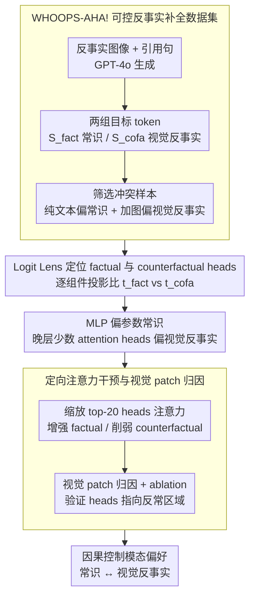

# When Seeing Overrides Knowing: Disentangling Knowledge Conflicts in Vision-Language Models

**会议**: ACL2026  
**arXiv**: [2507.13868](https://arxiv.org/abs/2507.13868)  
**代码**: https://github.com/francescortu/Seeing-Knowing  
**领域**: multimodal_vlm  
**关键词**: 视觉语言模型、知识冲突、机制解释、注意力头、视觉归因

## 一句话总结
这篇论文构造 WHOOPS-AHA! 让 VLM 的常识知识与图像反事实证据正面冲突，并发现少数晚层注意力头能因果控制模型依赖内部知识还是视觉输入。

## 研究背景与动机
**领域现状**：VLM 同时依赖预训练得到的参数知识和当前图像输入。正常情况下，这两类信息互补：参数知识提供世界常识，视觉输入提供场景事实。但当图像包含反常或反事实元素时，两者会产生冲突，例如常识认为狼对月亮嚎叫，图像却显示狼对太阳嚎叫。

**现有痛点**：很多 VLM 幻觉研究只观察最终答案是否错，或用外部归因方法解释图像区域影响，却没有深入回答模型内部如何在“知道的常识”和“看到的图像”之间做选择。若模型只是被视觉表面信号覆盖知识，或者在错误场景里过度相信参数常识，都会影响多模态系统可靠性。

**核心矛盾**：模型需要在视觉证据和内部知识之间动态校准。完全相信图像会让反事实或误导图像覆盖常识，完全相信参数知识又会忽略真实视觉输入。关键问题是，这种模态冲突是否由可定位、可干预的内部机制调节。

**本文目标**：论文要构造可控数据集来诱发知识冲突，定位 VLM 中支持 factual token 和 counterfactual token 的组件，验证这些组件是否具有因果作用，并检查它们能否作为视觉证据定位工具。

**切入角度**：作者使用 token-level completion 任务，把每个样本设计成一组明确的 factual continuations 和 counterfactual visual continuations。这样可以用 Logit Lens 直接比较内部组件对两个候选 token 的 logit 贡献，而不是在开放生成中模糊判断模型到底偏向哪种信息。

**核心 idea**：用反事实图像制造“看到的”和“知道的”冲突，再通过 logit attribution 找到晚层 factual/counterfactual attention heads，并对这些 heads 的图像/文本注意力做定向缩放，从因果上控制 VLM 的模态偏好。

## 方法详解

### 整体框架
论文分四步展开。第一步构建 WHOOPS-AHA! 数据集：基于 WHOOPS! 中 500 张视觉上不合理、语义丰富的图像，用 GPT-4o 为每张图生成一个能触发常识补全的句子，并提供两组 token：$S_{fact}$ 表示符合常识的补全，$S_{cofa}$ 表示符合反事实图像的补全。

第二步筛选真正能诱发冲突的样本。对每个模型，作者先在 text-only prompt 下选出 $S_{fact}$ 中概率最高的 factual token，再在 multimodal input 下选出 $S_{cofa}$ 中概率最高的 counterfactual token。只有文本模式偏向常识、加图后偏向视觉反事实的样本才保留，用于后续机制分析。

第三步用 Logit Lens 分析 LLaVA-NeXT-7B 和 Gemma3-12B 的 MLP、attention block 以及单个 attention head 对 $t_{fact}$ 和 $t_{cofa}$ 的贡献。作者发现 MLP 更偏向内部 factual knowledge，而 attention 尤其是晚层少数 heads 更偏向视觉反事实信号。

第四步做因果干预和视觉归因。作者选出最支持 factual / counterfactual 的 top-20 heads，对最终 token 位置的注意力权重做乘性缩放：增强 factual heads 对文本 token 的注意，或削弱 counterfactual heads 对图像 token 的注意，反向也可以。随后用注意力和梯度两种方式找出驱动 counterfactual 输出的图像 patch，并通过 patch ablation 验证这些区域是否真的导致视觉覆盖常识。

### 关键设计

**1. WHOOPS-AHA! 可控反事实补全数据集：把开放式多模态冲突压成 token 级可验证的测试床**

机制解释最怕开放问答——你根本看不清模型偏向的到底是常识还是图像。为此每个样本都被设计成一个反事实图像、一句引用该图的句子，再配两组明确的目标 token：符合常识的补全集 $S_{fact}$ 和符合视觉反事实的补全集 $S_{cofa}$。比如句子 “The wolf is howling at the” 在无图时常识会补 “moon”，但配上一张狼对太阳嚎叫的图后，视觉证据会把模型推向 “sun”。这种设计的好处是把复杂的多模态问答压缩成一对可控候选 token，作者就能用 Logit Lens 逐 token 比较 $t_{fact}$ 与 $t_{cofa}$ 的 logit，对中间组件做干净的归因，而不必在自由生成里模糊地猜模型信了哪一边。

**2. Logit Lens 定位 factual 与 counterfactual heads：在前向传播里看冲突究竟在哪一层、被谁解决**

只看最终输出无法回答"模型内部如何在知道与看到之间做选择"。作者对输入最后一个 token 的中间 hidden states 做 vocabulary projection，比较它对 $t_{fact}$ 和 $t_{cofa}$ 的 logit：在 block 级别统计 factual prevalence，在 head 级别统计 factual accuracy。一个 head 若经常把 factual token 的 logit 顶得更高，就归为 factual head；反之则是 counterfactual head。关键结论是冲突解决并非全模型平均分担，而是集中在上层少数 heads——MLP 整体更偏向参数常识，attention 尤其是晚层个别 heads 更偏向视觉反事实信号。这把一个看似弥散的"模型为何被图像带偏"问题，收敛成一小撮可定位、可下手的靶点。

**3. 定向注意力干预与视觉 patch 归因：从相关性升级到因果，并验证这些 head 真的指向反常区域**

光定位还不够，因为高排名的 heads 可能只是伴随输出变化的相关项。作者选出最支持 factual / counterfactual 的 top-20 heads，在最终 token 位置改写注意力矩阵的最后一行：对 counterfactual heads 按 $(1-\lambda)$ 缩小它们对图像 token 的注意，或对 factual heads 按 $(1+\lambda)$ 放大它们对文本 token 的注意，反向亦可。如果这组 heads 真有因果作用，定向干预就能把模型从视觉反事实推回常识、或反过来更相信图像——实验也确实如此。

随后作者再追问 counterfactual heads 到底在看图像的哪里：把它们的注意力、梯度归因和随机 heads 三种方式选出的高分 patch 拿去做 ablation。结果是这些 heads 关注的 patch 往往正是反常物体或属性所在区域，遮掉后 factual accuracy 回升，说明它们不只是改变了输出 token，还充当了指向冲突来源的视觉指针。

### 损失函数 / 训练策略
本文不训练新模型，主要是数据构建、前向分析和推理时干预。模型包括 LLaVA-NeXT-7B（32 层、每层 32 个 heads）和 Gemma3-12B（48 层、每层 16 个 heads）。干预强度 $\lambda$ 被限制在 $[-3,3]$，因为附录显示 $|\lambda|>3$ 后生成分布明显偏离，$|\lambda|>10$ 时常出现不合语法或重复输出。

## 实验关键数据

### 主实验
首先，数据验证显示文本补全和图像补全质量较高。随后，在冲突诱发实验中，加入图像会显著把模型从常识 token 推向视觉反事实 token。机制分析显示 counterfactual heads 更强地关注图像 token，并且少数 heads 足以改变模型行为。

| 实验项 | LLaVA-NeXT | Gemma3 | 结论 |
|--------|------|------|------|
| 保留冲突样本数 | 436 | 432 | 多数 WHOOPS-AHA! 样本能形成可分析冲突 |
| 文本例子 factual token | “moon” 概率 78% | “moon” 概率 100% | 无图时模型依赖常识 |
| 加图后 counterfactual token | “sun” 概率 26%，moon 降至 17% | “sun” 概率 44%，moon 降至 0.02% | 视觉输入覆盖内部知识 |
| 加图后 factual accuracy | 27% | 24% | 反事实图像系统性改变预测 |
| counterfactual heads 图像注意力 | 61% | 52% | 远高于模型平均 22%，说明视觉信号直接进入最终 token |
| factual heads 图像注意力 | 29% | 25% | 更少关注图像，更偏文本/参数知识 |
| 正向干预峰值 factual accuracy | 74% | 83% | 增强 factual heads / 抑制 counterfactual heads 可把输出推回常识 |

### 消融实验
论文的消融主要验证 head 选择、干预强度、控制任务和视觉归因质量。随机 heads 干预没有明显效果，POPE 控制实验证明 counterfactual heads 不是普通视觉理解 heads，Visual CounterFact 说明机制具有一定跨数据集稳定性。

| 配置 | 关键指标 | 说明 |
|------|---------|------|
| top-20 heads 干预 | factual accuracy 达到峰值 | 20 个 factual/counterfactual heads 在效果和稳定性之间最好 |
| 100 个随机 heads 干预 | factual accuracy 基本不变 | 输出变化来自特定 heads，而非任意注意力扰动 |
| POPE no image | 两模型准确率均 0.50 | POPE 是真实视觉依赖任务 |
| POPE suppress counterfactual heads | Gemma3 0.84→0.84，LLaVA 0.87→0.87 | 这些 heads 不负责一般视觉识别，而是冲突条件下被调用 |
| Visual CounterFact head overlap | counterfactual heads 重合 13/20 与 14/20，factual heads 重合 10/20 | 冲突解决机制不是 WHOOPS-AHA! 特有 |
| 视觉归因 Gemma3 | counterfactual heads ratio 4.41，gradient 1.74，random 0.92 | 注意力 heads 更精准聚焦反事实对象 |
| 视觉归因 LLaVA-NeXT | counterfactual heads ratio 2.05，gradient 1.88，random 1.09 | 注意力 heads 显著优于随机，也优于梯度基线 |

### 关键发现
- VLM 的模态冲突并不是全模型平均处理的。上层少数 attention heads 是核心调节器，attention 更支持视觉反事实，MLP 更支持参数常识。
- 干预具有方向性。增强 factual heads 并削弱 counterfactual heads 能让模型回到内部知识；反向操作则让模型更相信图像。这说明这些 heads 不是被动相关，而是有因果作用。
- counterfactual heads 还具有可解释的视觉定位能力。它们关注的 patch 往往就是反常物体或属性所在区域，并且 patch ablation 会让 factual accuracy 上升。

## 亮点与洞察
- 论文把 VLM 幻觉和机制解释连接得很漂亮：不是只说模型错了，而是指出视觉覆盖常识时由哪些 heads 推动，且可以被干预。
- WHOOPS-AHA! 的 token-level 设计很适合 mechanistic interpretability。它把复杂开放式多模态问答压缩成一组可控候选 token，让 logit-level 分析变得干净。
- counterfactual heads 同时是控制旋钮和视觉指针，这一点很有启发。未来可以把这类 heads 用作 VLM 可靠性监控：当模型答案依赖冲突 heads 时，触发额外校验或解释。

## 局限与展望
- Logit Lens 是近似诊断工具，从非最终 residual state 投影到词表会有失真。因此 head 排名和 factual/counterfactual 贡献不应被理解成精确解码。
- 实验主要聚焦 late-fusion、LLaVA 风格架构。早融合或中融合 VLM 的视觉信息注入方式不同，是否也存在同样的上层冲突 heads 还需要验证。
- 研究使用代表性 factual/counterfactual token 便于控制，但真实自由生成中可能涉及多个 token、长句和复杂语义。未来应扩展到完整 caption、问答解释和多步视觉推理。

## 相关工作与启发
- **vs 文本 LLM 知识冲突分析**: Ortu 等工作研究文本上下文和参数知识冲突；本文把这个问题推进到视觉输入与参数知识冲突，说明类似 competition 机制也存在于多模态模型中。
- **vs 梯度视觉归因**: 梯度方法能找到有影响的 patch，但在本文的反事实对象定位上通常不如 counterfactual heads 精准。机制上定位出的 heads 可以作为更语义化的归因通道。
- **vs VLM 幻觉检测**: 传统幻觉工作多从输出和数据层面诊断；本文提供了一种内部电路视角，说明某些幻觉或视觉覆盖现象可以被小规模 attention head 干预调节。

## 评分
- 新颖性: ⭐⭐⭐⭐⭐ 用可控反事实数据把 VLM 知识冲突定位到少数注意力头，并证明可因果干预，很有新意。
- 实验充分度: ⭐⭐⭐⭐☆ 主实验、随机控制、POPE 控制、Visual CounterFact 迁移和视觉归因都较完整，但模型架构覆盖仍有限。
- 写作质量: ⭐⭐⭐⭐☆ 论文叙事从数据到机制再到因果干预很顺，附录补充扎实。
- 价值: ⭐⭐⭐⭐⭐ 对 VLM 可靠性、机制解释和可控生成都有直接启发，尤其适合构建冲突感知的多模态监控工具。

<!-- RELATED:START -->

## 相关论文

- [\[ACL 2025\] Insight Over Sight: Exploring the Vision-Knowledge Conflicts in Multimodal LLMs](../../ACL2025/multimodal_vlm/conflictvis_vision_knowledge_conflict.md)
- [\[AAAI 2026\] Seeing Justice Clearly: Handwritten Legal Document Translation with OCR and Vision-Language Models](../../AAAI2026/multimodal_vlm/seeing_justice_clearly_handwritten_legal_document_translation_with_ocr_and_visio.md)
- [\[ACL 2026\] WikiSeeker: Rethinking the Role of Vision-Language Models in Knowledge-Based Visual Question Answering](wikiseeker_rethinking_the_role_of_vision-language_models_in_knowledge-based_visu.md)
- [\[CVPR 2026\] When to Think and When to Look: Uncertainty-Guided Lookback](../../CVPR2026/multimodal_vlm/when_to_think_and_when_to_look_uncertainty-guided_lookback.md)
- [\[ACL 2026\] VULCA-Bench: A Multicultural Vision-Language Benchmark for Evaluating Cultural Understanding](vulca-bench_a_multicultural_vision-language_benchmark_for_evaluating_cultural_un.md)

<!-- RELATED:END -->
