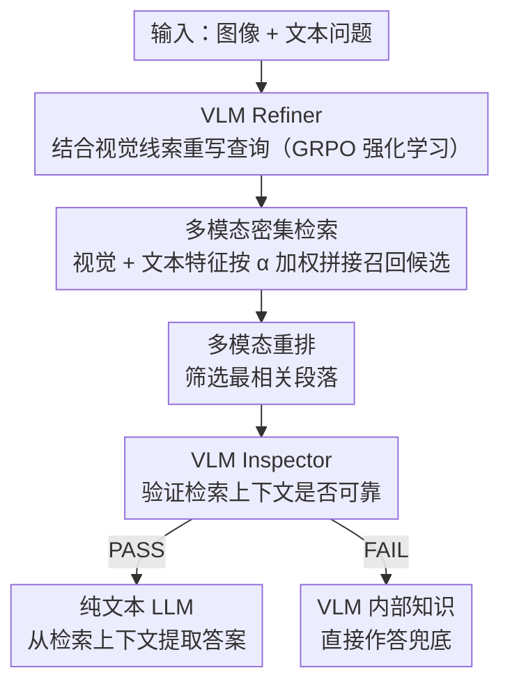

# WikiSeeker: Rethinking the Role of Vision-Language Models in Knowledge-Based Visual Question Answering

**会议**: ACL 2026 Findings  
**arXiv**: [2604.05818](https://arxiv.org/abs/2604.05818)  
**代码**: [https://github.com/zhuyjan/WikiSeeker](https://github.com/zhuyjan/WikiSeeker)  
**领域**: 多模态VLM  
**关键词**: 知识型VQA, 多模态RAG, 查询重写, 强化学习, 检索增强生成

## 一句话总结

提出 WikiSeeker，重新定义 VLM 在多模态 RAG 中的角色——从单纯的答案生成器转变为两个专门化智能体（Refiner 用 RL 训练重写查询、Inspector 验证检索上下文是否可靠），在 EVQA、InfoSeek、M2KR 三个基准上实现 SOTA。

## 研究背景与动机

**领域现状**：多模态检索增强生成（RAG）是知识型视觉问答（KB-VQA）的主流范式——检索外部知识库中的相关文档，与输入查询拼接后送入生成模型产出答案。

**现有痛点**：(1) **纯视觉检索**：大多数方法仅使用查询图片作为检索键，忽略了用户文本查询中的语义信息，当视觉内容模糊时检索效果差；(2) **VLM 角色错位**：VLM 通常仅被用作最终的答案生成器，但实验表明 VLM 在从检索上下文中提取答案方面反而不如纯文本 LLM——图像 token 在答案提取阶段往往是噪声而非有用信号。

**核心矛盾**：VLM 的视觉理解能力在检索和验证阶段有价值（理解图中是什么实体、判断检索结果是否匹配），但在答案提取阶段反而是负担（视觉 token 干扰文本阅读理解）。

**本文目标**：重新设计 VLM 在多模态 RAG 中的角色定位，充分利用 VLM 的视觉理解能力来改善检索和验证，而将答案提取交给更擅长的纯文本 LLM。

**切入角度**：作者通过实验发现，当检索上下文中正确信息占比增加时，纯文本 LLM 的 VQA 性能反而超过带图像输入的 VLM（如 Ratio=1.0 时 Qwen 93.45% vs QwenVL(I+T) 88.46%）。

**核心 idea**：将 VLM 重定位为 Refiner（用视觉线索重写查询提升检索）和 Inspector（验证检索上下文可靠性并路由决策），答案生成交给纯文本 LLM。

## 方法详解

### 整体框架

WikiSeeker 包含三个阶段：(1) **检索**：VLM Refiner 扩展原始问题，多模态检索器（视觉+文本嵌入拼接）从知识库中检索候选文档；(2) **重排**：多模态重排器筛选最相关段落；(3) **生成**：VLM Inspector 评估检索上下文是否充分——通过则路由到纯文本 LLM 生成答案，不通过则 VLM 用内部知识直接回答。

### 关键设计

**1. VLM 作为 Refiner：用视觉线索把简短查询重写成好检索的查询，并用 RL 自学策略**

KB-VQA 里用户查询往往又短又抽象，直接拿去检索噪声很大，而图片里其实藏着关键的实体线索。作者用 Qwen2.5-VL-3B-Instruct 当 Refiner，让它结合图像把原始问题扩写成更有信息量的检索查询：模型先在 `<think>` 标签里生成 CoT 推理，再在 `<answer>` 标签里给出重写结果。难点在于没有现成的"好查询"标注，于是作者用 GRPO 做强化学习，奖励由两部分拼起来：格式奖励检查输出是否符合 XML 结构，检索奖励则把重写查询真的拿去检索，按正确实体的命中排名给离散分（top-5 给 +4，top-200 内逐档递减，完全没命中扣 -2.5）。这样 Refiner 就以"检索是否命中"为信号自己摸索出最优重写策略，绕开了昂贵的人工标注查询对。

**2. 多模态密集检索（加权拼接策略）：让视觉和文本特征按可调比例共同决定检索**

纯视觉检索只拿查询图片当键，丢掉了用户文本里的语义，图像一模糊就抓瞎。作者把知识库组织成 <图像, 段落> 对，用 EVA-CLIP-8B 编码视觉、Qwen3-Embedding-0.6B 编码文本，再拼成统一向量。检索时查询侧也做加权拼接：

$$\mathbf{v}_q = \text{Concat}[\alpha \cdot \Phi_{vis}(I_q),\ (1-\alpha) \cdot \Phi_{text}(T_q)]$$

超参数 $\alpha$ 控制视觉与文本特征的相对权重，等于给两种模态留了一个可调的平衡旋钮——视觉清晰时多靠图，图像含糊时多靠文，避免被单一模态拖累。

**3. VLM 作为 Inspector：验证检索上下文是否可靠，再决定把答案交给谁生成**

这一步对应论文最反直觉的发现：VLM 擅长判断检索结果跟图像合不合，却不擅长从检索文本里抠答案——此时图像 token 反而成了干扰阅读的噪声。于是 Inspector（VLM）接收图像、问题和重排后的段落，输出一个判断 $s \in \{\text{PASS}, \text{FAIL}\}$ 以及一个内部知识答案 $A_{internal}$。若判 PASS，就把重写查询加检索上下文送给纯文本 LLM（如 LLaMA/Qwen）去生成答案，让最擅长读文本的模型干提取的活；若判 FAIL，说明检索不可靠，直接用 VLM 的内部知识答案兜底。这套解耦让每个组件都只做自己最强的事，而不是简单地"永远信检索"或"永远信参数知识"。

### 一个完整示例：一条 KB-VQA 查询怎么流过 WikiSeeker

以一张"某座地标建筑"的图片配问句"它建于哪一年？"为例，走一遍流程：

1. **Refiner 重写**：原始查询太泛，直接检索很可能落在 top-200 开外。Refiner 看图认出建筑实体，把查询扩写成带实体名和属性的检索查询（如"<具体地标> 落成年份"），把正确实体的命中排名往前推。
2. **多模态检索**：用加权拼接向量 $\mathbf{v}_q$ 从知识库召回候选 <图像, 段落>；图片清晰时调高 $\alpha$ 让视觉主导，图片含糊时调低 $\alpha$ 让文本语义补位。
3. **重排**：多模态重排器把候选里最相关的段落顶到前面。
4. **Inspector 路由**：Inspector 拿图像、问题和重排段落判 PASS / FAIL。若该建筑的百科段落已被检到（PASS），就把查询和上下文交给纯文本 LLM，让它从段落里读出建成年份；若检索到的段落答非所问（FAIL），则放弃噪声上下文，用 VLM 的内部知识直接作答。

整条链路的精髓是：视觉理解只在"检索 + 验证"两端发力，真正的答案抽取交还给更擅长读文本的纯文本 LLM。

### 损失函数 / 训练策略

Refiner 用 GRPO 训练，总奖励 $r_i = r_{retrieval}(o_i) + r_{format}(o_i)$。检索奖励基于命中排名的离散映射（top-5: +4, top-200: +0.1, miss: -2.5），格式奖励检查 XML 标签正确性（+1/-4）。训练集每个基准 7000 样本，按命中排名分层采样。

## 实验关键数据

### 主实验

EVQA 和 InfoSeek 检索结果（R@1）：

| 方法 | EVQA R@1 | EVQA R@20 | InfoSeek R@1 | InfoSeek R@20 |
|------|---------|----------|-------------|--------------|
| EchoSight | 36.5 | 48.8 | 53.2 | 77.9 |
| OMGM | 42.8 | 58.7 | 64.0 | 84.8 |
| WikiSeeker (w/o Refiner) | 28.0 | 43.4 | 53.5 | 78.5 |
| WikiSeeker (w. Refiner) | **44.1** | **62.3** | **67.0** | **87.7** |

Refiner 将 EVQA R@1 从 28.0 提升到 44.1（+57.5%），超越所有基线。

### 消融实验

| 配置 | 关键指标 | 说明 |
|------|---------|------|
| w/o Refiner | R@1 28.0 (EVQA) | 基础多模态检索 |
| w. Refiner | R@1 44.1 (EVQA) | 查询重写大幅提升检索 |
| VLM 生成 vs LLM 生成 | 88.46% vs 93.45% (Ratio=1.0) | 有可靠上下文时 LLM 更优 |
| w/o Inspector | 下降 | 不可靠上下文时 LLM 会被误导 |

### 关键发现

- VLM 在答案生成阶段确实不如纯文本 LLM：当检索上下文中正确信息占比增加时（Ratio=0.3→1.0），LLM 的优势越来越明显
- RL 训练的 Refiner 效果远超 SFT：RL 让模型自动学会如何重写查询以最大化检索命中率
- Inspector 的路由策略在不可靠检索场景尤其重要——VLM 的内部知识在 FAIL 路径上补偿了检索失败
- M2KR 多任务基准上也取得 SOTA，证明方法的通用性

## 亮点与洞察

- **"VLM 在答案提取时不如 LLM"**这个实证发现非常重要且反直觉——原因是视觉 token 在已经检索到正确文本上下文后变成了噪声。这启示我们在 RAG 系统中应该"用对的模型做对的事"
- **用 RL 训练查询重写**是一个优雅的自监督方案——以检索命中排名作为奖励信号，无需人工标注重写查询对。GRPO 的组内相对优势估计避免了训练 critic 模型的额外开销
- Inspector 的双路径设计实现了检索增强和参数知识的优雅融合——不是简单地"总是用检索"或"总是用内部知识"，而是根据可靠性动态选择

## 局限与展望

- Inspector 的 PASS/FAIL 判断是硬决策，可能存在边界情况的误判
- Refiner 使用较小的 VLM（3B），更大模型可能产出更好的查询重写
- 知识库构建依赖 LLM 对长段落的摘要，摘要质量影响检索效果
- 仅在百科知识型 VQA 上验证，对常识推理型 VQA 的效果未知

## 相关工作与启发

- **vs EchoSight/OMGM**: 它们用 VLM 做答案生成+纯视觉检索。WikiSeeker 将 VLM 重定位为 Refiner+Inspector，答案生成交给 LLM，检索升级为多模态。在 EVQA R@1 上超 OMGM 1.3 个百分点
- **vs ReflectiVA**: ReflectiVA 引入反思机制判断是否需要外部知识，但仍用 VLM 生成答案。WikiSeeker 的解耦策略更根本地解决了 VLM 在答案提取阶段的噪声问题

## 评分

- 新颖性: ⭐⭐⭐⭐ VLM 角色重定位的洞察有价值，RL 训练 Refiner 的方案优雅，但整体框架是已有技术的巧妙组合
- 实验充分度: ⭐⭐⭐⭐⭐ 三个基准、多个消融、VLM vs LLM 的系统对比实验充分
- 写作质量: ⭐⭐⭐⭐ 动机和方法描述清晰，Table 2 的实验设计有说服力
- 价值: ⭐⭐⭐⭐ 对多模态 RAG 系统的 VLM 角色设计有直接指导意义

<!-- RELATED:START -->

## 相关论文

- [\[CVPR 2026\] StaR-KVQA: Structured Reasoning Traces for Implicit-Knowledge Visual Question Answering](../../CVPR2026/multimodal_vlm/star-kvqa_structured_reasoning_traces_for_implicit-knowledge_visual_question_ans.md)
- [\[ACL 2025\] MAGIC-VQA: Multimodal and Grounded Inference with Commonsense Knowledge for Visual Question Answering](../../ACL2025/multimodal_vlm/magic-vqa_multimodal_and_grounded_inference_with_commonsense_knowledge_for_visua.md)
- [\[ICCV 2025\] ReasonVQA: A Multi-hop Reasoning Benchmark with Structural Knowledge for Visual Question Answering](../../ICCV2025/multimodal_vlm/reasonvqa_a_multi-hop_reasoning_benchmark_with_structural_knowledge_for_visual_q.md)
- [\[CVPR 2026\] VQ-VA World: Towards High-Quality Visual Question-Visual Answering](../../CVPR2026/multimodal_vlm/vq-va_world_towards_high-quality_visual_question-visual_answering.md)
- [\[CVPR 2026\] Does Language Shift Break Medical Vision-Language Models? Indonesian Radiology Visual Question Answering Case Study](../../CVPR2026/multimodal_vlm/does_language_shift_break_medical_vision-language_models_indonesian_radiology_vi.md)

<!-- RELATED:END -->
