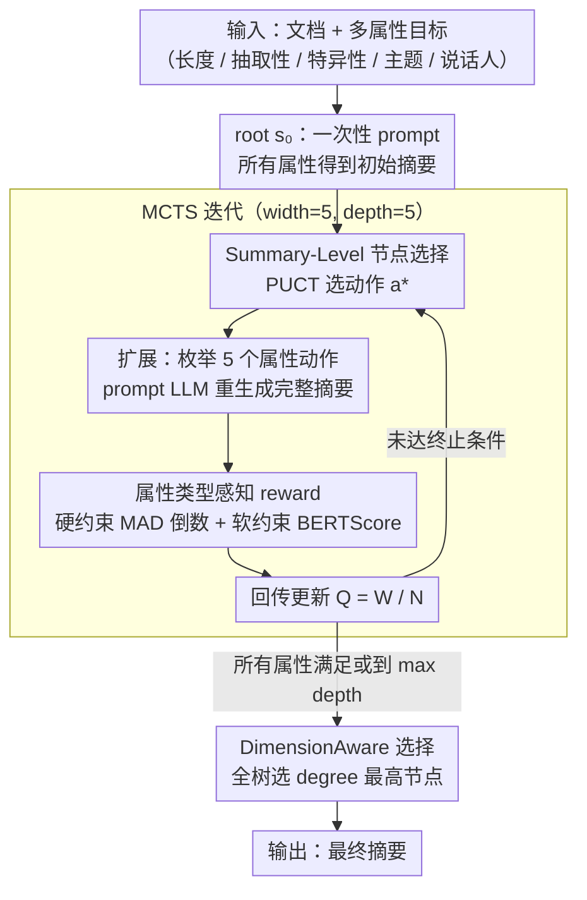

# Adaptive Planning for Multi-Attribute Controllable Summarization with Monte Carlo Tree Search

**会议**: ACL 2026  
**arXiv**: [2509.26435](https://arxiv.org/abs/2509.26435)  
**代码**: 暂无公开  
**领域**: 文本生成 / 可控摘要  
**关键词**: 可控摘要, 多属性控制, MCTS, 免训练, 顺序规划

## 一句话总结
本文提出 PACO，把"多属性可控摘要"重新表述为一个寻找"属性控制顺序"的规划问题，并用一个定制的 Monte Carlo Tree Search（节点是完整摘要、动作是单属性调整）在 prompt 阶段就找到最优调整路径，无需任何属性专用训练，用 Llama-3.2-1B 即可达到 Llama-3.3-70B baseline 的可控性，70B+PACO 全面超越所有现有方法。

## 研究背景与动机

**领域现状**：可控摘要要按用户指定的多个属性（长度、抽取性、特异性、主题、说话人等）生成摘要。现有主流方案要么是 MoE（HydraSum 每个 decoder 学一个属性）、要么是 hard prompt + soft prefix tuning（MACSum），都需要为每个属性单独 fine-tune，灵活性差，难以泛化到未见过的偏好组合。

**现有痛点**：(1) **属性间存在复杂相关性**——比如提升抽取性会被动改变长度，调整 specificity 又会影响 topic 对齐，单次 decoding 中同时强制所有属性容易"按下葫芦浮起瓢"；(2) LLM 的自回归生成天然不擅长在一次 forward 中同时满足多个数值约束；(3) 即使想"分步调整"，可能的调整顺序数随属性数组合爆炸，缺乏系统化的探索机制。

**核心矛盾**："一次性满足所有约束"和"语言模型的逐 token 生成范式"之间存在结构性冲突，而"按什么顺序逐步调整属性"的搜索空间又太大，无法靠人工启发式覆盖。

**本文目标**：(1) 用 inference-time 方法替代属性专用 fine-tuning，做到 training-free；(2) 把"多属性满足"从单次生成问题转成顺序决策问题；(3) 用搜索算法自动找到最优控制顺序。

**切入角度**：观察到摘要属性控制本质上是"逐次修改"——人在调摘要时也是"先调长度，再看 topic，再细化命名实体密度"。如果把每次单属性调整看作 MDP 中的 action，把当前摘要看作 state，那么属性控制就变成了在摘要空间上的树搜索问题。

**核心 idea**：用 MCTS 在 summary 级（而非 token 级）做 planning——节点 = 完整摘要，动作 = 调整某个属性，奖励 = 与目标属性的对齐度。这样既避免了 token-level MCTS 在长文本生成上的搜索空间爆炸，又能系统化探索最优调整路径。

## 方法详解

### 整体框架
PACO 把多属性可控摘要建模为 MDP：state $s$ = 当前摘要（含所有历史调整），action $a \in \{ext, len, spc, top, spk\}$ = 调整某个属性，root $s_0$ = 一次性 prompt 所有属性得到的初始摘要。LLM 作为 policy $\pi$，每个 action 由"prompt LLM 重新生成只针对该属性优化的摘要"实现。终止条件是所有属性都满足或达到最大深度。MCTS 完整跑完后从整棵树中选 degree（属性对齐度）最高的节点作为最终输出——这一点很关键，意味着 PACO 不强求修完所有属性，找到最佳折中即可。

### 关键设计

**1. Summary-Level MCTS 节点设计：把搜索粒度从 token 级提到整篇摘要级**

传统 LLM-MCTS 把节点定在 token 或 sentence 级，可一篇摘要动辄几千 token，搜索空间瞬间爆炸，而且半截 token 序列根本没法整体评估属性满足度。PACO 索性让每个节点都是一篇**完整摘要**：扩展节点时枚举所有 action（五个属性全是 legal action，哪怕某属性已经调过也允许再调），prompt LLM 基于完整历史 $s_0,s_1,\ldots,s_t$ 重新生成 $s_{t+1}$。选择步走 PUCT 变种 $a = \arg\max_a[Q(s,a) + U(s,a)]$，其中 $U(s,a) = c_{\text{puct}}\cdot\pi_\theta(s,a)\cdot\sqrt{\sum_b N(s,b)}/(1+N(s,a))$，$c_{\text{puct}}$ 用对数形式随访问数动态调节探索/利用。

之所以允许重复调同一属性，是因为后续动作经常会破坏前面调好的效果（调 specificity 顺手改了长度），必须给模型回头修复的机会。代价是每次扩展都要跑一次完整生成、比 token-level 一步贵得多，但换来的是搜索深度只有 5–10 步、且每个节点都是可直接采纳的答案，语义粒度刚好对得上"调一次属性"这个动作的真实含义。

**2. 属性类型感知的 reward 设计：硬约束求精确、软约束求对齐，分开算**

可控摘要的属性天生异构——长度是"必须等于 50 词"的硬指标，topic 是"越贴越好"的软指标，硬塞进同一个 metric 既数值不可比、又会让 MCTS 的 reward 信号失真。PACO 因此把属性切成两类分别计 reward：**deterministic**（extractiveness、length、specificity，要精确命中用户给的数值）用 MAD（mean absolute deviation）的倒数；**non-deterministic**（topic、speaker，越对齐越好）直接用 BERTScore。两者按

$$\text{Local reward} = \frac{\alpha}{avg_{\text{det}} + \varepsilon} + \frac{1}{\beta}\cdot avg_{\text{non-det}}$$

加总，$\alpha,\beta$ 调两类属性的相对权重。每个属性的度量也各有定义：extractiveness 是摘要词在原文中的比例，length 是词数，specificity 是命名实体占总词数比，topic 是主题词与摘要词的平均 BERTScore，speaker 是摘要与目标说话人话语的 BERTScore。分类之后，硬约束能被精确逼近、软约束能做 best-effort，搜索拿到的奖励才真正反映"这篇摘要离用户要求有多近"。

**3. DimensionAware 终止 / 选择策略：跑完全树后挑 degree 最高的节点，而非最深的 leaf**

可控摘要里属性常相互冲突，"全部精确满足"在现实中往往不可达，硬逼搜索往 max depth 走只会把质量调崩。所以 PACO 不学标准 MCTS 选 most-visited leaf，而是从**整棵树**里选属性对齐度（degree）最高的节点——这等价于"自适应放弃那些无法同时满足的属性"，让算法自己发现"调到哪一步收益最大"，比硬性约束鲁棒得多，也更贴合用户真实偏好。degree 的聚合提供三种可插拔策略：Weighted Mean（默认，带 recency-decay $\lambda$ 上调后期动作权重）、Geometric Mean（强调各属性均衡）、Min Score（安全关键场景）。回传仍用标准更新 $W(s,a) \leftarrow W(s,a) + V(s_l)$、$Q = W/N$。

### 损失函数 / 训练策略
**完全免训练**，纯 inference-time MCTS。tree 默认 width=5（动作数）、depth=5、每次模拟用 weighted mean 聚合 token 级 reward。recency decay $\lambda=0.5$ 是甜点（消融显示 $\lambda=0$ 或 2.0 都掉点）。任何 LLM 都可作 backbone。

## 实验关键数据

### 主实验
3 个 benchmark：MACSumDial（会议转录，5 属性含 speaker）、MACSumDoc（CNN/DailyMail，4 属性无 speaker）、DialogSum（日常对话）。3 个 backbone：Llama-3.2-1B、Qwen2.5-7B、Llama-3.3-70B。指标：det 属性用 MAD（越小越好），non-det 用 alignment（越大越好），质量用 ROUGE/BERTScore。

| Backbone | 方法 | Ext MAD↓ | Len MAD↓ | Spc MAD↓ | Top↑ | Spk↑ | ROUGE↑ |
|----------|------|---------|---------|---------|------|------|--------|
| HP+SP (BARTlarge 训练) | - | 6.66 | 34.66 | 7.08 | 0.807 | 0.804 | 0.315 |
| Llama-3.2-1B | base | 10.79 | 55.68 | 9.30 | 0.783 | 0.795 | 0.270 |
| Llama-3.2-1B | **PACO** | 9.30 | **17.96** | 7.22 | 0.792 | 0.794 | 0.288 |
| Qwen2.5-7B | base | 9.70 | 17.82 | 6.99 | 0.797 | 0.795 | 0.301 |
| Qwen2.5-7B | **PACO** | 8.72 | **11.79** | 5.43 | 0.799 | 0.794 | 0.302 |
| Llama-3.3-70B | base | 6.43 | 15.72 | 7.11 | 0.800 | 0.798 | 0.328 |
| Llama-3.3-70B | Implicit self-plan | 7.35 | 27.70 | 8.09 | 0.802 | 0.795 | 0.304 |
| Llama-3.3-70B | Explicit self-plan | 7.44 | 28.19 | 7.32 | 0.808 | 0.794 | 0.287 |
| Llama-3.3-70B | Joint-iterative | 5.19 | 11.19 | 5.18 | 0.797 | 0.797 | 0.319 |
| Llama-3.3-70B | Random sequential | 5.44 | 11.16 | 4.24 | 0.797 | 0.797 | 0.322 |
| Llama-3.3-70B | **PACO** | **4.91** | **7.63** | **3.81** | 0.795 | 0.798 | **0.328** |

### 消融实验（DeepSeek 70B / MACSumDial）

| 配置 | Avg Det MAD↓ | Top↑ |
|------|------------|------|
| Full PACO（local reward + DA filter）| 5.45 | 0.795 |
| 仅 local reward（无 heuristic）| 5.45 | 0.795 |
| 仅 heuristic（"模型能否完成所有剩余属性"二分概率）| 5.53 | 0.796 |
| Local + heuristic 组合 | 5.67 | 0.795 |
| Joint-iterative（同推理预算）| 7.19 | 0.797 |
| Random sequential（同推理预算）| 6.95 | 0.797 |

### 关键发现
- **小模型 + PACO ≈ 大模型 baseline**：Llama-3.2-1B+PACO 在 length 控制上把 MAD 从 55.68 降到 17.96，与 70B baseline 持平，证明"规划 > 模型规模"在 controllability 上成立。
- **预算 matched 对照证明增益来自规划而非算力**：Joint-iterative 和 Random sequential 用同样多的 inference 次数，PACO 仍胜 1.3 MAD，说明结构化树搜索比简单重采样有效。
- **Self-planning（让 LLM 自己规划）失败**：Implicit 和 Explicit self-plan 都比 baseline 更差，证明 LLM 当前的规划能力不足以替代显式搜索算法，外置 MCTS 是必要的。
- **长属性是最难控的**：在 MACSumDial 上长度始终 MAD 最高，因为长度与其它属性高度耦合；图 6 显示 70B+PACO 倾向于把长度调整放在最后做"收尾"。
- **heuristic 反而不如纯 local reward**：直觉上 heuristic 应该提供 lookahead 信号，但实际上 LLM 难以可靠预测"当前部分摘要能否完成所有剩余属性"，反而给搜索引入噪声。
- **质量不掉**：PACO 在 controllability 大幅提升的同时 ROUGE/BERTScore 与 baseline 持平甚至略升（增量调整比一次性全约束更不损质量）。

## 亮点与洞察
- **粒度选对了**：把 MCTS 节点定在"完整摘要"而非"token / sentence"是这套方法 work 的关键，既绕开了长文本生成上 token-level MCTS 的搜索爆炸，又让每个节点都是可直接采纳的中间产物。这个粒度选择对其它"长文本可控生成"任务（如对话改写、文档翻译、报告生成）都是可迁移的设计思路。
- **属性类型 ontology 是 reward 设计的关键**：把属性分成 deterministic / non-deterministic 两类、分别用 MAD 倒数和 alignment 直接相加，简单但管用——这种"按属性物理含义设计 reward 结构"的思路远比"所有属性归一化到 [0,1] 加和"鲁棒。
- **"全树选最高 degree"是反传统的设计**：标准 MCTS 选 most-visited 是基于"高质量解被反复 confirm"的假设，但 controllable summarization 里很多 instance 的最优解就是 root node 附近的几个早期节点，反而被深处搜索带偏。论文的 highest-degree 选择策略避免了这种 over-search。
- **negative result 也很有价值**：Implicit/Explicit self-planning 与 heuristic value function 的失败提供了重要洞察——LLM 当前的元推理（规划、lookahead 评估）能力远弱于其执行能力，把规划外置给确定性算法仍是更靠谱的工程选择。

## 局限与展望
- 计算开销大：每个 instance 需要 5–10 次 LLM 生成，比单 pass 慢 5–10×。对延迟敏感的应用需要 batch 调度或更激进的剪枝（如 progressive widening）。
- 当前 5 个属性已经接近 LLM prompt 的可靠控制上限，扩展到 10+ 属性可能需要分层搜索或属性聚类。
- 没有学习信号——所有反馈在 inference 时丢弃，没有把成功的 plan 蒸馏回模型；如果把高质量 trajectory 做 SFT，理论上可以让 1B 模型 zero-shot 接近 PACO 性能。
- 评估指标本身（extractiveness 用词重叠、specificity 用 NER 比例）较粗糙，可能与人类感知的"控制效果"有 gap。
- 跨 dataset 控制偏好不一致（DialogSum 里 length 反而最易控、specificity 最难），说明现有 reward 函数对 annotation style 较敏感，缺乏 normalize 机制。

## 相关工作与启发
- **vs HydraSum / HP+SP MACSum** (Goyal 2022, Zhang 2023)：他们 fine-tune 每个属性的专用模块，PACO 不训练但用 70B 仍胜出。
- **vs Tree of Thoughts / Reasoning via Planning** (Yao 2023, Hao 2023)：他们也用 MCTS 但节点是 token/思路片段，PACO 把节点定在 summary 级以适应长文本生成；同时允许动作重复，因为属性调整不是单调的。
- **vs Best-of-N sampling**：PACO 的 Random sequential baseline 本质就是 BoN（同预算多次试），PACO 用 MCTS 的 PUCT 信号引导搜索，证明结构化探索 > 随机重采样。

## 评分
- 新颖性: ⭐⭐⭐⭐ "summary-level MCTS" 和 "属性类型感知 reward" 是干净的设计，第一次把 controllable summarization 重述为顺序规划问题。
- 实验充分度: ⭐⭐⭐⭐ 3 dataset × 3 backbone + 同预算对照 + 自规划对照 + 完整消融 + 跨域分析，少见的完整。
- 写作质量: ⭐⭐⭐⭐ 图 2/3 直观，self-planning 的负面结果讲得很清楚，公式与算法表达精炼。
- 价值: ⭐⭐⭐⭐ 完全免训练、可即插即用、能用小模型达到大模型效果，对实际 controllable generation 系统有强参考价值。

<!-- RELATED:START -->

## 相关论文

- [\[ACL 2026\] ThreadSumm: Summarization of Nested Discourse Threads Using Tree of Thoughts](threadsumm_summarization_of_nested_discourse_threads_using_tree_of_thoughts.md)
- [\[ICML 2026\] Score-Repellent Monte Carlo: Toward Efficient Non-Markovian Sampler with Constant Memory in General State Spaces](../../ICML2026/nlp_generation/score-repellent_monte_carlo_toward_efficient_non-markovian_sampler_with_constant.md)
- [\[ACL 2026\] Are Emotion and Rhetoric Neurons in LLM? Neuron Recognition and Adaptive Masking for Emotion-Rhetoric Prediction Steering](are_emotion_and_rhetoric_neurons_in_llm_neuron_recognition_and_adaptive_masking_.md)
- [\[ACL 2025\] DTCRS: Dynamic Tree Construction for Recursive Summarization](../../ACL2025/nlp_generation/dtcrs_dynamic_tree_construction_for_recursive_summarization.md)
- [\[ACL 2026\] ConlangCrafter: Constructing Languages with a Multi-Hop LLM Pipeline](conlangcrafter_constructing_languages_with_a_multi-hop_llm_pipeline.md)

<!-- RELATED:END -->
