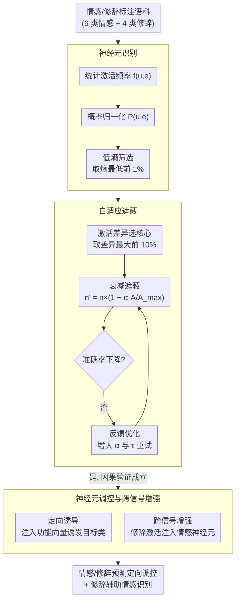

# Are Emotion and Rhetoric Neurons in LLM? Neuron Recognition and Adaptive Masking for Emotion-Rhetoric Prediction Steering

**会议**: ACL 2026  
**arXiv**: [2604.17255](https://arxiv.org/abs/2604.17255)  
**代码**: 无  
**领域**: 文本生成  
**关键词**: 情感神经元, 修辞神经元, 自适应遮蔽, 神经元调控, LLM可解释性

## 一句话总结

系统研究LLM中情感和修辞神经元的表征机制及其内在关联，提出结合多维筛选的神经元识别框架和自适应遮蔽验证方法，实现了情感/修辞预测的定向诱导和修辞神经元辅助情感识别。

## 研究背景与动机

**领域现状**：LLM在情感理解和修辞生成方面的能力日益重要，现有改进主要依赖外部优化（提示工程、微调），对内部表征机制的探索不足。少量神经元研究仅局限于情感神经元，忽略了修辞神经元及两者的内在联系。

**现有痛点**：传统的神经元功能验证方法（强制置零、均值替代）在情感和修辞任务上表现出反直觉现象——遮蔽被认为高度相关的目标神经元后，任务准确率不降反升。这使得可靠的因果验证变得不可行。

**核心矛盾**：想要通过神经元干预来验证和调控情感/修辞表达，但现有遮蔽方法不可靠。强制置零可能触发模型的功能补偿机制（互补神经元集群接管），均值替代未能真正破坏核心神经元的特异性表征。

**本文目标**：（1）系统识别6类情感和4类修辞的神经元；（2）提出可靠的因果验证方法；（3）实现定向调控和跨信号增强。

**切入角度**：从神经元激活差异性出发，设计衰减式遮蔽而非全零遮蔽，配合反馈优化确保遮蔽效果可靠。

**核心 idea**：用自适应遮蔽（动态筛选+衰减遮蔽+反馈优化）替代传统的硬遮蔽，实现可靠的神经元功能验证和调控。

## 方法详解

### 整体框架

基于Llama-3.1-8B-Instruct，聚焦FFN层神经元。流程包含三个阶段：神经元识别（激活频率+概率归一化+熵筛选）→ 自适应遮蔽验证（动态选择+衰减遮蔽+反馈优化）→ 神经元调控（定向诱导+跨信号增强）。

### 关键设计

**1. 神经元识别（Neuron Recognition）：用低熵筛出对某类情感/修辞高度选择性响应的神经元**

要研究"情感/修辞神经元"，第一步得先把它们从 FFN 里捞出来，难点在于怎么判定某个神经元是不是真的对某一类输入特异性响应。本文走三步统计筛选：先统计每个 FFN 神经元在各情感/修辞标签输入下的激活频率 $f_{u,e}$，再做激活概率归一化 $P_{u,e} = f_{u,e}/T_e$，最后用信息熵 $H = -\sum P_{u,e}\log(P_{u,e})$ 衡量这个神经元的激活在各类别上的分布有多集中，取熵最低的前 1% 作为目标神经元。

之所以盯着低熵，是因为熵越低代表激活越集中在某一类标签上、对该类别的选择性越强——这样的神经元才能可靠区分不同情感/修辞，而那些在所有类别上均匀激活的"通用"神经元会被高熵自然排除。

**2. 自适应遮蔽（Adaptive Masking）：用衰减遮蔽 + 反馈优化破解传统硬遮蔽的反直觉现象**

传统的强制置零、均值替代在情感/修辞任务上会出现诡异结果——遮掉被认定为高度相关的目标神经元后，准确率不降反升，根本没法做因果验证。本文判断这是硬遮蔽触发了模型的功能补偿（互补神经元集群接管），于是改用更温和、可自我校准的三步遮蔽。先算每个神经元的激活差异 $D_i = |A_{i,target} - A_{i,non\text{-}target}| / A_{all}$，取差异最大的前 10% 为核心神经元；再对它们施加**衰减遮蔽** $n'_u = n_u \times (1 - \alpha \times A_i/A_i^{max})$ 而非直接清零；最后引入反馈优化：一旦遮蔽后准确率没下降，就自动增大衰减系数 $\alpha$ 和选择阈值 $\tau$ 再试。

衰减而非置零，是为了破坏核心神经元的特异性表征却不至于猛到激活补偿集群；反馈优化则保证"没奏效就加码"，让遮蔽效果稳定可靠，最终在全部 10 个类别上都拿到稳定的准确率下降，这正是因果验证成立的标志。

**3. 神经元调控与跨信号增强：靠注入功能向量做定向诱导，并让修辞神经元反哺情感识别**

识别 + 遮蔽证明了神经元的"必要性"，这一步进一步验证"充分性"并挖掘情感与修辞的协同。定向诱导上，对非目标类别的输入注入目标神经元的功能向量 $n'_{s_i} = n_{s_i} + \beta \times \bar{n}_{s_i}$，把预测掰向目标情感/修辞；跨信号增强上，把修辞神经元的平均激活值注入情感神经元 $a_{i,joint} = a_i + \omega \cdot \bar{a}_{i,meta}$。

前者从正面确认这些神经元确实因果性地控制着对应表达（既能遮掉、也能注入诱发），后者则是想看修辞与情感是不是共享内部机制——实验里修辞注入能提升 1–5% 情感识别，说明修辞在模型内部不只是"装饰"，而是真的参与了情感表征。

### 损失函数 / 训练策略

LLM参数始终冻结，仅在FFN激活值层面进行干预。反馈优化（调整 $\alpha$ 和 $\tau$）仅在开发集上进行。

## 实验关键数据

### 主实验

不同遮蔽方法的准确率变化（$\Delta$ACC %）：

| 遮蔽方法 | Happiness | Sadness | Anger | Fear | Metaphor | Sarcasm |
|---------|-----------|---------|-------|------|----------|---------|
| Zero（强制置零）| +5.46 | +4.32 | +7.92 | +1.22 | +3.37 | -4.17 |
| Mean（均值替代）| +6.79 | -1.13 | +5.84 | +5.37 | +5.62 | -5.78 |
| **Adaptive** | **-9.25** | **-8.63** | **-10.14** | **-7.85** | **-7.29** | **-10.61** |

### 消融实验

| 配置 | 效果 | 说明 |
|------|------|------|
| 全层遮蔽 | 最大性能下降 | 情感/修辞依赖跨层协同 |
| 仅顶层遮蔽 | 次大下降 | 与神经元密集分布一致 |
| 仅底层遮蔽 | 最小下降 | 底层神经元较少 |
| 修辞注入情感 | 提升1-5% | 验证跨信号增强有效 |

### 关键发现

- 传统遮蔽方法（Zero/Mean）在情感任务上普遍出现反直觉的准确率提升，证明硬遮蔽不可靠
- 自适应遮蔽在所有10个情感/修辞类别上都产生稳定的准确率下降（-4%至-14%），验证了方法的可靠性
- 情感和修辞神经元主要集中在模型上层（25-32层），8B模型尤其明显
- 夸张修辞神经元对所有情感类别都有正向增强作用，与夸张天然放大情感强度的特性一致
- 讽刺修辞对悲伤情感的促进最显著，源于讽刺的隐含批评与悲伤的内敛特质之间的表达兼容性

## 亮点与洞察

- 自适应遮蔽解决了一个长期困扰可解释性研究的问题：传统遮蔽的反直觉现象。衰减遮蔽+反馈优化的组合设计既简洁又有效，可推广到其他神经元功能验证场景。
- 修辞神经元辅助情感识别是一个有趣的发现：修辞不仅是语言的"装饰"，在模型内部它确实影响着情感的表征。这为多信号协同的LLM调控提供了新方向。
- 神经元层级分布的发现（上层聚集）与现有知识存储研究一致，进一步证实FFN上层是语义整合的关键区域。

## 局限与展望

- 研究范围限于6种基本情感和4种修辞手法，未涉及更复杂的情感状态和更多修辞形式
- 神经元调控依赖静态功能向量，未考虑上下文相关的动态调整
- 仅在Llama-3.1上验证，其他架构（如Qwen、Mistral）是否有类似分布有待确认
- 衰减系数 $\alpha$ 的调整策略较为简单，更精细的自适应策略可能进一步提升效果

## 相关工作与启发

- **vs Lee et al. (2025)**: 验证了Llama系列中情感神经元的存在，但未研究修辞；本文首次系统研究修辞神经元并揭示情感-修辞的协同关系
- **vs Di Palma et al. (2025)**: 通过探针技术实现情感识别，但属于被动分析；本文实现了主动干预和定向调控
- **vs Radford et al. (2018)**: 最早发现情感神经元的概念；本文在现代LLM上进行了更系统和可靠的研究

## 评分
- 新颖性: ⭐⭐⭐⭐ 首次系统研究修辞神经元及情感-修辞协同
- 实验充分度: ⭐⭐⭐⭐ 5个数据集+跨数据集验证+多层遮蔽分析
- 写作质量: ⭐⭐⭐⭐ 动机清晰，实验设计严谨
- 价值: ⭐⭐⭐⭐ 为LLM神经元级可解释性和调控提供了可靠工具

<!-- RELATED:START -->

## 相关论文

- [\[ACL 2026\] Adaptive Planning for Multi-Attribute Controllable Summarization with Monte Carlo Tree Search](adaptive_planning_for_multi-attribute_controllable_summarization_with_monte_carl.md)
- [\[ACL 2026\] ConlangCrafter: Constructing Languages with a Multi-Hop LLM Pipeline](conlangcrafter_constructing_languages_with_a_multi-hop_llm_pipeline.md)
- [\[ACL 2025\] Personalized Text Generation with Contrastive Activation Steering](../../ACL2025/nlp_generation/personalized_text_generation_with_contrastive_activation_steering.md)
- [\[ACL 2026\] Can You Make It Sound Like You? Post-Editing LLM-Generated Text for Personal Style](can_you_make_it_sound_like_you_post-editing_llm-generated_text_for_personal_styl.md)
- [\[ACL 2025\] Balancing Diversity and Risk in LLM Sampling: How to Select Your Method and Parameter for Open-Ended Text Generation](../../ACL2025/nlp_generation/balancing_diversity_and_risk_in_llm_sampling_how_to_select_your_method_and_param.md)

<!-- RELATED:END -->
