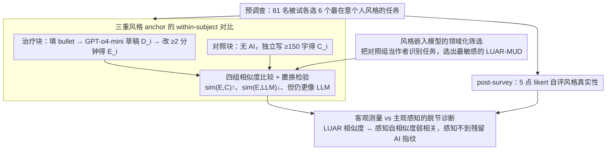

# Can You Make It Sound Like You? Post-Editing LLM-Generated Text for Personal Style

**会议**: ACL 2026  
**arXiv**: [2604.24444](https://arxiv.org/abs/2604.24444)  
**代码**: https://github.com/ctbaumler/personal_style_postedit  
**领域**: 文本生成 / 风格  
**关键词**: 个人写作风格、Post-editing、LLM 协作写作、风格 embedding、用户研究

## 一句话总结
作者设计一项 81 人预注册在线研究，让被试用 GPT-o4-mini 起草+人工 post-edit 重写婚礼誓词、道歉信等"在意个人风格"的文本，发现 post-edit 确实能显著拉近被试自身风格、远离 LLM 风格，但被编辑后的文本仍系统性地比独立写作更"AI 味"——而被试自己却感知不到这种残留风格痕迹。

## 研究背景与动机

**领域现状**：当前 LLM 写作辅助主流形态是"AI 起草 + 人类 post-edit"——这种工作流在机器翻译时代就已成熟，被广泛迁移到办公邮件、文档协作等场景。先前研究（Reza et al. 2025、Hwang et al. 2025）发现，在内容主导的写作中用户欢迎 AI 起草；但在"风格主导"的写作（婚誓、悼词、道歉信）中，用户强烈抵制 AI 介入语言生成阶段，担心"听起来不像我自己"。

**现有痛点**：（1）至今没有受控研究真正验证"post-edit 是否能让 LLM 草稿变得听起来像我自己"——这是社交媒体讨论 AI 婚誓时反复出现却没有答案的核心争议。（2）即使 post-edit 有效，也没人量化"编辑后的文本"在风格连续谱上落在何处：是更接近用户自己的独立写作，还是仍残留 LLM 的"指纹"？（3）"机器测量风格相似度"与"用户主观感知风格真实性"是否对齐？这关系到 LLM 辅助写作是否会带来"用户以为自己掌控了风格、但读者一眼能看出 AI 痕迹"的隐性风险。

**核心矛盾**：风格是社会信号——写作者通过风格表达身份、群体归属、与读者关系。LLM 默认风格被多项研究证实有可检测的统计指纹（em-dash、特定 hedging 词、句式模板等），与人类风格存在系统性 distribution gap。当用户用 post-edit 这种"打补丁"方式尝试覆盖 LLM 风格时，理论上只能修改"自己能感知到的差异"，而对自己感知不到的 LLM 特征无能为力——这就埋下了"自评好 vs 实际仍 AI 味"的脱节。

**本文目标**：通过预注册研究同时回答三组问题：(H1) post-edit 后的文本风格是否更像被试自己、更不像 LLM？(H2) post-edit 后的文本是否形成一种独立、可检测的"第三种风格"？(H3) 用户主观感知的"风格自相似度"是否与基于 embedding 的客观测量一致？

**切入角度**：用 LUAR (Rivera-Soto et al. 2021) 这种 author-level embedding 度量风格相似度——比起传统 stylometry，它在小样本写作任务上能更敏感地捕捉个体语言习惯；同时配套 Pangram AI 检测器交叉验证"LLM 风格残留"信号。被试在治疗组与对照组分别完成不同任务（治疗组：先写细节 bullet → 编辑 LLM 草稿；对照组：直接独立写作），用对照组写作作为该用户"真实风格"的 anchor。

**核心 idea**：用 within-subject 设计 + 多种风格 embedding 度量 + 用户主观评分三角验证，把"人能否通过编辑覆盖 LLM 风格指纹"从纯思辨争论变成可测量的实证问题。

## 方法详解

### 整体框架
研究分五阶段：(1) **pre-survey** 让 100 名 Prolific 被试从 8 个备选写作场景中挑选 6 个"我最在意个人风格"的任务（这 8 个场景由独立的 88 人预备调查从 15 个候选中筛出）；(2) 教程；(3) **治疗块**——4 个任务里被试先填写 ≥30 字的 bullet 细节，GPT-o4-mini 根据细节生成草稿，被试至少花 2 分钟做 post-edit；(4) **对照块**——剩余 2 个任务被试看不到任何 AI 输出，直接独立写 ≥150 字；(5) **post-survey** 收集人口学信息、对编辑后文本的风格真实性与可用性的 5 点 likert 评分、未来使用意愿、理由排名。最终经预注册剔除标准保留 81 名有效被试。所有相似度通过 LUAR-MUD embedding 的余弦相似度计算，p 值通过 10000 次置换检验得到，效应量用 Hedges' $g$ 配 1000 次 bootstrap 置信区间，多重比较用 Benjamini–Hochberg 控制 $q=0.05$。

### 关键设计

**1. 三重风格 anchor 的 within-subject 对比：把"编辑是否捕捉到个人风格"拆成可定量验证的几组比较**

只看"编辑前后变化"会留一个致命漏洞——被试可能只是把文本改得更像"普通人"而非"自己"，单组对比分不开这两种解释。本文因此对每名被试同时收集三种文本作为 anchor：独立写作的 control text $C_i$、LLM 原始草稿 $D_i$、编辑后的 post-edit 文本 $E_i$，再用 LUAR 嵌入算余弦相似度，对四组关键比较各跑置换检验。(H1a) 比 $\mathrm{sim}(E_i, C_i)$ 与 $\mathrm{sim}(D_i, C_i)$，看编辑有没有拉近自我风格；(H1b) 比 $\mathrm{sim}(E_i, \mathrm{LLM})$ 与 $\mathrm{sim}(D_i, \mathrm{LLM})$，看有没有远离 LLM；(H1a′) 比 $\mathrm{sim}(E_i, C_i)$ 与 $\mathrm{sim}(E_i, C_{j\neq i})$，验证拉近的是"自己"而不是泛化的"人味"；(H1c) 比 $\mathrm{sim}(E_i, \mathrm{LLM})$ 与 $\mathrm{sim}(E_i, C_i)$，量化残留 LLM 风格的相对强度。

把 LLM 草稿和自己的 control 写作同时当锚点，等于在风格谱上钉了两个端点，post-edit 文本落在哪、离哪个端点更近就一目了然，"改得像自己"和"只是改得像别人"也就被彻底分开了。

**2. 风格嵌入模型的领域化筛选：用本研究数据当 ground truth 反选最敏感的 embedding**

通用 benchmark 上排第一的风格 embedding，未必在"短文本 + 特定写作场景"这种小样本设定里最敏感，选错工具就会量错风格、招来方法论质疑。本文干脆把对照组数据本身当成一个 authorship identification 任务：给一条 query 控制文本，要从 80 名其他被试各一条控制文本加真作者另一条控制文本里把真作者排到第一，再在六种候选 embedding（LUAR-MUD、LUAR-CRUD、multilingual-style-representation、CISR、StyleDistance、SAURON）上比 MRR / R@1 / R@8。

结果 LUAR-MUD 以 MRR $=0.589$ / R@1 $=0.451$ / R@8 $=0.833$ 显著领先，于是主分析锁定 LUAR-MUD，并用 CISR 复跑 H1/H2 验证结论方向一致。这种"在领域内任务上反选模型"的做法，保证了后续所有相似度数字都来自一把对本数据真正灵敏的尺子。

**3. 客观测量 vs 主观感知的脱节诊断：并跑两条评估线，逼出 post-edit 的真正风险**

这是全文最关键的一步——post-edit 到底有没有解决用户痛点，取决于"机器测出的风格相似度"和"用户自己感知的真实性"是否对得上。本文每个任务结束让被试用 5 点 likert 评"这段文本多大程度像我自己"，平均成 perceived self-similarity，再用 repeated-measures correlation 把它和 LUAR 客观相似度配对回归，得 $r=0.244 \pm 0.076$、$p < .0001$：显著正相关但校准很弱。进一步的 follow-up 更刺眼——被试感知里 post-edit 文本和自己 control 文本代表性"没差别"（$p=.9062$），但客观测量却显示 post-edit 文本仍显著更像 LLM（H1c, $g=-1.43$）。

之所以坚持两条线并跑，是因为只看客观度量会得出"AI 味没擦干净"的悲观结论，只看主观评分又会得出"已经够用了"的乐观结论；两者一对照，真正的风险才暴露出来：用户根本感知不到自己手稿里残留的 AI 指纹，而检测器和读者却一眼能看出来。

## 实验关键数据

### 主实验

| 假设 | 比较 | 效应方向 | Hedges' $g$ | 95% CI | $p$ |
|------|------|---------|-------------|--------|-----|
| H1a | post-edit 后 vs 前 与 self-control 相似 | 显著拉近 | $+0.55$ | $[0.38, 0.71]$ | $.0002$ |
| H1a′ | post-edit 与自己 vs 与他人 control 相似 | 拉近自己 | $-0.56$ | $[-0.70, -0.43]$ | $.0002$ |
| H1b | post-edit 后 vs 前 与 LLM 相似 (LUAR) | 显著远离 | $-0.41$ | $[-0.44, -0.39]$ | $.0002$ |
| H1b | 同上 用 Pangram AI 检测分 | 显著远离 | $-0.45$ | $[-0.55, -0.35]$ | $.0002$ |
| H1c | post-edit 与 LLM vs 与 self-control 相似 | 仍更像 LLM | $-1.43$ | $[-1.55, -1.32]$ | $.0002$ |
| H2a | post-edit vs control 文本群同质性 | 更同质 | $+1.42$ | $[1.33, 1.51]$ | $.0002$ |
| H2b | post-edit vs LLM 文本群同质性 | 更多样 | $-0.69$ | $[-0.74, -0.63]$ | $.0002$ |
| H2c | post-edit 与他人 post-edit vs 自己 control 相似 | 共享 AI 指纹 | $+1.14$ | $[1.02, 1.26]$ | $.0002$ |
| H3 | perceived vs LUAR self-similarity | 弱正相关 | $r=0.244$ | $\pm 0.076$ | $<.0001$ |

### 消融实验

| 配置 / 切片 | 关键指标 | 说明 |
|-------------|---------|------|
| 主分析 LUAR-MUD (Full) | H1a $g=+0.55$, H1c $g=-1.43$ | 所有主结论显著 |
| 替换为 CISR embedding | H1a $g=+0.48$, H1c $g=-2.30$ | 结论方向一致，幅度略变 |
| Pangram AI 检测器交叉验证 H1b | $g=-0.45$ | 与 LUAR 同号 |
| 任务个人风格"非最高"分位（混合模型） | post-edit × style importance 交互 $\beta=0.020$, $p<.001$ | 越不在意风格越不主动擦 AI 痕迹 |
| 字词层面消融：contractions | post-edit 文本是 LLM 草稿的 $5\times$ | 缩写是被试关键个人特征 |
| em-dash 删除率 | $23\%$（254 个删 ~58） | 大众已知的"AI 特征"会被擦 |
| "delve" 出现次数 | $0$（全研究无人写） | 流行病毒词被高度警觉 |

### 关键发现
- **H1c 是全文最关键结论**：编辑后的文本相对"LLM 草稿"和"自己 control"的位置非常不对称——离 LLM 更近（$g=-1.43$，远超 H1a 的 $+0.55$），说明 post-edit 只能掩盖一小部分 AI 指纹。
- **H2c 揭示了"共享的 AI 残骸"**：不同被试编辑后的文本之间比与"自己 control 文本"更像——说明 LLM 留下的某些风格特征是所有编辑者都漏掉、漏改方式还相似的"集体盲点"。
- **H3 的脱节最危险**：被试主观感知"我的 post-edit 文本和我 control 文本一样能代表我"（$p=.906$），但客观测得 $g=-1.43$ 的巨大鸿沟——用户对自己的"风格自我评价"在 AI 时代不再可靠。
- **个人风格不重要时，被试更不擦 AI 痕迹**：混合模型显示 style importance 显著调节 post-edit 对 LLM-similarity 的影响（$\beta=0.020$，$p<.001$），说明用户的清理行为是动机驱动而非自动反应。
- 被试做的非标准化编辑（typo、不打空格的逗号）反而显著提升自相似度（CoLA 越低、与自己 control 相似度变化越大，$\beta=-0.116$，$p=.003$）——个人风格里包含的"不规范习惯"是真实的身份信号。
- 编辑策略不存在"短而密 vs 长而稀谁更好"——两种策略与自相似度变化都显著正相关（$r=0.306$ vs $r=0.207$），关键是改动总量。

## 亮点与洞察
- **"第三种风格"假设被数据证实**：post-edit 文本在风格嵌入空间里既不是 LLM 也不是人类，而是一类独立的、相互可识别的混合体——这给未来 AI 检测器开了一个新维度。
- **预注册 + within-subject 把"婚誓 reddit 撕逼"变成可证伪科学**：研究方法论本身就是亮点，把网络上"AI 协助写婚礼誓词到底 ok 不 ok"这种很难定量的争论，拆成 H1-H5 一组可检验假设。
- **"用户感知风格"≠"实际风格"是最强 take-away**：以前用户测试驱动的 LLM 风格对齐研究普遍把用户满意度当 ground truth，本文证明这套范式会系统性高估对齐效果——这对所有 personalization、style transfer、style alignment 工作都是重要 caveat。
- **可迁移的方法论 trick**：用领域内 authorship task 选 embedding 模型可以推广到任何"小样本 + 特定 domain"的风格分析。
- **挑选哪些"AI 词"会被警觉**——本文给出实证：em-dash 被擦但"exploring/guiding/understanding"几乎留着，"delve" 已成大众警觉词。这个清单对反检测、style cleaning 研究都有直接价值。

## 局限与展望
- 风格仅用 LLM embedding 度量，未引入法医语言学专家人工评估；embedding 可能漏掉对用户更显著的语义层风格特征。
- control 与 treatment 用不同任务，self-anchor 可能漏掉任务特定风格偏好，导致 self-similarity 被低估。
- 写作是"假的"——被试不会真把婚誓寄给伴侣，实操中真实风险/动机可能改变编辑深度与策略。
- LLM 草稿生成方式（bullet + word-count 提示）可能不代表真实用户的 prompt 习惯，更随意的 prompt 会产出风格更分散的草稿。
- 只研究"AI 先草稿 → 人 post-edit"这一种 co-writing 形态，未覆盖"人先写 → AI 编辑"、多轮交互等其他模式。
- 仅做被试自评，未做接收者视角实验——读者（尤其熟悉作者风格的家人朋友）是否能识别残留 AI 痕迹仍未知。
- 改进思路：在 post-edit 界面里"surface"用户漏改的 LLM 特征（如高亮 em-dash 与 LLM 高频词），但要警惕"侵犯用户自治""规定什么是'我的风格'"的伦理风险——作者建议把投入更优的方向放在"让 LLM 初稿更原创"。

## 相关工作与启发
- **vs Chakrabarty et al. 2025 (CHI'25 expert edits)**：他们让 creative writing 专家编辑 AI 文本以提升"质量"，本文让普通用户编辑以表达"个人风格"——动机和评估维度都不同，本文揭示了普通用户在风格层面的能力上限。
- **vs Reza et al. 2025 / Hwang et al. 2025**：先行工作发现用户欢迎 AI 在 planning 阶段帮忙、抵制 translating/reviewing 阶段——本文补上了"如果允许 post-edit translating 输出，用户是否买账？"的实证答案：买账（58/81 倾向继续用），但客观风格仍 AI 化。
- **vs Padmakumar & He 2024 (writing 多样性)**：他们发现 LLM 协作降低内容多样性，本文给出风格多样性侧的对照证据（H2a：post-edit 文本群比独立写作群更同质）。
- **vs Russell et al. 2025**：他们发现频繁用 ChatGPT 的人更善于检测 AI 文本——本文 H3 给出互补结论：写作者对自己 post-edit 后的文本反而高估了清洁度，AI 写作经验或许能改善这种盲区。
- **vs 传统 stylometry**：传统方法依赖手工特征（function-word 分布、POS 模板），本文证明 LUAR 这种 contrastive author-embedding 在小样本（每人 2 条 control）上仍足够敏感分离 81 人——给小数据风格研究提供了实用 baseline。
- 启发：(1) 任何 LLM personalization / style alignment 研究都必须双轨评估——客观 embedding + 用户感知；(2) "AI 写作检测"应区分"raw LLM 输出"与"post-edited LLM 输出"，后者是新挑战；(3) "原创性"（而非"风格"）才是 LLM 协作写作的真正瓶颈，未来工作应在提升草稿创造力而非风格擦除工具上。

## 评分
- 新颖性: ⭐⭐⭐⭐ 第一次系统量化 post-edit 对个人风格的恢复能力以及客观/主观脱节，研究问题非常有意义但方法主要是 well-designed user study 而非新算法。
- 实验充分度: ⭐⭐⭐⭐⭐ 81 人预注册 + 5 个主假设 + 多种 embedding 交叉验证 + 字词级 qualitative coding + 子群分析，覆盖度非常扎实。
- 写作质量: ⭐⭐⭐⭐⭐ 假设组织清晰、效应量与置信区间齐全、表格阅读友好、limitations 与伦理诚实，是 ACL HCI/NLP 交叉方向标杆性 user study 写法。
- 价值: ⭐⭐⭐⭐⭐ 对 LLM 协作写作、AI 检测、personalization 三个社区都有直接 implication，"用户感知 ≠ 客观对齐"的结论将影响后续大量 alignment 工作的评估范式。

<!-- RELATED:START -->

## 相关论文

- [\[ACL 2026\] ConlangCrafter: Constructing Languages with a Multi-Hop LLM Pipeline](conlangcrafter_constructing_languages_with_a_multi-hop_llm_pipeline.md)
- [\[ACL 2025\] Writing Like the Best: Exemplar-Based Expository Text Generation](../../ACL2025/nlp_generation/writing_like_best_exemplar.md)
- [\[ACL 2026\] Are Emotion and Rhetoric Neurons in LLM? Neuron Recognition and Adaptive Masking for Emotion-Rhetoric Prediction Steering](are_emotion_and_rhetoric_neurons_in_llm_neuron_recognition_and_adaptive_masking_.md)
- [\[ACL 2025\] Enhancing Text Editing for Grammatical Error Correction: Arabic as a Case Study](../../ACL2025/nlp_generation/enhancing_text_editing_for_grammatical_error_correction_arabic_as_a_case_study.md)
- [\[ACL 2026\] Planning Beyond Text: Graph-based Reasoning for Complex Narrative Generation](planning_beyond_text_graph-based_reasoning_for_complex_narrative_generation.md)

<!-- RELATED:END -->
