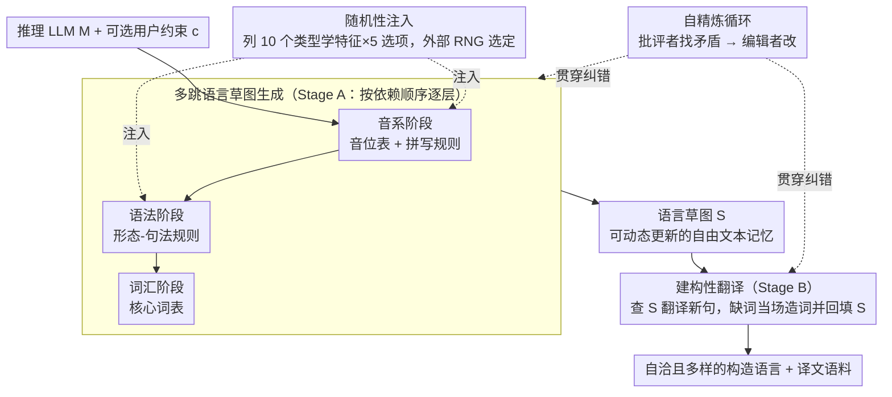

# ConlangCrafter: Constructing Languages with a Multi-Hop LLM Pipeline

**会议**: ACL 2026  
**arXiv**: [2508.06094](https://arxiv.org/abs/2508.06094)  
**代码**: [项目页面](https://conlangcrafter.github.io)  
**领域**: 计算语言学 / 创意生成  
**关键词**: 构造语言, 多跳推理, 类型学多样性, 自精炼, 元语言推理

## 一句话总结

本文提出 ConlangCrafter，一个基于 LLM 的多跳管道，将构造语言（conlang）设计分解为音系、语法、词汇三个模块化阶段，通过随机性注入保证类型学多样性、通过自精炼循环保证内部一致性，并提出了一个包含类型学多样性分析和翻译一致性评估的自动评估框架。

## 研究背景与动机

**领域现状**：构造语言（conlangs）如世界语和精灵语在艺术、哲学和国际交流中扮演重要角色。基础模型已在文本、图像等领域实现了革命性的创意生成。

**现有痛点**：(1) 构造语言的创建极其耗时——设计者可能花费数年甚至数十年才能达到自然语言的范围和复杂性；(2) LLM 在单次提示下难以生成内部一致的复杂语言系统；(3) LLM 倾向于生成缺乏类型学多样性的输出（Hopkins and Renda 2023），产生的语言过于相似；(4) 缺乏评估计算构造语言质量的自动化框架——没有 ground-truth。

**核心矛盾**：LLM 具备元语言推理能力，但直接生成完整语言描述会导致内部矛盾和多样性不足——语言的各层次（音系、语法、词汇）相互依赖，需要分阶段构建。

**本文目标**：(1) 研究 LLM 能否生成内部一致且类型学多样的语言系统；(2) 提出可扩展的自动评估指标；(3) 探索计算构造语言在创意辅助、游戏生成等方面的应用。

**切入角度**：借鉴语言类型学和语言记录实践，将语言描述分为音系→语法→词汇三层，每层通过多步提示构建，利用 RNG 注入类型学多样性，利用自精炼保证一致性。

**核心 idea**：将构造语言生成建模为多跳推理任务——每个语言层次是一个推理步骤，通过维护可动态更新的"语言草图"记忆库来积累和一致化语言知识。

## 方法详解

### 整体框架

构造一门语言难在它有内部依赖：音系决定能拼出哪些词形，语法依赖词形，词汇又依赖语法。直接让 LLM 一次性吐出完整语言描述，结果往往是各层互相矛盾、而且生成的语言彼此都长得太像。ConlangCrafter 的对策是把这件事拆成"多跳推理"——每个语言层次是一个推理步骤，全程维护一份可动态更新的"语言草图"S 来积累和一致化知识。整条管道分两阶段：Stage A（语言草图引导）按音系→语法→词汇的顺序逐层提示 LLM 生成描述并写进 S；Stage B（建构性翻译）拿着 S 把新文本翻译进这门构造语言，过程中还能反过来扩展 S 里的词汇和语法。核心组件就三样：一个推理型 LLM M（如 DeepSeek-R1）、一份自由文本记忆库 S、以及可选的用户约束 c。

### 关键设计

**1. 多跳语言草图生成：把"造一门语言"拆成有依赖顺序的多步推理**

单次提示生成不出足够详细又自洽的语言系统，这是直接生成的根本痛点。作者顺着语言的天然依赖关系把任务切成三层——音系先行（提供词形），语法居中（依赖词形），词汇殿后（依赖语法）——每一层再拆成若干子步骤逐步提示 LLM，结果统一沉淀进语言草图 S。

这种结构和其他复杂推理任务里的多跳方法同源：与其逼模型一步到位，不如让它在一个可读可改的外部记忆上层层加细。S 作为贯穿全程的状态，既让后续步骤能引用前面的决定，也为下一步的自精炼提供了检查对象。

**2. 随机性注入（Randomness Injection）：把多样性的决定权从 LLM 手里交给外部 RNG**

LLM 本身有强烈的"趋同"倾向，放任它自由发挥，生成的语言会在类型学上扎堆、彼此雷同。作者的巧招是在音系和语法阶段开头，先让 LLM 列一张包含 10 个语言类型学特征的检查清单、每个特征给 5 个选项，然后用一个**外部随机数生成器**为每个特征随机选定一个选项，LLM 再据此实例化具体的语言描述。

关键在于分工：LLM 负责提供"哪些类型学选项是合理的"这份知识，RNG 负责"这次到底选哪个"。多样性不再依赖采样温度去碰运气，而是由外部随机源强制铺开，t-SNE 上去掉这一步语言就明显聚成团（见实验）。

**3. 自精炼循环（Self-Refinement）：用同一个 LLM 分饰批评者与编辑者，反复抓矛盾**

语言草图里一旦埋下矛盾，会顺着管道一路传播到后续阶段，而翻译又必须严格服从已构造的语法，所以一致性检查不能省。作者利用"评估比生成容易"这个观察，让同一个 LLM 扮演两个角色：批评者负责找出错误和歧义、列成问题清单，编辑者再照着清单逐条修改，如此迭代直到没有新问题或触达最大迭代次数。

因为只是在已有草图上做局部纠错、而非重新生成，这个循环既便宜又稳，是把"多样但可能自相矛盾"的初稿收敛成"既多样又自洽"成品的关键一环。

### 一个完整示例：从零造一门语言再翻译一句话

以 DeepSeek-R1 为 M、无用户约束为例走一遍。**音系阶段**：LLM 先列出 10 个音系类型学特征（如音节结构、声调有无、辅音丛是否允许……），每个 5 选项；RNG 掷出一组选择，比如"CV 音节 + 无声调 + 不允许辅音丛"，LLM 据此写出音位表与拼写规则，存入草图 S。**语法阶段**：再列 10 个形态-句法特征（语序、格标记、性数一致……），RNG 选出"SOV + 后置词 + 有格标记"，LLM 写出形态规则并追加进 S；批评者此时检查"格标记的形式是否和音系允许的音节冲突"，发现冲突就让编辑者改掉。**词汇阶段**：在已定的音系+语法框架内生成核心词表，仍写进 S。三层走完，S 就是一份自洽的语言描述。**Stage B 翻译**：给一句新英文，LLM 查 S 把它转成构造语言；遇到 S 里没有的词就当场造词、把语法缺口补进 S，再让自精炼循环核对译文是否违反已有语法——这样同一门语言翻译多句时会越来越完整、越来越一致。

### 损失函数 / 训练策略

不涉及模型训练。使用推理时链式思维扩展的大型推理模型（DeepSeek-R1、Gemini 2.5 Flash/Pro）。评估使用 OpenAI o3 作为判断 LLM，避免生成和评估使用同一模型产生偏差。

## 实验关键数据

### 主实验

**类型学多样性评分（Dmean，越高越好）**

| 方法 | Dmean |
|------|-------|
| 自然语言（WALS 数据库，1874 种） | ~0.55 |
| ConlangCrafter (DeepSeek-R1) | 最高 |
| ConlangCrafter (Gemini 2.5 Pro) | 高 |
| ConlangCrafter (Gemini 2.5 Flash) | 高 |
| 单阶段基线 | 低 |

**翻译一致性评分（Nc,t/Nt,t，越高越好）**

| 方法 | 一致性率 |
|------|---------|
| ConlangCrafter (DeepSeek-R1) | 最高 |
| ConlangCrafter (Gemini 2.5 Pro) | 高 |
| 单阶段基线 | 明显更低 |

### 消融实验

| 配置 | 多样性 | 一致性 |
|------|--------|--------|
| 完整 ConlangCrafter | 高 | 高 |
| 去掉随机性注入 | 低（多样性显著下降） | 高 |
| 去掉自精炼 | 高 | 低（一致性显著下降） |
| 单阶段基线 | 低 | 低 |

### 关键发现

- 多跳管道比单阶段方法在类型学多样性和翻译一致性上都显著更好
- 随机性注入是保证多样性的关键——去掉后生成的语言在 t-SNE 可视化中聚集成团
- 自精炼循环对一致性至关重要——没有它翻译中会出现大量语法违反
- 人工专家评估与自动评估中度一致，支持了自动评估框架的有效性
- DeepSeek-R1 在一致性上表现最佳，Gemini 2.5 在多样性上有竞争力

## 亮点与洞察

- "计算构造语言"是一个全新的范式——将 LLM 的"幻觉"转化为创意特性而非缺陷
- 多跳推理+记忆库+自精炼的架构对任何需要构建复杂一致系统的 LLM 任务都有借鉴意义
- 类型学特征检查清单+RNG 的多样性控制策略可迁移到其他需要多样性的生成任务

## 局限与展望

- 语言草图未覆盖语义学、语用学和正字法等更多语言层面
- 自动评估基于 LLM-as-judge，在这种高度专业化任务上仍有局限
- 实验仅使用 10 个测试句子和约 20 种语言，规模相对有限
- 未来可扩展到低资源语言的辅助记录和教育应用

## 相关工作与启发

- **vs 低资源翻译**: 低资源翻译中幻觉是有害的，但构造语言翻译中"幻觉"是必要的创意——目标语言本就不存在
- **vs 过程化世界生成**: ConlangCrafter 可直接用于开放世界游戏中的社会/语言程序化生成
- **vs 链式思维推理**: 多跳管道本质上是一种结构化的思维链，每层对应一个推理步骤

## 评分

- 新颖性: ⭐⭐⭐⭐⭐ 开创了"计算构造语言"这一全新研究范式
- 实验充分度: ⭐⭐⭐⭐ 自动+人工评估，消融实验充分，但样本量有限
- 写作质量: ⭐⭐⭐⭐ 背景动机清晰，方法描述详尽
- 价值: ⭐⭐⭐⭐ 对创意AI和语言学研究有启发，实际应用前景广泛

<!-- RELATED:START -->

## 相关论文

- [\[ACL 2026\] Adaptive Planning for Multi-Attribute Controllable Summarization with Monte Carlo Tree Search](adaptive_planning_for_multi-attribute_controllable_summarization_with_monte_carl.md)
- [\[ACL 2026\] Are Emotion and Rhetoric Neurons in LLM? Neuron Recognition and Adaptive Masking for Emotion-Rhetoric Prediction Steering](are_emotion_and_rhetoric_neurons_in_llm_neuron_recognition_and_adaptive_masking_.md)
- [\[ACL 2026\] Can You Make It Sound Like You? Post-Editing LLM-Generated Text for Personal Style](can_you_make_it_sound_like_you_post-editing_llm-generated_text_for_personal_styl.md)
- [\[ACL 2025\] Multi-document Summarization through Multi-document Event Relation Graph Reasoning in LLMs](../../ACL2025/nlp_generation/event_graph_bias_mitigation_summarization.md)
- [\[ACL 2025\] PerSphere: A Comprehensive Framework for Multi-Faceted Perspective Retrieval and Summarization](../../ACL2025/nlp_generation/persphere_a_comprehensive_framework_for_multi-faceted_perspective_retrieval_and_.md)

<!-- RELATED:END -->
