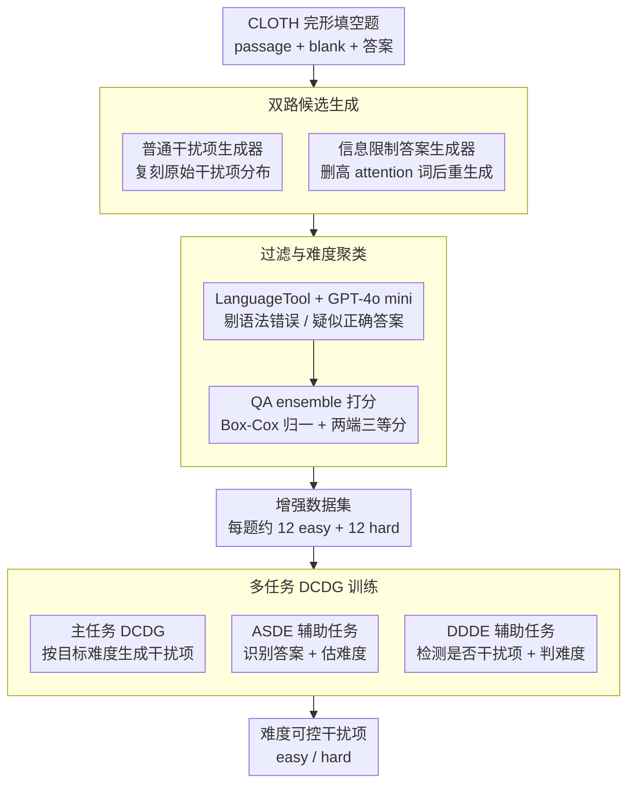

# Difficulty-Controllable Cloze Question Distractor Generation

**会议**: ACL2026  
**arXiv**: [2511.01526](https://arxiv.org/abs/2511.01526)  
**代码**: https://github.com/ksh108405/DCDG  
**领域**: 文本生成 / 教育 NLP  
**关键词**: 完形填空, 干扰项生成, 难度控制, 数据增强, 多任务学习

## 一句话总结
这篇论文提出 DCDG，通过双路干扰项数据增强、QA ensemble 难度聚类和多任务 seq2seq 训练，让完形填空干扰项生成模型可以按 easy/hard 控制难度，并在自动与人工评测中明显优于 GPT-4o。

## 研究背景与动机
**领域现状**：多选完形填空是语言能力测试和在线教育里很常见的题型，自动出题系统通常需要先生成正确答案，再生成若干看起来合理但不应成为正确答案的 distractors。近年的方法多用 PLM 或 text-to-text 模型直接学习数据集中已有干扰项，也有工作用候选词表或知识库做筛选。

**现有痛点**：已有方法更像是在复刻训练集中原本的干扰项分布，能生成“像干扰项”的词，但很难指定它是更容易排除的干扰项，还是与答案更接近、更迷惑学习者的干扰项。另一个现实问题是公开 cloze 数据集通常只有少量人工干扰项，没有大规模难度标注，直接训练 difficulty-aware 模型会缺数据。

**核心矛盾**：干扰项难度既和语义相似度、上下文可替代性有关，又受学习者水平影响。作者为了让问题可操作，把研究边界收窄到语言能力测评中的“上下文语义合理性”：越像可以填入空格但又不应成为正确答案，越难；越明显不合上下文，越易。

**本文目标**：作者要解决两个子问题：第一，如何从没有难度标注的 CLOTH 数据集中扩出大量 easy/hard 干扰项；第二，如何训练一个在输入里指定难度后能稳定生成对应难度干扰项的模型。

**切入角度**：论文的关键观察是，答案生成器知道哪些上下文词对正确答案最关键。如果故意删除这些高注意力词，再让答案生成器补词，它会生成与原答案相关但不再完全受原上下文约束的候选词，这些词天然适合成为不同难度的干扰项。

**核心 idea**：用“信息限制的答案生成器”补充普通 distractor generator，再用 QA ensemble 给候选项分 easy/hard，最后通过主任务加两个辅助任务把难度控制信号写入生成模型。

## 方法详解

### 整体框架

DCDG 的方法分上下两层：上游先从没有难度标注的 CLOTH 数据集里造出一个带 easy/hard 标签的增强数据集，下游再用它训练一个难度可控的干扰项生成器。上游要把每道原始完形填空题扩成约 12 个 easy 和 12 个 hard 候选，下游则要在给定 passage、blank、答案、目标难度和数量时稳定生成指定难度的干扰项。

具体地，第一阶段训练两个 Gemma 2 9B 生成器：一个普通干扰项生成器学习原始 distractor 分布，另一个答案生成器先学会生成正确答案、再被复用到"信息被部分删除的 passage"上去生成"被误导后的答案"。第二阶段用 LanguageTool 和 GPT-4o mini 过滤语法错误或可能成为正确答案的候选。第三阶段用多个 fine-tuned PLM 组成的 QA ensemble 给候选打分，按分数把两端三等分切出 hard / easy。最后用这份增强数据训练 DCDG 主模型，并挂上 ASDE、DDDE 两个辅助任务，让模型真正理解答案、干扰项与难度三者的语义关系。

### 关键设计

**1. 双路候选生成：用"普通生成器 + 信息限制答案生成器"两条腿一起扩候选**

只复刻原始干扰项，候选就被训练数据本身的难度分布锁死；只让 LLM 凭空生成，又不一定贴合 cloze 语境。作者的关键观察是：答案生成器其实知道哪些上下文词对正确答案最关键。于是普通 distractor generator 负责复现数据集里的典型干扰项，answer generator 则先在完整 passage 上生成答案并累计 attention，再**删掉高 attention 词**后重新生成——这时它产出的是"与原答案相关、却不再完全受原上下文约束"的候选，天然适合当不同难度的干扰项。删除比例可设 0.1、0.2、0.4 等，删得越多，候选偏离原答案越远、难度越低。

两条路一个偏数据内风格、一个偏更广的难度覆盖，互补性很强（实验里两路的 semantic overlap 仅 0.29、Jaccard 仅 0.13），合起来才把候选空间真正撑开。

**2. 过滤与难度聚类：先剔无效候选，再用 QA ensemble 的"误选倾向"近似难度**

扩出来的候选良莠不齐，且难度不能靠模型随口贴标签。作者先用 LanguageTool 去掉语法不合格项，再让 GPT-4o mini 判断候选是否可能本身就是正确答案、把这类剔除；剩下的候选交给一个由 11 个模型家族、18 个小 PLM fine-tune 成的多选 cloze QA ensemble 打分，分数衡量"这个选项有多像正确答案"。分数最高的三分之一标 hard，最低的三分之一标 easy，中间一段直接丢弃。

这一步的巧处在于，难度不是主观打的，而是用"候选被 QA 模型误选为答案的可能性"来近似——越容易被误选越难。由于不同模型的分数分布右偏、不能直接平均，作者用 Box-Cox normalization 把它们拉到可比尺度后再聚合。

**3. 多任务 DCDG 训练：主任务之外再加两个辅助任务，逼模型理解"为什么这是干扰项"**

如果只训练"给定难度生成干扰项"，模型很容易把难度 token 当成贴在表面的标签、并不真懂。为此主任务 DCDG 接收 passage、生成数量、目标难度和答案后输出对应难度的干扰项；ASDE 辅助任务要求模型在混合选项里找出正确答案、并估计各干扰项的难度；DDDE 辅助任务则把某个 distractor 填回 blank，让模型检测它是不是干扰项并判断其难度。

三个任务一起训，模型被迫同时学会"答案的可替代性""错误选项的属性""难度的相对高低"，hard 和 easy 的可分性因此显著提升——这也是消融里 ASDE+DDDE 能压低无效率、同时守住难度控制的原因。

### 一个完整示例：一道题如何被扩成带难度标签的训练样本

拿一道完形填空题（passage + blank + 正确答案 + 原始干扰项）走一遍。**双路生成**：普通干扰项生成器平均产出约 29.66 个候选（语义多样性 0.6684），信息限制答案生成器在删高 attention 词后平均产出约 19.25 个候选（语义多样性 0.6928，更分散）；两路合并、去重后得到一大堆候选。**过滤**：LanguageTool 先砍掉语法不通的，GPT-4o mini 再砍掉"其实是正确答案"的——后者很关键，因为高 attention 删除若改成随机/低 attention 删除，会有 40%+ 候选退化成正确答案，而高 attention 删除能把这个比例压到 20% 以下。**聚类**：剩余候选交给 18 个 PLM 的 QA ensemble 打分、Box-Cox 归一后排序，最高三分之一进 hard 桶、最低三分之一进 easy 桶，中段丢弃，最终每题落到约 12 个 easy + 12 个 hard。**训练**：这些带标签的样本喂给 DCDG 主模型，配合 ASDE / DDDE 两个辅助任务，模型学会"输入 hard 就给迷惑性强、输入 easy 就给明显不合上下文"的干扰项。

### 损失函数 / 训练策略

所有任务都统一成 seq2seq 交叉熵训练。候选生成和 DCDG 主模型都使用 Gemma 2 9B；数据增强阶段采用 5-fold cross-validation，避免模型在生成增强候选时看到同一题的训练答案。DCDG 使用 LoRA，$r=16$、$\alpha=16$，warm-up ratio 为 0.1；DDDE 学习率设为 $5e^{-5}$，其他任务为 $3e^{-5}$，并用 early stopping 控制过拟合。

## 实验关键数据

### 主实验
| 实验对象 | 指标 | 本文方法 | 对比对象 | 关键结论 |
|--------|------|----------|----------|----------|
| 增强数据集 | 每题 easy distractors 数 | 12.06 | 原始 CLOTH 约 2.998 | 大幅扩充干扰项数量 |
| 增强数据集 | 每题 hard distractors 数 | 12.02 | 原始 CLOTH 约 2.998 | hard/easy 两端都有足量样本 |
| 增强 easy | GPT-4o 判为 Easiest | 73.17% | 原始 distractor 21.21% | easy 标签符合预期 |
| 增强 hard | GPT-4o 判为 Hardest | 70.05% | 原始 distractor 26.53% | hard 标签明显更迷惑 |
| DCDG + ASDE + DDDE | easy 生成判为 Easiest | 64.23% | GPT-4o 0-shot 为 33.54%, 5-shot 为 46.39% | 难度控制优于 GPT-4o |
| DCDG + ASDE + DDDE | hard 生成判为 Hardest | 73.25% | GPT-4o 0-shot 为 56.77%, 5-shot 为 53.81% | hard 控制最强 |

### 消融实验
| 配置 | 关键指标 | 说明 |
|------|---------|------|
| Answer generator w/ IR | 每题 19.25 个候选, semantic diversity 0.6928 | 信息限制答案生成器候选更分散 |
| Distractor generator | 每题 29.66 个候选, semantic diversity 0.6684 | 普通生成器产量更高但语义覆盖略窄 |
| 两路候选重叠 | semantic overlap 0.2908, Jaccard overlap 0.1281 | 两路生成高度互补 |
| 删除比例 0.1 | diversity 0.6554, plausibility 0.3404 | 更接近答案，难度更高 |
| 删除比例 0.5 | diversity 0.6734, plausibility 0.2920 | 更分散，难度更低 |
| DCDG + ASDE + DDDE | invalid ratio: easy 0.2%, hard 5.1% | 在保持难度控制时减少无效干扰项 |

### 关键发现
- 高注意力删除比随机删除或低注意力删除更有效；论文报告在删除 25% 词时，低注意力/随机删除会导致超过 40% 候选重复为正确答案，而高注意力删除可把重复率压到 20% 以下。
- 人工 ESL 评测与自动评测趋势一致：模型生成的 easy 有 72.8% 被评为 Easiest，hard 有 45.6% 被评为 Hardest，invalid ratio 均不超过 1.6%。
- GPT-4o 与人类难度排序的 Spearman 相关为 0.54，接近人类之间一致性 0.62，说明用 GPT-4o 做大规模难度评估在这个三选排序设置下是可接受代理。

## 亮点与洞察
- 最巧妙的点是把“答案生成器失败”变成“干扰项生成能力”：通过删除关键上下文，让原本追求正确答案的模型产生与答案相关但不完全正确的候选，比直接提示 LLM 生成干扰项更可控。
- 难度标签没有直接依赖主观打分，而是通过 QA ensemble 的选择倾向来近似，这让 easy/hard 既有任务定义，又能被自动扩展到大规模数据。
- ASDE 和 DDDE 的价值在于让模型理解“为什么这是干扰项”而不只是“生成一个标了 hard 的词”，这个思路可以迁移到答案生成、错误选项解释、阅读理解题项质量控制等教育 NLP 任务。

## 局限与展望
- 作者承认本文只控制 distractor difficulty，没有把 passage 可读性、句法结构、blank 位置等题目整体难度因素纳入统一建模。
- 难度被离散成 easy/hard 二分类，虽然避免了任意连续阈值，但也损失了更细粒度的教学适配能力。
- 信息限制策略主要面向 word-level cloze question，对开放式问答、数学题或其他题型是否有效仍需重新设计删除规则和有效性过滤。
- 后续可以把 QA ensemble 的 normalized score 作为连续难度轴，再结合教师或学习者反馈做校准，形成更细的个性化难度控制。

## 相关工作与启发
- **vs 传统知识库/词表方法**: 早期方法依赖 WordNet、Probase 或人工候选表，优点是可解释，缺点是领域覆盖有限；本文改用生成模型和过滤器扩展候选，覆盖更广。
- **vs PLM 直接生成干扰项**: Chiang 等和 Wang 等方法能生成自然干扰项，但难度控制弱；本文通过增强数据和多任务训练显式引入难度信号。
- **vs IRT-based 难度建模**: IRT 更接近真实学习者能力，但需要大量答题数据且计算昂贵；本文采用离散 difficulty proxy，更适合缺少学生响应数据的公开 cloze 数据集。
- **启发**: 对很多教育生成任务，可以先构造“可被自动评估的行为代理指标”，再训练可控生成模型，而不是直接要求 LLM 在提示词里理解抽象教学难度。

## 评分
- 新颖性: ⭐⭐⭐⭐☆ 把信息限制答案生成器用于干扰项扩增很有辨识度，难度聚类和多任务训练组合完整。
- 实验充分度: ⭐⭐⭐⭐⭐ 自动评测、人工 ESL 评测、专家评测、两路生成分析和多任务对比都比较扎实。
- 写作质量: ⭐⭐⭐⭐☆ 方法链条清楚，表格较多但支撑充分，附录承担了不少实现细节。
- 价值: ⭐⭐⭐⭐☆ 对教育 NLP 和自动题目生成很实用，也提供了可复用数据与模型。

<!-- RELATED:START -->

## 相关论文

- [\[ACL 2026\] Children's English Reading Story Generation via Supervised Fine-Tuning of Compact LLMs with Controllable Difficulty and Safety](childrens_english_reading_story_generation_via_supervised_fine-tuning_of_compact.md)
- [\[ACL 2026\] Adaptive Planning for Multi-Attribute Controllable Summarization with Monte Carlo Tree Search](adaptive_planning_for_multi-attribute_controllable_summarization_with_monte_carl.md)
- [\[ACL 2026\] XtraGPT: Context-Aware and Controllable Academic Paper Revision via Human-AI Collaboration](xtragpt_context-aware_and_controllable_academic_paper_revision_via_human-ai_coll.md)
- [\[CVPR 2025\] ArtFormer: Controllable Generation of Diverse 3D Articulated Objects](../../CVPR2025/nlp_generation/artformer_controllable_generation_of_diverse_3d_articulated_objects.md)
- [\[ACL 2026\] FACTS: Table Summarization via Offline Template Generation with Agentic Workflows](facts_table_summarization_via_offline_template_generation_with_agentic_workflows.md)

<!-- RELATED:END -->
