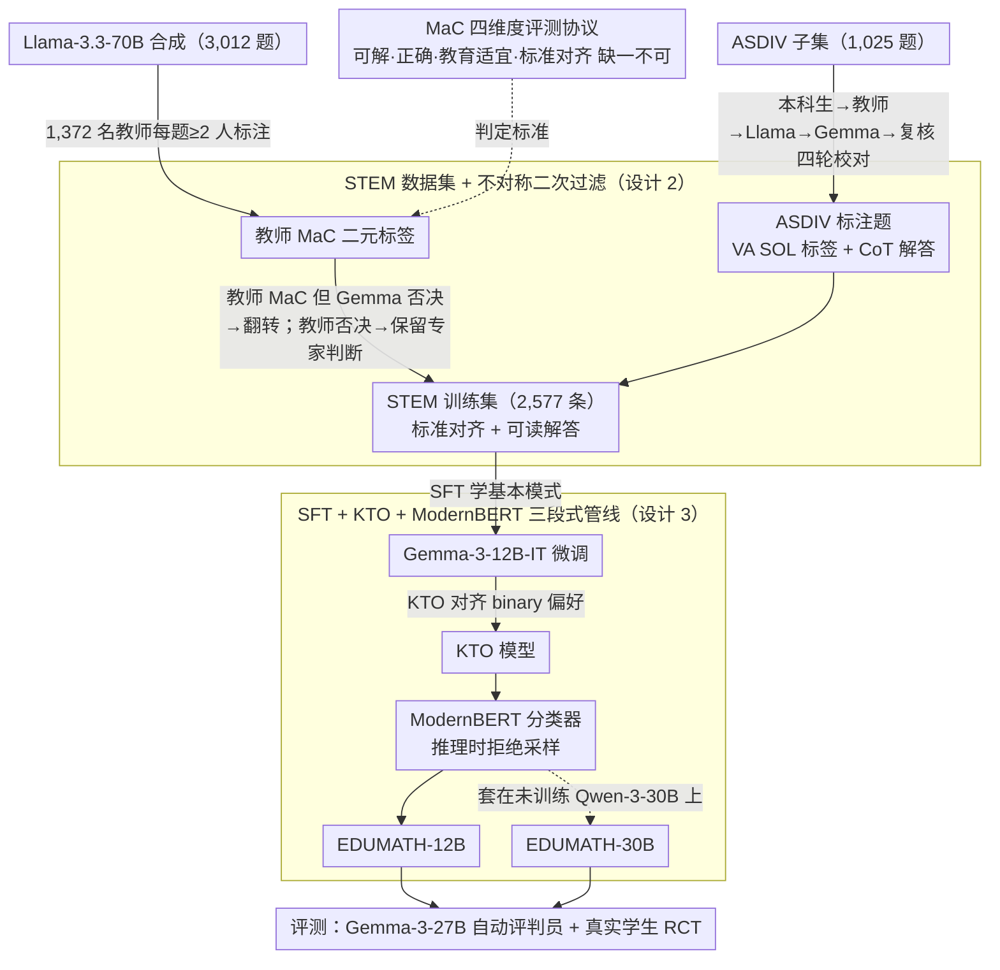

# EDUMATH: Generating Standards-aligned Educational Math Word Problems

**会议**: ACL 2026  
**arXiv**: [2510.06965](https://arxiv.org/abs/2510.06965)  
**代码**: https://github.com/bryanchrist/EDUMATH  
**领域**: 文本生成 / 教育  
**关键词**: 数学应用题生成、标准对齐、教师标注、KTO、ModernBERT 过滤

## 一句话总结
作者把"按 K-12 数学课程标准生成应用题（MWP）"任务系统化，搜集了 11,000+ 由真实美国教师标注的 MWP 训练数据 STEM，用 SFT + KTO + ModernBERT 过滤训出 EDUMATH-12B/30B 两个开源 SOTA 生成器，并在 3-5 年级真实学生身上做了第一个 RCT，发现学生在 LLM 题与人写题上正确率相当但**几乎一致偏好定制 LLM 题**。

## 研究背景与动机

**领域现状**：数学应用题（MWP）是 K-12 数学教学的核心评估工具，"按学生兴趣 + 能力定制"被广泛证明能提升学习效果。但老师人手不足、burn-out 严重，无法逐个学生写题，只能从有限题库拼凑。LLM 强大的语言能力让"自动生成 MWP"看似水到渠成，但 Christ 2024、Ariyarathne 2025 等先验工作发现 LLM 在教育级 MWP 上仍然差距明显。

**现有痛点**：(1) **无答案**：现有生成工作（Ariyarathne 2025、Sun 2025）只产生题面、不产生解题步骤，老师/学生不能直接用；(2) **粒度太粗**：对齐到"加减法"这种 topic 而非"单步、两位数以内加减法"这类完整 standard，老师无法精细控制难度；(3) **缺真实评测**：之前评测要么靠 LLM 自评、要么找大学生而不是真正在职教师，没有"产品级"信号；(4) **缺训练数据**：GSM8K / ASDIV / SVAMP 等都没按 K-12 课程标准标注，无法直接训生成器。

**核心矛盾**：教育 MWP 必须同时满足"可解、解答准确、教育适宜、严格对齐标准"四条互相牵制的硬约束；任何一条不达标都会被老师退稿。但已有 LLM 训练数据都只满足其中 1-2 条。

**本文目标**：(1) 定义"standards-aligned educational MWP generation"任务并给出 4 个评测维度；(2) 构造首个被教师标注、且解答可读的训练集 STEM；(3) 训出小尺寸开源模型却能匹敌闭源 SOTA 的生成器；(4) 在真实小学生身上做第一次受控用户研究。

**切入角度**：选用 Virginia SOL（VA SOL）而非 Common Core——因为 VA SOL 对每条标准都注明"数值范围、步骤数"等可量化难度约束，比 Common Core 更适合做"严格对齐"。

**核心 idea**：用"教师 + LLM 双重标注"把 ASDIV 子集 + 3,012 条 LLM 合成 MWP 过滤成"完全合格"集合（MaC，meets all criteria），再用 SFT → KTO → ModernBERT 三段式管线训练 + 过滤，把"高质量数据"和"分类器后处理"分别贡献给小模型与大模型。

## 方法详解

### 整体框架
五阶段 pipeline：(1) **标注 ASDIV 子集**——把 1,025 道 3-5 年级题用"本科教育生 → K-12 教师 → Llama-3.3-70B → Gemma-3-27B → 教育生最终复核"四轮校对，给出 VA SOL 标签和 CoT 解答；(2) **合成 + 教师标注**——用 Llama-3.3-70B 在 23 个有题 + 15 个未覆盖 SOL 组合上各生成 80-90 题，共 3,012 题，由 1,372 名 Prolific 美国教师每题至少 2 人标 4 维度，分歧加第三人，按多数投票得 MaC 标签，再让 Gemma-3-27B 做"质量复检"翻转可疑标签；(3) **训练 EDUMATH 12B**——Gemma-3-12B-IT 在 STEM 上做 SFT，再用 KTO 在所有教师标注（含 MaC 与非 MaC）上对齐二元偏好，最后叠加 ModernBERT MaC 分类器做拒绝采样；(4) **训练 EDUMATH 30B**——直接把 ModernBERT 分类器扣在 Qwen-3-30B 输出上做过滤，**不训练**主干；(5) **评测**——对 5 个开源 + 3 个闭源 baseline 各采 250-1000 题，用 Gemma-3-27B 当自动评判员（与教师 κ 持平）+ 真实学生 RCT。

### 关键设计

**1. 四维度 MaC（Meets-All-Criteria）评测协议：把"教育级"压成一条最严的二元门槛**

以往 MWP 评测只看可解性加正确性，结果"题面与标准不符"或"解答冗长绕圈"的题也能轻松过关，但真实老师只要看到任何一条不合格就会退稿。MaC 正是照搬这种工作流，把一道题拆成四条二元判定、缺一不可：Solvability 看题面是否有解且答案唯一；Accuracy 要求 CoT 解答既终答案对、中间推理又可读不绕；Educational Appropriateness 看有无语法错误、冲突信息、是否适合 3-5 年级课堂；Standards Alignment 则严格核验是否满足 VA SOL（含数值范围、步骤数等可量化约束）。只有四条全为 True 才算 MaC。正因为是四维联合，门槛被压到极严，教师对 MaC 的一致率只有 $65.5\pm1.7\%$——看似偏低，其实是严苛鉴别力的直接代价。

**2. STEM 数据集 + 教师 × LLM 不对称二次过滤：把稀缺的专家信号洗到最干净**

GSM8K、ASDIV 这些数据集都没按 K-12 标准标注，训不出对齐的生成器，于是作者构造了首个"教师标注 + 标准对齐 + 可读解答"三合一的训练集 STEM（2,577 条），由 ASDIV 子集（1,025）和教师判为 MaC 的合成题（1,552）合并而成。关键在过滤规则的不对称：对"教师标 MaC 但 Gemma 复检否决"的样本翻转为非 MaC，借机器扫掉人工疲劳漏检；而对"教师否决但 Gemma 通过"的样本则保留教师判断，信任专家对微妙不适宜的直觉。单靠教师标注成本高又有疲劳误差，单靠 LLM 又看不出教师才能察觉的细节，这条规则恰好把两端各自的最大价值留下。同时还记录每条题的 token 长度、8 项可读性指数的复合分、BERTScore F1 等度量，让数据风格贴近人写题。

**3. SFT + KTO + ModernBERT 的三段式生成管线：把有限标注的每分价值都榨出来**

高质量标注既贵又少，这条管线的目的就是让它撑起跨档的能力跃迁——使 12B 模型匹敌 27B、30B 反超闭源。SFT 先用 STEM 监督模型学会"可解 + 标准对齐 + 可读 CoT"的基本模式；接着 KTO（Kahneman-Tversky Optimization）拿 binary MaC 标签当正/负样例做对齐，它不需要成对偏好，正好契合教师投票天然产出的 binary 信号，也比要 pairwise 的 DPO/RLHF 更稳；最后再训一个 ModernBERT 二分类器（AUC-ROC 0.861），在推理时对 LLM 输出做拒绝采样。这层后处理对 EDUMATH-12B 带来 +4.9% MaC，对完全未训练的 Qwen-3-30B 更是直接把它推到 SOTA——分类器把"训练成本"和"质量门槛"解耦，任何未来更强的 LLM 都能零训练接入，等于把这批标注的价值长期复用。

### 损失函数 / 训练策略
SFT：Gemma-3-12B-IT，5 epoch，lr=$1\times 10^{-6}$，bs=1，10% warm-up，按验证集 loss 选 checkpoint（step 10k）；KTO：合并教师标注 + ASDIV = 4,039 条，4×A100-80G，5 epoch，lr=$5\times 10^{-6}$，bs=8，desirable/undesirable 权重按反频；ModernBERT：3,664 行（含正负不平衡），10 epoch，lr=$1\times 10^{-5}$，bs=8，按反频加权交叉熵；评测：以 STEM 中 8-shot 例题作 prompt，所有模型用同一提示模板生成 1,000（开源）/250（闭源）题。

## 实验关键数据

### 主实验
8 个模型在 4 维 MaC 上的对比（基于 Gemma-3-27B 自动评判员，与教师 κ 持平）：

| 模型 | PPL ↓ | BF1 vs 同 | ASDIV BF1 | Q 长度 | A 长度 | MaC ↑ |
|------|-------|-----------|-----------|--------|--------|-------|
| GPT-4o (API) | 16.1 | 75.2 | 74.2 | 63.5 | 152.3 | 92.8 |
| GPT-4.1 (API) | 16.3 | 75.3 | 74.3 | 64.5 | 150.2 | 92.8 |
| GPT-4.5 (API) | 15.7 | 75.0 | 74.1 | 61.8 | 150.6 | 92.0 |
| Gemma-3-12B-IT | 11.3 | 77.2 | 74.0 | 84.7 | 240.8 | 63.9 |
| Gemma-3-27B-IT | 12.2 | 77.1 | 74.5 | 76.1 | 215.1 | 75.4 |
| Qwen-3-30B-IT | 12.3 | 76.9 | 74.0 | 68.1 | 202.9 | 87.3 |
| Qwen-3-235B-IT | 12.5 | 76.1 | 74.1 | 66.5 | 186.5 | 89.0 |
| **EDUMATH-12B** | **9.5** | 74.5 | 73.8 | 54.9 | 166.7 | 85.9 |
| **EDUMATH-30B** | 12.0 | 76.1 | 73.8 | 60.4 | 163.5 | **94.6** |

关键点：(1) EDUMATH-30B 以 94.6% MaC 反超 GPT-4.5（92.0%）和 GPT-4o（92.8%）成为 SOTA；(2) EDUMATH-12B（85.9%）在仅 12B 参数下逼近 30B 级别开源模型；(3) EDUMATH-12B 的 PPL 9.5 最低 + 题长 54.9 最接近人写均长 53.9，说明输出风格与教师手写最贴近；(4) BERTScore 显示 EDUMATH 与 ASDIV 的同质性几乎等于 ASDIV 内部 BF1，意味着"多样性 ≈ 人写水平"。

### 消融实验（EDUMATH-12B 三段式 pipeline）

| 阶段 | MaC % |
|------|-------|
| Gemma-3-12B-IT base | 63.9 (±1.5) |
| + SFT on STEM | 76.2* (+12.3) |
| + KTO | 81.0* (+4.8) |
| + ModernBERT 过滤（最终 EDUMATH-12B） | **85.9*** (+4.9) |

每一阶段相比上一阶段都有 $p<0.01$ 显著提升。按 topic 拆解（表 3）显示 EDUMATH-30B 是唯一在 8 大数学 topic 上 MaC 均 > 90 % 的模型，证明能力分布均衡。

### 关键发现
- **三段式管线缺一不可**：SFT 给基础模仿、KTO 校准 binary 偏好、ModernBERT 兜底，把 12B 从 63.9% 推到 85.9% 这种跨档跃迁完全靠数据 × 训练 × 推理后处理叠加。
- **过滤分类器对未训练大模型同样有用**：Qwen-3-30B 直接套 ModernBERT 即跃居 SOTA，说明作者的"标注价值"具备模型无关性，可迁移到任意未来更强模型。
- **错误剖析**：所有模型的最大失败模式是 Accuracy（解答冗长或推理错），约占 30-60% 错误；Educational Appropriateness 几乎不出错，证明 LLM 在"学校适宜内容"上已饱和，但"清晰简洁的解题逻辑"还是瓶颈。
- **真实学生 RCT 结论**：3-5 年级共 94 名学生在两所小学测试，EDUMATH 题与人写题正确率几乎一致，但**绝大多数学生偏好定制 LLM 题**（School 2 个性化场景下 12 名学生中 11 名选 LLM 题），证据点为"喜欢题目里的话题"——这是"customization → engagement"链条的首批受控证据。

## 亮点与洞察
- **把"教育对齐"从'topic 级'下推到'标准级'**：VA SOL 把"两位数、单步、加法"作为可机器化校验的约束，使得 standards-aligned 任务首次具备可量化评分，未来任何 K-12 教育 LLM 都可以照搬这套"标准 → 难度向量"的设计哲学。
- **KTO 与 ModernBERT 的组合是"无配对偏好"教育场景的最优解**：DPO/RLHF 要 pairwise 偏好，教师投票天然 binary；KTO 直接拥抱这种粒度且训练稳定；分类器再把推理期质量门槛抬高，整套方案在小机房（4×A6000/4×A100）即可复现。
- **首个针对生成 MWP 的小学生 RCT**：以往多用大学生或自动指标做替代，本文请实际课堂学生做盲测，证明 LLM 题能"既不输又更受喜爱"，是 AI-for-Education 少见的"真实人评"工作。
- **教师与 Gemma 不对称翻转规则**：把人 / LLM 各自的优势分别吸收，是数据清洗策略上很可借鉴的小招——比起单纯多数投票，能在不增加成本的前提下抬升标签信噪比。

## 局限与展望
- 仅覆盖 3-5 年级数学，且只评英语 SOL；扩到 K-2 / 6-12 或多语种需重新做教师标注。
- 全文本，无图表/几何图，与现实教材里大量图文题不符；多模态 MWP 生成尚未尝试。
- 同一 prompt 套到所有模型保证公平，但闭源模型可能在自身定制 prompt 下表现更好；prompt-engineering 维度未做。
- 评测高度依赖单一自动评判员 Gemma-3-27B；尽管 κ 与教师持平，仍存在"评判员偏好"的潜在系统偏差。
- 学生 RCT 样本 n=94 偏小，且仅两所学校；推广到不同地区/社经背景还需扩 N。

## 相关工作与启发
- **vs MATHWELL (Christ 2024)**：他们对齐到学生兴趣却没对齐到课程标准，且只有 3 维评测；本文新增 Standards Alignment 维度并把数据规模和模型规模都扩大一档。
- **vs Mathwizards / Sun 2025**：他们生成"按 topic 对齐的练习题"但**无解答**；EDUMATH 同时输出题面 + 可读 CoT 解答，老师可直接用。
- **vs GSM8K / ASDIV / SVAMP**：这些数据集训的是 solver，本文用 STEM 训的是 generator——同样是 MWP 但任务方向相反，是"教育向 LLM"研究的另一面。
- **vs OpenAI GPT 系列**：闭源模型 MaC 已经很高（92%+），但 EDUMATH-30B 在 8 个 topic 上更均衡且单题 PPL 更优，证明高质量开放数据 + 推理时过滤足以反超。
- **启发**：任何"严格规范化输出 + 标签稀缺"领域（医学问答、法律合同、考试题库）都可以借鉴"教师 + LLM 双重标注 → SFT+KTO+分类器三段管线 → 真人用户 RCT"的整套范式。

## 评分
- 新颖性: ⭐⭐⭐⭐ 标准级对齐 + 二元 MaC 评测 + KTO+ModernBERT 组合，单项不算炫但整合起来形成全新可复现的 pipeline。
- 实验充分度: ⭐⭐⭐⭐⭐ 11,000+ 教师标注 + 8 模型对比 + 8 topic 拆解 + 真实学生 RCT，远超同类工作。
- 写作质量: ⭐⭐⭐⭐ 五阶段叙事清晰，表 1-3 信息密度高；少量 appendix 引用在正文未充分展开。
- 价值: ⭐⭐⭐⭐⭐ 把数据 + 模型 + 评估全套开源，立即可用，对降低教师 burnout 有直接社会价值。

<!-- RELATED:START -->

## 相关论文

- [\[ACL 2026\] Can You Make It Sound Like You? Post-Editing LLM-Generated Text for Personal Style](can_you_make_it_sound_like_you_post-editing_llm-generated_text_for_personal_styl.md)
- [\[ACL 2026\] Investigating the Representation of Backchannels and Fillers in Fine-tuned Language Models](investigating_the_representation_of_backchannels_and_fillers_in_fine-tuned_langu.md)
- [\[ACL 2026\] Are Emotion and Rhetoric Neurons in LLM? Neuron Recognition and Adaptive Masking for Emotion-Rhetoric Prediction Steering](are_emotion_and_rhetoric_neurons_in_llm_neuron_recognition_and_adaptive_masking_.md)
- [\[ACL 2026\] Frankentext: Stitching Random Text Fragments into Long-Form Narratives](frankentext_stitching_random_text_fragments_into_long-form_narratives.md)
- [\[ACL 2026\] XtraGPT: Context-Aware and Controllable Academic Paper Revision via Human-AI Collaboration](xtragpt_context-aware_and_controllable_academic_paper_revision_via_human-ai_coll.md)

<!-- RELATED:END -->
