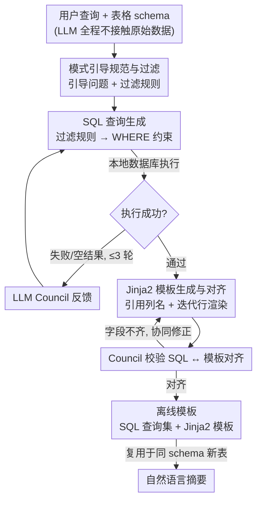

# FACTS: Table Summarization via Offline Template Generation with Agentic Workflows

**会议**: ACL 2026 Findings  
**arXiv**: [2510.13920](https://arxiv.org/abs/2510.13920)  
**代码**: [GitHub](https://github.com/BorealisAI/FACTS)  
**领域**: 数据分析 / 表格理解  
**关键词**: 表格摘要, 离线模板, Agentic工作流, SQL生成, 隐私合规

## 一句话总结

本文提出 FACTS（Fast, Accurate, and Privacy-Compliant Table Summarization），通过三阶段 Agentic 工作流自动生成可复用的离线模板（SQL 查询 + Jinja2 模板），实现快速、准确、隐私合规的查询聚焦表格摘要，在 FeTaQA、QTSumm 和 QFMTS 三个基准上全面超越基线。

## 研究背景与动机

**领域现状**：查询聚焦表格摘要（query-focused table summarization）要求根据用户查询从表格数据生成自然语言摘要，不同于简单的表格问答（返回短答案）和通用表格摘要（捕捉所有重要内容）。在金融、医疗、法律等领域，专业人员依赖定制化摘要做决策。

**现有痛点**：(1) 表格到文本模型（如 TAPEX、ReasTAP）需要昂贵的微调，且在数值推理和逻辑忠实度上表现不佳；(2) 基于提示的方法（如 DirectSumm）直接查询 LLM，受 token 限制，暴露敏感数据，且需为每张新表重新生成；(3) 现有 Agentic 框架（如 Binder、Dater）依赖分解规划或手工模板，缺乏鲁棒性和可扩展性。

**核心矛盾**：实用方案必须同时满足四个属性——快速（可复用）、准确（基于执行而非自由生成）、可扩展（不需传递所有行）、隐私合规（不暴露原始数据给 LLM）——但现有方法无一满足全部。

**本文目标**：设计首个自动化离线模板生成的 Agentic 框架，一次生成、多次复用，满足所有四个属性。

**切入角度**：将表格摘要分解为 SQL 查询（提取精确值）+ Jinja2 模板（渲染自然语言），形成可独立于数据值的离线模板。

**核心 idea**：离线模板绑定于表格 schema 和查询语义而非具体数据值——一旦生成，可直接应用于任何共享相同 schema 的新表格，避免重复 LLM 推理。

## 方法详解

### 整体框架

FACTS 由三个互联阶段组成，每个阶段的输出由 LLM Council（多模型集成验证）迭代验证和改进。最终产出为离线模板——SQL 查询集 + Jinja2 渲染模板。LLM 全程仅接触 schema 信息，从不暴露原始数据。

### 关键设计

**1. Schema-Guided Specification and Filtering（模式引导规范与过滤）：把高层自然语言查询翻译成 schema 级的具体操作**

用户查询通常是一句高层次的自然语言，直接喂给模型既难精确执行又会暴露数据，所以第一阶段先做"翻译"。Agent 只拿到用户查询和表格 schema，产出两类输出：一是引导问题（guided questions），用来识别哪些列、关系和操作与查询相关；二是过滤规则（filtering rules），指定要排除的行或类别值。关键在于 LLM 全程不接触任何原始数据，只能基于 schema 提出抽象规则——例如 `exclude rows where category='expense'`，这条规则随后才被转化为 SQL 的 WHERE 子句。这样既明确了查询意图，又把"看数据"这一步完全挡在本地。

**2. SQL Queries Generation（SQL 查询生成）：把摘要建立在可执行程序上，从根上消除幻觉**

自由文本生成的最大风险是数值和逻辑被模型编造，FACTS 的对策是让数据提取这一步只走 SQL。Agent 基于第一阶段的规范生成候选 SQL，把过滤规则落成约束条件，每条查询都在本地数据库上真正执行验证：一旦执行失败或返回空结果，错误信息就回传给 LLM Council 作反馈，Agent 据此迭代修正，最大 patience 设为 3 轮。因为最终数字全部来自数据库执行而非模型臆测，摘要的事实正确性从机制上就得到了保证。

**3. Jinja2 Template Generation and Alignment（Jinja2 模板生成与对齐）：把数据提取和文本渲染解耦，各自可验证、可复用**

有了精确的 SQL 结果还需要变成自然语言，这一步交给 Jinja2 模板，并要求它引用精确列名、正确迭代返回的行、对空结果优雅处理。LLM Council 会专门检查 SQL 输出与模板引用是否对齐——若出现字段缺失或形状不兼容，SQL 与模板会被协同修正。把"取数"（SQL）和"成文"（Jinja2）拆成两层后，正确性由程序执行兜底、可读性由模板渲染负责，两者都能独立验证；更重要的是，这套 SQL + 模板的组合一旦生成就绑定在 schema 与查询语义上、与具体数据值无关，从而可以直接套用到任何共享同一 schema 的新表，避免重复的 LLM 推理。

### 一个完整示例

以一句"汇总本季度各部门的非支出类收支"为例：第一阶段，Agent 只看到 schema（如 `dept, category, amount, quarter`），生成引导问题"需要按 dept 聚合 amount"并产出过滤规则 `exclude rows where category='expense'`；第二阶段，规则被翻成 `SELECT dept, SUM(amount) ... WHERE category != 'expense' GROUP BY dept`，在本地库执行，若首次因列名拼写报错则回传 Council、Agent 修正后重跑（平均 1.36 轮即通过）；第三阶段，Agent 生成 Jinja2 模板遍历返回行渲染成"市场部本季度净收入 …、研发部 …"，Council 校验模板字段与 SQL 列一一对齐（平均 1.84 轮）。整套模板存下来后，下个季度换一张同 schema 的新表，只需重新执行 SQL + 渲染、无需再调用 LLM。

### 损失函数 / 训练策略

FACTS 为无训练方法。主 Agent 使用 GPT-4o-mini 作为骨干。LLM Council 由 GPT-4o-mini、Claude-4 Sonnet 和 DeepSeek v3 组成，通过多数投票决定接受/拒绝，聚合反馈指导改进。每样本平均 2.47 个引导问题/过滤规则、1.36 轮 SQL 修正、1.84 轮模板修正。

## 实验关键数据

### 主实验

| 方法 | FeTaQA BLEU/RL/MET | QTSumm BLEU/RL/MET | QFMTS BLEU/RL/MET |
|------|---------------------|---------------------|---------------------|
| CoT | 28.2/51.0/56.9 | 19.3/39.0/47.2 | 31.5/54.3/58.1 |
| DirectSumm | 29.8/51.7/58.2 | 20.7/40.2/50.3 | 33.6/57.0/62.8 |
| SPaGe | 33.8/55.7/62.3 | 20.9/41.3/47.7 | 45.7/68.3/73.4 |
| FACTS (GPT-Only) | 30.8/55.7/66.0 | 20.1/43.1/50.5 | 45.4/70.5/73.2 |
| **FACTS** | **32.6/58.9/67.7** | **21.9/45.8/51.3** | **46.0/70.8/73.2** |

### 消融实验

| 评估维度 | FACTS 得分 |
|----------|-----------|
| 意图匹配 | 97% |
| SQL 执行准确率 | 94% |
| 模板渲染准确率 | 98% |
| Council 共识错误率 | ~3% |
| 整体事实正确率 | ~92% |

### 关键发现

- FACTS 在所有三个数据集上均达到最佳或次佳结果，尤其在 ROUGE-L 和 METEOR 上优势明显
- 人类偏好研究：FACTS vs SPaGe——55% 偏好 FACTS 的完整性，59% 偏好正确性，60% 偏好减少幻觉
- 复用性测试：100 张同 schema 表时，FACTS 因模板复用大幅加速（仅需 SQL 执行 + Jinja2 渲染）
- GPT-Only 变体仍超越大多数基线，证明核心工作流本身有效，Council 多样性进一步增强
- 每样本平均消耗 9,922 输入 token 和 1,045 输出 token，计算成本可控

## 亮点与洞察

- "离线模板"概念是工程上的优雅创新——将一次性的 LLM 推理成本摊薄到无限次复用中，特别适合企业场景（如每年重复的财务报告摘要）
- LLM Council 的多数投票 + 聚合反馈机制提供了轻量级的自我修正能力，~3% 的共识错误率表明多模型集成有效
- 隐私合规设计是该方法的核心优势——LLM 仅接触 schema，原始数据值完全留在本地 SQL 引擎中
- SQL + Jinja2 的组合将"正确性"和"可读性"解耦——前者由程序执行保证，后者由模板渲染实现

## 局限与展望

- 假设模板在相同 schema 下完全复用，未考虑 schema 漂移或列重命名
- 对复杂的多表 JOIN 和嵌套查询可能需要更多修正轮次
- SQL 执行准确率 94% 意味着仍有 6% 的错误——对高风险决策可能不够
- Jinja2 模板的自然语言表达可能在不同语言/文化背景下需要调整

## 相关工作与启发

- **vs DirectSumm**: 后者一次性将全表+查询传给 LLM，暴露数据且不可复用；FACTS 通过离线模板解决了两个问题
- **vs SPaGe**: SPaGe 使用图结构化规划提高可靠性，但其规划仅部分可复用；FACTS 的离线模板完全可复用
- **vs Binder/Dater**: 这些方法将查询转为可执行程序但缺乏模板化和复用能力；FACTS 增加了 Jinja2 渲染层实现自然语言输出

## 评分

- 新颖性: ⭐⭐⭐⭐ 离线模板生成概念新颖且实用，但各组件（SQL 生成、Jinja2、LLM Council）有先例
- 实验充分度: ⭐⭐⭐⭐⭐ 三个基准、自动+人类评估、复用性/可扩展性分析、消融全面
- 写作质量: ⭐⭐⭐⭐⭐ 问题定义清晰，四个属性对比表直观，示例具体
- 价值: ⭐⭐⭐⭐⭐ 高度实用——隐私合规+可复用的设计直接解决企业部署痛点

<!-- RELATED:START -->

## 相关论文

- [\[ACL 2025\] Theme-Explanation Structure for Table Summarization Using Large Language Models](../../ACL2025/nlp_generation/theme-explanation_structure_for_table_summarization_using_large_language_models_.md)
- [\[ACL 2026\] SCURank: Ranking Multiple Candidate Summaries with Summary Content Units for Enhanced Summarization](scurank_ranking_multiple_candidate_summaries_with_summary_content_units_for_enha.md)
- [\[ACL 2026\] Planning Beyond Text: Graph-based Reasoning for Complex Narrative Generation](planning_beyond_text_graph-based_reasoning_for_complex_narrative_generation.md)
- [\[ACL 2026\] Losses that Cook: Topological Optimal Transport for Structured Recipe Generation](losses_that_cook_topological_optimal_transport_for_structured_recipe_generation.md)
- [\[ACL 2026\] ThreadSumm: Summarization of Nested Discourse Threads Using Tree of Thoughts](threadsumm_summarization_of_nested_discourse_threads_using_tree_of_thoughts.md)

<!-- RELATED:END -->
