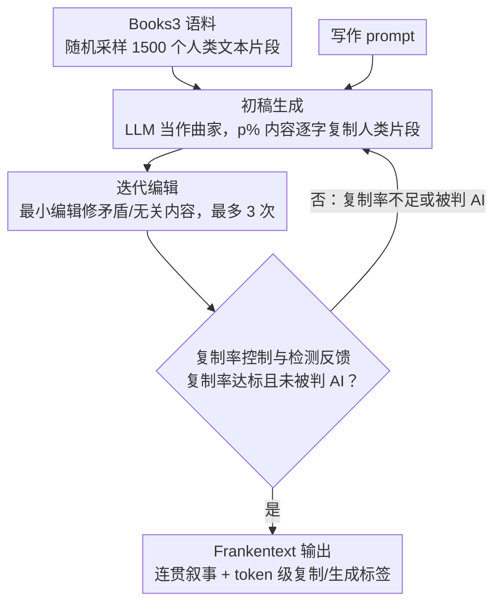

# Frankentext: Stitching Random Text Fragments into Long-Form Narratives

**会议**: ACL 2026  
**arXiv**: [2505.18128](https://arxiv.org/abs/2505.18128)  
**代码**: [GitHub](https://github.com/chtmp223/Frankentext)  
**领域**: AIGC检测  
**关键词**: AIGC检测, 混合作者归因, 可控文本生成, AI文本检测器, 人机协作写作

## 一句话总结

提出Frankentext范式，让LLM在极端约束下（90%文本逐字复制自人类写作）拼接随机人类文本片段为连贯长篇叙事，揭示现有AI文本检测器在混合作者场景下的严重失败（72%的Frankentext被误判为人类写作）。

## 研究背景与动机

**领域现状**: 随着LLM生成文本质量不断提高，AI文本检测成为学术诚信和内容溯源的关键需求。现有检测器主要基于二分类（AI vs 人类）的假设。

**现有痛点**: 现实中存在大量人机协作写作的"灰色地带"——文本并非纯AI或纯人类撰写，而是两者混合。现有二分类检测器（如Binoculars、FastDetectGPT）无法有效识别这类混合文本。

**核心矛盾**: 当前检测方法依赖表面特征（如困惑度、统计签名），但当AI生成内容中大量嵌入真实人类文本时，这些统计特征会被稀释，导致检测失效。

**本文目标**: 系统研究一种极端的可控生成范式——Frankentext，让LLM在大部分token必须逐字复制自人类写作的约束下生成连贯叙事，以揭示检测器的脆弱性并推动细粒度检测方法的发展。

**切入角度**: 灵感来自弗兰肯斯坦——用不同来源的"碎片"拼装出一个完整的"生物"。LLM充当作曲家而非作家，从数千个随机人类文本片段中选取、排列、拼接成连贯故事。

**核心idea**: 通过prompt-based pipeline让LLM选择并拼接随机采样的人类文本段落，在维持指定复制率（如90%）的同时生成连贯、相关的叙事，从而对现有AI检测器构成根本性挑战。

## 方法详解

### 整体框架

Frankentext pipeline 围绕"生成初稿 → 迭代编辑"两个核心阶段展开，并可叠加一个可选的复制率/检测反馈回路。首先，从大型书籍语料库（Books3，含 197K 本书、超 1.6 亿段落）中随机采样 1500 个人类文本片段（约 103K BPE tokens），连同写作 prompt 一起输入 LLM，让其在约束下拼出初稿；随后用同一个 LLM 做迭代编辑（最多 3 次）修正矛盾和不连贯之处；过程中还可选地以 ROUGE-L 或 AI 检测器作为反馈信号，当复制率不足或文本被判为 AI 生成时触发重新生成，让输出收敛到指定复制率并尽量躲过检测。

### 关键设计

**1. 初稿生成（Draft Generation）：让 LLM 当"作曲家"，从随机人类碎片里拼出叙事**

人类几乎不可能在数千个互不相关的文本片段里手工找到可以串成故事的组合，但 LLM 擅长在巨大组合空间里做隐式搜索。作者正是利用这点：向模型提供写作 prompt 和 1500 个随机采样的段落级人类文本片段，要求生成约 500 词的故事，其中 90% 内容必须逐字复制自给定片段，只允许添加少量连接词和过渡短语。于是 LLM 不再是"作者"而是"作曲家"——它的活儿是从不相关的人类文本中挑出能拼接的碎片并排列成连贯叙事，而真正的句子主体仍然出自人类之手。

**2. 迭代编辑（Iterative Polishing）：在不破坏复制约束的前提下修掉拼接留下的硬伤**

直接拼出来的初稿往往有角色矛盾、事实冲突、无关内容这类硬伤，读起来不连贯。编辑阶段用同一个 LLM 识别这些问题并施加最小编辑（类似 self-correct），过程中始终守住逐字复制约束和原写作 prompt，最多迭代 3 次。这一步的收益很直接：连贯性从 68% 提升到 81%，说明拼接质量的瓶颈不在选片段，而在事后缝合。

**3. 复制率控制与检测反馈（Copy Rate Control）：用可选反馈信号同时压住复制率和逃检率**

最终输出要满足预设的人类文本占比（如 90%），同时还想尽量躲过检测器，这两件事可以共用一套反馈回路。作者可选地把 ROUGE-L 或 AI 文本检测器本身当作反馈信号：如果复制率不足、或文本被判为 AI 生成，就提示 LLM 再次修订。复制率越高越难被检测，但连贯性会随之下降，这条反馈回路让生成过程在两者之间动态收敛到目标点，并把逃避检测的概率最大化——也正是这一设计直接构成了对现有检测器的根本性挑战。

## 实验关键数据

### 主实验

| 模型 | 复制率 | 相关性% | 连贯性% | Pangram检出AI% | Binoculars检出% | FastDetectGPT检出% |
|------|--------|---------|---------|---------------|-----------------|-------------------|
| Gemini-2.5-Pro (vanilla) | - | 100 | 100 | 100 | 52 | 99 |
| Gemini-2.5-Pro (FT) | 75% | 100 | 81 | 4 | 0 | 1 |
| o4-mini (FT) | 68% | 56 | 29 | 24 | 0 | 1 |
| Claude-3.7-Sonnet (FT) | 64% | 95 | 73 | 17 | 2 | 16 |
| DeepSeek-R1 (FT) | 42% | 91 | 72 | 74 | 0 | 0 |
| Qwen-3-32B thinking (FT) | 36% | 91 | 54 | 85 | 52 | 92 |

### 消融实验

| 配置 | 关键指标 | 备注 |
|------|---------|------|
| 移除编辑阶段 | 连贯性68%→81% | 编辑阶段显著提升连贯性 |
| 使用相关段落(FAISS检索) | 复制率仅38%，检测率下降 | 相关性反而降低复制率 |
| 使用句子而非段落 | 连贯性89%，检测率+14% | 短单元提升连贯但更易检测 |
| 最大上下文(100K段落) | 复制率76%，连贯性89% | 性能最好但成本10倍 |
| 单本书(Monte Cristo) | 连贯性89%，相关性97% | 单一来源也能有效工作 |
| 要求25%人类文本 | Pangram AI检出54% | 更多AI文本→更易检测 |
| 要求90%人类文本 | Pangram AI检出4% | 更多人类文本→更难检测 |

### 关键发现

- Gemini-2.5-Pro是最佳Frankentext生成模型，兼顾连贯性(81%)、相关性(100%)和低检测率(4%)
- Binoculars和FastDetectGPT对Frankentext几乎完全失效（检出率<2%），Pangram表现稍好但仍漏检59%
- 人类评估者平均能识别56%的Frankentext为AI参与，优于自动检测器
- 复制率与检测率呈反比关系：人类文本比例越高越难检测，但连贯性也随之下降
- Frankentext中AI关键词（如"Elara"）出现频率从vanilla的686次锐减至10次

## 亮点与洞察

- **灰色地带的发现**：Frankentext打破了"AI vs 人类"的二元假设，揭示了一个检测器难以处理的混合作者空间
- **成本效益**：每篇Frankentext仅需$1.32（Gemini），远低于人机协作数据集CoAuthor的$2.50/篇，且无需复杂设置
- **Token级标注**：每篇Frankentext自带复制vs生成的token级标签，可直接用于训练混合作者检测模型
- **人类感知独特**：评估者称赞Frankentext具有独特的"人类感"——富有想象力的前提、生动的描写和冷幽默，这正是因为其大部分内容确实来自人类写作

## 局限与展望

- 依赖大规模高质量同领域人类文本语料，低资源语言和专业领域（如技术手册）难以直接应用
- 复制率指标可能低估实际人类文本占比
- 本文仅暴露攻击面，未提出具体防御方案
- 非虚构领域（如新闻）的Frankentext质量仍有提升空间，生成文本偏向叙事风格
- Books3包含版权作品，引发创作归属权和版权问题

## 相关工作与启发

- **vs Binoculars/FastDetectGPT**: 这两个基于困惑度的检测器对Frankentext几乎完全失效，说明表面统计特征不足以应对混合作者文本
- **vs Pangram**: 作为训练型分类器，Pangram能部分检测混合文本（37%标记为mixed），但仍漏检59%的Gemini Frankentext
- **vs CoAuthor**: Frankentext提供了一种更廉价、可规模化的混合作者数据生成方式，且覆盖词级和句级多种粒度
- **vs Paraphrasing攻击**: 不同于改写原文来逃避检测，Frankentext直接使用原始人类文本，是一种全新的攻击向量

## 评分

- 新颖性: ⭐⭐⭐⭐⭐ 提出全新的文本生成范式，将LLM定位为"作曲家"而非"作者"，视角非常新颖
- 实验充分度: ⭐⭐⭐⭐⭐ 5个模型系列、3个检测器、人类评估、多个消融实验，覆盖面极广
- 写作质量: ⭐⭐⭐⭐ 论文结构清晰，弗兰肯斯坦的类比生动，但某些部分可再精炼
- 价值: ⭐⭐⭐⭐⭐ 对AI文本检测领域具有重要警示意义，推动了从二分类向细粒度检测的转变

<!-- RELATED:START -->

## 相关论文

- [\[ICLR 2026\] FS-DFM: Fast and Accurate Long Text Generation with Few-Step Diffusion Language Model](../../ICLR2026/nlp_generation/fs-dfm_fast_and_accurate_long_text_generation_with_few-step_diffusion_language_m.md)
- [\[ACL 2025\] Context-Aware Hierarchical Merging for Long Document Summarization](../../ACL2025/nlp_generation/context-aware_hierarchical_merging_for_long_document_summarization.md)
- [\[ACL 2026\] Right at My Level: A Unified Multilingual Framework for Proficiency-Aware Text Simplification](right_at_my_level_a_unified_multilingual_framework_for_proficiency-aware_text_si.md)
- [\[ACL 2026\] Can You Make It Sound Like You? Post-Editing LLM-Generated Text for Personal Style](can_you_make_it_sound_like_you_post-editing_llm-generated_text_for_personal_styl.md)
- [\[ACL 2026\] Planning Beyond Text: Graph-based Reasoning for Complex Narrative Generation](planning_beyond_text_graph-based_reasoning_for_complex_narrative_generation.md)

<!-- RELATED:END -->
