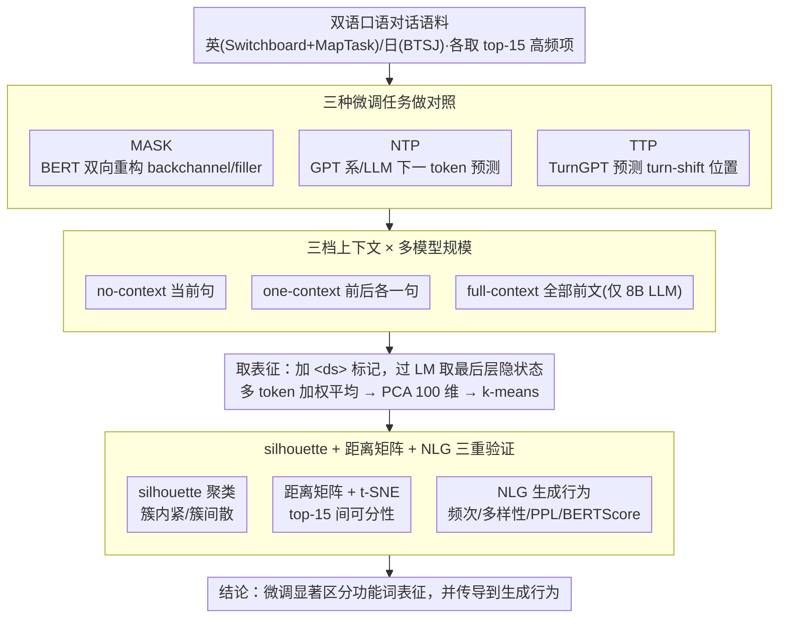

# Investigating the Representation of Backchannels and Fillers in Fine-tuned Language Models

**会议**: ACL 2026  
**arXiv**: [2509.20237](https://arxiv.org/abs/2509.20237)  
**代码**: https://github.com/colalao/discourse_markers (有)  
**领域**: 对话生成 / 表征分析 / 话语标记  
**关键词**: backchannel, filler, 微调, silhouette 聚类, 对话语言模型

## 一句话总结
论文在英日双语口语对话语料上用 MASK / NTP / TTP 三种微调任务训练 BERT / GPT-2 / TurnGPT / LLaMA-3 8B / Qwen-3 8B，再用 t-SNE 可视化和 silhouette 聚类量化"哼哈词"（backchannel 如 *uh-huh*）和"语气词"（filler 如 *um*）的表征质量；发现微调能让这些被视为"语义漂白"的功能词在嵌入空间里被显著区分开，并让模型在 NLG 生成时自然地说出多种 backchannel/filler，向"像人一样对话的 LM"迈出可量化的第一步。

## 研究背景与动机
**领域现状**：在对话里 backchannel（*uh-huh*, *yeah*）和 filler（*uh*, *um*）虽然占口语词频前列，但 NLP 长期把它们当 stop words 在预处理阶段直接删掉——例如 Switchboard 的依存句法分析普遍把它们剔除以提升解析精度。

**现有痛点**：(a) 主流文本预训练语料几乎不含这些口语标记，pre-trained LM 给它们的 token ID 都偏高，对应的 embedding 也是接近随机的；(b) 缺了 backchannel/filler 的 LM 在 dialogue agent 任务里既不会"嗯嗯"地给反馈、也不会用"呃"标记 cognitive load，导致 ASR、对话机器人都不像真人；(c) 已有研究关注 BERT/GPT-2 微调后"词级表征"的变化，但**鲜有针对低频功能词的系统研究**。

**核心矛盾**：理论上 backchannel/filler 是 semantically bleached（无指称义），可语用上又承担 grounding、turn-taking、disfluency 等关键功能——LM 到底有没有能力区分同一个 backchannel 在不同语境下的不同语用功能？还是真的只能给它随机向量？

**本文目标**：(RQ1) 微调能否改善 LM 对 backchannel/filler 的表征？(RQ2) 上下文窗口大小起什么作用？(RQ3) 哪种模型受益最大？(RQ4) 不同微调任务有差异吗？

**切入角度**：聚类质量（silhouette score）天然能衡量"同一 backchannel 是否被表示为多个细分语用功能、不同 backchannel 是否相互可分"——把它当显微镜，照一照 4 种模型 × 3 种微调任务 × 3 种上下文设置 × 中英日两种语言。

**核心 idea**：用 silhouette score + t-SNE + 距离矩阵的三件套，把"功能词在 LM 里到底学没学会"从主观印象转成可统计验证的指标；再用 NLG 生成评测交叉验证表征改善是否真的传导到了输出行为。

## 方法详解

### 整体框架
全流程是"选数据 → 三种微调 → 三种上下文取表征 → 聚类 / 距离矩阵 / t-SNE / NLG 评估"。

- **数据**：英文用 Switchboard + MapTask（合计 ~150K 话语，含 127,672 个 backchannel/filler）；日文用 BTSJ 1000 Person Natural Conversation Corpus（170,898 个）。各取 top-15 高频项。
- **模型**：BERT、GPT-2（英 768 维 / 日 1024 维）、TurnGPT（基于 GPT-2）、LLaMA-3 8B、Qwen-3 8B（后两者 4096 维 + LoRA 微调，rank=16，作用于 q_proj/v_proj）。
- **微调任务**：MASK（适用于 BERT）、NTP（GPT 系 + LLM）、TTP（仅 GPT-2 在 TurnGPT 框架下）。前两者 80/20 数据切分，TTP 用 train/val/test 标准划分。
- **取表征**：在含 backchannel/filler 的句子里加 `<ds>` 标记，过 LM 取最后一层隐状态；多 token 的 backchannel 用加权平均压成单向量；最后 PCA 降到 100 维做 $k$-means。

三种上下文设置：no-context（只看当前句）、one-context（前后各一句）、full-context（仅 LLaMA-3 / Qwen-3 支持，把全部前文 concat）。

### 关键设计

**1. 三种微调任务做对照：用不同训练目标分别"压"出 backchannel/filler 的语用差异**

要回答"微调能否改善表征"，得先排除"是不是只有某种特定任务才管用"。作者于是设计了三条目标各异的微调路线形成对照。MASK 沿用 BERT 默认策略，把 backchannel/filler 整段以 0.8/0.1/0.1 的概率替换为 [MASK] / 随机 token / 原 token，逼双向上下文重构这些 token；NTP 把两个说话人的句子合并并加 `<s1>`/`<s2>` 说话人 ID，做标准下一 token 预测；TTP 让 TurnGPT 预测 $y^{*}=\arg\max_y P(y|X)$，即"哪个 token 之后会发生 turn-shift"，直接利用 backchannel 与 turn-holding 的强关联。作者原本假设最"对症"的 TTP 应当最好，结果却是 NTP 的 silhouette 略高于 TTP——这反过来说明无任务偏置的通用语言建模本身已经把 backchannel/filler 的语用差异挤进了表征空间，不必专门设计 turn-taking 监督。

**2. 三档上下文 × 多模型规模的因子设计：把"加多少上下文"和"模型多大"两个变量拆开**

"上下文窗口"和"模型容量"常被混在一起谈，作者把它们正交拆开单独考察。上下文设三档：no-context 只喂含 backchannel 的当前句，one-context 加前后各一句，full-context 把全部历史 concat（最长数千 token，只有 LLaMA-3 / Qwen-3 撑得住）；模型则横跨 BERT (110M)、GPT-2 (124M) 到 LLaMA-3 / Qwen-3 (8B)。结果跑出一条反直觉规律：上下文越多 silhouette 反而越低——更多上下文会把功能词的表征"拉平"成附近实词的平均，所以 backchannel/filler 在 no-context 下最容易被聚类区分；而模型并非越大越好，小模型在专门微调下能逼近 8B LLM。

**3. silhouette + 距离矩阵 + NLG 行为的三重验证：防止任何单一指标被刷高**

任何单一指标都可能被 hack——silhouette 高不代表生成时会自然用 backchannel，生成得多也不代表表征空间真有结构。作者因此从内部表征、配对可分性、外部生成行为三个维度联立验证。silhouette $s(i)=\frac{b(i)-a(i)}{\max(a(i),b(i))}$ 同时奖励"簇内紧凑、簇间分散"，量化同一 backchannel 是否被拆成多个语用功能、不同 backchannel 是否互相可分；距离矩阵直接画 top-15 backchannel 间欧氏距离的 heatmap 看亮暗格变化；NLG 评测让 LM 续写两轮对话，比较生成中 backchannel 的频次、类型多样性、frequency-weighted perplexity、BERTScore 和 BLEU。只有三层都指向同一结论，"微调真的让 LM 学会了这些功能词"才立得住。

### 损失函数 / 训练策略
MASK 用 token-level 交叉熵（仅 mask 位置）；NTP 用标准下一 token cross-entropy；TTP 优化二分类 turn-taking 概率（GPT-2 + TurnGPT 框架，batch 4, lr 5e-4, dropout 0.3, 15 epochs，取 val loss 最低的 ckpt）。LLaMA-3 / Qwen-3 用 LoRA（rank 16, dropout 0.1，仅 q/v_proj），训练时间 7–15 小时不等（8×L40 48G）。

## 实验关键数据

### 主实验
平均 silhouette score（bootstrap n=1000，95% CI）：

| 模型 | 任务 | 语言 | no-ctx 基线 → FT | one-ctx 基线 → FT | full-ctx 基线 → FT |
|---|---|---|---|---|---|
| BERT | MASK | EN | 0.144 → 0.241 | 0.213 → 0.391 | — |
| BERT | MASK | JP | 0.213 → 0.391 | 0.197 → **0.429** | — |
| GPT-2 | NTP | EN | 0.274 → 0.328 | 0.149 → 0.311 | — |
| GPT-2 | NTP | JP | 0.157 → 0.288 | 0.101 → 0.273 | — |
| GPT-2 | TTP | EN | — → 0.289 | — → 0.211 | — |
| GPT-2 | TTP | JP | — → 0.284 | — → 0.261 | — |
| LLaMA-3 8B | NTP | EN | 0.450 → **0.588** | 0.183 → 0.291 | 0.210 → 0.301 |
| LLaMA-3 8B | NTP | JP | 0.257 → 0.450 | 0.179 → 0.335 | 0.318 → 0.408 |
| Qwen-3 8B | NTP | EN | 0.253 → 0.379 | 0.157 → 0.292 | 0.189 → 0.322 |
| Qwen-3 8B | NTP | JP | 0.172 → 0.452 | 0.154 → 0.263 | 0.173 → 0.181 |

英文 LLaMA-3 no-context 微调后 silhouette = 0.588（满分 1.0），是所有组合中最高；日文 BERT MASK 微调 one-context 已能跑到 0.429，几乎与 8B LLM 持平。

### 消融实验（NLG 行为评估，one-context）

英文生成 backchannel/filler 关键指标：

| 模型 | Diversity（类型数）↑ | Frequency ↑ | Perplexity ↓ | BERTScore F1 ↑ | BLEU ↑ |
|---|---|---|---|---|---|
| LLaMA-3 no-FT | 73 | 4.29% | 197.7 | 78.69% | 0.0600 |
| **LLaMA-3 FT** | **83** | **18.61%** | **5.30** | **79.99%** | **0.0697** |
| Qwen-3 no-FT | 87 | 5.33% | 202.1 | 76.02% | 0.0698 |
| Qwen-3 FT | 95 | 9.19% | 91.3 | 79.73% | 0.0800 |
| GPT-2 no-FT | 68 | 6.68% | 158.6 | 79.67% | 0.0544 |
| GPT-2 FT | 90 | 17.43% | 6.98 | 79.99% | 0.0731 |

日文上 frequency 从 0.31% → 7.57%（LLaMA-3），PPL 从 256 → 28.5。

### 关键发现
- **微调几乎在所有 (模型 × 任务 × 语言 × 上下文) 组合上都提升 silhouette**：图 4 和表 6 一致显示 FT 曲线高于 base，最显著的是 LLaMA-3 英文 no-ctx 从 0.450 → 0.588（+30%）。
- **上下文反向稀释功能词表征**：silhouette 总体随 context 增大而下降，作者解释为"context 让 backchannel 的表征被周围实词信息覆盖"——这是个反直觉但合理的发现，对"对话表征研究是否要堆历史"给出新视角。
- **NTP 略胜 TTP**：尽管 TTP 任务与 backchannel 的功能（turn-holding）直觉相关，silhouette 反而比 NTP 略低；说明通用语言建模目标本身就能捕捉这些功能词的语用差异，不需要专门的 turn-taking 监督。
- **小模型未必输**：日文 BERT MASK one-context 达到 0.429，几乎追平 LLaMA-3 0.450；表明对功能词表征任务"专门微调 + 双向注意力"比"模型变大"性价比更高。
- **表征质量 → 生成行为可传导**：LLaMA-3 微调后英文生成 backchannel 频次翻 4 倍（4.29% → 18.61%）、PPL 从 197 暴跌到 5.3，且对话续写的人工定性分析显示能在合适位置插入 *yeah*（确认）/ *um*（disfluency）/ *so*（话题转换）等不同语用功能。
- **副作用可控**：在 MapTask 上跑 dialogue act 分类的对照实验显示 BERT/GPT-2/Qwen 仅掉 0.4–1.4 个点，LLaMA-3 反而提升 5.8 个点，证明这种"专门为口语功能词"的微调不会显著伤害 LM 的通用语言理解能力。

## 亮点与洞察
- **把"被丢弃的 stop words"做成了真正的研究对象**：本文是少数把 backchannel/filler 当一等公民研究、并且双语都覆盖的工作，对"如何让 LM 真正像人一样说话"是范式提醒——清洗数据时丢掉的恰恰是社交线索。
- **silhouette + 距离矩阵 + NLG 三件套**：这一套量化-可视化-行为的多层评估非常适合任何"low-freq token representation"研究（如方言词、表情符、低资源语言代词），可直接迁移。
- **上下文反稀释 = 功能词的双刃剑**：发现"加上下文反而让 backchannel 表征更钝"是非常有价值的负向洞察，提示对话系统设计时要区分"语义任务"和"语用任务"——前者要 long context，后者反而要少 context 才能保留 marker 的 distinctness。
- **NTP > TTP 推翻直觉**：任务目标越"对症"未必越好，进一步支持"通用语言建模本身已经隐含了 turn-taking 信号"这一观点，节约了为每个口语现象设计专用预训练任务的工程量。

## 局限与展望
- 作者承认：(a) 只覆盖英日，缺德语（VM2/MUNDEX 因规模与标注差异未纳入）；(b) 仅测到 8B 模型，更大 LLM 受算力限制未做；(c) 主要分析最后一层隐状态，对 hidden layer 演化分析较粗；(d) 未尝试 surgical fine-tuning 等更精细微调技巧；(e) 没有语音模型对照，但 backchannel 的声学差异（音高、停顿）本就重要；(f) NLG 评估靠少量代表性人工示例，缺大规模 native speaker 评测。
- 自己发现：(g) NLG 表中 LLaMA-3 微调后 frequency 飙到 18.61%——比真实 ground truth 还要高，说明微调可能过度补偿"原本没用 backchannel"的偏差，向"啰嗦化"过头；(h) Qwen-3 在日文 full-context 设置下微调几乎没收益（0.173 → 0.181），值得追查多语模型在低资源功能词上的微调机制差异；(i) PPL 比较两个数量级的下降需谨慎——可能反映 corpus 内分布拟合而非泛化能力。
- 改进思路：把语用功能（confirmation / hesitation / topic-shift）显式标注成多类别 silhouette 评测；引入语音模态联合训练；用 RLHF 风格的"自然度"奖励训练 dialogue agent 而非完全靠监督微调。

## 相关工作与启发
- **vs Qian & Skantze 2024 contrastive feedback embeddings**：他们用对比学习处理 HuBert/Whisper/BERT 在 backchannel 上的表征，但只关注 feedback 一小类、且负样本空间小；本文转向更广泛的功能词类别并放弃对比学习以降算力，方法上更轻量。
- **vs Mosbach 2020、Merchant 2020**：他们研究 BERT 微调对一般词表征的影响，本文把焦点对到"被 NLP 系统性忽视的 backchannel/filler"，扩展了这类分析的覆盖面。
- **vs Skantze 2017 / Ekstedt & Skantze 2020 (TurnGPT)**：前作研究 turn-taking 预测，本文复用 TurnGPT 作为 TTP backbone 但反过来研究 backchannel/filler 的表征，是同一研究脉络的反向延伸。

## 评分
- 新颖性: ⭐⭐⭐⭐ 把被忽视的 backchannel/filler 系统性当研究对象、且配套三层评估，是个"角落里的金矿"；但单独看每个组件方法都不算新。
- 实验充分度: ⭐⭐⭐⭐⭐ 5 个模型 × 3 个任务 × 3 个上下文 × 中英日 × bootstrap CI + 层级分析 + 副作用对照 + NLG 行为评估，全方位覆盖。
- 写作质量: ⭐⭐⭐⭐ RQ 清晰、图表丰富、附录详尽；偶有概念铺垫稍长。
- 价值: ⭐⭐⭐⭐ 对对话 agent / TTS / 口语对话 LM 方向有直接可借鉴价值，并提醒社区不要继续把功能词当垃圾扔掉。

<!-- RELATED:START -->

## 相关论文

- [\[ACL 2025\] An Empirical Study of Many-to-Many Summarization with Large Language Models](../../ACL2025/nlp_generation/an_empirical_study_of_manytomany_summarization.md)
- [\[ACL 2025\] Theme-Explanation Structure for Table Summarization Using Large Language Models](../../ACL2025/nlp_generation/theme-explanation_structure_for_table_summarization_using_large_language_models_.md)
- [\[ACL 2026\] Children's English Reading Story Generation via Supervised Fine-Tuning of Compact LLMs with Controllable Difficulty and Safety](childrens_english_reading_story_generation_via_supervised_fine-tuning_of_compact.md)
- [\[ACL 2026\] In-depth Research Impact Summarization through Fine-Grained Temporal Citation Analysis](in-depth_research_impact_summarization_through_fine-grained_temporal_citation_an.md)
- [\[ACL 2025\] Tell, Don't Show: Leveraging Language Models' Abstractive Retellings to Model Literary Themes](../../ACL2025/nlp_generation/tell_dont_show_leveraging_language_models_abstractive_retellings_to_model_litera.md)

<!-- RELATED:END -->
