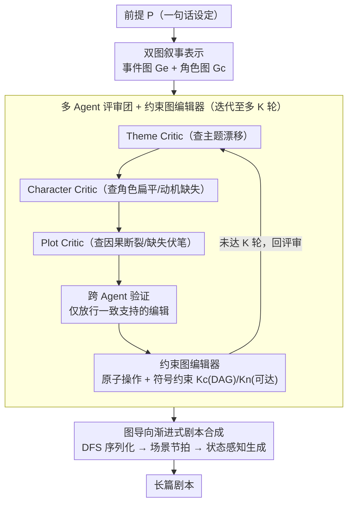

# Planning Beyond Text: Graph-based Reasoning for Complex Narrative Generation

**会议**: ACL 2026 Findings  
**arXiv**: [2604.21253](https://arxiv.org/abs/2604.21253)  
**代码**: 无  
**领域**: LLM效率  
**关键词**: 叙事生成, 图结构推理, 事件图, 角色图, 多agent迭代优化

## 一句话总结
本文提出 PLOTTER 框架，首次将叙事规划从文本表示转移到图结构表示（事件图+角色图），通过多 agent 的 Evaluate-Plan-Revise 迭代循环在图拓扑上诊断和修复叙事缺陷，在叙事性、角色塑造、戏剧张力等维度上显著优于现有方法。

## 研究背景与动机

**领域现状**：LLM 已能生成流畅文本，长篇叙事生成的研究沿两条路线发展——大纲式规划（如 Re3、DOC、DOME 的分层大纲生成）和角色扮演式规划（如 HoLLMwood、IBSEN 的多 agent 模拟）。

**现有痛点**：（1）大纲式方法按序操作，早期逻辑错误向下游级联传播，且刚性大纲限制了复杂修订的灵活性；（2）角色扮演方法在风格多样性和对话丰富度上表现好，但协调依赖非结构化自然语言，长上下文中易产生语义漂移和指令误解；（3）两类方法都无法维持全局叙事连贯性、上下文逻辑一致性和角色发展的平滑性——经常产生单调、有结构断裂的剧本。

**核心矛盾**：直接在文本表示上进行叙事规划本质上是低效的——缺乏对情节依赖关系的显式建模，系统无法有效推理底层的因果网络和角色-事件的演化关系，最终限制了生成严谨叙事结构的能力。

**本文目标**：将剧本生成从序列规划问题转化为动态图生成与精炼问题，在图拓扑上通过迭代编辑实现因果层面的诊断和修复。

**切入角度**：从经典叙事学理论出发（Barthes 的行动逻辑理论、Moretti 的角色网络理论），用图结构显式表征叙事的因果骨架和角色社交动力学。

**核心 idea**：在图结构上而非文本上做叙事规划——通过事件图和角色图的原子级编辑操作解决因果断裂和角色不一致。

## 方法详解

### 整体框架

PLOTTER 想解决的是长篇剧本生成里"直接在文本上做规划"的低效——文本大纲既看不见事件之间的因果与伏笔，也建模不了角色关系的演化，导致逻辑断裂层层下传。它的做法是把规划搬到图上：先从一句前提 $P$ 生成一对叙事图（事件图 $G_e$ + 角色图 $G_c$），再让一个多 agent 评审团在图拓扑上反复诊断缺陷、由一个受符号约束的编辑器执行原子修复，循环至多 $K$ 轮；最后把这张精炼好的图确定性地序列化、逐场景展开成剧本。整条链路里，"叙事的因果骨架"始终是一个可读、可编辑的图对象，而不是一段模糊的自然语言。

### 关键设计

**1. 双图叙事表示：让因果、伏笔、角色演化都变成可编辑的符号对象**

文本大纲的根本缺陷是无法显式捕捉非相邻事件间的伏笔/悬念关系，也无法刻画角色关系如何随情节演化。PLOTTER 用两张图把这些长程依赖提升为一等公民：事件图 $G_e = (V_e, E_e)$ 的每个节点是一个情节事件，带事件描述、叙事阶段（起承转合-高潮等）和时间索引，有向边携带叙事关系标签 $\rho(e) \in \{\text{Causal}, \text{Foreshadowing}, \text{Suspense}\}$；角色图 $G_c = (V_c, E_c)$ 的每个节点编码多维角色属性（核心性格、内部冲突、外部目标、隐藏秘密），边则表示角色间的演化关系（冲突/合作/情感/隐秘）。一旦"A 事件为 B 事件埋了伏笔"成为图上一条带标签的边，后续诊断和修复就能直接在这条边上操作，而不必在长文本里猜它藏在哪。

**2. 多 Agent 评审团 + 约束图编辑器：用确定性的符号约束兜住 LLM 评审的不可靠**

光有图还不够，关键是怎么在图上稳定地查错改错。PLOTTER 让三个专业评审 Agent 按固定顺序跑一遍 Evaluate-Plan-Revise 循环：Theme Critic（查主题漂移、展示不足）→ Character Critic（查角色扁平化、动机缺失、态度突变）→ Plot Critic（查因果断裂、逻辑矛盾、缺失伏笔），每个 Agent 输出一份结构化问题清单 $\mathcal{I}_i$，并通过跨 Agent 验证只放行获得一致支持的编辑。诊断出的问题交给约束图编辑器，映射成原子编辑操作（如 Add-Plot-Bridge、Revise-Event），但每个操作都要先过两道符号约束才算数：因果理性 $\mathcal{K}_C$ 要求因果子图保持 DAG（不允许时间回路），叙事完备性 $\mathcal{K}_N$ 要求所有节点从开头可达、且都有路径通向结尾。这两道检查是纯符号、确定性的，不依赖 LLM，因此一个会破坏结构的编辑根本不会被执行，更不会传播到下游——这正是文本层评审做不到的地方。

**3. 图导向渐进式剧本合成：把符号图确定性地落成连贯长文，且不丢拓扑、不断参照**

最后一步要把优化好的图变回剧本文本，难点是既不能破坏图里辛苦维护的因果拓扑，又要在几千 token 的长生成里不出现角色/线索的参照断裂。PLOTTER 先用确定性深度优先遍历把事件图序列化成层次化事件计划 $\mathcal{T}_h$（优先走悬念后继、保留伏笔线索），同时把角色图节点扩展成详细人物档案；接着一次性生成所有场景节拍（scene beats），再由状态感知生成器逐场景展开，每个场景都条件化于该事件的关系类型（悬念/冲突等）、相关角色档案和一份滚动更新的叙事状态 $M_i$。确定性序列化保证文本化不会打乱因果顺序，滚动记忆 $M_i$ 则让后文始终知道前文发生过什么。

### 一个完整示例：修一处"动机断裂"

假设评审循环跑到第 2 轮，Plot Critic 在事件图上发现"角色 X 突然背叛盟友"这个节点缺少因果前驱——它和前面的事件之间没有任何 Causal 入边，属于典型的因果断裂。Character Critic 同时报告 X 的动机栏位是空的。两个 Agent 的问题清单经跨 Agent 验证后取得一致，编辑器据此提出一组 Add-Plot-Bridge 操作（"Trinity of Action"式的 Why-Who-How 三重桥接）：新增一个"X 偶然得知盟友隐瞒的秘密"事件节点，并补两条 Causal 边把它接到背叛事件上，同时在角色图里给 X 的"隐藏秘密/内部冲突"属性补上对应内容。提交前先过约束检查——新增边不会形成时间回路（$\mathcal{K}_C$ 通过），新节点从开头可达且通向结尾（$\mathcal{K}_N$ 通过），于是这组编辑被执行。到合成阶段，序列化会把这个新桥接事件排在背叛之前，状态记忆 $M_i$ 把"X 已知道秘密"带进后续场景，最终读者看到的就是一段有铺垫、有动机的背叛，而不是凭空翻脸。

### 损失函数 / 训练策略

无训练——PLOTTER 是纯推理时（inference-time）框架，使用现有 LLM（GPT-4.1、DeepSeek-R1、Qwen3）作为主干。评估使用 GPT-4.1 做成对比较 + 人工评估。

## 实验关键数据

### 主实验（GPT-4.1 主干，成对比较胜率）

| 维度 | vs LLM-Plan-Write | vs Dramatron | vs DOC |
|------|-------------------|-------------|--------|
| Narrative (剧本) | 72% | 74% | 92% |
| Thematic (剧本) | 100% | 90% | 86% |
| Characterization (剧本) | 100% | 76% | 92% |
| Dramatic Engagement (剧本) | 96% | 72% | 92% |
| Premise Fidelity (剧本) | 40% | 14% | 44% |

### 消融实验

| 配置 | 效果说明 |
|------|---------|
| w/o Character module | 角色和戏剧维度掉点最大 |
| w/o Plot module | 叙事维度掉点最大 |
| w/o Theme module | 主题维度掉点明显但整体影响较小 |
| 单模块 vs 全模块 | 全模块胜率 >80%，远超单模块之和——"1+1>2"协同效应（+29% 故事线，+34% 剧本） |
| K=3 迭代 (默认) | Distinct-2=0.793, Self-BLEU=0.017，最佳平衡点 |
| K=5 迭代 | 质量下降（Distinct-2=0.640），编辑成功率降至 0.83 |

### 关键发现
- PLOTTER 在叙事、主题、角色、戏剧四个维度上以压倒性优势击败所有基线（胜率 72-100%）——唯一略弱的是前提忠实度
- 三个评审 Agent 存在强协同效应——单独任何一个 Agent 的改进都很有限，但三者协同后胜率跳跃式提升 29-34%，验证了跨维度联合优化的必要性
- 默认 K=3 迭代是最优选择——过多迭代（K=5）导致编辑成功率下降和质量退化
- 人工评估与 LLM 评估高度一致（Cohen's κ = 0.834），增强结论可信度
- 每篇剧本成本 1.68 USD（K=3），预算模式 0.36 USD（K=1），计算负担可控

## 亮点与洞察
- **叙事规划从文本到图的范式转换**是核心贡献——图结构让因果推理、伏笔关系、角色动态成为可编辑的符号对象，而非模糊的文本暗示。这与程序设计中"先设计数据结构再写算法"的思想一致
- DAG 约束和连通性约束的确定性验证非常优雅——不依赖 LLM 的符号检查确保结构有效性，避免了 LLM 评审的不可靠性传播
- "Trinity of Action"修复策略（Why-Who-How 三重桥接）的案例研究很有说服力——展示了复杂叙事断裂需要多层次因果链修复而非简单文本润色

## 局限与展望
- 前提忠实度（Premise Fidelity）是明显短板——图的迭代精炼可能偏离原始前提
- 高度依赖 LLM 主干的能力——在 DeepSeek-R1 上 vs Dramatron 的优势小于在 GPT-4.1 上
- 评估数据集仅 50 个前提，虽然跨 9 种类型但每种类型样本量有限
- 未与更新的基线（如 StoryWriter）在同等条件下对比
- 计算成本较高（523k tokens/篇），大规模应用需要优化

## 相关工作与启发
- **vs DOC (Yang et al., 2023)**: DOC 使用静态层次化文本大纲做约束，本文用动态可编辑的图结构——图的灵活性允许非线性修订而非大纲的线性重写
- **vs Dramatron (Mirowski et al., 2023)**: Dramatron 基于角色扮演和自由文本协调，缺乏共享符号状态导致指令误解；PLOTTER 的图结构提供了共享的可验证状态
- **vs R2 (Lin et al., 2025)**: R2 从完整源文本提取静态图做生成参考，PLOTTER 在图上做动态规划和迭代编辑——前者是被动引用，后者是主动推理

## 评分
- 新颖性: ⭐⭐⭐⭐⭐ 图结构叙事规划 + 符号约束编辑 + 多agent协同是全新范式
- 实验充分度: ⭐⭐⭐⭐ 3个 LLM 主干、3个基线、成对比较+人工+客观指标，但数据规模偏小
- 写作质量: ⭐⭐⭐⭐⭐ 案例研究生动、方法描述清晰、理论动机扎实
- 价值: ⭐⭐⭐⭐ 对长篇叙事生成的方法论有根本性推进，图结构规划思想可迁移到其他长程规划任务

<!-- RELATED:START -->

## 相关论文

- [\[ACL 2025\] Multi-document Summarization through Multi-document Event Relation Graph Reasoning in LLMs](../../ACL2025/nlp_generation/event_graph_bias_mitigation_summarization.md)
- [\[ICCV 2025\] Beyond Isolated Words: Diffusion Brush for Handwritten Text-Line Generation](../../ICCV2025/nlp_generation/beyond_isolated_words_diffusion_brush_for_handwritten_text-line_generation.md)
- [\[ACL 2026\] Adaptive Planning for Multi-Attribute Controllable Summarization with Monte Carlo Tree Search](adaptive_planning_for_multi-attribute_controllable_summarization_with_monte_carl.md)
- [\[ACL 2026\] FACTS: Table Summarization via Offline Template Generation with Agentic Workflows](facts_table_summarization_via_offline_template_generation_with_agentic_workflows.md)
- [\[ACL 2026\] Losses that Cook: Topological Optimal Transport for Structured Recipe Generation](losses_that_cook_topological_optimal_transport_for_structured_recipe_generation.md)

<!-- RELATED:END -->
