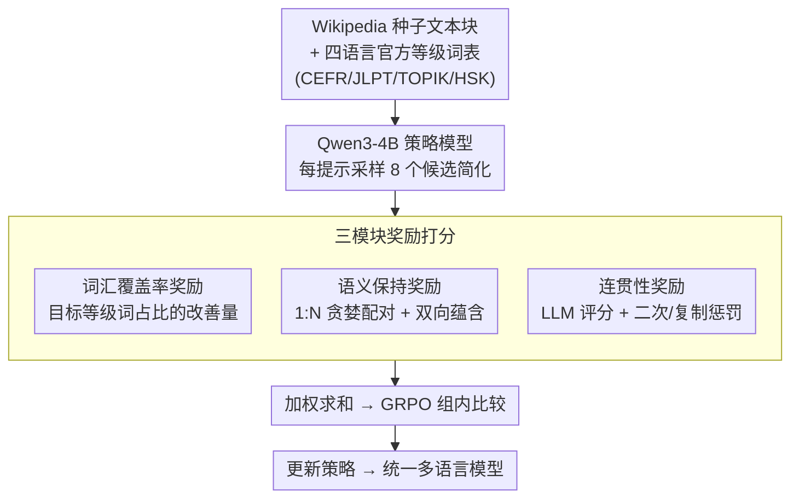

# Right at My Level: A Unified Multilingual Framework for Proficiency-Aware Text Simplification

**会议**: ACL 2026  
**arXiv**: [2604.05302](https://arxiv.org/abs/2604.05302)  
**代码**: 无  
**领域**: 强化学习  
**关键词**: 文本简化, 词汇等级控制, 多语言强化学习, GRPO, 语言学习

## 一句话总结

提出 Re-RIGHT 框架，通过三模块奖励（词汇覆盖率+语义保持+连贯性）的 GRPO 训练，用 4B 策略模型在英日韩中四种语言上实现按学习者熟练度等级（CEFR/JLPT/TOPIK/HSK）精确简化文本，超越 GPT-5.2 和 Gemini 2.5 等大模型。

## 研究背景与动机

**领域现状**：二语习得理论（输入假说）指出学习者在当前水平(i)与略高水平(i+1)之间的"可理解输入"中学习效果最佳。研究表明学习者需要认识文本中 95-98% 的词汇才能流畅阅读。文本简化旨在控制词汇复杂度以匹配目标读者的词汇知识。

**现有痛点**：(1) 即使最先进的 LLM（GPT-5.2、Gemini 2.5）也无法可靠生成精确匹配特定熟练度等级的文本，特别是在简单等级（如 CEFR A1 仅 45.1% 词汇覆盖率）和非英语语言上表现更差；(2) 现有 RL 方法需要预标注的等级标签句子语料，且主要限于英语；(3) 构建个性化平行语料成本高昂。

**核心矛盾**：LLM 缺乏对精确词汇等级的控制能力——它们能写出"简单"的文本，但无法保证特定等级的词汇覆盖率。等级越低、语言越非主流，这个问题越严重（英语 A1 平均 42.6% vs 韩语 TOPIK1 仅 29.8%）。

**本文目标**：无需等级标注平行语料，训练一个统一的多语言策略模型，精确控制四种语言在各自熟练度体系下的词汇简化。

**切入角度**：利用各语言官方词汇等级数据（CEFR/JLPT/TOPIK/HSK，共 43K 词条）作为评估信号而非训练标签，通过 GRPO 训练让模型自主学习简化策略。

**核心 idea**：用 GRPO 训练 4B 策略模型，三个奖励模块分别控制词汇等级覆盖率、语义保持和文本连贯性，无需平行语料即可实现跨语言跨等级的精确简化。

## 方法详解

### 整体框架

Re-RIGHT 要解决的是"LLM 写得出'简单'文本，却控制不住具体词汇等级"的问题，且不想为每种语言、每个等级都准备昂贵的等级标注平行语料。它的思路是把官方词汇等级表当成**评估信号**而非训练标签：准备阶段收集 Wikipedia 精选文章作为训练种子（8057 篇，69220 个文本块）和四种语言的官方等级词表（CEFR/JLPT/TOPIK/HSK，共 43K 词条）；训练阶段用 GRPO 优化一个 Qwen3-4B 策略模型，对每个提示采样 8 个候选回复，由三个奖励模块（词汇覆盖率、语义保持、连贯性）加权打分，组内比较后更新策略。最终一个统一模型就能覆盖英日韩中四语言和各自所有熟练度等级。

### 关键设计

**1. 词汇覆盖率奖励：用差值而非绝对值，逼模型把词汇真正降到目标等级**

简化的核心诉求是"目标读者认识里面的词"，所以这个奖励直接衡量生成文本中处于目标等级及以下的内容词比例。具体做法是先对候选文本做词形还原、去掉功能词/停用词/专有名词，再统计内容词里等级 $\leq$ 目标等级 $\ell_t$ 的占比 $\text{score}_{vocab} = |\{w_i \in M(C) \mid \ell(w_i) \leq \ell_t\}| / |M(C)|$，中文额外支持字级拆解匹配。关键是奖励取的不是这个绝对值，而是简化后相对原文的**改善量** $r_{vocab} = \text{score}_{rollout} - \text{score}_{original}$——这让模型在 GRPO 的组内比较中关注"我比原文降了多少级"，比直接奖励绝对覆盖率更容易学到有效的简化策略，也天然避免了"原文本来就简单导致虚高"的问题。

**2. 语义保持奖励：用 1:N 贪婪配对 + 双向蕴含，容忍句子被拆分却不放过信息丢失**

简化常把一个复杂句拆成几个简单句，传统逐句对比在这种结构变化下会失效。Re-RIGHT 用两阶段方法绕过这点：先用 BERTScore 对参考句和候选句做贪婪配对，允许 1:N 对齐（一句拆成多句也能正确对上）；再用多语言 NLI 模型对每一对做双向蕴含检验——双向都蕴含得 1.0 分，单向得 0.5 分，否则 0 分，最终取所有配对的平均。这样即使句子结构被重组，只要信息没丢，分数依然高；反之如果简化把关键信息删了，双向蕴含立刻失败，奖励随之下降。

**3. 连贯性奖励：LLM 评分 + 二次惩罚 + 复制惩罚，三重防奖励黑客**

RL 训练最怕模型钻空子——靠生成重复模板或干脆照抄原文来骗高分。这个奖励用一个 14B 评估模型对候选文本相对参考文本打 0-100 分衡量自然度，但在归一化后做了二次变换来加重对低质量输出的惩罚：$r_{coherence} = \max(1 - (\frac{1-\text{score}}{1-\alpha})^2, 0) - \beta J(S_t(A), S_t(B))$。前半段的平方项让分数偏低时惩罚迅速放大，后半段的 Jaccard 相似度惩罚项 $J(\cdot)$ 则直接打击"直接复制原文"这种退化——两者合起来把奖励黑客的两条主要路径都堵死了。

### 损失函数 / 训练策略

使用 GRPO 算法，最终奖励为三个模块的加权和。策略模型 Qwen3-4B + LoRA，每提示采样 8 个候选。训练集为 Wikipedia 精选文章文本块（上限 512 token），单一模型处理所有语言和等级。评估时用不同于训练的评估模型（gemma-3-27b 和 Qwen3-32B 的平均分）避免自评偏差。

## 实验关键数据

### 主实验

| 语言 | 方法 | 词汇覆盖率(总) | 词汇覆盖率(简单) | 语义保持 | 连贯性 |
|--------|------|------|----------|------|------|
| EN | Re-RIGHT | 81.6% | 66.9% | 80.8 | 82.9 |
| EN | GPT-5.2 | 71.0% | 52.4% | 76.1 | 84.6 |
| EN | Gemini 2.5 | 77.7% | 59.1% | 72.0 | 82.8 |
| JA | Re-RIGHT | 76.0% | 60.4% | 80.6 | 83.1 |
| JA | Gemini 2.5 | 65.8% | 51.1% | 61.7 | 85.2 |
| ZH | Re-RIGHT | 80.2% | 66.1% | 76.6 | 83.7 |
| ZH | Gemini 2.5 | 64.4% | 48.6% | 66.7 | 85.3 |

### 消融实验

| 配置 | 关键指标 | 说明 |
|------|---------|------|
| FUDGE (受控解码) | EN 74.2% | 受限于规则判别器，提升有限 |
| Base Qwen3-4B | EN 72.6% | 纯提示方法的基线 |
| Reference (原文) | EN 58.3% | 未简化的原始文本 |

### 关键发现

- 4B 模型经 Re-RIGHT 训练后在词汇覆盖率上大幅超越 GPT-5.2（EN: 81.6% vs 71.0%）和 Gemini 2.5（ZH: 80.2% vs 64.4%），证明精确控制能力可以通过 RL 训练获得
- 简单等级提升最显著：英语 Easy 从 52.4%（GPT-5.2）提升到 66.9%，中文从 48.6%（Gemini）到 66.1%
- 语义保持方面 Re-RIGHT 也普遍优于大模型，说明 RL 训练不仅提升了控制力还改善了简化质量
- 连贯性略低于 GPT-5.2（合理的 trade-off），但远优于简单约束解码方法

## 亮点与洞察

- **无需平行语料的等级精确简化**：传统方法需要大量等级标注的平行句对，Re-RIGHT 仅需词汇表和种子文本就能训练，极大降低了扩展到新语言的门槛。这个框架可以轻松扩展到任何有官方词汇等级体系的语言
- **1:N 双向蕴含语义评估**：巧妙处理了简化导致的句子拆分问题——先贪婪配对再双向蕴含，比传统逐句 BERTScore 更鲁棒
- **4B 模型 > GPT-5.2 的启示**：精确控制能力不是模型规模能解决的，需要针对性的 RL 训练。这为"小模型+精准训练 > 大模型+通用能力"提供了又一证据

## 局限与展望

- 连贯性奖励依赖 14B 评估模型，训练成本和稳定性受限于评估模型质量
- 当前限于四种语言，扩展到低资源语言可能因词汇等级数据缺乏而受阻
- 训练和推理限制在 512 token 以内，长文档简化需要进一步研究
- 可探索：结合 reading ease 指标做更细粒度的句法简化、与真实 L2 学习者做用户研究验证实际教学效果

## 相关工作与启发

- **vs Li et al. (2025b) PPO 方法**：他们用 PPO 训练英语简化模型但需要 CEFR 等级标注句子数据；Re-RIGHT 用 GRPO + 词汇表即可，且支持多语言
- **vs FUDGE 受控解码**：FUDGE 在解码时逐步检查词汇等级约束，但提升有限（74.2% vs 81.6%），因为解码层面的控制无法改变模型内部的词汇选择偏好

## 评分

- 新颖性: ⭐⭐⭐⭐ 多语言等级精确简化的 RL 框架新颖，三模块奖励设计巧妙
- 实验充分度: ⭐⭐⭐⭐⭐ 四种语言全面评测，与 GPT-5.2/Gemini 2.5 对比有说服力，示例展示直观
- 写作质量: ⭐⭐⭐⭐ 动机论证充分，方法描述清晰，语言学背景扎实
- 价值: ⭐⭐⭐⭐ 实用价值高——直接服务于 L2 教育，4B 模型可本地部署

<!-- RELATED:START -->

## 相关论文

- [\[ACL 2025\] ATGen: A Framework for Active Text Generation](../../ACL2025/nlp_generation/atgen_a_framework_for_active_text_generation.md)
- [\[AAAI 2026\] C3TG: Conflict-aware, Composite, and Collaborative Controlled Text Generation](../../AAAI2026/nlp_generation/c3tg_conflict-aware_composite_and_collaborative_controlled_text_generation.md)
- [\[ACL 2026\] XtraGPT: Context-Aware and Controllable Academic Paper Revision via Human-AI Collaboration](xtragpt_context-aware_and_controllable_academic_paper_revision_via_human-ai_coll.md)
- [\[ACL 2025\] Towards Better Open-Ended Text Generation: A Multicriteria Evaluation Framework](../../ACL2025/nlp_generation/towards_better_open-ended_text_generation_a_multicriteria_evaluation_framework.md)
- [\[ACL 2025\] Document-Level Text Generation with Minimum Bayes Risk Decoding using Optimal Transport](../../ACL2025/nlp_generation/doc_level_mbr_optimal_transport.md)

<!-- RELATED:END -->
