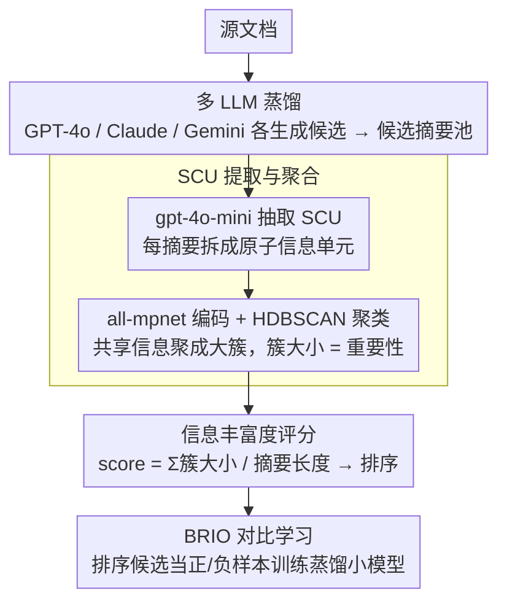

# SCURank: Ranking Multiple Candidate Summaries with Summary Content Units for Enhanced Summarization

**会议**: ACL 2026 Findings  
**arXiv**: [2604.19185](https://arxiv.org/abs/2604.19185)  
**代码**: [https://github.com/IKMLab/SCURank](https://github.com/IKMLab/SCURank)  
**领域**: 文本摘要 / 模型蒸馏  
**关键词**: 摘要排序, 内容单元, 对比学习, 多LLM蒸馏, 信息丰富度

## 一句话总结

本文提出 SCURank，一种基于摘要内容单元（SCU）的排序框架，通过提取 SCU、跨摘要聚类估计信息重要性、按信息丰富度评分来排序候选摘要，替代不稳定的 LLM 直接排序和粗粒度的 ROUGE 排序，在多 LLM 蒸馏场景中配合 BRIO 对比学习显著提升了蒸馏模型的摘要性能。

## 研究背景与动机

**领域现状**：LLM 在摘要任务上表现出色，但部署成本高。将 LLM 摘要能力蒸馏到 BART 等小模型已成为趋势。BRIO 框架通过对比学习训练小模型区分好/差摘要，其中候选摘要的排序质量至关重要。

**现有痛点**：(1) LLM 直接排序（如 GPTRank）不稳定——研究表明 LLM 在文本比较和排序中不可靠且不一致；(2) ROUGE 等经典指标仅衡量 n-gram 重叠，对高质量摘要的区分度不足；(3) 仅从单一 LLM 蒸馏引入模型特定偏差，限制了生成模式的多样性。

**核心矛盾**：高质量摘要之间的差异在于信息选择和覆盖，而非表面词汇重叠。需要一种能衡量信息丰富度而非表面匹配的排序方法。

**本文目标**：(1) 设计基于信息内容而非直接比较或表面重叠的摘要排序方法；(2) 验证从多个不同 LLM 蒸馏的效果。

**切入角度**：回归摘要的核心目标——信息保留。利用 SCU（摘要内容单元）作为信息的原子表示，通过跨摘要聚类估计每个 SCU 的重要性。

**核心 idea**：摘要的质量由其包含的信息内容的丰富度和重要性决定——越多重要 SCU 出现在一个摘要中，这个摘要越好。

## 方法详解

### 整体框架

SCURank 想替换掉摘要蒸馏里两种不靠谱的候选排序方式——LLM 直接排序（不稳定）和 ROUGE 排序（只看表面 n-gram 重叠）——改成衡量"信息丰富度"。这些候选摘要本身来自多个不同 LLM（多 LLM 蒸馏），以拉开内容选择上的差异。拿到一篇文档的候选摘要池后，它分三步走：先用 gpt-4o-mini 从每个候选里抽出简短、独立、唯一的信息单元（SCU）；再把所有 SCU 编码成向量、用 HDBSCAN 聚类，让"被多个摘要共享的信息"自然聚成大簇；最后按每个摘要所含 SCU 的重要性求和、再除以长度打分排序。排好序的候选随后喂给 BRIO 对比学习去训练蒸馏模型。

### 关键设计

**1. SCU 提取与聚合：只让 LLM 干它擅长的结构化抽取，用簇大小当重要性的客观信号**

这一步针对的是"LLM 直接排序不可靠"的痛点——办法是把 LLM 的职责限制在它可靠的地方。先用 LLM 把每个摘要拆成一条条 SCU（例如"奥巴马在 2009 年获得诺贝尔和平奖"这样一个原子事实），这是结构化抽取任务、可靠性高；再用 all-mpnet-base-v2 把 SCU 编码成向量，交给 HDBSCAN 聚类。HDBSCAN 不需要预设簇数，能自适应不同文档下语义信息的多寡。聚类的妙处在于：越多候选摘要各自独立提到同一条信息，这条信息就会落进越大的簇——簇大小于是成了一个不依赖 LLM 主观判断的"信息重要性"代理。

**2. 信息丰富度评分：用长度归一化的簇大小之和，给出可解释、稳定的排序标准**

有了每条 SCU 的重要性（即它所在簇的大小），摘要的好坏就可以量化为它装了多少重要信息。摘要 $s_i$ 的得分定义为 $\text{score}(s_i) = \sum_{u \in s_i} |C(u)| \,/\, |s_i|$，即把它包含的每个 SCU $u$ 所在簇 $C(u)$ 的大小加起来，再除以摘要长度 $|s_i|$。除以长度这一步很关键——不做归一化的话，更长的摘要会因为塞进更多 SCU 而被系统性偏好。相比 ROUGE 的表面重叠和 GPTRank 的不稳定，这个分数直接回答"这个摘要覆盖了多少被公认重要的信息"，既具体又可复现。

**3. 多 LLM 蒸馏：用多源候选打破单一模型的内容选择偏差**

只从一个 LLM 蒸馏会把它特定的内容选择偏好和写作风格一起继承下来，限制了多样性。SCURank 的解法是对同一文档让多个 LLM（GPT-4o、Claude、Gemini 等）各自生成候选摘要，由于不同模型在"挑哪些信息、怎么措辞"上各有偏好，混在一起的候选池天然覆盖更广。这些来自不同源的候选用同一套 SCURank 排序后再送进 BRIO，给蒸馏模型提供了更丰富、更少偏置的训练信号，实验中也体现为蒸馏模型更少照抄、更多改写。

### 损失函数 / 训练策略

使用 BRIO 框架进行对比学习：排序靠前的摘要作为正样本，排序靠后的作为负样本。BRIO 同时训练生成和评估能力。SCU 提取使用 gpt-4o-mini，编码使用 all-mpnet-base-v2。

## 实验关键数据

### 主实验

**蒸馏模型摘要性能对比**

| 排序方法 | ROUGE-1 | ROUGE-2 | ROUGE-L | BERTScore |
|---------|---------|---------|---------|-----------|
| ROUGE 排序 | 基线 | 基线 | 基线 | 基线 |
| GPTRank | 略优于 ROUGE | 略优于 ROUGE | 不稳定 | 不稳定 |
| **SCURank** | **最优** | **最优** | **最优** | **最优** |

### 消融实验

| 配置 | 效果 | 说明 |
|------|------|------|
| 单 LLM 蒸馏 | 基线 | 仅从一个 LLM 蒸馏 |
| 多 LLM 蒸馏 + ROUGE 排序 | 提升 | 多样性有帮助 |
| 多 LLM 蒸馏 + SCURank | **最优** | 信息丰富度排序+多样性 |
| HDBSCAN vs K-Means | HDBSCAN 更好 | 自适应簇数的优势 |

### 关键发现

- SCURank 在所有评估指标和数据集上一致优于 ROUGE 和 GPTRank 排序
- 多 LLM 蒸馏增强了蒸馏模型的抽象能力（更少抄袭、更多改写）
- LLM 在 SCU 提取任务上可靠（结构化输出），但在直接排序任务上不可靠
- SCURank 的排序与人类对摘要质量的判断更一致
- 长度归一化是关键——没有它更长的摘要会被系统性地偏好

## 亮点与洞察

- 将排序焦点从"表面匹配"回归到"信息保留"是摘要评估的正确方向
- LLM 做结构化任务（SCU 提取）可靠但做判断任务（排序）不可靠——这个区分为 LLM 在评估中的正确使用提供了指导
- HDBSCAN 的自适应聚类很适合信息单元的自然分组

## 局限与展望

- SCU 提取仍依赖 LLM，存在一定成本
- 信息丰富度不等于摘要质量的全部——连贯性、可读性等未直接建模
- 仅在新闻摘要数据集上验证
- 未来可探索将 SCURank 与流畅度/连贯性指标结合

## 相关工作与启发

- **vs GPTRank**: 依赖 LLM 直接排序，不稳定；SCURank 仅用 LLM 提取 SCU，排序基于确定性的信息统计
- **vs ROUGE**: 衡量表面 n-gram 重叠，对高质量摘要区分力不足；SCURank 衡量语义级信息覆盖
- **vs Nawrath et al. (2024)**: 提出 SGU 用于评估，SCURank 将其扩展到排序和蒸馏应用

## 评分

- 新颖性: ⭐⭐⭐⭐ SCU 用于排序是自然但有效的扩展
- 实验充分度: ⭐⭐⭐⭐ 多数据集、多排序方法对比、消融完整
- 写作质量: ⭐⭐⭐⭐ 方法清晰，流程图直观
- 价值: ⭐⭐⭐⭐ 为摘要蒸馏提供了更可靠的排序方案

<!-- RELATED:START -->

## 相关论文

- [\[ACL 2025\] Principled Content Selection to Generate Diverse and Personalized Multi-Document Summaries](../../ACL2025/nlp_generation/dpp_diverse_multidoc_summary.md)
- [\[ACL 2026\] FACTS: Table Summarization via Offline Template Generation with Agentic Workflows](facts_table_summarization_via_offline_template_generation_with_agentic_workflows.md)
- [\[ACL 2026\] ThreadSumm: Summarization of Nested Discourse Threads Using Tree of Thoughts](threadsumm_summarization_of_nested_discourse_threads_using_tree_of_thoughts.md)
- [\[ACL 2026\] Adaptive Planning for Multi-Attribute Controllable Summarization with Monte Carlo Tree Search](adaptive_planning_for_multi-attribute_controllable_summarization_with_monte_carl.md)
- [\[ACL 2026\] In-depth Research Impact Summarization through Fine-Grained Temporal Citation Analysis](in-depth_research_impact_summarization_through_fine-grained_temporal_citation_an.md)

<!-- RELATED:END -->
