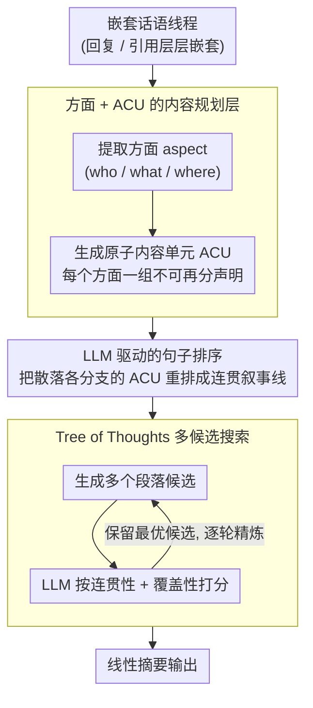

# ThreadSumm: Summarization of Nested Discourse Threads Using Tree of Thoughts

**会议**: ACL 2026  
**arXiv**: [2604.17648](https://arxiv.org/abs/2604.17648)  
**代码**: 无  
**领域**: 可解释性  
**关键词**: 嵌套话语线程摘要, Tree of Thoughts, 原子内容单元, 多阶段LLM管道, 连贯性与覆盖性

## 一句话总结

本文提出 ThreadSumm，一个多阶段 LLM 管道框架，将嵌套话语线程摘要建模为层次推理问题——先提取方面和原子内容单元进行内容规划，再通过句子排序构建线程感知序列，最后用 Tree of Thoughts 搜索生成和评分多个段落候选，在 Reddit/StackExchange 数据集上优于基线。

## 研究背景与动机

**领域现状**：讨论论坛中的嵌套线程结构（回复、引用、转发交织）使得摘要远比标准文档摘要复杂。现有 LLM 摘要方法主要处理线性文档或相对结构化的对话。

**现有痛点**：(1) 嵌套线程的树状/图状结构导致离题回复与主题回复交织，关键内容被掩埋；(2) 现有方法不平衡多元观点——倾向于最频繁的话题而忽略少数但重要的视角；(3) 多说话者场景中的轮次重叠和打断使得简单的线性邻接模型无法推断回复关系。

**核心矛盾**：线程的图结构 vs 摘要的线性输出——需要在保持连贯性的同时覆盖分布在不同分支中的多元话题。

**本文目标**：(1) 解决话语覆盖问题（多个交织话题的均衡表示）；(2) 解决连贯性问题（即使没有预定义线程顺序也能生成连贯摘要）。

**切入角度**：将摘要分解为内容规划（方面提取+ACU生成）和文本实现（句子排序+段落写作+ToT搜索）两个独立的推理层次。

**核心 idea**：用结构化的中间表示（方面+ACU）显式控制覆盖范围，用 Tree of Thoughts 搜索在连贯性和覆盖性之间找到最优平衡。

## 方法详解

### 整体框架

ThreadSumm 要摘要的是讨论论坛里那种回复、引用层层嵌套的话语线程，难点在于源头是树状/图状结构、而摘要必须是一段线性文字，直接喂给 LLM 容易跑偏到最热门的话题、漏掉散落在边缘分支里的重要观点。它把这件事拆成两层推理：先做"内容规划"，从原文抽出方面（aspect）和原子内容单元（ACU），用结构化的中间表示把"该覆盖哪些内容"先固定下来；再做"文本实现"，把这些 ACU 排成连贯序列、写成段落，并用 Tree of Thoughts 搜索多个候选、按连贯性和覆盖性打分挑最优。整条管道免训练，五个步骤全靠 LLM 提示串起来。

### 关键设计

**1. 方面 + ACU 的内容规划层：先把"该覆盖什么"显式定下来，再写摘要**

针对的痛点是直接摘要会被最显著的话题带跑、把少数但重要的视角埋掉。ThreadSumm 先用 few-shot 提示提取文档中的方面（who/what/where 这类元素），再为每个方面生成一组原子内容单元——不可再分的独立语义声明。ACU 的粒度比原句更细，等于把"摘要要说哪些事"摊成一张可勾选的清单，覆盖度因此可以被精确控制：先按方面铺开、再按方面补 ACU，强制让每个交织的话题都拿到均衡的表示，而不是任由生成阶段自由取舍。

**2. LLM 驱动的句子排序：把散在不同分支的 ACU 重排成一条连贯叙事线**

ACU 抽出来是一堆无序集合，而且它们原本散落在嵌套线程的不同分支和不同深度，靠位置或时间戳这类启发式根本拼不出合理顺序。这一步用零样本提示让 LLM 直接重排 ACU 列表，使其符合逻辑、读起来顺。把排序交给 LLM 而非位置规则，是因为线程里的连贯性是更全局的话语问题——哪个观点该先讲、哪个是对前文的回应，需要语义层面的判断，这恰好是排序步骤被低估却关键的地方：好的排序是连贯段落的前提。

**3. Tree of Thoughts 多候选搜索：在连贯性和覆盖性之间搜出最优平衡**

单次生成容易陷入局部最优——要么读着顺但漏了内容，要么覆盖全但拼接生硬。ThreadSumm 给定排序后的 ACU 后生成多个段落候选，用 LLM 给每个候选在两个维度上打分：连贯性（想法之间是否衔接、逻辑流是否通顺）和覆盖性（是否包含源文档的重要信息），选分最高的候选。这个过程多步迭代，每一步保留的最佳候选连同它的排序方案被带进下一步继续精炼。相比一次成型，ToT 的"多候选 + 逐轮精炼"把摘要空间当成一棵搜索树系统性地探索，让最终输出在两个相互拉扯的目标上都尽量站住。

### 损失函数 / 训练策略

免训练管道，不涉及参数更新。实验用 GPT-4、Claude-3、LLaMA-3-70B 三个 LLM 跑同一套流程，在 Reddit（250 实例）、StackExchange（117 实例）和 Bitcoin 论坛（1 实例案例研究）上评估。

## 实验关键数据

### 主实验

**Reddit 数据集（QAGS 一致性/ROUGE-1）**

| 模型-方法 | QAGS | ROUGE-1 |
|----------|------|---------|
| Claude-Vanilla | 38.34 | 30.88 |
| Claude-CHRONOS | 45.43 | 26.35 |
| Claude-ThreadSumm | **55.66** | **34.37** |
| GPT-4-Vanilla | 36.46 | 30.54 |
| GPT-4-ThreadSumm | **50.34** | **33.30** |

### 关键发现

- ThreadSumm 在 QAGS（事实一致性）上显著优于所有基线——ACU 的显式内容规划有效防止了幻觉
- ROUGE-1 提升也一致，说明覆盖度确实提高
- ToT 的迭代精炼对连贯性提升明显——多候选搜索比单次生成质量更高
- 不同 LLM 上的趋势一致，证明框架的模型无关性

## 亮点与洞察

- ACU 作为中间表示非常适合线程摘要——它天然支持跨分支的内容聚合和均衡覆盖
- ToT 搜索在摘要任务中的应用是新颖的——将连贯性和覆盖性作为搜索目标的双优化
- 句子排序步骤是被低估但重要的环节——好的排序是连贯段落的前提

## 局限与展望

- 多步 LLM 调用增加了延迟和成本
- 仅在英文讨论论坛上验证
- Bitcoin 论坛只有 1 个实例作为案例研究，不够统计显著
- 未与最新的长上下文 LLM 做直接对比

## 相关工作与启发

- **vs CHRONOS**: 基于时间顺序处理线程，ThreadSumm 用 LLM 推理处理任意线程结构
- **vs arg-graph**: 用论证图结构化对话，ThreadSumm 用 ACU 提供更通用的内容分解
- **vs mRedditSumm**: 多文档摘要基线，ThreadSumm 通过 ToT 搜索取得更好的连贯性

## 评分

- 新颖性: ⭐⭐⭐⭐ ACU+ToT搜索的组合在线程摘要中是新颖的
- 实验充分度: ⭐⭐⭐ 3模型+3数据集但规模较小
- 写作质量: ⭐⭐⭐⭐ 研究问题清晰，框架描述完整
- 价值: ⭐⭐⭐⭐ 对嵌套话语摘要提供了实用的解决方案

<!-- RELATED:START -->

## 相关论文

- [\[ACL 2026\] Adaptive Planning for Multi-Attribute Controllable Summarization with Monte Carlo Tree Search](adaptive_planning_for_multi-attribute_controllable_summarization_with_monte_carl.md)
- [\[ACL 2025\] DTCRS: Dynamic Tree Construction for Recursive Summarization](../../ACL2025/nlp_generation/dtcrs_dynamic_tree_construction_for_recursive_summarization.md)
- [\[ACL 2026\] FACTS: Table Summarization via Offline Template Generation with Agentic Workflows](facts_table_summarization_via_offline_template_generation_with_agentic_workflows.md)
- [\[ACL 2026\] SCURank: Ranking Multiple Candidate Summaries with Summary Content Units for Enhanced Summarization](scurank_ranking_multiple_candidate_summaries_with_summary_content_units_for_enha.md)
- [\[ACL 2026\] In-depth Research Impact Summarization through Fine-Grained Temporal Citation Analysis](in-depth_research_impact_summarization_through_fine-grained_temporal_citation_an.md)

<!-- RELATED:END -->
