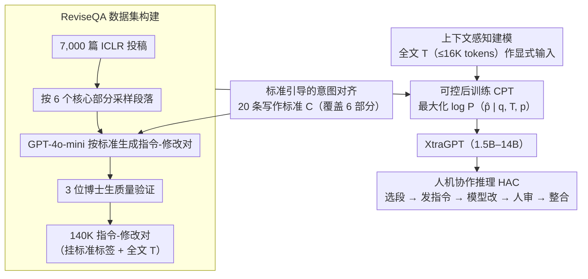

# XtraGPT: Context-Aware and Controllable Academic Paper Revision via Human-AI Collaboration

**会议**: ACL 2026  
**arXiv**: [2505.11336](https://arxiv.org/abs/2505.11336)  
**代码**: [GitHub](https://github.com/Xtra-Computing/XtraGPT)  
**领域**: 文本生成  
**关键词**: 论文修改, 人机协作, 上下文感知, 可控生成, 学术写作

## 一句话总结

本文提出 XtraGPT——首个面向学术论文修改的开源 LLM 套件（1.5B-14B），通过在 7,000 篇顶会论文和 140,000 个标准引导的指令-修改对上微调，实现上下文感知的段落级可控修改，7B 版本匹配 GPT-4o-mini，14B 版本超越 GPT-4o-mini，人类评估显示修改后论文预测评分平均提升 0.65 分。

## 研究背景与动机

**领域现状**：LLM 在学术工作流中的应用日益广泛，但主要停留在通过 ChatGPT 等通用模型进行表面润色。现有的 AI 写作工具要么是从头生成整篇论文（引发原创性和伦理问题），要么仅做语法修正。

**现有痛点**：(1) 通用 LLM 对学术论文的修改往往流于表面——改善了流畅性但未解决核心论证问题（如动机不清、贡献模糊）；(2) 学术写作本质上是迭代的，但当前 LLM 工作流将每次提示视为独立交互，缺乏跨修改轮次的上下文追踪；(3) 现有系统缺乏三个关键可控性：遵循上下文示例、遵循用户指令、遵循显式写作标准。

**核心矛盾**：学术论文修改需要理解全文上下文和遵循领域特定的写作标准，但通用 LLM 既缺乏全文理解能力，也缺乏对学术写作规范的内化。

**本文目标**：构建一个人机协作的论文修改框架，模型作为"助手"提供上下文感知的定向修改，人类保留创意控制权。

**切入角度**：将修改任务建模为标准引导的条件生成——给定全文 $T$、目标段落 $p$、用户指令 $q$，生成修改后段落 $\hat{p} = \text{Model}_\theta(p, q, T)$。通过 20 条从顶会审稿指南中提炼的写作标准来规范化修改意图。

**核心 idea**：通过标准引导的意图对齐和上下文感知建模，将学术论文修改从"通用润色"提升为"精准的结构化改进"。

## 方法详解

### 整体框架

XtraGPT 想解决的是通用 LLM 改论文只会"表面润色"——能把句子改顺，却碰不到动机不清、贡献模糊这类核心论证问题，而且每次提示都被当成孤立交互，没有全文上下文。它的后训练框架把"改一段论文"建模为标准引导的条件生成：给定全文 $T$、目标段落 $p$、用户指令 $q$，输出修改后段落 $\hat{p} = \text{Model}_\theta(p, q, T)$。三个组件分别管"改的方向"（20 条写作标准把模糊意图对齐到具体策略）、"改的依据"（全文 $T$ 作为显式输入）、"怎么学会"（在 ReviseQA 上做可控后训练 CPT，最大化 $\log P_\theta(\hat{p}\mid q,T,p)$）。推理时走人机协作（HAC）协议：用户选段落、发指令，模型给修改，用户审核后整合，创意控制权始终在人手里。

### 关键设计

**1. 标准引导的意图对齐：把"加强贡献"这种高层模糊指令翻译成可执行的修改策略**

作者的指令往往笼统（比如"让动机更清楚"），模型不知道具体该动哪里。XtraGPT 从 ICLR 审稿指南和专家经验里提炼出 20 条段落级写作标准 $C$，覆盖标题、摘要、引言、背景、实验、结论六个部分（如"标题与内容的一致性""引言中动机的强度和清晰度""实验对主要创新的支撑"）。训练数据里每个指令-修改对都显式挂上一条标准 $c \in C$，让模型学会把某类请求和对应的修改策略绑定起来。这套标准等于在抽象意图和具体文本操作之间架了一座桥，且因为出自权威写作指南，保证改出来的东西符合学术规范，而不是模型自己的随意发挥。

**2. 上下文感知建模：让段落修改和全文叙事保持一致**

改"引言里的动机"和改"实验里的分析"需要的考量完全不同，缺了全文上下文的修改容易和论文整体脱节。XtraGPT 把完整论文正文 $T$（去掉致谢和参考文献，控制在 16,384 tokens 内）作为模型的显式输入，训练目标 $\mathcal{L}_{CPT}(\theta) = -\mathbb{E}[\log P_\theta(\hat{p} \mid q, T, p)]$ 强制模型以全局叙事、结构和术语为条件来表示当前段落。这一条是整个框架最关键的支点：消融实验里一旦去掉上下文 $T$，结论部分的 LC win rate 从 50% 直接崩到 11.76%，可见离开全文，定向修改几乎无从谈起。

**3. ReviseQA 数据集构建：撑起大规模、高质量的标准引导修改训练数据**

现有数据集要么只盯语法修正、要么覆盖端到端整篇生成，缺的正是"段落级结构化修改"这种训练资源。XtraGPT 从 ICLR 2024 的 7,000 篇投稿出发，对每篇论文的六个核心部分采样段落，按 20 条标准生成指令-修改对：修改由 GPT-4o-mini 产出（幻觉率仅 1.7%），再由三位博士生做人类质量验证，最终得到 140,000 个高质量指令-修改对，留 5% 作测试集。正是这份"全文上下文 + 标准标签 + 段落修改"三位一体的数据，让小模型也能内化学术写作规范。

### 损失函数 / 训练策略

标准条件语言模型损失 $\mathcal{L}_{CPT}(\theta) = -\mathbb{E}[\log P_\theta(\hat{p} \mid q, T, p)]$，做全参数微调（优于 LoRA）。评估用长度控制胜率（Length-Controlled Win Rate），由 alpaca_eval_gpt4_turbo_fn 自动评判以消除长度偏差。

## 实验关键数据

### 主实验

**长度控制胜率（vs XtraGPT-7B 作为锚点）**

| 模型 | 标题 | 摘要 | 引言 | 背景 | 实验 | 结论 | 总体 |
|------|------|------|------|------|------|------|------|
| QwQ-32B | 46.58 | 85.34 | 81.99 | 83.82 | 82.64 | 95.69 | **80.86** |
| DeepSeek-v3-671B | 56.42 | 65.71 | 68.32 | 74.12 | 72.11 | 64.83 | **67.70** |
| XtraGPT-14B | 55.29 | 59.43 | 50.90 | 59.43 | 57.87 | 52.11 | **55.49** |
| GPT-4o-Mini | 48.80 | 47.43 | 55.73 | 66.07 | 45.67 | 39.03 | **51.75** |
| **XtraGPT-7B (anchor)** | — | — | — | — | — | — | **50.00** |
| Qwen2.5-7B-Instruct | 39.93 | 45.14 | 45.64 | 39.28 | 33.87 | 31.17 | **40.80** |

### 消融实验

| 配置 | 总体 LC Win Rate | 说明 |
|------|----------------|------|
| XtraGPT-7B (完整 CPT) | 50.00 | 锚点 |
| w/o 写作标准 | 44.65 | 去掉标准引导 |
| Qwen2.5-7B (基座) | 40.80 | 无微调 |
| w/o 上下文 $T$ | 34.71 | 去掉全文上下文 |

### 关键发现

- XtraGPT-7B 超越所有同规模开源模型，且在摘要、实验、结论部分超越 GPT-4o-mini
- 上下文 $T$ 是最关键组件：去除后结论部分 LC win rate 从 50% 骤降至 11.76%，整体降至 34.71%
- 标准引导贡献显著但次于上下文（44.65 vs 50.00），在引言和摘要等结构化部分尤为重要
- AI-SCIENTIST 全文评估显示：修改后贡献分 +7.89%、表达分 +12.50%、严谨性 +6.41%，总评分从 6.08 升至 6.73（p<0.001）
- 人类评估中修改接受率为 3.23/5.0，指令遵循 3.78/5.0

## 亮点与洞察

- HAC 协议的设计理念值得借鉴：人类负责创意和决策，AI 负责执行和改善，避免了全自动化带来的原创性和伦理风险
- 20 条写作标准的提炼本身就是一个有价值的资源——可以作为论文自查清单或审稿指南
- 使用 AI-SCIENTIST 作为论文质量评估器是巧妙的实验设计——将主观的"论文变好了吗"转化为可量化的预测评分变化

## 局限与展望

- ReviseQA 仅来自 ICLR 2024，可能偏向 ML/AI 领域的写作风格，对其他学科（如 NLP、生物医学）的泛化性未知
- GPT-4o-mini 生成的修改作为训练目标，可能引入该模型的偏好和风格偏差
- 当前仅支持单轮修改评估，多轮迭代修改的累积效果未被系统衡量
- 16K token 的上下文窗口限制了对超长论文的处理能力
- 未探索与人类修改历史（如 OpenReview 上的修改记录）对齐的可能性

## 相关工作与启发

- **vs AI Scientist**: AI Scientist 追求全自动化的论文生成和审稿，原创性存疑；XtraGPT 明确定位为"辅助工具"，保留人类主导权
- **vs STORM/CO-STORM**: STORM 从零生成文章，面临事实幻觉和一致性问题；XtraGPT 在人类草稿基础上修改，天然减少了幻觉风险
- **vs CycleResearcher**: CycleResearcher 使用论文生成-评审循环进行自我提升，但存在 reward hacking；XtraGPT 使用人类标注验证的标准引导数据

## 评分

- 新颖性: ⭐⭐⭐⭐ 首个面向学术论文修改的开源 LLM 套件，HAC 框架设计合理
- 实验充分度: ⭐⭐⭐⭐ LC win rate + 人类评估 + AI-SCIENTIST 全文评估 + 消融
- 写作质量: ⭐⭐⭐⭐ 框架描述清晰，与现有工作的定位区分明确
- 价值: ⭐⭐⭐⭐⭐ 解决研究者日常痛点，开源模型+数据集+Overleaf 插件，实用性极高

<!-- RELATED:START -->

## 相关论文

- [\[ACL 2025\] Context-Aware Hierarchical Merging for Long Document Summarization](../../ACL2025/nlp_generation/context-aware_hierarchical_merging_for_long_document_summarization.md)
- [\[ACL 2026\] Adaptive Planning for Multi-Attribute Controllable Summarization with Monte Carlo Tree Search](adaptive_planning_for_multi-attribute_controllable_summarization_with_monte_carl.md)
- [\[ACL 2026\] Right at My Level: A Unified Multilingual Framework for Proficiency-Aware Text Simplification](right_at_my_level_a_unified_multilingual_framework_for_proficiency-aware_text_si.md)
- [\[ACL 2026\] Children's English Reading Story Generation via Supervised Fine-Tuning of Compact LLMs with Controllable Difficulty and Safety](childrens_english_reading_story_generation_via_supervised_fine-tuning_of_compact.md)
- [\[ACL 2026\] Difficulty-Controllable Cloze Question Distractor Generation](difficulty-controllable_cloze_question_distractor_generation.md)

<!-- RELATED:END -->
