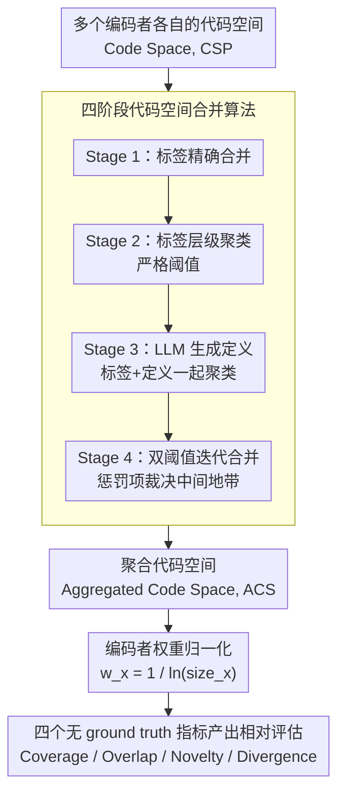

# A Computational Method for Measuring "Open Codes" in Qualitative Analysis

**会议**: ACL 2026  
**arXiv**: [2411.12142](https://arxiv.org/abs/2411.12142)  
**代码**: [GitHub](https://github.com/) (开源软件包)  
**领域**: 模型压缩  
**关键词**: 归纳编码, 定性分析, LLM辅助评估, 代码空间聚合, 团队协作评估

## 一句话总结

提出一种基于理论的计算方法，通过LLM增强的代码合并算法和四个无需ground truth的指标（Coverage, Overlap, Novelty, Divergence），系统评估人类和AI在归纳定性编码中的表现。

## 研究背景与动机

**领域现状**：定性分析是社会科学中理解人类数据的核心方法，其中归纳编码（open coding）要求研究者直接从数据中发现模式和主题，而非依赖预设框架。随着生成式AI被越来越多地用于辅助编码任务，急需可靠的评估方法。

**现有痛点**：归纳编码的评估面临根本性困境——(1) 基于ground truth的指标（如inter-rater reliability）与归纳编码的开放性本质矛盾；(2) 聚类/主题一致性指标关注内部同质性而非概念广度；(3) 人工评估成本高、难以规模化。

**核心矛盾**：归纳编码追求的是"广泛捕获新颖见解"，而非"与标准答案一致"，现有评估方法无法反映这一特性。

**本文目标**：设计一套理论驱动、无需ground truth的计算指标，能够系统衡量人类和机器编码者在归纳编码中的贡献质量。

**切入角度**：借鉴团队编码方法（team-based approach），将多个编码者的结果聚合到共享分析空间，从而实现基于集体的相对评估。

**核心 idea**：通过LLM增强的层级聚类算法将多个编码者的codebook合并为聚合代码空间（ACS），然后用四个互补指标从不同维度衡量每个编码者的贡献。

## 方法详解

### 整体框架

归纳编码里每个编码者会从同一批数据里各自总结出一套 codes（即 Code Space, CSP），但不同人对同一概念往往措辞不同，没法直接横向比。本文先用一个四阶段合并算法把所有人的 CSP 聚合成一个共享的 Aggregated Code Space（ACS），把"语义相同、说法不同"的 codes 归并到一起；随后给每个编码者算一个归一化权重，压住"产出越多占位越大"的偏差；最后在这个统一空间上算四个互补指标，从覆盖广度、与他人重合度、独特贡献、分布偏离四个角度，给每个编码者一个无需 ground truth 的相对评估。

### 关键设计

**1. 四阶段代码空间合并算法：把"同义不同词"的 codes 收敛成统一概念空间**

归纳编码的麻烦在于两个编码者可能用完全不同的标签描述同一个概念，简单按字符串匹配根本对不上，而单一相似度阈值又压不住"概念相近但不同"的误并。本文用逐级加严的四阶段管线来解决：Stage 1 做朴素的标签精确合并；Stage 2 在标签上做严格阈值的层级聚类合并；Stage 3 引入 LLM 为每个 code 生成定义，把"标签 + 定义"一起送进聚类，让语义判断不再只看表面词；Stage 4 做双阈值迭代合并，并加入一个惩罚项 $penalty$，它基于两个 code 的示例重叠度和各自的唯一示例数来计算。

双阈值加惩罚是这一步的关键：上阈值之上直接合并、严格阈值之下绝不合并、中间地带交给 $penalty$ 裁决——示例重叠高才合、唯一示例多则抑制合并，这样既防止把不同概念错并到一起，也避免某个小 codebook 因为体量小而被大 codebook 不成比例地吞掉。阈值通过交互式验证选定（strict=0.32, upper=0.55），相似度用余弦距离度量。

**2. 编码者权重归一化机制：让指标反映质量而非数量**

如果一个编码者疯狂产出大量冗余 codes（flooding），他在 ACS 里占的位置会虚高，Coverage 等指标被数量撑大却不代表质量好。本文给每个编码者一个权重 $w_x = \frac{1}{\ln(size_x)}$，其中 $size_x$ 是他的 code 数量（下限取所有人的中位数）。code 数越多，权重越低，于是每个 code 的边际贡献被稀释——这样最终指标反映的是真实概念贡献，而不是谁写得多谁就赢。

**3. 四个无 ground truth 评估指标：组合起来才有诊断力**

归纳编码追求的是"广泛捕获新见解"而非"对标准答案"，所以传统的 inter-rater reliability 这类指标天然不适用。本文在 ACS 上定义四个互补指标：Coverage 衡量一个编码者（加权后）覆盖了 ACS 多大比例的概念广度；Overlap 衡量他的 codes 和其他人重合的程度，即概念一致性；Novelty 衡量只有他一个人发现、别人都没有的 codes，即独特贡献；Divergence 用 Jensen-Shannon 散度衡量他的 code 分布偏离群体分布的程度。

单看任何一个指标都会误判，组合解读才是这套指标的价值所在：高 Coverage + 高 Overlap 是可靠编码者；高 Novelty 但 Overlap 极低往往不是创见而是幻觉（没人能印证）；Divergence 异常高则提示这个编码者整体跑偏。这种多维诊断比卡单一阈值能区分出"过度编码""幻觉""正常"等不同失效模式。

### 损失函数 / 训练策略

本文不涉及模型训练。合并算法以余弦距离作语义相似度，阈值经交互式验证选定（strict=0.32, upper=0.55）。全程使用开源本地模型（生成定义用 Gemma3-27B，嵌入用 mxbai-embed-large），保证所有处理可在本地完成、数据不出域。

## 实验关键数据

### 主实验

| 配置 | Coverage变化 | Overlap变化 | Novelty变化 | Divergence变化 |
|------|-------------|-------------|-------------|----------------|
| Stage 2 vs 1 | +0.09% | -0.09% | +0.05% | +0.37% |
| Stage 3 vs 1 | +3.60% | +5.45% | +0.94% | -4.31% |
| Stage 4 vs 1 | +7.02% | +7.86% | -1.64% | -1.91% |

### 消融实验

| 配置 | 关键指标 | 说明 |
|------|---------|------|
| 跨LLM一致性 | CoV < 0.1 | 10次重复运行变异系数极低 |
| 模型解释力 | R² > 0.91 | 条件+模型+编码者身份高度解释指标变异 |
| Flooding检测 | Coverage=78.7%, Novelty=68.1% | 过度编码被有效识别 |
| Hallucination检测 | Overlap=15.6%, Divergence=75.7% | 幻觉编码被有效诊断 |

### 关键发现
- 四个阶段的合并算法显著减少合并后代码数量（p<0.001），但排名前5的编码者排序保持稳定
- 3/4的LLM（Gemma3, QwQ, GPT-4.1）产生高度相似的指标，仅Gemini-2.5-Pro有显著偏差
- Flooding编码者的Coverage虽高但Novelty呈递减效应；Hallucination编码者Coverage和Overlap急剧下降

## 亮点与洞察
- 四个指标的组合诊断能力强大：正常编码者呈现"中等Coverage + 合理Overlap + 适度Novelty + 低Divergence"的健康模式
- 方法完全不依赖ground truth，适用于真正的探索性分析场景
- 即使用小型开源LLM也能获得稳定结果，对数据隐私友好（所有处理可在本地完成）

## 局限与展望
- 当前仅在一个数据集上验证，需要更多领域和语言的测试
- 阈值选择仍需人工交互验证，尚未实现全自动化
- 对于编码者极少（如仅2人）的场景，指标的统计效力可能不足
- 未来可扩展到更大规模的多轮迭代编码流程

## 相关工作与启发
- **vs Ground-truth指标**: 本方法不需要预设正确答案，更符合归纳编码的探索性本质
- **vs 聚类一致性指标**: 不仅关注内部一致性，更关注跨编码者的互补性和概念覆盖广度
- **vs 人工评估**: 计算指标可重复、可扩展，且与人工评估的诊断方向一致

## 评分
- 新颖性: ⭐⭐⭐⭐ 首次为归纳编码提出不依赖ground truth的系统计算指标
- 实验充分度: ⭐⭐⭐⭐ 消融、鲁棒性、边界案例检测均有充分验证
- 写作质量: ⭐⭐⭐⭐ 理论动机清晰，算法描述严谨
- 价值: ⭐⭐⭐⭐ 对定性分析与AI协作有实际指导意义

<!-- RELATED:START -->

## 相关论文

- [\[ACL 2026\] DimABSA: Building Multilingual and Multidomain Datasets for Dimensional Aspect-Based Sentiment Analysis](dimabsa_building_multilingual_and_multidomain_datasets_for_dimensional_aspect-ba.md)
- [\[ACL 2026\] MSMO-ABSA: Multi-Scale and Multi-Objective Optimization for Cross-Lingual Aspect-Based Sentiment Analysis](msmo-absa_multi-scale_and_multi-objective_optimization_for_cross-lingual_aspect-.md)
- [\[ACL 2025\] Towards a More Generalized Approach in Open Relation Extraction](../../ACL2025/nlp_understanding/generalized_open_relation_extract.md)
- [\[ACL 2025\] Beyond Prompting: An Efficient Embedding Framework for Open-Domain Question Answering](../../ACL2025/nlp_understanding/embqa_embedding_odqa.md)
- [\[ACL 2025\] Dynamic Order Template Prediction for Generative Aspect-Based Sentiment Analysis](../../ACL2025/nlp_understanding/dot_absa_template.md)

<!-- RELATED:END -->
