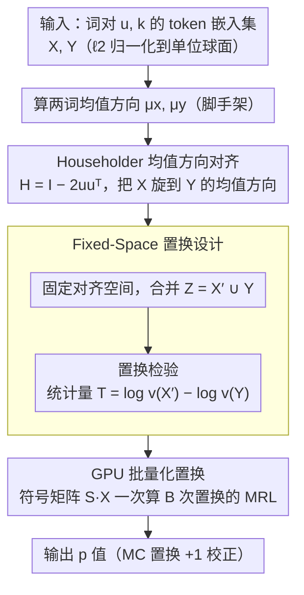

# Accurate and Efficient Statistical Testing for Word Semantic Breadth

**会议**: ACL 2026  
**arXiv**: [2605.08048](https://arxiv.org/abs/2605.08048)  
**代码**: https://rebrand.ly/WordSemanticBreadth  
**领域**: LLM 效率 / 词义分析  
**关键词**: 词义广度, 置换检验, Householder 变换, 上下文嵌入, GPU 加速

## 一句话总结
本文指出"在上下文嵌入空间用置换检验直接比较两个词的语义广度"会因均值方向差异而严重虚高 Type-I 错误，提出用 Householder 反射先对齐均值方向再做置换的方法，把 Type-I 错误降低 32.5%，并给出 GPU 批量化实现实现 23 倍加速。

## 研究背景与动机
**领域现状**：上下文嵌入（如 BERT）已成为词义建模的标准工具。Nagata 与 Tanaka-Ishii (2025) 把"一个词在不同上下文中的 token 嵌入云"看成一个分布，用其离散度（dispersion）作为"语义广度 / contextual diversity"的代理指标——这对词典学（决定一个词该拆几个义项）极有价值。

**现有痛点**：要在两个词之间比较语义广度差异是否"统计显著"，最朴素做法是把两个词的 token 云合并后做置换检验。但作者指出：**当两个词在球面上的均值方向不同（即语义不同）时，朴素置换会把两组点混合到不同区域，从而把"方向差异"误计入"离散度差异"**，使得 Type-I 错误（错误判定有显著广度差异）严重虚高，违背显著性检验的初衷。

**核心矛盾**：嵌入空间的"语义差异"和"广度差异"在统计上被纠缠在一起；置换检验默认了"可交换性 (exchangeability)"假设，而方向差异显著时这一假设被打破。

**本文目标**：(i) 让置换检验只对广度敏感、不对语义方向敏感，从而 calibrate p 值；(ii) 让置换检验在词表规模下可承受（朴素 CPU 实现太慢）。

**切入角度**：作者注意到，如果能先把一个词的 token 云"旋转"到另一个词的均值方向，再做置换，就能消除方向差异这个干扰因子。这恰好是 Householder 反射的几何作用——一个保范数、保相对几何的正交变换。

**核心 idea**：先用 Householder 反射对齐两词的均值方向，再做合并置换；同时把整个置换过程改写成 GPU 上的批量矩阵乘法，让大规模词表分析变得可行。

## 方法详解

### 整体框架
方法的输入是一对词：一个待评词 $u$ 和一个参考词 $k$，各自从语料里抽出 token 嵌入集 $X = \{\mathbf{x}_i\}_{i=1}^n$ 与 $Y = \{\mathbf{y}_j\}_{j=1}^m$（都已 $\ell_2$ 归一化到单位球面 $\mathbb{S}^{d-1}$），输出是一个 p 值，回答"$u$ 是否比 $k$ 语义更广"。整条流水线是：先算两词的均值方向 $\hat{\mu}_x, \hat{\mu}_y$，用一次 Householder 反射把 $X$ 旋转到 $Y$ 的均值方向上消除"方向差异"这个干扰因子，再把对齐后的两组点合并做置换检验，统计量取 mean resultant length 的对数差。整个置换过程进一步被改写成 GPU 上的批量矩阵乘法，让词表规模的两两比较变得可承受。

### 关键设计
**1. Householder 均值方向对齐：用一次正交反射剥掉"方向差异"，只留下广度差异**

朴素置换之所以 Type-I 错误虚高，是因为两个语义不同的词在球面上均值方向不同，置换把两组点混到不同区域，方向差异被错算进离散度差异。本文先把这个干扰因子直接消掉：取反射轴 $\mathbf{u} = (\hat{\mu}_x - \hat{\mu}_y)/\|\hat{\mu}_x - \hat{\mu}_y\|_2$，构造 $H = I - 2\mathbf{u}\mathbf{u}^\top$，这是一次反射，恰好满足 $H\hat{\mu}_x = \hat{\mu}_y$ 且 $H^\top H = I$，把 $X$ 的均值方向对齐到 $Y$ 上，同时因为是正交变换，组内每个点的 norm、相对距离、离散度全部保持不变。作者在附录 D 证明 Householder 变换正是让合并集 mean resultant length 最大化、从而最大限度恢复"可交换性"的那个变换。

之所以用单次反射而不是完整的旋转优化，是因为反射计算量只有 $O(d^2)$，数学上又已知足以对齐任意两个单位向量；而之所以不用 Procrustes，是因为 Procrustes 需要点对点配对，但两词的 token 数不同、点之间也没有自然对应关系，根本配不上。

**2. Fixed-Space 置换设计：对齐空间固定不动，置换才有意义**

对齐之后必须把合并集 $Z = X' \cup Y$ 固定下来，所有置换都在这同一个对齐空间里进行。一个很自然但错误的做法是每次置换都重新估计 $H$ 再对齐——那样几何空间会随标签置换而漂移，置换分布反映的就不再是 H0 下的真实可变性，p 值失去意义。固定空间后，置换打乱的只是"标签归属"而非"几何空间"。检验统计量取 MRL 的对数差 $T_{obs} = \log v(X') - \log v(Y)$，其中 $v(X) = 1/g_d(r(X))$，$r(X) = \|\frac{1}{n}\sum_i \mathbf{x}_i\|_2$ 是 mean resultant length（越大越集中、越小越分散）。这个设计在附录 E 用"同一个词切两半"的 sanity check 得到验证。

**3. GPU 批量化置换：把串行置换重写成一次矩阵乘法，拿到 23 倍加速**

词典学应用要在数千到数万词的规模上做大量两两比较，朴素的 $O(BNd)$ 串行置换（$B$ 次置换、$N$ 总样本数、$d$ 维度）在 CPU 上完全不实用。本文把每次置换 $b$ 表示成符号向量 $\mathbf{s}^{(b)} \in \{+1, -1\}^N$（$+1$ 入组 1，$-1$ 入组 2），$B$ 次堆叠成符号矩阵 $\mathbf{S} \in \{+1,-1\}^{B \times N}$，于是每组的均值向量可以一次性算出 $\mathbf{M} = \mathbf{S}\mathbf{X} \in \mathbb{R}^{B \times d}$，再对每行取 $\ell_2$ 范数就得到 $B$ 个 MRL。整个流程几乎全是 dense matmul 加 reduction，把 GPU 算力直接拉满，相比 CPU 朴素实现快约 23 倍，让"显著性检验"从 CPU bottleneck 变成 GPU-friendly 的批量操作。

### 损失函数 / 训练策略
本文是统计推断方法，无模型训练。核心统计量是 **mean resultant length** $r(X) = \|\frac{1}{n}\sum \mathbf{x}_i\|_2 \in [0,1]$ 与对应的浓度参数 $\kappa = g_d(r)$（与 von Mises-Fisher 分布相关）；语义广度代理为 $v(X) = 1/g_d(r(X))$。p 值用标准 Monte Carlo 置换公式加 +1 校正：$p = \frac{1 + \sum_b \mathbb{I}[T^{(b)} \geq T_{obs}]}{B + 1}$。

## 实验关键数据

### 主实验：Type-I 错误与运行效率对比

| 方法 | Type-I 错误率 | 单词对耗时 | 设备 |
|------|---------------|-----------|------|
| 朴素置换检验（CPU） | 高（虚高）| 1.0× | CPU |
| Householder + GPU 置换 | -32.5%（相对降低）| ~1/23 ≈ 23× 加速 | GPU |

### 消融实验：方法各组件的作用

| 配置 | Type-I 错误控制 | 真实广度差异检出 | 速度 |
|------|----------------|------------------|------|
| 朴素置换（无对齐 + CPU） | ❌ 严重虚高 | ✅ 但伴随大量假阳 | 慢 |
| 仅对齐（CPU） | ✅ Type-I -32.5% | ✅ 保留 | 慢 |
| 仅 GPU 批量（无对齐） | ❌ 仍虚高 | ✅ | 快（23×） |
| 完整方法（对齐 + GPU） | ✅ | ✅ | 快（23×） |

### 关键发现
- **方向差异是 Type-I 虚高的主因**：Householder 对齐前后 Type-I 错误下降 32.5%，证明朴素置换的失败来自方向-广度的纠缠而非样本量不足。
- **对齐对真实广度差异的检出几乎无损**：因为 Householder 是正交变换，保持组内的所有相对几何关系，真实有广度差异的词对依然能被检出。
- **GPU 加速放大方法的实用性**：23× 加速使得跨数千词的两两比较从不可行变为分钟级任务，这是把方法推广到词典编纂实际工作流的关键。
- **Fixed-Space 设计被同词分半实验验证**：附录 E 把同一个词的 token 切成两半做对照——理想情况 p 值应均匀分布在 [0,1]。朴素置换严重偏向小 p 值（假阳）；Householder + fixed-space 把分布拉回均匀，统计上验证了校准性。
- **小样本量场景失败模式**：当每词 token 数低于约 50 时 MRL 估计噪声变大，p 值的 power 急剧下降——作者建议子采样到统一规模（如 200 tokens/词）以稳定方差。

## 亮点与洞察
- **几何直觉非常清晰**：用图 1 的"球面上两群点"图像让人一眼看懂为什么朴素置换失败、为什么 Householder 能修复——把抽象的统计问题翻译成可视化几何问题。
- **Householder 而非 Procrustes 是恰当选择**：作者敏锐发现 Procrustes 需要点对点配对，而词的 token 云之间没有自然对应，Householder 反射正好绕过这个困难。
- **Fixed-Space 设计的微妙处**：很多研究者会自然想到"每次置换都重新对齐"，但作者证明那样反而破坏 H0；这是一个很容易踩到的陷阱。
- **GPU 化的现实意义**：很多统计检验在小规模下"理论可行但实际太慢"，本文把置换检验改写成 dense matmul 的做法可以推广到其它高维统计推断（如 bootstrap CI 计算）。

## 局限与展望
- **作者承认**：方法用于决定"哪些词需要更细的义项划分"，不直接预测义项数；适用于词典编纂的优先级排序而非完整自动化。
- **额外局限**：假设两词的浓度参数可比较，对极端各向异性嵌入（如某些层的 BERT）可能需要先去各向异性化；样本量极小时（每词 token 数 < 50）MRL 估计噪声大，p 值可信度下降。
- **改进方向**：(i) 把对齐方法扩展到多于两个词（如 ANOVA 类设计），需要处理多个均值方向的同时对齐；(ii) 与现有去各向异性方法（如 whitening）组合，进一步净化几何；(iii) 把统计量从 MRL 扩展到其它直接刻画"多模态/多义"的指标（如球面 GMM 的成分数）。

## 相关工作与启发
- **vs Nagata & Tanaka-Ishii 2025**（contextual diversity）：他们提出用嵌入云的离散度作为词义广度代理，本文补上"如何统计显著比较两个词的广度差异"这一缺口。
- **vs Zmigrod et al. 2022**（精确置换检验）：他们的方法仅对离散值统计量有效，无法处理连续高维的 MRL 统计量，本文用 GPU 加速的 Monte Carlo 置换填补这一空白。
- **vs Procrustes alignment**（Schönemann 1966）：Procrustes 要求点对点配对，不适合无对应关系的 token 云比较；本文用 Householder 反射成功绕过该限制。
- **vs HyperLex**（Vulić 2017）：HyperLex 衡量词汇蕴含强度，与"广度"概念部分重叠但不等价，本文的方法可以与之结合区分"语义广度"和"语义包含"。
- **vs 各向异性研究**（Ethayarajh 2019）：他们指出 BERT 上下文嵌入存在严重各向异性、各层几何差异大；这意味着应用本方法前可能需要 whitening 等预处理来稳定结果，是一个值得探索的组合方向。

## 评分
- 新颖性: ⭐⭐⭐⭐ 把 Householder 反射引入语义广度检验是一个原创且简洁的方案，几何动机非常清晰。
- 实验充分度: ⭐⭐⭐ 主结果（-32.5% Type-I 错误、23× 加速）有量化；但缺乏大规模词典学下游任务的端到端验证。
- 写作质量: ⭐⭐⭐⭐⭐ 图 1 几何示意 + 形式化定义结合得很好；问题动机、方法、实证一气呵成。
- 价值: ⭐⭐⭐⭐ 对词典学/NLP 资源构建是直接可用的工具；对其它"在嵌入空间做置换检验"的研究（如概念漂移检测）也有借鉴价值。
- 工程友好度: ⭐⭐⭐⭐ 开源代码、GPU 实现降低复现门槛；几何/统计直觉清晰，方便迁移到相邻问题。

<!-- RELATED:START -->

## 相关论文

- [\[ACL 2026\] BoundRL: Efficient Structured Text Segmentation through Reinforced Boundary Generation](boundrl_efficient_structured_text_segmentation_through_reinforced_boundary_gener.md)
- [\[ACL 2026\] Semantic Reranking at Inference Time for Hard Examples in Rhetorical Role Labeling](semantic_reranking_at_inference_time_for_hard_examples_in_rhetorical_role_labeli.md)
- [\[ACL 2026\] LLM-Guided Semantic Bootstrapping for Interpretable Text Classification with Tsetlin Machines](llm-guided_semantic_bootstrapping_for_interpretable_text_classification_with_tse.md)
- [\[ACL 2025\] In the LLM Era, Word Sense Induction Remains Unsolved](../../ACL2025/nlp_understanding/in_the_llm_era_word_sense_induction_remains_unsolved.md)
- [\[ACL 2026\] SAM-NER: Semantic Archetype Mediation for Zero-Shot Named Entity Recognition](sam-ner_semantic_archetype_mediation_for_zero-shot_named_entity_recognition.md)

<!-- RELATED:END -->
