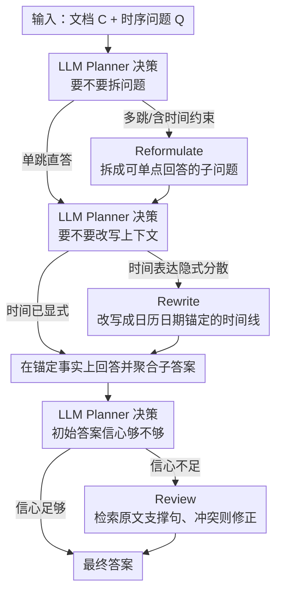

# AdapTime: Enabling Adaptive Temporal Reasoning in Large Language Models

**会议**: ACL 2026 Findings  
**arXiv**: [2604.24175](https://arxiv.org/abs/2604.24175)  
**代码**: https://github.com/Applied-Machine-Learning-Lab/ACL2026-AdapTime  
**领域**: NLP 理解 / LLM 推理  
**关键词**: 时间推理, 时序问答, 自适应规划, LLM Planner, 无外部工具

## 一句话总结
本文提出 AdapTime，把"时间推理"抽象为 reformulate / rewrite / review 三个可复用的原子动作，由 LLM Planner 根据问题与上下文自适应决定执行哪几步、按什么顺序执行，无需任何外部工具、手工规则或微调即可显著提升 LLM 在时序 QA 上的表现，在 DeepSeek-V3 上把 TimeQA-Easy 推到 85.4 EM。

## 研究背景与动机

**领域现状**：时序问答（Temporal QA）要求模型从含时间标注的文档中回答时间相关问题，如 "Terence Cooper 在 1966 年 3 月到 1969 年 10 月之间担任什么职位？"。现有方案大致两类——一类靠外部工具（QAaP 用 Python 字典做 check/match、Event-AL 用 Python 求解器、Step-back 用 retriever），另一类靠人工干预（Time-CoT 手工补 timeline、TG-LLM 手动修正难例的 temporal graph、TISER 同样依赖 TG）。

**现有痛点**：(1) 外部工具与人工规则使方法绑定到特定数据/场景，换 benchmark 就要重写；(2) 现有 pipeline 都是**固定流程**——对所有问题都按同一套"提取-推理-验证"顺序跑一遍，无视问题难度的差异。结果就是简单题被过度处理（推理冗余、引入错误），复杂题又因步骤不够而推不出来。

**核心矛盾**：时序问题的复杂度方差极大——"美国总统是谁"这样的简单查询和"在某个时间段内某人担任什么职位"这样的多跳推理本质上应该走不同的推理路径，但传统 fixed pipeline 强行用同一套流程处理所有问题。

**本文目标**：(1) 抽出一组**LLM 自身就能完成**的原子时序动作，去掉对外部工具/人工的依赖；(2) 让 LLM 自己根据问题特性决定调用哪些动作、按什么顺序，做到 per-instance 的自适应推理。

**切入角度**：作者发现现有方法虽然形式各异，本质都在做三件事之一——把复杂问题拆成子问题、把隐式时间表达改写成结构化形式、对答案做事实核验。如果这三件事都能由 LLM 自己 prompt 完成，那么外部工具就成了多余的。

**核心 idea**：定义 reformulate / rewrite / review 三个动作 + 一个 LLM Planner，让 Planner 根据问题与中间状态在线决定每步是否执行该动作，把"固定 pipeline"升级成"自适应规划"。

## 方法详解

### 整体框架
AdapTime 把时序推理拆成 3 个原子动作（Reformulate / Rewrite / Review）加 1 个 LLM Planner，四者用同一个 backbone、纯 prompt 实现，不调用任何外部工具。给定文档 $C$ 和时序问题 $Q$，Planner 在每个潜在动作点先做一次"是/否"决策：要不要先把 $Q$ 拆成子问题、要不要把 $C$ 重写成时间锚定的结构化表示、初始答案信心够不够要不要做事实核验。被选中的动作依次执行、子答案聚合，最终给出答案——简单题可能一步直答，难题才会走满三步。

> 三个动作 Reformulate / Rewrite / Review 全部由 LLM 纯 prompt 完成（关键设计 3 的 zero-tool 内化），Planner 在每个动作点门控是否执行。

### 关键设计

**1. 三个原子时序推理动作：把已有方法的核心操作收敛成 LLM 能自主完成的最小动作集**

现有 temporal QA 方法形式各异，但本质都在做"问题分解 / 上下文改写 / 答案核验"三件事之一，本文把它们抽象成三个纯 prompt 的正交动作。**Reformulate** 让 LLM 把含复杂时间约束或多跳的问题分解为 $Q=\{q_1,\ldots,q_n\}$，每个 $q_i$ 单点可答、最后聚合，例如 "Cooper 在某时间段担任什么职位" 拆成 "Cooper 担任过哪些职位" + "哪个职位的时间区间覆盖目标时段"。**Rewrite** 让 LLM 把 "during his presidency""after the war ended" 这类隐式时间表达改写成以日历日期为锚的显式时间线（code / timeline / temporal graph 任一形式），下游就能直接在锚定事实上推理。**Review** 让 LLM 检索能支撑当前答案的原文句子，证据缺失或冲突时修正答案。

这三个动作覆盖了 QAaP / Time-CoT / Event-AL / TG-LLM / TISER 的全部关键操作（表 1 给了逐项对照），但每个都是纯 prompt，去掉了对 Python interpreter、手工 timeline、难例标注的依赖，且三者正交解耦、可任意组合。

**2. LLM Planner 自适应规划：让模型看一眼问题再决定走多深**

固定 pipeline 对所有问题都按同一套顺序跑，简单题被过度推理反而引入噪声，难题又步骤不够推不出来。AdapTime 用一个同样是 LLM prompt 的 Planner（与执行共用 backbone）在每个动作点各调用一次：先看 $Q$ 是否多跳→决定是否 Reformulate；再看 $C$ 的时间表达是否模糊分散→决定是否 Rewrite；最后看初始答案可信度→决定是否 Review。每次决策以自然语言"是/否 + 简短理由"给出，由二元决策 $d_i$ 门控对应动作，不强制走完所有步骤（完整伪代码见算法 1）。

这样推理预算就花在真正需要的地方。论文图 3 的统计佐证了 Planner 确实做了任务感知的差异化决策：TimeQA 上 Reformulate 频率高（问题多为可拆解的多跳），TempReason-L2/L3 上 Rewrite + Review 频率显著高于 TimeQA（时间线复杂、初始答案可信度低）。

**3. 基于内置能力的 zero-tool 推理：把工具调用全部内化成 prompt**

依赖外部工具是当前 temporal QA 泛化性差的根因——换 domain 或换数据源，工具和规则就得重搭。AdapTime 把过去交给外部组件的活全收回 LLM 内部：原本用 Python interpreter 做的"事实匹配"改成 prompt LLM 检索原文支撑句，原本用 retriever 做的"长文档压缩"改成 prompt LLM 把相关段落改写成时间线，原本靠人工补的难例标注改成 prompt LLM 重新分解问题。所有能力收回内部后，方法就能 zero-shot 迁移到新场景（在开放域 ArchivalQA 上仍 work 也佐证了这点）。

### 一个完整示例
以问题 "Terence Cooper 在 1966 年 3 月到 1969 年 10 月之间担任什么职位？" 为例走一遍：Planner 先判断这是带时间区间约束的多跳问题 → 触发 **Reformulate**，拆成 $q_1$="Cooper 担任过哪些职位及任期" 和 $q_2$="哪个任期覆盖 1966-03 到 1969-10"。接着 Planner 看到文档里职位时间多以 "during his tenure""until his resignation" 这类隐式表达出现 → 触发 **Rewrite**，把相关段落改写成以日历日期为锚的时间线（如 "Governor: 1966-03 ~ 1969-10"）。在锚定后的时间线上回答 $q_1, q_2$ 并聚合得到候选答案。最后 Planner 评估答案信心，若不够确定 → 触发 **Review**，回到原文检索能支撑该职位的句子，证据一致则定稿、冲突则修正。一道简单的 "美国现任总统是谁" 则会被 Planner 判为单跳直答，三步全部跳过。

### 损失函数 / 训练策略
完全免训练，只用 prompt 调度。decoding 用 top-k=10，temperature=0.7，batch_size=1，max_new_tokens=512。论文还尝试用 1000 条 DeepSeek-V3 生成的高质量 plan 蒸馏一个 LLaMA-3-8B 监督 Planner，反而比 prompt-based Planner 差（TimeQA-Easy 31.0 vs 41.5 EM），说明 in-context 规划能力比 fine-tuned 规划器更鲁棒、不易过拟合。

## 实验关键数据

### 主实验
两个 benchmark：TimeQA（easy/hard，显式 vs 隐式时间）+ TempReason（L2 时间-事件对齐 / L3 事件间时序），各采样 1000 题。三个 backbone：LLaMA-3-8B、Qwen-3-8B、DeepSeek-V3。指标：EM + F1。

| 模型 | 方法 | TimeQA-Easy EM | TimeQA-Hard EM | TempReason-L2 EM | TempReason-L3 EM | Avg EM |
|------|------|---------------|----------------|------------------|------------------|--------|
| GPT-4 (闭源参考) | – | 71.6 | 54.6 | 45.4 | 43.1 | 54.3 |
| TG-LLM (SOTA 参考) | – | 66.4 | 63.1 | 42.4 | 35.6 | 51.9 |
| LLaMA-3-8B | ICL | 1.1 | 1.7 | 3.8 | 1.8 | 2.1 |
| LLaMA-3-8B | CoT | 29.7 | 31.6 | 18.5 | 16.5 | 24.1 |
| LLaMA-3-8B | **AdapTime** | **41.5** | **33.3** | **18.7** | 14.5 | **27.0** (+24.9) |
| Qwen-3-8B | CoT | 69.4 | 62.9 | 22.6 | 28.8 | 45.9 |
| Qwen-3-8B | **AdapTime** | **72.7** | **66.5** | **29.1** | 28.8 | **49.3** (+6.4) |
| DeepSeek-V3 | CoT | 85.3 | 75.6 | 44.8 | 47.0 | 63.2 |
| DeepSeek-V3 | Step-back | 84.4 | 76.4 | 45.8 | 48.8 | 63.9 |
| DeepSeek-V3 | Self-refinement | 77.6 | 76.4 | 44.3 | 41.1 | 60.1 |
| DeepSeek-V3 | **AdapTime** | **85.4** | **77.7** | **48.0** | **49.8** | **65.1** (+5.5) |

### 消融实验（DeepSeek-V3）

| 配置 | TimeQA-Easy EM | TempReason-L3 EM |
|------|---------------|------------------|
| Full AdapTime | 85.4 | 49.8 |
| w/o Reformulate | 85.0 | 48.9 |
| w/o Rewrite | 84.8 | 47.6 |
| w/o Review | 84.8 | 49.0 |
| w/o LLM Planner（固定执行三步）| 85.3 | 48.9 |

### 关键发现
- **Rewrite 贡献最大**：单独加 Rewrite 把 ICL baseline 从 80.8 拉到 86.4 EM，去掉 Rewrite 也是掉点最多的——说明"显式时间锚定的上下文表示"对 LLM 的时序推理最关键。
- **Planner 价值在难数据上凸显**：在 TimeQA-Easy 上 w/o Planner 几乎不掉点（强行三步也 work），但在 TempReason-L2/L3 这种需要灵活选择步骤的复杂任务上 Planner 提供稳定的 0.5–1 EM 提升。
- **token 预算几乎不增**：AdapTime 平均 4873 tokens/instance，仅比 ICL（4345）多 12%，远低于 self-refinement 的 >10000 tokens——说明 Planner 的"按需触发"确实节省了开销。
- **跨规模一致提升**：在 1B → 8B → V3 三个量级上都显著超过对应 baseline，且 8B+AdapTime 在 TimeQA 上甚至超过闭源 GPT-4，证明方法 model-agnostic。
- **不同问题分布的步骤分布显著不同**（图 3）：TimeQA 偏向 Reformulate（多跳分解），TempReason-L2/L3 偏向 Rewrite+Review（隐式时间+答案不确定），验证 Planner 确实做出了任务感知的差异化决策。

## 亮点与洞察
- **把"工具调用"转化为"prompt 调度"**：以往 temporal QA 把推理拆给外部 Python/retriever/symbolic solver，AdapTime 证明纯 LLM 也能完成这些子任务，并通过显式 Planner 取代隐式的"thought chain"实现可控自适应。这种"工具内化"思路可直接迁移到其它领域（数学、代码、agentic search）。
- **Prompt-based Planner > Fine-tuned Planner**：实验对比显示蒸馏微调反而损失泛化能力，说明在数据稀缺的规划任务上 in-context 比 SFT 更鲁棒——这是一个对 agentic LLM 设计很有启发的反直觉发现。
- **"3 个正交动作"的抽象力**：作者把 5 篇前作的核心操作压缩成 3 个动作（表 1 对照），同时覆盖既有工作的能力上界。这种"先做 ontology 抽象再做工程"的研究范式非常值得借鉴。
- **可与 retriever 叠加**：4.7 节展示了 BM25+AdapTime 在开放域 ArchivalQA 上仍能提升 2 EM，说明 AdapTime 是个 orthogonal 增强，可叠加到 RAG pipeline 上。

## 局限与展望
- LLM Planner 的决策稳定性依赖底层模型——同一个问题在不同 run 之间可能给出不同的执行路径，作者承认在小模型上 Planner 的可靠性会下降。
- 动作集仅 3 个，对于更复杂的时间推理（如时区转换、相对时间表达计算、跨语言时间）可能需要扩展（如增加 "Calculate" 或 "Convert" 动作）。
- 方法对长文档的 token 开销仍然主要来自原始上下文，对超长输入（>32k）的性能尚未充分验证；可结合 retriever 但论文只做了 BM25 的初步实验。
- 未对 Planner 的决策给出可解释性分析或 calibration——Planner 何时会做错决策、错误模式是什么，尚未深究。

## 相关工作与启发
- **vs QAaP** (Zhu et al. 2023)：QAaP 把问题转成 Python dict 并用代码执行匹配，AdapTime 不需要 Python 解释器，所有逻辑由 prompt 完成，泛化性更强。
- **vs TG-LLM / TISER** (Xiong et al. 2024 / Bazaga et al. 2025)：他们把文本预先构造成 temporal graph 并人工修正难例，AdapTime 的 Rewrite 动作实现等价能力但 fully automatic。
- **vs Step-back / Self-refine**：Step-back 让模型抽象一步再答，Self-refine 让模型反思迭代，但都是固定流程；AdapTime 引入 Planner 做 per-instance 路由，更精细，且 token 预算只略增。

## 评分
- 新颖性: ⭐⭐⭐⭐ 把多个时序方法的核心抽象成 3 个原子动作 + Planner 调度，是一个干净的 redesign。
- 实验充分度: ⭐⭐⭐⭐ 2 个 benchmark × 3 个 backbone + 充分消融 + 开放域延伸 + 案例对比，覆盖面广。
- 写作质量: ⭐⭐⭐⭐ 表 1 的对照清晰，算法 1 的伪代码直观，case study 附录有完整示例。
- 价值: ⭐⭐⭐⭐ 完全免训练、纯 prompt、可直接套到任意 LLM，复现门槛低，对 agentic 推理研究有方法论启示。

<!-- RELATED:START -->

## 相关论文

- [\[ACL 2026\] The Imperfective Paradox in Large Language Models](the_imperfective_paradox_in_large_language_models.md)
- [\[ACL 2026\] Table Question Answering in the Era of Large Language Models: A Comprehensive Survey](table_question_answering_in_the_era_of_large_language_models_a_comprehensive_sur.md)
- [\[ACL 2026\] It's High Time: A Survey of Temporal Question Answering](it39s_high_time_a_survey_of_temporal_question_answering.md)
- [\[AAAI 2026\] Language Models and Logic Programs for Trustworthy Tax Reasoning](../../AAAI2026/nlp_understanding/language_models_and_logic_programs_for_trustworthy_tax_reasoning.md)
- [\[ACL 2026\] ASTRA: Adaptive Semantic Tree Reasoning Architecture for Complex Table Question Answering](astra_adaptive_semantic_tree_reasoning_architecture_for_complex_table_question_a.md)

<!-- RELATED:END -->
