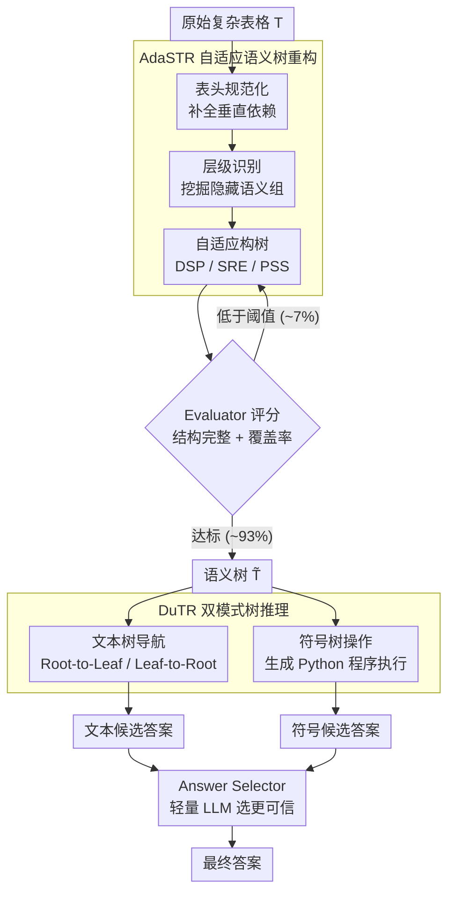

# ASTRA: Adaptive Semantic Tree Reasoning Architecture for Complex Table Question Answering

**会议**: ACL2026  
**arXiv**: [2604.08999](https://arxiv.org/abs/2604.08999)  
**代码**: https://github.com/zjukg/ASTRA  
**领域**: 表格问答 / LLM推理  
**关键词**: 复杂表格问答, 语义树, 表格序列化, 符号推理, 结构化检索  

## 一句话总结
ASTRA 把复杂表格自适应重构为语义树，再用文本树导航和符号代码执行双模式推理回答问题，在 AIT-QA、SSTQA 和 HiTab 上分别达到 91.6%、81.9% 和 90.1% 准确率，超过强 LLM 和已有表格结构化方法。

## 研究背景与动机
**领域现状**：LLM 处理表格问答通常要先把二维表格转成一维文本，例如 Markdown、HTML、三元组、关系表或树结构。对简单平表，这些序列化方式已经能让 LLM 完成不少问答任务。

**现有痛点**：复杂表格常有层级表头、合并单元格、不规则子表和隐式语义依赖。论文指出现有方法面临四类问题：结构忽略、二维到一维的表示鸿沟、黑盒数值推理导致 hallucination，以及固定 schema 难以适配异构表格。

**核心矛盾**：LLM 喜欢自然语言式输入，但表格的关键信息往往在二维结构和层级关系里；如果直接转成文本，结构会散；如果转成关系表或三元组，又可能产生稀疏、冗余或丢失层级语义。

**本文目标**：ASTRA 要构建一种既保留显式层级和语义上下文，又能被 LLM 检索和代码执行的中间表示，并在复杂表格问答中同时提升准确率、可解释性和效率。

**切入角度**：作者选择“语义树”作为统一表示：树节点和路径保留表头层级、实体-属性关系和单元格来源，同时可被自然语言检索，也可转成 Python dictionary 供程序化推理。

**核心 idea**：先用 AdaSTR 根据表格规模和内容密度自适应重构语义树，再用 DuTR 在同一棵树上并行做文本导航和符号执行，最后由 answer selector 选择更可信答案。

## 方法详解

### 整体框架
ASTRA 把复杂 TableQA 拆成两个阶段。第一阶段是 AdaSTR，即 Adaptive Semantic Tree Reconstruction，将原始表格 $T$ 变成语义树 $\tilde{T}$。第二阶段是 DuTR，即 Dual-Mode Tree Reasoning，在语义树上同时运行文本树导航和符号树操作，得到两个候选答案，再用轻量 LLM 做最终选择。

这个流程的重点是“表示先行”：不是直接让 LLM 对 Markdown 表格硬推理，而是先把表格重写成具有显式父子关系、语义路径和可执行结构的树。

### 关键设计

**1. AdaSTR 自适应语义树重构：复杂表格不能用一种固定序列化吃遍天下**

复杂表格有层级表头、合并单元格和隐式语义依赖，直接转 Markdown 会把结构压散。AdaSTR 先做 Header Identification & Normalization，把垂直依赖合并进单个 header（如把孤立的 Percent 补全成 Yukon-Percent），再做 Hierarchy Identification，让 LLM 从规范化后的 header 里挖出隐藏语义组（如 Regional Statistics）。关键是构树策略随表格规模和密度自适应切换：中等规模表格直接让 LLM 解析（DSP），文本密集表格用坐标占位再回填（SRE），大规模重复表格生成程序循环构树（PSS）。这样既避开了"所有表都让 LLM 一次吐完整树"的高成本和高幻觉，又能为下游推理提供保留显式父子路径和语义上下文的中间表示 $\tilde{T}$。

**2. Evaluator-Guided Refinement Loop：语义树一旦构错，后面所有推理都在错误结构上跑**

表示层必须先有质量控制。Evaluator 检查构出来的树的结构完整性和信息覆盖率——路径是否与原表坐标一致、有多少单元格被正确映射；若综合分低于阈值，就把具体反馈交回 LLM 迭代修正，最多若干轮。这个闭环把"构树幻觉"挡在推理之前，实测只在约 7% 的样本上触发，多数表格单轮即可构好，但对困难样本保留了纠错能力。

**3. DuTR 双模式树推理：语义定位和数值计算是两种活，复杂表格往往两者都要**

在同一棵语义树上并行跑两种推理。文本模式按问题类型自适应选遍历方向：聚合型问题用 Leaf-to-Root，从相关叶节点向上补齐上下文；查找型问题用 Root-to-Leaf，从全局路径指导向下定位。符号模式则把语义树抽象成结构 skeleton，配示例代码让 LLM 生成选择、聚合、比较的 Python 程序，并用 self-correction loop 修运行错误。文本路径擅长语义检索、符号执行擅长可验证计算，二者产出两个候选答案，最后交给轻量 LLM 的 answer selector 挑更可信的那个。

### 一个完整示例

以一张带层级表头的区域统计表、问"育空地区的人口占比是多少"为例走一遍：AdaSTR 先做 header 规范化，把表里孤立的列名 `Percent` 补全成语义完整的 `Yukon-Percent`，再识别出隐藏语义组 `Regional Statistics`，因为是中等规模表，走 DSP 策略由 LLM 直接解析成语义树 $\tilde{T}$；Evaluator 检查覆盖率达标（这条样本落在不触发反馈环的 ~93% 里），直接放行。进入 DuTR：这是一个查找型问题，文本模式选 Root-to-Leaf，从根路径 `Regional Statistics → Yukon → Percent` 一路向下定位到目标叶节点取值；符号模式同时把树抽象成 skeleton 生成一段取数的 Python，两边各得一个候选答案；answer selector 比对后选出最终答案。整个过程的结构信息全程显式可追溯，而不是让 LLM 对一坨 Markdown 黑盒硬猜。

### 损失函数 / 训练策略
ASTRA 是 training-free 方法，没有模型训练损失。实验为公平比较，AdaSTR、DuTR、E5、EEDP、GraphOTTER 和 ST-Raptor 等训练自由方法都使用 DeepSeek-V3-250324 作为 backbone；评价使用 GPT-5 作为二分类 judge 判断预测答案是否与 gold answer 等价，并计算 Accuracy。

## 实验关键数据

### 主实验
ASTRA 在三个复杂表格问答数据集上都取得强结果，尤其在 SSTQA 和 HiTab 上同时超过强模型和中间表示基线。

| 方法 | AIT-QA Acc | SSTQA Acc | HiTab Acc | 说明 |
|------|------------|-----------|-----------|------|
| DeepSeek-V3 | 78.5 | 63.2 | 82.0 | 普通文本序列化下的强开源 LLM |
| GPT-4o | 80.6 | 66.4 | 78.6 | 闭源强模型 |
| o3 | 89.1 | 78.2 | 85.3 | 推理型强模型 |
| GraphOTTER | 90.4 | 71.5 | 88.8 | 三元组/图式中间表示 |
| ST-Raptor | 62.7 | 71.1 | 49.0 | 物理树结构，泛化较弱 |
| ASTRA Adaptive Selection | 91.6 | 81.9 | 90.1 | 最终方法 |
| ASTRA Oracle | 93.5 | 86.1 | 94.1 | 理想选择文本/符号答案的上界 |

Textual Reasoning 和 Symbolic Reasoning 的互补性也很明显：SSTQA 上文本模式 79.8% 高于符号模式 75.3%，而 HiTab 上符号模式 89.3% 高于文本模式 82.2%，说明语义密集问题和数值聚合问题确实需要不同推理路径。

### 消融实验
| 模块 / 配置 | 指标 | 结果 | 说明 |
|-------------|------|------|------|
| AdaSTR 完整版 | Avg Coverage / Min Coverage | 0.929 / 0.738 | 构树覆盖最好 |
| w/o Evaluator-Guided | Avg Coverage / Min Coverage | 0.745 / 0.473 | 去掉反馈环后信息遗漏明显 |
| w/o Synthesis Strategies | Avg Coverage / Min Coverage | 0.795 / 0.153 | 静态 DSP 难处理大规模复杂表 |
| Adaptive Tree Navigation | SSTQA Acc | 79.84 | 完整文本导航 |
| w/o Embedding Model | SSTQA Acc | 71.34 | 缺少语义路径 guide 掉 8.50 点 |
| Force Root-to-Leaf | SSTQA Acc | 77.23 | 固定策略不如动态切换 |
| Force Leaf-to-Root | SSTQA Acc | 75.65 | 固定策略不如动态切换 |
| Symbolic Tree Manipulation | SSTQA Acc | 75.26 | 完整符号推理 |
| w/o Code Examples | SSTQA Acc | 70.42 | 示例代码对程序生成很关键 |
| Textual Serialization | SSTQA Acc | 63.20 | 原始文本序列化较弱 |
| Semantic Tree Direct Prompting | SSTQA Acc | 70.55 | 只换表示就提升 7.35 点 |

### 关键发现
- 语义树表示本身就很有价值：不加复杂推理，仅 Direct Prompting 也能从 63.20 提到 70.55。
- Textual 和 Symbolic 两个模式不是替代关系，而是互补关系。语义问题更适合文本路径检索，数值聚合更适合代码执行。
- ASTRA 的在线 QA 延迟明显低于 ST-Raptor 和 GraphOTTER。例如 AIT-QA 上 ASTRA tree/QA 为 29.18/7.80 秒，ST-Raptor 为 55.73/31.18 秒，GraphOTTER QA 为 19.54 秒；当查询数达到 3 次以上时，ASTRA 的 write-once/read-many 架构能摊薄构树成本。
- Evaluator-Guided Loop 只在约 7% case 触发，说明多数表格可以单轮构树，同时保留对困难样本的修正能力。

## 亮点与洞察
- 论文抓住了复杂表格问答的根问题：不是 LLM 不够聪明，而是输入表示把表格结构压坏了。语义树相当于把二维结构翻译成 LLM 和程序都能消费的中间语言。
- DSP/SRE/PSS 三种构树模式很实用，避免了“所有表格都让 LLM 直接吐完整树”的高成本和高幻觉风险。
- 最有启发的是 Textual-Symbolic 双模式：同一份结构化表示既能服务语义检索，也能服务可验证计算，这比单纯 prompt engineering 更稳。

## 局限与展望
- 对非常简单的平表，语义树重构可能比直接文本序列化多出不必要开销。ASTRA 的优势主要在复杂层级表格。
- 方法主要依赖文本和结构解析，未利用真实表格中的视觉线索，如背景色、粗体、边框和排版强调；这些 cues 在真实报表中常常携带隐式语义。
- 评价依赖 GPT-5 judge，虽然更能处理语义等价，但仍可能引入 judge 偏差；未来可增加人工抽检或任务特定精确匹配。
- Answer Selector 是轻量 LLM，但当文本答案和符号答案都错或都部分对时，选择器仍可能被误导。

## 相关工作与启发
- **vs Markdown/HTML 序列化**: 传统文本序列化简单，但容易丢层级和单元格依赖；ASTRA 用树路径显式保留这些关系。
- **vs GraphOTTER**: GraphOTTER 三元组化能缓解 schema 固定问题，但会把单元格关系拆散；ASTRA 的树能保留父子结构和语义上下文。
- **vs ST-Raptor**: ST-Raptor 证明树结构有用，但偏物理布局和规则构造；ASTRA 用 LLM 挖掘语义层级，更能处理不规则表。
- **启发**: 面向 LLM 的表格表示不应只追求“压成文本”，而应追求“既自然语言可读，又程序可执行”。

## 评分
- 新颖性: ⭐⭐⭐⭐ 语义树和双模式推理组合得很完整，尤其是自适应构树策略有工程价值。
- 实验充分度: ⭐⭐⭐⭐⭐ 三个复杂表格数据集、主实验、构树消融、推理消融、效率分析都比较充分。
- 写作质量: ⭐⭐⭐⭐ 结构清楚，问题定义和挑战拆解很到位；部分 appendix 细节对复现仍很重要。
- 价值: ⭐⭐⭐⭐⭐ 对复杂表格 QA、文档智能和 LLM 工具化推理都有直接启发。

<!-- RELATED:START -->

## 相关论文

- [\[ACL 2026\] Table Question Answering in the Era of Large Language Models: A Comprehensive Survey](table_question_answering_in_the_era_of_large_language_models_a_comprehensive_sur.md)
- [\[ACL 2026\] AdapTime: Enabling Adaptive Temporal Reasoning in Large Language Models](adaptime_enabling_adaptive_temporal_reasoning_in_large_language_models.md)
- [\[ACL 2025\] Recursive Question Understanding for Complex Question Answering over Heterogeneous Personal Data](../../ACL2025/nlp_understanding/recursive_question_understanding_for_complex_question_answering_over_heterogeneo.md)
- [\[ACL 2025\] Multi-Hop Reasoning for Question Answering with Hyperbolic Representations](../../ACL2025/nlp_understanding/multi-hop_reasoning_for_question_answering_with_hyperbolic_representations.md)
- [\[ACL 2025\] RISE: Reasoning Enhancement via Iterative Self-Exploration in Multi-hop Question Answering](../../ACL2025/nlp_understanding/rise_reasoning_enhancement_via_iterative_self-exploration_in_multi-hop_question_.md)

<!-- RELATED:END -->
