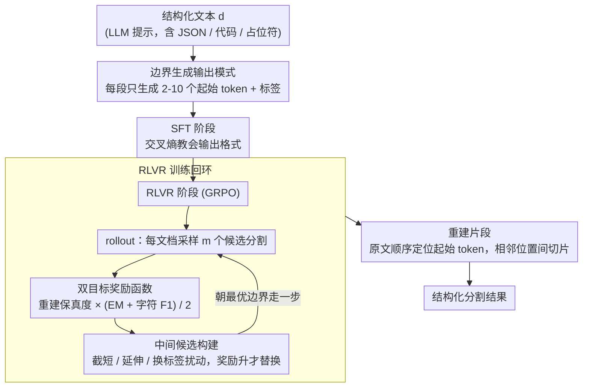

# BoundRL: Efficient Structured Text Segmentation through Reinforced Boundary Generation

**会议**: ACL 2026  
**arXiv**: [2510.20151](https://arxiv.org/abs/2510.20151)  
**代码**: 无  
**领域**: 文本分割/强化学习  
**关键词**: 结构化文本分割, 边界生成, RLVR, 熵坍塌, 中间候选

## 一句话总结

BoundRL 将结构化文本分割重新定义为边界生成任务——仅生成每个片段的起始 token 而非完整文本，减少 90% 的输出 token 并消除幻觉风险，结合双目标奖励函数和选择性扰动策略的 RLVR 训练，使 1.7B 小模型超越了 Claude-4 Sonnet 的 few-shot 表现。

## 研究背景与动机

**领域现状**：文本分割将文本划分为语义连贯的片段，广泛用于文档理解、QA 检索和提示优化。传统方法在句子或段落级别进行分割，但结构化文本（如 LLM 提示）包含代码片段、JSON 格式和占位符，不符合传统的句段结构。

**现有痛点**：(1) 传统的句子/段落级分割方法不适用于结构化文本；(2) token 级序列标注产生过于碎片化的结果；(3) 边界分类需要对每个 token 进行分类，计算量过大；(4) 现有 LLM 方法（如让模型生成每个片段的完整文本）面临高推理成本和幻觉风险。

**核心矛盾**：结构化文本需要 token 级别的精细分割，但生成完整片段文本的方法在长文本上推理成本与输入长度线性增长，且不可避免地引入幻觉。

**本文目标**：设计一种高效的 token 级结构化文本分割方法，同时实现低推理成本和高分割质量。

**切入角度**：将分割问题转化为边界生成——只生成每个片段的起始 token 序列和标签，然后在原文中定位这些 token 来重建完整片段。

**核心 idea**：通过仅生成"定位信息"（起始 token）而非"内容信息"（完整文本），将输出复杂度从 O(|d|) 降低到 O(n)（n 为片段数），同时通过定制的 RLVR 训练克服 SFT 的局限性。

## 方法详解

### 整体框架

BoundRL 要解决的是结构化文本（如 LLM 提示）的 token 级分割，但又不想付出"让模型逐字重写每个片段"那样的高推理成本和幻觉代价。它的做法是把分割重新表述为**边界生成**：模型只吐出每个片段的起始 token 和标签，推理时再回原文按序定位这些起始 token、把相邻起始位置之间的文本切出来。训练分两阶段——先用 SFT 教会输出格式，再用一套双目标奖励的 RLVR 把分割质量顶上去，其间用扰动构建的中间候选来对抗熵坍塌。



### 关键设计

**1. 边界生成输出模式：只生成"定位标记"，不生成片段内容**

传统 LLM 分割让模型逐段重写完整文本，输出长度随输入线性膨胀，长文本上推理成本高、还会改写出原文没有的内容（幻觉）。BoundRL 把输出从"内容"换成"定位"：对输入文本 $d$，模型每个片段只生成 2-10 个起始 token 的序列 $\hat{s}_i$ 和一个标签 $\hat{l}_i$。重建时从左到右在原文中顺序定位每个 $\hat{s}_i$，两个相邻起始位置之间的原文即为一个片段；排序约束保证即使同一段起始 token 在原文出现多次，每次出现也被唯一分配到一个片段。

这样输出复杂度从 $O(|d|)$ 降到 $O(n)$（$n$ 为片段数），实测减少约 90% 的输出 token；而且片段文本是从原文"剪"出来的、不是重新生成的，从机制上根除了幻觉。

**2. 双目标奖励函数：同时管"原文恢复得全不全"和"切得准不准"**

SFT 的交叉熵会错误惩罚那些对应正确边界、但 token 串写法不同的输出，又对细微的 token 不匹配惩罚不足，导致它不是边界生成的好训练信号。BoundRL 改用一个连续奖励

$$r(\hat{T}^L) = \rho_{\text{rec}}(\hat{T}^L) \cdot \frac{\text{EM}(\hat{T}^L) + \text{F1}_{\text{char}}(\hat{T}^L)}{2}$$

其中重建保真度 $\rho_{\text{rec}}$ 按字符比例衡量从生成片段能恢复多少原文，语义对齐项用精确匹配 EM 和字符级 $\text{F1}_{\text{char}}$ 衡量与标注片段的一致性。关键是相同边界的不同起始 token 写法会拿到相同奖励，从而不再惩罚"切对了但写法不同"的情况，同时对边界偏移给出平滑、密集的反馈。

**3. 中间候选构建：用扰动造"踏脚石"，对抗熵坍塌**

直接拿标注序列当参考往往离模型当前分布太远，模型学不动，RLVR 容易陷入熵坍塌。BoundRL 在 rollout 阶段对中等奖励的候选分割做三种小扰动：截短片段（去掉一端一个词）、延伸片段（加一端一个词）、替换标签；取奖励最高的扰动结果作为中间候选，且只在奖励确有提升时才选择性替换原候选（每次最多替换 $k$ 个）。这些中间候选离当前生成只差一步，正好充当桥接当前解和最优解的"踏脚石"，也恰好吃到了本文连续密集奖励函数的红利。

### 一个完整示例

以一段含 JSON 占位符的提示为例：原文经 SFT 模型生成 3 个起始 token 序列 + 标签，如 `("You are", instruction)`、`("```json", schema)`、`("Return", output_format)`。重建时在原文里顺序定位这三段起始 token，得到三个片段的边界。RLVR 阶段，假设某候选把第二段切成了 `("```json {", schema)`（多带了一个 `{`），奖励处于中等；扰动模块尝试"截短"得到 `("```json", schema)`、奖励上升，于是把它选为中间候选替换原候选，模型据此朝正确边界再走一步——而不是被迫一次性对齐到可能很远的标注序列。

### 损失函数 / 训练策略

SFT 阶段使用标准交叉熵损失训练 1 epoch。RLVR 阶段使用 GRPO（不含标准差归一化），每批 6 个输入文档，每个生成 $m=4$ 个候选分割，温度 1.2。每 0.2 epoch 保存检查点，基于验证集选择最优模型。

## 实验关键数据

### 主实验

**Synthetic 测试集结果 (Qwen3-1.7b)**

| 方法 | ρ_rec | EM | F1_char |
|------|-------|-----|---------|
| SFT | 99.9 | 70.6 | 92.2 |
| SFT+RLVR | 99.9 | 75.2 | 93.5 |
| BoundRL | 99.9 | **77.3** | **94.8** |

**Langchain 测试集结果 (Qwen3-1.7b)**

| 方法 | ρ_rec | EM | F1_char |
|------|-------|-----|---------|
| SFT | 86.9 | 39.1 | 73.5 |
| BoundRL | **90.6** | **47.3** | **76.8** |

### 消融实验

- BoundRL (Qwen3-1.7b) 在 Langchain 上 EM 达 47.3%，超越 Claude-4 Sonnet 的 few-shot prompting
- 中间候选构建相比标准 RLVR 在多个模型上带来一致提升
- RL-PLUS（使用参考候选替代中间候选）效果略差，验证了中间候选更贴近模型分布的假设

### 关键发现

- 边界生成范式将输出 token 减少 90%，同时保持甚至提升分割质量
- 双目标奖励函数有效解决了 SFT 在边界生成任务上的固有局限
- 中间候选策略对 RLVR 的熵坍塌问题提供了有效且低成本的解决方案
- 1.7B 参数的小模型通过 BoundRL 训练可以超越 Claude-4 Sonnet 的 few-shot 表现

## 亮点与洞察

- "只生成定位信息不生成内容"的思路简洁优雅，从根本上避免了幻觉
- 中间候选的扰动策略设计精巧，利用了奖励函数的连续性特征
- 实验设计全面，涵盖了三种不同规模的基础模型
- 构建了 StructSeg 数据集（15.3K 标注），填补了结构化文本分割评估的空白

## 局限与展望

- 当起始 token 在原文中无法定位时，对应片段会被丢弃
- 仅在 LLM 提示上进行了案例研究，未扩展到其他结构化文本类型
- 对于超长文档（如整本书），片段数 n 可能仍然很大
- 未来可将边界生成方法推广到代码分割、法律文档分割等领域

## 相关工作与启发

- 与传统的序列标注和边界分类方法相比，边界生成范式在效率和质量上实现了更好的平衡
- 中间候选策略与 curriculum learning 的思想一脉相承
- 为 RLVR 在结构化输出任务中的应用提供了有价值的设计模式

## 评分

- 新颖性: ⭐⭐⭐⭐⭐ 边界生成范式是对文本分割任务的根本性重新定义
- 实验充分度: ⭐⭐⭐⭐ 多模型、多基线、消融实验完整
- 写作质量: ⭐⭐⭐⭐ 方法阐述清晰，图示直观

<!-- RELATED:START -->

<div class="related-papers" markdown="1">

## 相关论文

- [\[ACL 2026\] Exploring Concreteness Through a Figurative Lens](exploring_concreteness_through_a_figurative_lens.md)
- [\[ACL 2026\] Accurate and Efficient Statistical Testing for Word Semantic Breadth](accurate_and_efficient_statistical_testing_for_word_semantic_breadth.md)
- [\[ACL 2026\] Reasoning-Based Refinement of Unsupervised Text Clusters with LLMs](reasoning-based_refinement_of_unsupervised_text_clusters_with_llms.md)
- [\[ACL 2026\] Filling the Gap: Is Commonsense Knowledge Generation useful for Natural Language Inference?](filling_the_gap_is_commonsense_knowledge_generation_useful_for_natural_language_.md)
- [\[ACL 2026\] LLM-Guided Semantic Bootstrapping for Interpretable Text Classification with Tsetlin Machines](llm-guided_semantic_bootstrapping_for_interpretable_text_classification_with_tse.md)

</div>

<!-- RELATED:END -->
