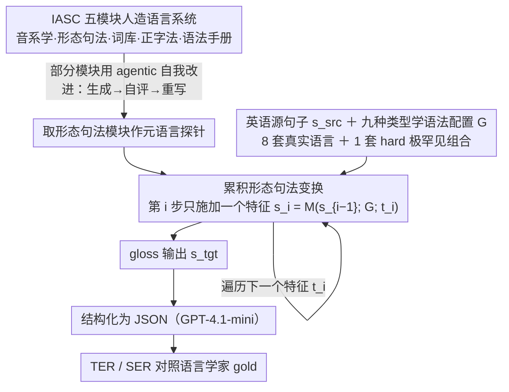

# Creating ConLangs to Probe the Metalinguistic Grammatical Knowledge of LLMs

**会议**: ACL 2026  
**arXiv**: [2510.07591](https://arxiv.org/abs/2510.07591)  
**代码**: [https://github.com/SakanaAI/IASC](https://github.com/SakanaAI/IASC)  
**领域**: LLM Agent  
**关键词**: 人造语言, 元语言知识, 形态句法变换, LLM语言能力探测, 语言类型学

## 一句话总结

本文提出 IASC（Interactive Agentic System for ConLangs），一个模块化的人造语言构建系统，通过让 LLM 按语言学规格执行形态句法变换来探测其元语言知识，发现 LLM 处理常见语言类型模式远优于罕见模式，且不同 LLM 之间能力差异悬殊。

## 研究背景与动机

**领域现状**：大量研究关注 LLM 的语言能力，包括翻译、句法标注等，但这些任务评估的是 LLM 对特定语言的知识，而非对语言学概念本身的理解。LLM 是否真正"理解"抽象的语言学概念（如词序、格标记、一致性等），而不只是记住了训练数据中特定语言的模式？

**现有痛点**：(1) 现有 LLM 语言能力评估多集中于百科知识式的测试（知道某种语言的某个事实），缺少对元语言学推理能力的系统探测；(2) 自然语言测试容易受训练数据泄露影响，LLM 可能只是"记住"了答案而非真正理解规则。

**核心矛盾**：LLM 在训练中接触到大量语言学文献和多语言数据，但这并不意味着它能按照给定的抽象语法规则来操纵语言结构。例如，将英语句子的词序从 SVO 改为 OVS（一种极罕见的词序）在原则上并不比改为 SOV 更难，但 LLM 的表现可能截然不同。

**本文目标**：(1) 提供一个灵活有趣的人造语言构建工具；(2) 利用形态句法变换任务系统探测 LLM 对不同语言类型学特征的元语言知识水平。

**切入角度**：构建人造语言（ConLang）要求 LLM 不只是翻译，而是根据抽象的语法规格重组句子结构、添加形态标记——这直接考验其对语言学概念的理解深度。

**核心 idea**：用一个模块化的人造语言构建系统作为 benchmark，通过让 LLM 将英语句子按不同的形态句法参数（词序、格系统、时态标记等）进行变换，来量化其元语言学能力。

## 方法详解

### 整体框架

IASC 是一个完整的人造语言构建 pipeline，包含音系学、形态句法、词库、正字法和语法手册五个模块，但本文真正当作"探针"用的是形态句法模块：给 LLM 一个英语源句子和一套目标语法规格，让它把句子重组成符合该规格的结构并产出 gloss 标注。关键在于这个变换不是一步完成，而是把每个语法特征拆开、一步步累积地施加上去，再用九套覆盖常见到极罕见类型学组合的语法配置去对照，从而量化 LLM 在哪类语言现象上真懂、哪类只是死记训练数据里的高频模式。

### 关键设计

**1. 累积形态句法变换：把"一次满足全部规格"拆成逐特征叠加**

直接把整套语法规格丢给 LLM 让它一次性变换，preliminary 实验里效果很差——prompt 又长又杂，模型没法同时盯住词序、格标记、时态等多个约束。IASC 改成迭代式的累积变换：每一步只施加一个语法特征，按 $s_i = M(s_{i-1}; G; t_i)$ 在上一步结果 $s_{i-1}$ 的基础上、用只聚焦单个特征的 prompt $t_i$ 继续改写（比如先把英语 SVO 改成目标词序，再加格标记，再加时态标记）。每步认知负担都很轻，模型遵循约束的准确率也因此明显高于一次性变换。

**2. 九种类型学多样的语法配置：用类型学频率当自变量去逼问"是否真懂规则"**

为了把"理解抽象规则"和"记住高频语言模式"区分开，作者设计了九套语法配置——八套受真实语言启发（阿拉伯语、斐济语、法语、希克卡里亚纳语、米佐语、土耳其语、越南语、威尔士语），外加一套刻意堆叠极罕见组合的 "hard" 配置。每套都明确规定词序、格系统、一致性标记、时态标记等参数，再用 45 个源句子 × 9 套配置 = 405 个测试样本作为评测集，gold data 由语言学家手工标注。由于变换本身和类型学是否常见无关（把 SVO 改成 OVS 在原则上并不比改成 SOV 难），一旦 LLM 在罕见配置上系统性变差，就说明它依赖的是训练分布而非抽象规则。

**3. Agentic 自我改进机制：用一轮自评-修正补救首次输出的偏差**

LLM 第一次产出未必完全贴合规格，部分模块（如音系学）因此引入 agentic 流程：模型先生成初始输出，再自动对这份输出写一段评论/反馈，然后依据反馈重写，如此迭代。这相当于把"审稿-修订"内化进生成过程，用模型自己的二次审查去捕捉首轮遗漏的规格违例。实验也显示这种 refinement 并非对所有模块都有效，只在部分模块上带来改善。

## 实验关键数据

### 主实验

| 模型 | 'french' (常见) | 'turkish' (常见) | 'mizo' (罕见) | 'hard' (极罕见) | 整体表现 |
|------|----------------|-----------------|---------------|----------------|---------|
| GPT-4.1 | TER 低 | TER 低 | TER 中等 | TER 较高 | 最好 |
| Claude 3.7 | TER 低 | TER 低 | TER 中高 | TER 高 | 第二 |
| Gemini 2.5 | TER 中等 | TER 中等 | TER 高 | TER 很高 | 中等 |
| 较小模型 | TER 高 | TER 高 | TER 很高 | TER 极高 | 较差 |

### 消融实验

| 配置 | 效果 | 说明 |
|------|------|------|
| 累积变换 vs 一次性变换 | 累积远优 | 一次性变换 LLM 无法同时遵循多约束 |
| 常见类型学特征 vs 罕见特征 | 常见远优 | LLM 对 SVO/SOV 处理好，OVS/OSV 差 |
| 形态标记（前缀 vs 后缀） | 后缀更好 | 与训练数据中后缀更常见一致 |
| 有 agentic refinement vs 无 | 有时改善 | 并非所有模块都受益 |

### 关键发现

- LLM 对常见语言类型学模式（如 SVO、SOV 词序、后缀式形态）的处理明显优于罕见模式（如 OVS 词序、前缀式形态），与该特征在世界语言中的分布频率高度相关
- 不同 LLM 之间能力差异巨大：GPT-4.1 在大多数配置上表现最好，而较小模型在罕见配置上几乎完全失败
- "hard" 语言配置（含极罕见类型学组合）对所有模型都极具挑战性，说明 LLM 的元语言知识仍受训练数据分布强烈约束

## 亮点与洞察

- **用人造语言作为探测工具**：极其巧妙的实验设计——人造语言避免了训练数据泄露问题，且能精确控制语言学变量，使得评估结果可解释性极强
- **揭示了 LLM "语言知识"的本质**：LLM 不是真正"理解"语言学概念，而是依赖训练数据中的模式分布。常见的语言类型处理好、罕见的处理差，说明其能力本质上是统计相关性而非抽象规则理解
- **累积变换策略**：将复杂的多约束问题分解为逐步单约束变换，是一种通用的 prompt engineering 策略，可迁移到其他需要多步推理的场景

## 局限与展望

- 评估数据集（405 个样本）相对较小，可能不足以捕捉所有语法特征的交互效应
- 仅以英语为源语言，未探索从其他语言出发的变换效果
- 形态句法模块的 gold data 由单个语言学家标注，可能引入标注者偏差
- 作者也尝试了将方法应用于低资源语言翻译，但结果大多为负面，距实际应用还有距离
- 53 页的论文包含大量附录，核心贡献可以更集中

## 相关工作与启发

- **vs ConlangCrafter (Alper et al., 2025)**: 也做 LLM 驱动的人造语言构建，但 IASC 的形态句法模块更细粒度，支持逐特征探测
- **vs 传统 LLM 语言能力测试**: 如 BLiMP、SyntaxGym 等测试 LLM 对特定语言现象的判断，IASC 则要求 LLM 主动进行语言结构操纵，难度更高
- **vs Diamond (2023)**: 仅用 ChatGPT 通过简单 prompt 生成人造语言，未做系统的模块化控制和类型学评估

## 评分

- 新颖性: ⭐⭐⭐⭐⭐ 用人造语言构建来探测元语言知识是非常新颖且有深度的研究视角
- 实验充分度: ⭐⭐⭐⭐ 九种语法配置覆盖了丰富的类型学多样性，但样本量偏小
- 写作质量: ⭐⭐⭐⭐ 论文极为详尽（53页），语言学背景介绍充分，但过于冗长
- 价值: ⭐⭐⭐⭐⭐ 对理解 LLM 的语言知识本质提供了关键洞察，IASC 工具本身也有独立价值

<!-- RELATED:START -->

## 相关论文

- [\[ACL 2026\] Knowledge-driven Augmentation and Retrieval for Integrative Temporal Adaptation](knowledge-driven_augmentation_and_retrieval_for_integrative_temporal_adaptation.md)
- [\[ACL 2026\] Filling the Gap: Is Commonsense Knowledge Generation useful for Natural Language Inference?](filling_the_gap_is_commonsense_knowledge_generation_useful_for_natural_language_.md)
- [\[ACL 2026\] Commonsense Knowledge with Negation: A Resource to Enhance Negation Understanding](commonsense_knowledge_with_negation_a_resource_to_enhance_negation_understanding.md)
- [\[ACL 2026\] Reasoning-Based Refinement of Unsupervised Text Clusters with LLMs](reasoning-based_refinement_of_unsupervised_text_clusters_with_llms.md)
- [\[ACL 2026\] Can LLMs Estimate Cognitive Complexity of Reading Comprehension Items?](can_llms_estimate_cognitive_complexity_of_reading_comprehension_items.md)

<!-- RELATED:END -->
