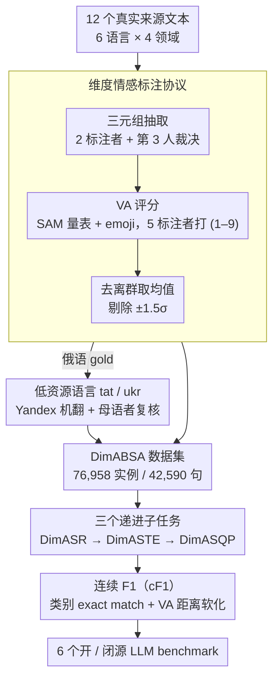

# DimABSA: Building Multilingual and Multidomain Datasets for Dimensional Aspect-Based Sentiment Analysis

**会议**: ACL 2026  
**arXiv**: [2601.23022](https://arxiv.org/abs/2601.23022)  
**代码**: https://github.com/DimABSA/DimABSA2026 (有)  
**领域**: 多语言 / 情感分析 / 评测基准  
**关键词**: ABSA、维度情感、Valence-Arousal、多语言、cF1

## 一句话总结
作者构建了首个多语言（6 种语言）多领域（4 个领域）的维度型方面级情感分析数据集 DimABSA（76,958 个 aspect 实例 / 42,590 句），用连续的 valence–arousal 分数取代传统的「正/负/中」三分类，并设计 3 个新子任务和统一指标 cF1，对 6 个开/闭源 LLM 进行了系统评测。

## 研究背景与动机

**领域现状**：传统 ABSA（Aspect-Based Sentiment Analysis）从 SemEval-2014 起就形成了 (aspect term, aspect category, opinion term, polarity) 四元组的标准范式，主流做法是抽取 + 分类 pipeline，标签是 positive / negative / neutral 三种粗粒度类别。

**现有痛点**：粗粒度类别标签无法刻画情感强度的微妙差异——「good」和「excellent」都是 positive，「a little slow」和「extremely slow」都是 negative，但语义强度差距悬殊。词汇强度（lexical intensity）和情感修饰副词（slightly, very, tremendously）的信息在 polarity 标签里全部丢失。

**核心矛盾**：情感本质上是连续的（affective science 的 Russell circumplex 模型用 valence × arousal 两维连续空间刻画情感），但 ABSA 标签是离散的，这导致 (1) 同 polarity 内的细粒度区分能力为零；(2) 跨任务（如情绪动力学、心理健康标记）迁移困难。

**本文目标**：把 ABSA 从「类别预测」升级为「连续维度回归 + 类别抽取」混合任务，并要做到 (i) 多语言（含低资源语言）、(ii) 多领域、(iii) 评测指标统一。

**切入角度**：借鉴心理学的 Self-Assessment Manikin (SAM) 标注协议 + emoji 辅助，把 valence (1–9) 和 arousal (1–9) 当作连续标签，每个 tuple 由 5 个标注者评分后去除 ±1.5σ 离群值再求均值，把噪声压到可用区间。

**核心 idea**：用 (A, C, O, V#A) 五元组替换 (A, C, O, polarity) 四元组；为混合的「类别抽取 + 连续回归」任务设计连续 F1（cF1）——只有类别全对才算 categorical TP，再把 VA 距离折算为 [0,1] 的软分数。

## 方法详解

DimABSA 不是一个模型，而是 **「数据集 + 子任务 + 评测指标 + LLM benchmark」** 四件套。下面分别解释。

### 整体框架

输入是从 Yelp / Amazon / Rakuten Travel / EDINET / SemEval-2016 / SIGHAN-2024 / Mobile01 / MOPS 等 12 个真实来源爬取的原文本，覆盖 6 种语言（English, Japanese, Russian, Tatar, Ukrainian, Chinese）× 4 个领域（restaurant, laptop, hotel, finance）共 10 个子数据集。pipeline 分两阶段：

1. **三元组抽取阶段**：2 个标注者独立标 (A, C, O)，不一致时第 3 人裁决，无共识则丢弃。
2. **VA 评分阶段**：通过 SAM 量表 + VA emoji，5 个标注者对每个已确认 tuple 给 V (1–9) 和 A (1–9)，去 ±1.5σ 后均值。

Tatar 和 Ukrainian 是低资源语言，通过把 Russian 数据用 Yandex Translate 机翻 + native speaker 复核（Tatar 45.5%、Ukrainian 35.6% 被人工修订）得到。

### 关键设计

**1. 维度情感标注协议：把 polarity 三分类换成连续的 valence–arousal 坐标**

粗粒度的 pos/neg/neu 标签丢掉了所有强度信息——"good"和"excellent"同样是正、"a little slow"和"extremely slow"同样是负。DimABSA 把每个 aspect tuple 的极性升级成一对连续分数 $(V, A) \in [1,9]^2$：valence 衡量正负（1 = 极负、5 = 中立、9 = 极正），arousal 衡量激活度（1 = 平静、9 = 兴奋）。标注界面借用心理学的 SAM pictorial scale 加 emoji 来锚定刻度，每个 tuple 由 5 人独立打分，最终取去离群后的均值 $\hat{r} = \mathrm{mean}(\{r_i : |r_i - \mu| \le 1.5\sigma\})$，自动剔除偏离 ±1.5σ 的标注者。arousal 历来比 valence 难标（Buechel2017、mohammad2018obtaining 都证实过），多标注 + 离群剔除把 arousal RMSE 压到 0.76–2.29 区间；而且最终数据呈典型的"U 形分布"——arousal 在 valence 两极偏高、中立处偏低，恰好符合情感学规律，反过来佐证了标注质量。

**2. 三个递进子任务（DimASR → DimASTE → DimASQP）：把"纯回归"一路加码到"抽取+分类+回归"**

为了让不同能力可以被分别考察，三个子任务按复杂度递进：DimASR 给定 text + aspect 直接预测 V#A（纯回归，用 RMSE 评），DimASTE 要从 text 里抽出 (A, O) 再预测 VA（抽取 + 回归，用 cF1 评），DimASQP 在此之上再补一个 aspect category $C$ 的分类（抽取 + 分类 + 回归，用 cF1 评）。这种分层让想专攻 LLM 数值回归能力的人用 DimASR、想测结构归纳的人用 DimASTE/DimASQP；更关键的是它把两类发现摆到了一起对照——DimASR 上 one-shot 就能显著校准 VA 分布，而 DimASTE/DimASQP 要 ≥70B + fine-tuning 才能掌握结构模式，揭示了 LLM 对回归和抽取截然不同的学习曲线。

**3. 连续 F1（cF1）：在 F1 框架里同时算清"类别对不对"和"VA 偏多少"**

混合任务最棘手的是评测：传统 F1 强行二值化会浪费 VA 的连续信息，而单独报 F1 + RMSE 又没法用一个数比较模型。cF1 的做法是先判 categorical TP——(A, O) 或 (A, C, O) 必须 exact match——再把命中的 TP 按 VA 误差软化为 continuous TP：当 $t \in P_{cat}$ 时 $\mathrm{cTP}^{(t)} = 1 - \mathrm{dist}(\mathrm{VA}_p, \mathrm{VA}_g)$，否则为 0；其中归一化欧氏距离 $\mathrm{dist} = \sqrt{(V_p-V_g)^2 + (A_p-A_g)^2} / \sqrt{128}$，分母 $\sqrt{128}$ 是 $[1,9]$ 平方空间内的最大距离，保证 $\mathrm{dist} \in [0,1]$。于是 cPrecision = $\sum \mathrm{cTP} / |P|$、cRecall = $\sum \mathrm{cTP} / |G|$，cF1 取两者调和均值。它的巧妙在于 VA 完美时（dist = 0）退化为标准 F1、向后兼容，VA 越差则 cTP 越小、平滑衰减。Appendix F 的算例可印证：4 个预测里 2 个类别对（cTP 分别 0.875、0.5）+ 2 个类别错（cTP = 0），cF1 = 0.393，比纯 F1 = 0.5 更严格地反映了 VA 偏差。

### 损失函数 / 训练策略
不训练自己的模型，而是 benchmark：
- **Zero/few-shot**：API 访问 GPT-5 mini、Kimi K2 Thinking，少样本时取训练集前 $k$ 个样本作为 in-context examples。
- **Supervised fine-tuning**：Qwen3-14B、Ministral-3-14B、Llama-3.3-70B、GPT-OSS-120B 全部用 4-bit QLoRA，AdamW + linear scheduler，lr = 2e-5，batch = 4，5 epochs，硬件 H200。所有模型用 Hugging Face Transformers 实现。

## 实验关键数据

### 主实验：跨语言×子任务 LLM 全面对比（表节选）

DimASR 用 RMSE（越低越好），DimASTE/DimASQP 用 cF1（越高越好）。报告各数据集的关键代表值：

| Subtask | Dataset | GPT-5 mini (0-shot) | Kimi K2 (0-shot) | Llama-3.3 70B (FT) | GPT-OSS 120B (FT) |
|---------|---------|---------------------|------------------|---------------------|--------------------|
| DimASR (RMSE↓) | eng-rest | 2.949 | 2.343 | 2.524 | **1.461** |
| DimASR (RMSE↓) | jpn-hot | 3.141 | 2.329 | 2.626 | **0.719** |
| DimASR (RMSE↓) | zho-fin | 2.655 | 2.966 | 2.563 | **0.651** |
| DimASR (RMSE↓) | AVG (10 langs) | 2.760 | 2.344 | 2.567 | **1.192** |
| DimASTE (cF1↑) | eng-rest | 0.499 | 0.510 | 0.542 | **0.544** |
| DimASTE (cF1↑) | jpn-hot | 0.173 | 0.315 | 0.469 | **0.540** |
| DimASTE (cF1↑) | AVG | 0.353 | 0.379 | **0.464** | 0.457 |
| DimASQP (cF1↑) | eng-rest | 0.404 | 0.374 | **0.505** | 0.501 |
| DimASQP (cF1↑) | AVG | 0.225 | 0.254 | **0.386** | 0.373 |

观察：(i) DimASR 上 120B fine-tune 把 RMSE 砍掉一半，14B/70B 反而不如 prompting baseline；(ii) DimASTE/DimASQP 上 70B 与 120B 接近，14B 远不够；(iii) Tatar 始终最弱，Chinese/Japanese 在 fine-tune 后追近 English。

### 消融实验：少样本提示数 vs cF1（GPT-5 mini）

| 配置 | DimASR (avg RMSE) | DimASTE (avg cF1) | DimASQP (avg cF1) | 说明 |
|------|-------------------|--------------------|--------------------|------|
| 0-shot | 2.760 | 0.353 | 0.225 | 无任何示例 |
| 1-shot | 2.155 | 0.348 | 0.234 | DimASR 大幅下降，结构任务几乎不变 |
| 32-shot | ~1.9（plateau） | ~0.40 | ~0.26 | 各任务接近 plateau |
| 256-shot | ~1.9 | ~0.41 | ~0.27 | 仍弱于 70B/120B FT baseline |
| **FT 120B** | **1.192** | – | – | 各 baseline 中最佳 DimASR |
| **FT 70B** | – | **0.464** | **0.386** | 最佳 cF1 |

### 关键发现
- **回归任务对「示例」极敏感**：单个示例就能校准 VA 数值尺度（zero-shot 输出呈随机栅格分布，1-shot 立即向 gold 分布对齐），但 ≥32-shot 后饱和。
- **结构抽取需要规模 + 微调**：DimASTE/DimASQP 上 14B 模型 FT 后 cF1 不升反降（Qwen3-14B 在 jpn-hot 仅 0.162），70B 才出现质变（0.469），说明 underrepresented 语言的结构模式需要足够容量才能学到。
- **类别越多越掉点**：DimASQP 比 DimASTE 平均掉 0.07–0.1 cF1，laptop 域（148 categories）掉得比 restaurant（18 categories）严重得多。
- **机翻 + 复核**对 Tatar 和 Ukrainian 这样的低资源语言可行，但 Tatar 始终是最弱语言（即使 FT 后），暗示翻译来的训练信号无法完全弥补结构差异。
- **arousal 比 valence 难标**：所有语言上 arousal RMSE > valence RMSE，与前人发现一致。

## 亮点与洞察
- **cF1 是把「混合任务」单值化的优雅设计**：用 $1 - \mathrm{dist}/\sqrt{128}$ 把欧氏距离归一化后接入 TP 计数，既保留 F1 的严格性（类别错 → 0），又允许 VA 误差平滑衰减；当 VA 完美时退化为标准 F1，保证向后兼容。这个思路可以迁移到任何「先分类后回归」的任务（如带分数的实体抽取、带置信度的事件检测）。
- **U 形 VA 分布是天然的健全性检查**：作者展示 10 个数据集都呈 U 形，且 finance 域 arousal 更窄（因文本正式），跨文化差异在中日数据更紧凑——这种「分布形状能自我验证标注质量」的思路值得任何主观标注项目借鉴。
- **「regression vs extraction」对 LLM 是两种本质不同的能力**：DimASR 上 1-shot 就够（校准数字尺度），DimASTE 上 256-shot 还不够（需结构归纳）。这对未来 LLM benchmark 设计有启示——评估时应明确分离这两种能力。
- **机翻 + 母语者修订 + 修订比例统计** 提供了「低资源语言数据集如何透明」的范式（Tatar 45.5%、Ukrainian 35.6%），让下游用户清楚知道翻译噪声的上界。

## 局限与展望
- **跨文化情感解读不可比**：作者在 Limitations 明确指出 valence/arousal 在不同文化中尺度漂移（中日趋中心化、欧语更两极化），不能直接做跨语言数值对比。
- **机翻语言（tat, ukr）的结构信号被压缩**：所有翻译数据集的 F1/RMSE 是和 Russian 共享的同一组数字（0.865/1.030/2.041），意味着 tuple 标注实际来自 Russian gold 投射，下游模型在 tat 上的低 cF1 部分反映了「投影标注」的不一致性而非纯粹的模型能力差距。
- **finance 域只有 ST1（DimASR）**：jpn-fin 和 zho-fin 没标 (A, C, O)，导致结构任务上无法系统对比 finance vs review 的难度差异。
- **LLM 选择偏新**：评测的 6 个 LLM 都是 2024–2025 模型，未对比纯 encoder-based ABSA SOTA（如 InstructABSA），cF1 在传统判别模型上的表现未知。
- **改进方向**：(i) 设计 culture-invariant 的相对 VA 评估指标；(ii) 联合训练「类别 + VA」的多任务模型，目前 LLM 是一次性生成全部字段，未利用任务间结构；(iii) 扩展到对话级、文档级 dimensional ABSA。

## 相关工作与启发
- **vs M-ABSA (Wu2025)**：M-ABSA 同样多语言但仍用 categorical polarity 标签，DimABSA 在维度（VA 连续）和领域（4 个 vs 单一 review）上都更广。两者结合可形成 categorical + dimensional 双轨基准。
- **vs SIGHAN-2024 Chinese DimABSA (Lee2024)**：那是单语单域的中文 restaurant，本文是其 6 语言 4 领域的扩展，并新增 cF1 指标和 LLM benchmark，可视作直接 successor。
- **vs SemEval-2014/15/16 ABSA**：传统 SemEval 系列定义了 (A, C, O, polarity)，本文是把 polarity 升级为 VA 的最自然延伸；事实上本文的 Russian/Tatar/Ukrainian 数据就直接基于 SemEval-2016 Russian 子集扩展。
- **vs NRC-VAD lexicon (mohammad2018obtaining)**：NRC-VAD 提供 word-level VA 词典，本文则是 aspect-level，并把 VA 嵌入 ABSA pipeline。NRC-VAD 可作为本文 LLM 的特征增强或后处理校准源。

## 评分
- 新颖性: ⭐⭐⭐⭐ 首个多语言多域 dimensional ABSA 数据集 + 巧妙的 cF1 指标，方向新但单点创新有限
- 实验充分度: ⭐⭐⭐⭐ 10 数据集 × 6 LLM × 3 子任务全面 benchmark，但缺与传统判别式 ABSA 模型对比
- 写作质量: ⭐⭐⭐⭐ 结构清晰，公式和表格信息密度高；标注协议和指标推导都给了完整算例
- 价值: ⭐⭐⭐⭐⭐ 作为 SemEval-2026 Track A 数据，已吸引 300+ 参赛者，社区影响力大且数据/代码开源

<!-- RELATED:START -->

## 相关论文

- [\[ACL 2026\] MSMO-ABSA: Multi-Scale and Multi-Objective Optimization for Cross-Lingual Aspect-Based Sentiment Analysis](msmo-absa_multi-scale_and_multi-objective_optimization_for_cross-lingual_aspect-.md)
- [\[ACL 2025\] Dynamic Order Template Prediction for Generative Aspect-Based Sentiment Analysis](../../ACL2025/nlp_understanding/dot_absa_template.md)
- [\[ACL 2026\] A Computational Method for Measuring "Open Codes" in Qualitative Analysis](a_computational_method_for_measuring_34open_codes34_in_qualitative_analysis.md)
- [\[ACL 2025\] SynGraph: A Dynamic Graph-LLM Synthesis Framework for Sparse Streaming User Sentiment Analysis](../../ACL2025/nlp_understanding/syngraph_a_dynamic_graph-llm_synthesis_framework_for_sparse_streaming_user_senti.md)
- [\[ACL 2026\] MADE: A Living Benchmark for Multi-Label Text Classification with Uncertainty Quantification](made_a_living_benchmark_for_multi-label_text_classification_with_uncertainty_qua.md)

<!-- RELATED:END -->
