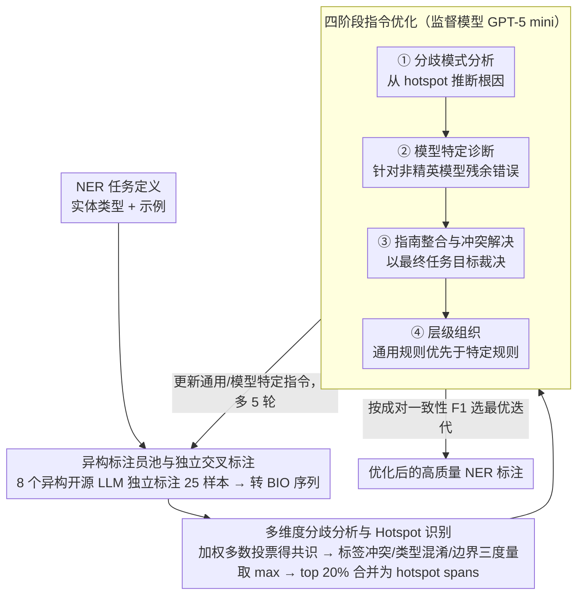

# DiZiNER: Disagreement-guided Instruction Refinement via Pilot Annotation Simulation for Zero-shot Named Entity Recognition

**会议**: ACL 2026  
**arXiv**: [2604.15866](https://arxiv.org/abs/2604.15866)  
**代码**: [https://github.com/SiunKim/diziner-ner/](https://github.com/SiunKim/diziner-ner/)  
**领域**: LLM评测  
**关键词**: 零样本NER, 分歧引导, 指令优化, Pilot Annotation模拟, 多模型集成

## 一句话总结

DiZiNER 通过模拟人工标注中的"预标注"流程，利用多个异构 LLM 作为标注员、一个监督 LLM 分析模型间分歧并迭代优化任务指令，在18个NER基准上实现了14个数据集的零样本SOTA，平均提升+8.0 F1，且超越了作为监督者的GPT-5 mini。

## 研究背景与动机

**领域现状**：大语言模型（LLM）通过零样本和少样本学习已经在命名实体识别（NER）任务上取得了显著进展。然而，当前最先进的NER系统仍然高度依赖人工标注数据，零样本方法与监督微调方法之间存在巨大的性能差距（平均约-32.0 F1）。

**现有痛点**：LLM在NER任务中表现出持续的系统性错误模式，主要包括三类：（1）难以遵循复杂的标注指南；（2）实体边界检测存在歧义；（3）频繁混淆实体类型。已有的解决方案如指令微调、开放NER框架和大规模合成数据生成虽有改善，但与监督方法相比差距仍然很大。

**核心矛盾**：现有零样本NER方法缺乏一种有效的机制来系统性地发现和纠正LLM的标注错误模式。单一模型的指令优化受限于模型自身的偏差，无法跳出自身能力的限制。

**本文目标**：设计一个不需要参数更新的零样本NER框架，能够自动发现并纠正LLM标注中的系统性错误，缩小零样本与监督方法之间的性能差距。

**切入角度**：作者观察到LLM的NER错误模式与人工标注早期阶段的标注不一致性高度相似。在人工标注中，通过"预标注"（pilot annotation）流程——即多个标注员独立标注、监督者分析分歧、更新指南——可以有效解决这些问题。

**核心 idea**：用多个异构LLM模拟标注员，用一个更强的LLM模拟监督者，通过分析模型间分歧来迭代优化NER任务指令，从而在不进行任何参数更新的情况下持续提升零样本NER性能。

## 方法详解

### 整体框架

DiZiNER采用迭代式的pilot annotation模拟框架。整体pipeline包含三个核心阶段：（1）独立交叉标注——多个异构LLM独立对同一组文档进行NER标注；（2）分歧分析——识别高分歧区域（hotspot spans），量化并分类标注分歧模式；（3）指令优化——监督模型基于分歧报告迭代优化通用指令和模型特定指令。输入是NER任务定义（实体类型、示例），输出是经过迭代优化的高质量NER标注结果。

### 关键设计

**1. 异构标注员池与独立交叉标注：用来源各异的模型保证错误彼此独立**

如果多个标注员同源、错误高度相关，一致性高也可能是"集体错对"，分歧信号就失真了。DiZiNER 因此选了 8 个来自不同组织、不同架构的开源 LLM（mistral-small3.2:24b、gpt-oss:20b、phi4:14b、qwen3:14b 等）当独立标注员，它们训练数据和优化流程各不相同。每轮迭代从文档集采样 25 个样本，所有标注员按各自的任务配置 $\Theta_k^{(t)} = (\Sigma, C^{(t)}, R_k^{(t)}, G^{(t)})$ 独立标注，结果再从 span 级转成 BIO 序列以便做 token 级对比。异构性让标注员之间的错误尽量相互独立，避免相关错误堆出虚假的高一致，使得后续分歧信号真正指向系统性问题。

**2. 多维度分歧分析与 Hotspot 识别：把分歧拆成三种度量再定位高分歧区**

光看"标注员是否一致"太粗，不同的不一致其实指向不同的标注病灶。DiZiNER 先用模型间成对 F1 算出各模型权重，加权多数投票得到共识标签，再在每个 token 上算三个互补的分歧度量：标签冲突度 $D_{\text{conf}}$（BIO 标签的分散程度）、类型混淆度 $D_{\text{type}}$（实体类型上的分歧）、边界不确定性 $U_{\text{bnd}}$（实体边界是否一致）。最终分歧分数取三者最大值，排名前 20% 的 token 被标为高分歧，相邻的高分歧 token 合并成 hotspot spans。三个度量分别对应"实体性判断 / 类型混淆 / 边界问题"，并取 max 兜底，确保任何一类系统性错误都不会被漏掉。

**3. 四阶段指令优化：让监督模型把分歧报告系统地翻译成新指令**

发现分歧之后要把它转化成可执行的指令修订，DiZiNER 用 GPT-5 mini 当监督模型，分四阶段推进：先做分歧模式分析，从 hotspot 里识别反复出现的分歧模式并推断根因；再做模型特定诊断，针对非精英模型的残余错误下针对性调整；接着做指南整合与冲突解决，把新旧指令合并、以最终任务目标为准裁决冲突；最后做层级组织，把优化后的指令重排成"通用规则优先于特定规则"的层级结构。分阶段让指令更新可控、不致一锅乱炖，层级化的结构也更易被 LLM 读懂和遵循。

### 损失函数 / 训练策略

DiZiNER 不涉及任何参数训练，完全基于迭代的指令优化。每轮迭代处理25个文档样本，最多进行5轮优化循环。最优配置通过模型间成对一致性（strict span F1）来选择——由于一致性与NER性能呈强相关（相关系数高达0.922），因此可以在没有标注数据的情况下可靠地选择最佳"迭代-模型"组合。实验探索了三组参数配置以确保跨基准的一致性。

## 实验关键数据

### 主实验

| 方法 | CrossNER均值 | 13基准均值 | 与最佳零样本差 | 与监督差距 |
|------|------------|-----------|--------------|----------|
| B2NER (之前最佳) | 75.3 | - | - | -32.0 |
| GPT-5 mini (监督者) | 69.3 | 62.3 | - | - |
| DiZiNER | 75.7 | 68.4 | +11.1 | -20.9 |

在18个基准中的14个数据集上取得零样本SOTA，超越GPT-5 mini监督者平均+5.0~+6.4 F1。

### 消融实验

| 消融项 | 影响 |
|--------|------|
| 移除最终任务目标 | F1从77.6降至71.9 |
| 异构vs同族模型池 | 异构池优1.7-3.7 F1 |
| 标注员数量4→8 | F1从73.1升至75.5 |
| 标注员数量>12 | 性能下降（共识噪声） |
| 使用金标注数据 | 仅微弱提升+0.3 F1 |
| 最优文档集大小 | 15-25个样本 |

### 关键发现

- 模型间一致性与NER性能呈强相关，可作为无标签的质量指标
- 异构模型池（≤24B）持续优于同系列大模型池
- 金标注数据对框架帮助极小，表明分歧引导本身已足够有效
- 每个基准的平均优化成本仅$40.1（推理$1.90/轮 + 监督$0.77/轮）

## 亮点与洞察

- 将人工标注领域成熟的pilot annotation方法论巧妙迁移到LLM场景，这种类比非常深刻且实用
- 完全不需要参数更新就能超越监督者模型，证明了分歧信号本身包含的信息量远超单一模型的能力上限
- 模型间一致性作为无标签的性能代理指标，为实际部署中的质量监控提供了可行方案
- 成本极低（每基准$40），使得大规模应用成为可能

## 局限与展望

- 零样本与监督方法仍存在约-20.9 F1的差距，尚未完全弥合
- 框架对监督模型能力有一定依赖，不同监督模型的性能存在差异
- 固定的20%阈值可能导致过度校正，部分基准在早期达峰后出现性能下降
- 文档集规模较小（25样本），可能限制了对复杂任务的覆盖

## 相关工作与启发

- 与InstructUIE、GoLLIE等指令微调方法不同，DiZiNER完全免训练
- 与UniversalNER、GLiNER等编码器方法互补，后者关注推理效率
- EvoPrompt等自迭代方法使用自生成伪样本，而DiZiNER利用模型间分歧作为更强信号
- 启发：多模型分歧信号可能在更多IE任务（关系抽取、事件抽取）中发挥类似作用

## 评分

- **新颖性**: ⭐⭐⭐⭐⭐ 将pilot annotation方法论系统性地迁移到LLM零样本NER，概念新颖且执行完整
- **实验充分度**: ⭐⭐⭐⭐⭐ 18个基准、多项消融、成本分析、鲁棒性验证，实验极其全面
- **写作质量**: ⭐⭐⭐⭐ 框架描述清晰，数学符号规范，但部分细节较密集
- **价值**: ⭐⭐⭐⭐⭐ 提供了一种低成本、免训练的高性能零样本NER方案，实用价值极高

<!-- RELATED:START -->

## 相关论文

- [\[ACL 2026\] SAM-NER: Semantic Archetype Mediation for Zero-Shot Named Entity Recognition](sam-ner_semantic_archetype_mediation_for_zero-shot_named_entity_recognition.md)
- [\[ACL 2026\] Reasoning-Based Refinement of Unsupervised Text Clusters with LLMs](reasoning-based_refinement_of_unsupervised_text_clusters_with_llms.md)
- [\[ACL 2026\] Refining and Reusing Annotation Guidelines for LLM Annotation](refining_and_reusing_annotation_guidelines_for_llm_annotation.md)
- [\[ACL 2026\] LLM-Guided Semantic Bootstrapping for Interpretable Text Classification with Tsetlin Machines](llm-guided_semantic_bootstrapping_for_interpretable_text_classification_with_tse.md)
- [\[ECCV 2024\] SLIMER: Show Less, Instruct More - Enriching Prompts with Definitions and Guidelines for Zero-Shot NER](../../ECCV2024/nlp_understanding/slimer_zero_shot_ner.md)

<!-- RELATED:END -->
