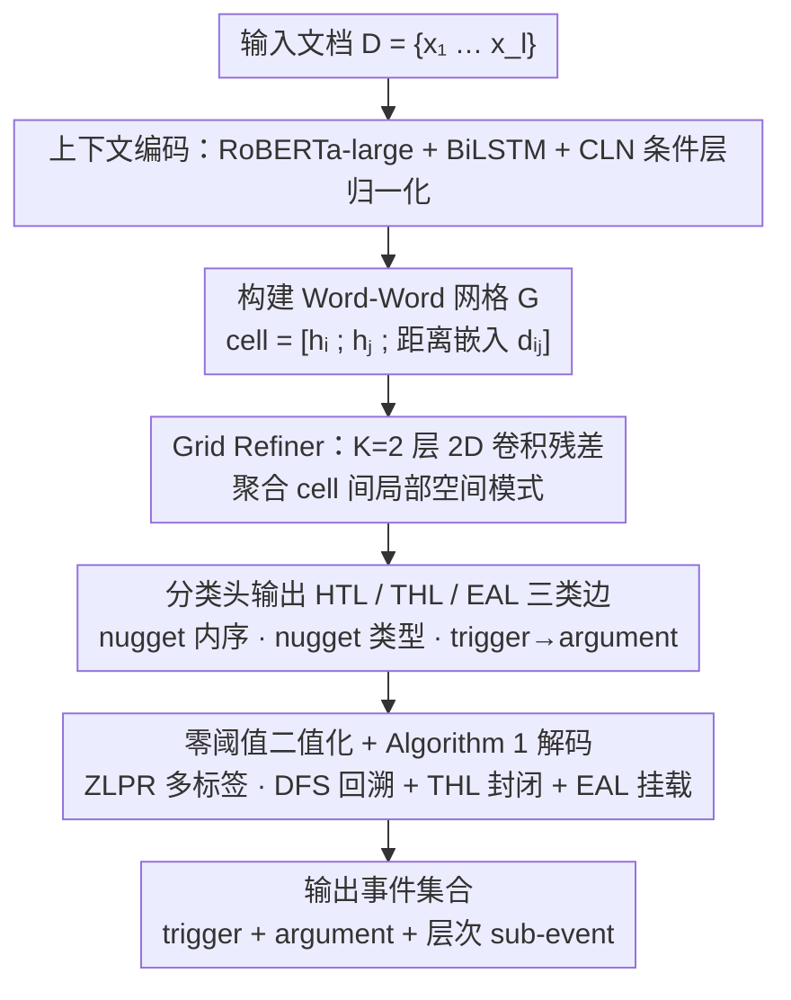

# EXCEEDS: Extracting Complex Events via Nugget-based Grid Modeling in Scientific Domain

**会议**: ACL 2026  
**arXiv**: [2406.14075](https://arxiv.org/abs/2406.14075)  
**代码**: https://github.com/HammerScholar/EXCEEDS  
**领域**: NLP 理解 / 事件抽取 / 信息抽取  
**关键词**: 事件抽取, 文档级, 词-词关系网格, 科学文献, 层次事件

## 一句话总结
作者发现"科学文献摘要"这种 EE 场景同时存在**信息密度高**（每 100 token 5.54 个事件 + 12.82 个 argument）和**事件结构复杂**（重叠/不连续/逆序 nugget + 子事件）两个老 EE 数据集都没碰过的痛点，于是 (a) 标注了 2,508 文档/24,381 事件的 SciEvents 数据集，(b) 提出 EXCEEDS——把 EE 重构成"在 $l \times l$ word-word 网格上做多标签关系分类"的端到端框架，用 HTL/THL/EAL 三种边把 trigger/argument/sub-event 全部统一建模，在主指标和复杂场景上都打过 9 个 SOTA baseline。

## 研究背景与动机
**领域现状**：事件抽取（EE）通常拆成 event detection (ED) + event argument extraction (EAE) 两阶段。主流路线有三家——global 联合抽取（OneIE）、判别式 token 分类（PAIE/Tagprime）、生成式（DEGREE/KnowCoder）；在 ACE05、RAMS、Genia 这些已有 benchmark 上 F1 都已经做到不错。

**现有痛点**：但作者把 9 个主流域专数据集的"信息密度"和"复杂形态比例"做了细统计后发现两个被忽视的事实：(1) 科学文本（论文摘要）的密度远高于 news/legal/cyber 等域——SciEvents 每 100 token 有 5.54 个事件、39.49 个 nugget token，比 ACE05 (1.80 events) 高 3 倍多；(2) 科学文本里 33.70% 是 overlapping nugget、25.63% 是 sub-event、3.08% 是 discontinuous nugget、1.01% 是 reverse-order nugget——而绝大多数现有数据集只标连续 nugget。

**核心矛盾**：现有 EE 方法的两个建模假设都被科学域打破——(a) 大部分方法假设非层次结构（无 sub-event）和局部上下文（句子级），但科学摘要里的 trigger 经常跨远距离连 argument、且 trigger-of-trigger 的 sub-event 关系到处都是；(b) 判别式方法依赖 span 起止 offset，根本无法表示 discontinuous 和 reverse-order nugget。

**本文目标**：(1) 造一个能同时考察"高密度 + 复杂结构"的科学域 EE 数据集；(2) 设计一个能在**单一端到端**框架里同时处理重叠、不连续、逆序 nugget 以及层次 sub-event 的方法。

**切入角度**：作者借鉴 NER 里 W2NER 等 word-word relation 网格的思路——既然 span boundary 表示法搞不定复杂形态，那就回到 token-pair 关系，让"哪两个 token 在一个 nugget 里 / 哪个 nugget 是哪个 nugget 的 argument" 全部统一为网格上的多标签关系预测。

**核心 idea**：把 EE 简化为 "$l \times l$ 网格上的 nugget-based 关系分类"——HTL（head→next）连 nugget 内 token、THL（last→first 带类型）封闭 nugget、EAL（trigger-head→argument-head）连跨 nugget 关系，整套结构既能编码所有复杂 nugget 形态，也能天然表达层次 sub-event。

## 方法详解

### 整体框架
EXCEEDS pipeline：输入文档 $D = \{x_1, \dots, x_l\}$ → RoBERTa-large 编码 → BiLSTM 加序列依赖 → CLN（条件层归一化）做上下文自适应得到 $\mathbf{H} \in \mathbb{R}^{l \times d}$ → 构建 pair-wise 网格 $\mathbf{G} \in \mathbb{R}^{l \times l \times C_g}$（每个 cell 是 $[\mathbf{h}_i; \mathbf{h}_j; \mathbf{d}_{i,j}]$ 经 MLP 投影，$\mathbf{d}_{i,j}$ 是相对距离嵌入）→ $K=2$ 层 2D 卷积残差 Grid Refiner 做局部信息聚合 → 线性分类头输出 $\mathbf{Y} \in \mathbb{R}^{l \times l \times |R|}$ → 多标签零阈值二值化 → 用 Algorithm 1 解码出事件集合：先 DFS 沿 HTL 回溯 nugget chain、要求 tail-to-head 必须有 THL-type 边封闭，然后根据 THL-type 决定是 trigger 还是 argument，最后用 EAL 边 + ontology 约束把 argument 挂到 trigger。

### 关键设计

**1. Word-Word Event Grid（HTL + THL + EAL 三类边）：用一张 token-pair 网格吸纳所有复杂 nugget 形态**

传统 BIO 或 span boundary 表示法天然假设 nugget 是连续的左到右段，一旦碰到 overlapping（同一 token 属于两个 nugget）、discontinuous（中间夹 stop word）、reverse-order（倒装）就直接崩掉——而这正是科学摘要里 33.70% overlapping、3.08% discontinuous、1.01% reverse-order 的真实分布。作者的解法是把建模的最小单元从"span"换成"token 对"：在 cell $G[i,j]$ 存放 token 对 $(x_i, x_j)$ 之间的关系类型 $r \in R$，让所有结构都退化成网格上的一组边。

三种边各司其职。**HTL**（head-tail-link）只标 nugget 内相邻 token 的"先 $x_i$ 后 $x_j$"顺序，于是 discontinuous 自然支持（中间 token 没有 HTL 链入即可跳过）、reverse-order 也自然支持（HTL 方向不必从左到右）。**THL**（tail-head-link）从 nugget 最后一个 token 指回第一个 token，且这条边的标签就是 nugget 的语义类型（trigger type 或 argument type），一举完成"封闭 nugget + 标类型"两件事，省掉了单独的 type classifier。**EAL**（event-argument-link）连 trigger 头 token 到 argument 头 token，而层次 sub-event 直接用 trigger→trigger 的 EAL 表示——这样原本要 ED+EAE 两阶段 + 层次关系抽取才能搞定的复杂结构，全部统一进同一张矩阵、端到端可学。

**2. CLN + 距离嵌入 + 2D 卷积 Grid Refiner：让孤立的 cell 相互感知**

朴素的 pair MLP 把每个 cell 独立看待，会丢掉"trigger 周围若干 cell 一起激活时才是真 trigger"这类网格上的空间模式。作者先用 Conditional Layer Normalization 把 token 表示按上下文自适应重归一化——$\mathbf{H} = \text{MLP}_\gamma(\mathbf{L}) \odot \frac{\mathbf{L} - \mu}{\sigma + \epsilon} + \text{MLP}_\beta(\mathbf{L})$，让 affine 参数随语境变化；再在构建每个 cell 时拼接相对距离嵌入 $\mathbf{d}_{i,j}$ 注入位置信号。

关键的局部传播交给 $K=2$ 层残差 2D 卷积块 $\mathbf{G}^{(k+1)} = \text{Norm}(\mathbf{G}^{(k)} + \mathcal{F}(\mathbf{G}^{(k)}))$：trigger-argument 这类关系往往落在网格的固定模式上（如对角线邻近），卷积核能以 $O(Kl^2)$ 的低成本把这种空间先验注入进来。消融显示去掉 Grid Refiner 后 AC 掉 0.76、EC 掉 0.21，说明它是有效的锦上添花，但比 CLN/BiLSTM 这层 token 表示的贡献要小。

**3. Multi-label 零阈值损失 + 启发式解码：处理一个 cell 多标签，并保证只解出合法结构**

复杂 nugget 下"一个 token 对同时属于多种关系"（如既是 HTL 又是 EAL 的 head）是常态，二元 sigmoid 链不区分类型间的相互依赖。作者改用 ZLPR 多标签 cross-entropy：$\mathcal{L}_{i,j} = \log(1 + \sum_{r \in \Omega^-} e^{y^r_{i,j}}) + \log(1 + \sum_{r \in \Omega^+} e^{-y^r_{i,j}})$，它同时优化所有正例相对所有负例的 margin、自动平衡正负标签数、且零阈值天然可微，推理时直接按 $\mathbb{I}[y^r_{i,j} > 0]$ 二值化得到 $\hat{\mathbf{M}}$，不需要预设激活数。

解码（Algorithm 1）则用两条硬约束剪掉非法结构：(i) 每条 HTL chain 必须有 THL-type 边封闭，否则丢弃；(ii) 找不到任何合法 trigger 可挂的 argument 丢弃。这既保证结构合法，也防止 DFS 在训练早期因模型不稳定爆炸出指数级 HTL chain（作者还特意在前几个 epoch 跳过 validation 防卡死）。

### 一个完整示例

以一句典型科学摘要 "We evaluate **method X** on **dataset Y**" 为例走一遍网格解码：编码后网格上，`method`→`X` 之间被预测出一条 HTL 边、`X`→`method` 之间有一条带 trigger-type 的 THL 边，于是 DFS 沿 HTL 回溯拿到 nugget chain `[method, X]`、再由封闭它的 THL-type 判定这是个 trigger；同理 `dataset`→`Y` 被一条 argument-type 的 THL 封闭成 argument nugget。接着 EAL 边把 trigger 头 token `method` 连到 argument 头 token `dataset`，加上 ontology 约束确认角色合法，最终输出一个完整事件 `(trigger=method X, argument=dataset Y)`。若摘要里还有"用这个评估结果支撑某结论"的更高层事件，就再用一条 trigger→trigger 的 EAL 把两个 trigger 串起来，直接表达 sub-event 层次——全程不需要第二个模型。

### 损失函数 / 训练策略
单一多标签 ZLPR 损失训练整个网格分类器，无任何阶段性预训练或 curriculum；backbone RoBERTa-large lr=1e-5，其他模块 lr=1e-3，batch=2，epoch=20，BiLSTM hidden=1024，grid channels $C_g=256$，refiner $K=2$、kernel=3、dropout=0.1；初始几个 epoch 跳过 validation 防 DFS 爆炸。整体复杂度 $O(l^2)$ 由网格构造主导，内存 $O(l^2 C_g + l^2 |R|)$。

## 实验关键数据

### 主实验
SciEvents 上整体 F1（%，TI=Trigger Identification, TC=Trigger Classification, AI/AC=Argument I/C, EC=Event Correlation 即 sub-event 抽取），表格摘 9 个 baseline 中的代表 + EXCEEDS：

| 模型 | TI | TC | AI | AC | EC |
|------|------|------|------|------|------|
| OneIE (global) | 75.72 | 62.93 | 30.30 | 28.81 | 37.41 |
| EEQA (生成式) | 74.85 | 62.15 | 37.75 | 35.64 | 44.81 |
| PAIE† (判别式) | 73.27 | 63.03 | 43.92 | 42.06 | 47.17 |
| Tagprime (判别式) | 73.27 | 63.03 | 44.67 | 42.69 | 47.72 |
| BartGen† (生成式) | 73.27 | 63.03 | 39.85 | 37.81 | 42.75 |
| KnowCoder (LLM-based) | 69.88 | 52.02 | 35.24 | 33.43 | 34.54 |
| **EXCEEDS** | **75.29** | **63.74** | **44.97** | **43.20** | **48.25** |

EXCEEDS 在 TC/AI/AC/EC 全部第一，TI 紧跟 OneIE（差 0.43），EAE 类指标比第二名 Tagprime 高 +0.30~+0.53 个绝对 F1，EC（hierarchical sub-event）+0.53。

### 消融实验
**模块消融 + 复杂场景细分**：

| 配置 | TC | AC | EC | 说明 |
|------|------|------|------|------|
| EXCEEDS Full | 63.74 | 43.20 | 48.25 | 完整模型 |
| − Contextual encoding | 63.44 | 42.14 | 47.64 | 去 CLN/BiLSTM，AC −1.06 最大 |
| − Grid Refiner | 63.41 | 42.44 | 48.04 | 去 2D 卷积聚合，AC −0.76 |

复杂场景子集（F1%，- 表示 baseline 物理上不支持）：

| 模型 | Discontinuous AC | Overlapping TC | Overlapping AC | Reverse-order AC | Sub-event TC | Sub-event AC | Sub-event EC |
|------|----------|----------|----------|----------|----------|----------|----------|
| Tagprime | – | 55.03 | 18.11 | – | 53.84 | 47.89 | 48.11 |
| PAIE | – | 49.62 | 13.18 | – | 53.66 | 47.34 | 49.08 |
| BartGen | 2.74 | 31.98 | 10.58 | 0.00 | 52.25 | 43.61 | 40.19 |
| KnowCoder | 0.00 | 26.18 | 6.93 | 0.00 | 42.36 | 34.81 | 40.33 |
| **EXCEEDS** | **13.86** | **62.46** | **22.46** | **7.27** | **55.13** | **48.32** | **51.15** |

### 关键发现
- **判别式 baseline 完全无法处理 discontinuous 和 reverse-order**：表格里写 "–" 是因为这些方法基于 span offset 表示，物理上做不出来；EXCEEDS 的网格关系表示是唯一一个全部场景都能跑的——这是建模范式的根本差异。
- **生成式模型在复杂 nugget 上崩溃**：BartGen/DEGREE/KnowCoder 在 overlapping nugget 上的 AC 从 10.58/7.16/6.93 一路掉到 0，因为生成 textual span 无法表达"同一 token 属于两个 nugget"；EXCEEDS 22.46 反而是它们的 2-3 倍。
- **CLN/BiLSTM 比 Grid Refiner 更重要**：AC 上去 Contextual 模块掉 -1.06，去 Grid Refiner 只掉 -0.76——说明网格表示的核心瓶颈在 token representation 质量，refiner 是锦上添花。
- **误差分析**：TI/AI 的错误 89.2%/84.6% 是 "missed"（漏检）而非 boundary 错——说明在 dense 科学语境下 recall 才是真正瓶颈；TC/AC 的分类错主要集中在语义相近类型（MDS vs WKS、TriedC vs BaseC），暗示需要更细粒度的 schema-aware 表示。
- **整体 AC 仍只有 43.20%**——作者明确承认 SciEvents 仍是个 hard benchmark，这个数据集本身就是给社区抛的硬骨头。

## 亮点与洞察
- **W2NER 思想在 EE 上的优雅延展**：把 NER 的 word-word relation 扩展为三类边（nugget 内 + nugget 类型 + nugget 间），用单一矩阵优雅表达原本需要 ED+EAE 两阶段 + 多种独立模型才能搞定的复杂结构——这种"找一个共同的图表示去吸纳所有任务"的做法是 IE 领域很有启发性的范式。
- **THL-type 边一举多得**：tail→head 这一条边同时完成"封闭 nugget"和"标 nugget 类型"两件事，把原本需要单独的 type classifier 直接融进同一个网格——结构上的"复用"减少了模型复杂度也减少了误差传播。
- **Sub-event 用 trigger→trigger 的 EAL 直接建模**：避免了传统层次事件抽取的两阶段 pipeline（先抽事件再抽事件间关系），这个统一性在科学文献"评估方法 X 使用数据集 Y" 这种典型 nested 模式上特别自然。
- **SciEvents 数据集本身的价值**：作者花 4 轮 schema 迭代 + 7 个标注员 + 三层质控做出 73% 一次通过率的高质量数据集，这种工程投入在当前学界少见；信息密度统计表（每 100 token 计 events/args/nugget tokens）也提供了一个跨域比较的标准框架。

## 局限与展望
- **只用了摘要**：SciEvents 全部来自 ACL 论文 abstract（2019-2022），没覆盖正文的图表、公式、跨章节引用——但论文里很多重要事件其实在 method 和 result 章节才完整展开，这限制了 dataset 的代表性。
- **领域窄**：候选数据只来自 ACL，本质上是 NLP 子域；推广到生物医学、物理、化学等不同写作风格的领域时 schema 是否还合适未验证。
- **complex 场景仍未解决**：reverse-order AC 只有 7.27、discontinuous AC 只有 13.86，比连续 nugget 上的 43.20 差一大截——网格表示虽然能"建模"这些结构，但实际 F1 仍然很低，说明数据规模 + 模型架构都还不够。
- **$O(l^2)$ 内存随文档长度爆炸**：对长文档（如全文级别）不可扩展；作者只在摘要级别（短文档）跑通，未做 chunk 或稀疏化方案。
- **改进方向**：(1) 加入 schema-aware 的 prompt 或 type embedding 帮助细粒度类型区分；(2) 用稀疏注意力 + 局部网格分块支持文档级（万 token）输入；(3) 把 SciEvents 扩展到多领域 + 多模态（图表 + 公式）；(4) 借助 LLM 做弱监督生成 silver-standard 标注降低人工成本。

## 相关工作与启发
- **vs Tagprime（最强判别式 baseline）**：Tagprime 把 EE 拆成 token-level 序列标注，靠 trigger 嵌入做 EAE 增强，AC 达 42.69；EXCEEDS AC 43.20 仅高 0.51，但在 discontinuous/reverse-order 上从无法跑变可跑，在 overlapping AC 上 22.46 vs 18.11 高出 +4.35——证明网格表示的边界优势在复杂场景才真正显现。
- **vs OneIE / 联合抽取**：OneIE 联合建模 entity/relation/event 时用 entity 信息训练，在 TI 上略有优势（75.72 vs 75.29）；但 EXCEEDS 不需要 entity 监督，纯 raw text + 网格关系就达到接近水平，更通用。
- **vs PAIE / Tagprime / DEEIA（EAE-only 模型）**：这些方法都依赖外部 ED 模块（实验中用 Tagprime 的 trigger），是 pipeline error 累积模式；EXCEEDS 单一网格同时输出 trigger + argument + sub-event，端到端的优势在 EC 指标上拉开差距（48.25 vs 47.72）。
- **vs KnowCoder（LLM-based）**：LLaMA2-7B + LoRA 微调的 KnowCoder 在所有指标上都明显落后（AC 33.43, TC 52.02）——说明在专业域 + 复杂结构 EE 上，LLM 的 zero-shot/few-shot 通用能力并不能取代针对结构的专门建模；这给"LLM 一统 IE"的乐观论点一个清醒提示。
- **对其他任务的启发**：网格 + 多关系边的思路可以迁移到 nested NER、coreference、AMR parsing 等任何"需要在 token 对上预测多种关系"的任务；THL-type 边作为"结构-类型联合标签"的设计模式也值得在其他结构预测任务复用。

## 评分
- 新颖性: ⭐⭐⭐⭐ 把 W2NER 网格关系思想扩展到 EE 并引入 sub-event 表示是清晰的增量贡献，但底层范式（token-pair 关系网格）此前已在 NER 中成熟。
- 实验充分度: ⭐⭐⭐⭐⭐ 9 个 SOTA baseline 横跨三大流派 + 整体/复杂场景双重评测 + 模块消融 + 误差分析 + 复杂度/时间分析 + 数据集统计跨 9 个域对比，几乎无可挑剔。
- 写作质量: ⭐⭐⭐⭐ 图 2/3 把 HTL/THL/EAL 三种边可视化得很清晰，Algorithm 1 的 decoding 步骤也写得严谨；但 schema 部分依赖大量附录，正文里复杂场景的 F1 太低没有充分讨论原因。
- 价值: ⭐⭐⭐⭐⭐ SciEvents 是一个高质量的科学域 EE benchmark（24k 事件 + 56k arguments），加上 EXCEEDS 提供的端到端复杂结构建模范式，对科学知识图谱、文献摘要、自动综述等下游任务都是重要基础设施。

<!-- RELATED:START -->

## 相关论文

- [\[ACL 2026\] ASTRA: Adaptive Semantic Tree Reasoning Architecture for Complex Table Question Answering](astra_adaptive_semantic_tree_reasoning_architecture_for_complex_table_question_a.md)
- [\[ACL 2025\] Beyond Prompting: An Efficient Embedding Framework for Open-Domain Question Answering](../../ACL2025/nlp_understanding/embqa_embedding_odqa.md)
- [\[ACL 2025\] Recursive Question Understanding for Complex Question Answering over Heterogeneous Personal Data](../../ACL2025/nlp_understanding/recursive_question_understanding_for_complex_question_answering_over_heterogeneo.md)
- [\[ACL 2026\] DimABSA: Building Multilingual and Multidomain Datasets for Dimensional Aspect-Based Sentiment Analysis](dimabsa_building_multilingual_and_multidomain_datasets_for_dimensional_aspect-ba.md)
- [\[ACL 2026\] It's High Time: A Survey of Temporal Question Answering](it39s_high_time_a_survey_of_temporal_question_answering.md)

<!-- RELATED:END -->
