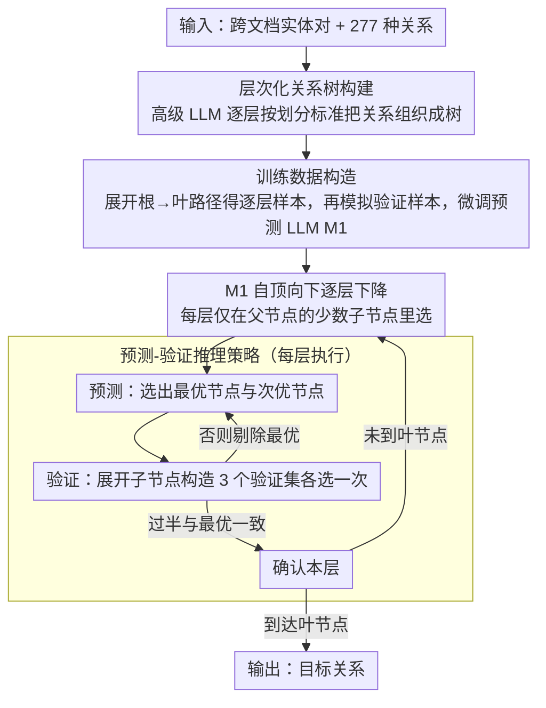

# HCRE: LLM-based Hierarchical Classification for Cross-Document Relation Extraction

**会议**: ACL 2026  
**arXiv**: [2604.07937](https://arxiv.org/abs/2604.07937)  
**代码**: [https://github.com/XMUDeepLIT/HCRE](https://github.com/XMUDeepLIT/HCRE)  
**领域**: NLP理解  
**关键词**: 跨文档关系抽取, 层次化分类, 大语言模型, 错误传播缓解, 预测验证策略

## 一句话总结
提出 HCRE 模型，通过构建层次化关系树将跨文档关系抽取从大规模关系集的直接分类转化为逐层层次化分类，并设计预测-验证推理策略缓解层间错误传播，在 CodRED 数据集上显著超越 SLM 和 LLM 基线。

## 研究背景与动机

**领域现状**：跨文档关系抽取（RE）旨在识别分布在不同文档中的实体间的关系，Wikidata 中超过一半的关系事实跨越多个文档。现有方法主要采用"小语言模型（SLM）+ 分类器"范式。

**现有痛点**：SLM 的语言理解能力有限制约了跨文档 RE 的进一步提升。作者初步实验发现，直接将 LLM 应用于跨文档 RE 效果不理想，甚至不如强 SLM 基线。深入分析揭示根本原因是预定义关系数量过多（CodRED 有 277 种关系）：(1) 大量语义相似的关系难以区分；(2) 列举所有关系导致输入过长，分散了 LLM 对文档关键信息的注意力。

**核心矛盾**：LLM 有强大的语言理解能力但无法有效处理大规模关系选项集，而 SLM 虽能处理但理解能力不足。

**本文目标**：减少 LLM 在每次推理时需考虑的关系选项数量，同时避免层次化分类引入的错误传播问题。

**切入角度**：通过初步实验证明，减少关系选项数量可显著提升 LLM 性能（见 Figure 4），这启发了层次化分类的设计。

**核心 idea**：构建层次化关系树，让 LLM 逐层自顶向下推理目标关系，每层只需考虑少量选项；同时用预测-验证策略通过多视角验证缓解层间错误传播。

## 方法详解

### 整体框架
HCRE 想解决的核心问题是：LLM 语言理解能力强，但一旦把 CodRED 的 277 种关系一股脑塞进 prompt 让它直接选，它既分不清大量语义相近的关系，又会被超长选项列表分散对文档的注意力，反而打不过强 SLM。HCRE 的破解办法是把"一次 277 选 1"拆成"自顶向下逐层在少量选项里选"：先用一个高级 LLM 离线把 277 种关系组织成一棵层次化关系树，再展开树上的根→叶路径构造出逐层分类与验证的训练数据、据此微调出关系预测 LLM $\mathcal{M}_1$；推理时 $\mathcal{M}_1$ 在树的引导下从根逐层下降，每层只在当前父节点的少数子节点里挑，直到走到叶节点得到目标关系；为防止某一层选错把错误一路传到底，每层都额外跑一遍"预测-验证"，用更细粒度的子节点信息复核当前判断。

### 关键设计

**1. 层次化关系树构建：把 277 选 1 拆成每层少数选项**

LLM 直接面对 277 个关系时既要分辨大量近义关系、又被长选项列表拖累注意力，这正是它打不过 SLM 的根因。HCRE 用一个高级 LLM（如 GPT-4o）离线把关系集逐层组织成树：每一层先生成一个划分标准 $C_l$（如"按领域划分"），再按该标准把当前节点下的关系分组、生成并命名子节点，递归到最大深度 $L$。其中第二层被特意设计成"有效关系"与"无有效关系"两个分支，把正样本和 NA 显式分开，缓解标签不均衡。这样每个父节点的子节点数都远小于 277，LLM 每一步只在一小撮语义同族的选项里做判断，分类难度大幅下降。

**2. 训练数据构造：让 $\mathcal{M}_1$ 显式学会逐层分类与验证**

逐层下降和推理时的验证都是 $\mathcal{M}_1$ 原本不具备的新行为，需要专门的监督信号。对每个原始样本 $(x, \mathcal{R}, r)$，HCRE 先在树上找到根到叶 $r$ 的路径，把它展开成 $L-1$ 个逐层分类样本，构成 $\mathcal{D}_1$；再模拟一次推理时的验证环节——把候选节点替换成它的子节点、让模型在更细的选项里重新选一遍——为 $\mathcal{D}_1$ 中每个样本生成对应的验证样本，构成 $\mathcal{D}_2$。最后在合并集 $\mathcal{D}_1 \cup \mathcal{D}_2$ 上微调 $\mathcal{M}_1$，让它既学会沿树自顶向下选，又学会在推理时真正利用细粒度信息做验证，而不是把验证当摆设。

**3. 预测-验证推理策略：用子节点的细粒度信息复核每层判断**

逐层分类天生有错误传播问题——上层选错，下面再准也白搭。HCRE 在每一层把决策拆成预测和验证两步。预测步让 $\mathcal{M}_1$ 从当前层选项集 $\mathcal{R}_l$ 里选出最优节点 $\hat{r}_{1st}$ 和次优节点 $\hat{r}_{2nd}$；验证步则分别把 $\hat{r}_{1st}$、$\hat{r}_{2nd}$ 展开为它们各自的子节点，构造出三个验证选项集 $\mathcal{R}_l^{v_1}, \mathcal{R}_l^{v_2}, \mathcal{R}_l^{v_3}$，让 $\mathcal{M}_1$ 在每个验证集里再选一次。若超过半数验证结果与 $\hat{r}_{1st}$ 语义一致，就确认这层的预测；否则把 $\hat{r}_{1st}$ 剔除、回到预测步重来。它有效的关键在于：验证集携带了子节点级别的更细语义，能帮 $\mathcal{M}_1$ 辨别“最优”和“次优”之间原本难以察觉的微妙差别，从而在每一层就拦住错误，而不是让它传下去。

### 损失函数
标准的语言模型有监督微调损失（交叉熵），在 $\mathcal{D}_1 \cup \mathcal{D}_2$ 上训练。

## 实验关键数据

### 主实验
CodRED 数据集上的结果：

| 模型 | Closed micro F1 | Closed binary F1 | Open micro F1 | Open binary F1 |
|------|----------------|-----------------|---------------|----------------|
| ECRIM (RoBERTa) | 42.54 | 49.47 | 23.39 | 27.60 |
| NEPD (RoBERTa) | 42.96 | 52.67 | 30.12 | 37.04 |
| Vanilla LLaMA | 38.14 | 41.43 | 15.19 | 17.00 |
| **HCRE (LLaMA)** | **45.35** | **58.19** | **34.91** | **49.33** |

### 消融实验

| 配置 | micro F1 | binary F1 | 说明 |
|------|---------|----------|------|
| Full HCRE | 45.35 | 58.19 | 完整模型 |
| w/o multi-view | 39.37 | 49.63 | 仅用单一验证集 |
| w/o PtV | 37.66 | 47.28 | 去掉预测-验证策略 |
| w/o LTC | 43.18 | 56.60 | 直接生成树而非逐层构建 |
| w/o HRT | 38.14 | 41.43 | 无层次化树，直接分类 |

### 关键发现
- HCRE 相比最强 SLM 基线（NEPD）在 closed 设置下 micro F1 提升 2.39，binary F1 提升 5.52
- 在 open 设置下提升更为显著（binary F1 从 37.04 跃升至 49.33），表明层次化分类对长文档更有效
- 预测-验证策略是最关键组件：去掉后 micro F1 下降 7.69，binary F1 下降 10.91
- 多视角验证（3 个验证集 vs 1 个）额外带来 micro F1 1.71 的提升
- 错误传播分析显示 PtV 策略在每一层都有效降低了错误传播率

## 亮点与洞察
- 初步实验揭示了"关系选项过多"是 LLM 在跨文档 RE 上表现不佳的根因，这一发现具有普遍指导意义——在任何大规模标签分类任务中 LLM 都可能面临类似问题
- 预测-验证策略通过"用子节点替换父节点"构造验证集的设计非常巧妙，本质上是用更细粒度的信息来验证粗粒度判断
- 评估指标分析（maximum F1 高估性能、P@K 对数据规模敏感）为社区提供了有价值的方法论建议

## 局限与展望
- 树构建依赖 GPT-4o，对树质量有依赖且成本较高
- 验证步骤增加了推理开销（每层需要多次 LLM 调用）
- 仅在 CodRED 一个数据集上验证，泛化性有待进一步确认
- 未来可探索自适应树深度或动态调整验证强度以平衡效率与准确性

## 相关工作与启发
- **vs NEPD**: NEPD 专注于长距离依赖建模但仍受限于 SLM 能力上限，HCRE 利用 LLM 的强语言理解突破了这一限制
- **vs 层次化文本分类（HTC）方法**: 传统 HTC 方法（DFS-L, BFS-L）不含验证机制，在跨文档 RE 上错误传播严重
- **vs Vanilla LLM**: 初步实验清楚表明直接用 LLM 处理大关系集效果差，层次化是必要的

## 评分
- 新颖性: ⭐⭐⭐⭐ 层次化分类+预测验证策略的组合设计新颖实用
- 实验充分度: ⭐⭐⭐⭐ 消融充分，初步实验动机分析有说服力
- 写作质量: ⭐⭐⭐⭐⭐ 问题发现→分析→解决的逻辑链条非常清晰
- 价值: ⭐⭐⭐⭐ 对大规模分类任务的 LLM 应用有实际指导价值

<!-- RELATED:START -->

## 相关论文

- [\[ACL 2026\] Beyond Chunking: Discourse-Aware Hierarchical Retrieval for Long Document Question Answering](beyond_chunking_discourse-aware_hierarchical_retrieval_for_long_document_questio.md)
- [\[ACL 2026\] LLM-Guided Semantic Bootstrapping for Interpretable Text Classification with Tsetlin Machines](llm-guided_semantic_bootstrapping_for_interpretable_text_classification_with_tse.md)
- [\[ACL 2026\] LexRel: Benchmarking Legal Relation Extraction for Chinese Civil Cases](lexrel_benchmarking_legal_relation_extraction_for_chinese_civil_cases.md)
- [\[ACL 2025\] Towards a More Generalized Approach in Open Relation Extraction](../../ACL2025/nlp_understanding/generalized_open_relation_extract.md)
- [\[ACL 2026\] MSMO-ABSA: Multi-Scale and Multi-Objective Optimization for Cross-Lingual Aspect-Based Sentiment Analysis](msmo-absa_multi-scale_and_multi-objective_optimization_for_cross-lingual_aspect-.md)

<!-- RELATED:END -->
