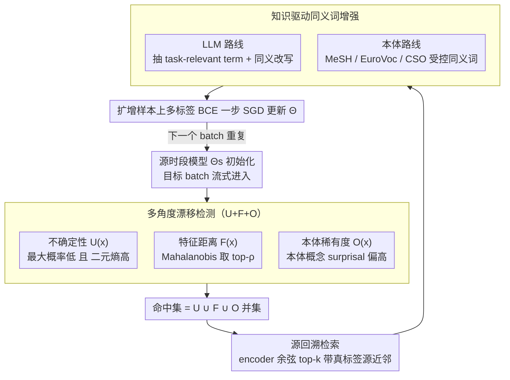

# Knowledge-driven Augmentation and Retrieval for Integrative Temporal Adaptation

**会议**: ACL 2026  
**arXiv**: [2604.22098](https://arxiv.org/abs/2604.22098)  
**代码**: https://github.com/trust-nlp/TemporalLearning-KARITA  
**领域**: 时序适配 / 数据漂移 / 医学 NLP  
**关键词**: 时序偏移、本体知识、检索增强、合成同义词、多标签分类

## 一句话总结
KARITA 把"时序漂移"拆成不确定性、特征距离和本体术语稀有度三种互补信号，对每个被命中的目标样本回溯检索语义相近的源样本，再用 LLM + 领域本体（MeSH / EuroVoc / CSO）生成同义词改写做数据增强，从而以纯数据驱动的方式把源时段模型迁移到未来时段，在临床、法律、科学三类长跨度多标签分类数据上稳定优于强基线。

## 研究背景与动机

**领域现状**：现实部署中模型在历史数据训练、在未来数据推理，语义分布、领域知识都在变化。已有的时序自适应工作要么忽略时间维度，要么只盯一种漂移信号——例如词义偏移（diachronic embedding）、特征空间距离、或概念分布——靠单一信号统一描述全部偏移。

**现有痛点**：在临床（MIMIC）、法律（EurLex）、科学（arXiv-CS）这类长跨度高风险语料里，时序偏移天然是多源叠加：用药新规、立法改动、新兴 CS 子方向等同时进行。统一特征表征会把不同性质的漂移压扁、误判，导致在某些时段模型崩盘（论文里 EATA 在 MIMIC 上 ma-F1 从源 → 目标降到 28.02 即典型失败）。

**核心矛盾**：偏移有"语义可见的"和"语义不可见的"两类。术语层面的演变（如新疾病编码、新法规缩写）常常不会在特征空间产生显著距离，纯 feature-shift 检测会漏；而 entropy/uncertainty 仅看输出，可能漏掉模型自信但实际语义已变的样本。任何单信号都不够。

**本文目标**：(1) 用多角度、互补的信号刻画异质时序漂移；(2) 不依赖目标标签、不做盲目伪标，而是利用源域真实标注做"回溯检索"；(3) 对检索回来的样本做术语级同义改写，让模型在不重训整个体系的前提下增强对术语演化的鲁棒性。

**切入角度**：作者把时序自适应重新理解为"数据中心、迭代选择"过程：每个目标 batch 都先识别"哪些被漂移命中"，再有针对性地把对应源样本拉回来增强，而不是一次性全量重训。

**核心 idea**：用 uncertainty + feature + ontology 三种漂移信号做联合命中，把对应"还可信"的源样本做 LLM/本体同义增强后回灌训练，实现"shift-aware retrieval + knowledge-aware augmentation"的迭代适配。

## 方法详解

### 整体框架
KARITA 想解决的问题是：模型在历史时段训练、却要在未来时段推理，而真实语料（临床、法律、科学）里的时序漂移是多源叠加的——用药新规、立法改动、新兴 CS 子方向同时发生，任何单一信号都刻画不全。它的整体思路是把时序自适应做成"数据中心、batch 级迭代"的过程，而非一次性全量重训。以源时段模型 $\Theta_s$ 作初始化，对每个流式进来的目标 batch $\mathcal{B}_t$ 走四步（Algorithm 1）：先用 $U(x),F(x),O(x)$ 三种互补信号取并集挑出"被漂移命中"的样本 $\mathcal{D}_{shift}$；再为每个命中样本从源数据回溯检索语义最近、带真标签的源近邻；接着用 LLM 或领域本体把这些源样本的术语改写成目标时段可能出现的同义表达做增强；最后用这批"真标签 + 术语对齐"的扩增样本梯度更新 $\Theta$。整个过程不依赖任何目标标签，LLM 端的术语识别每个目标样本只跑一次并缓存复用以省成本。

### 关键设计

**1. 多角度漂移检测（U+F+O）：从输出、表征、本体三层判断谁该被关注**

时序漂移有"语义可见"和"语义不可见"两类：术语层面的演变（新疾病编码、新法规缩写）常常不在特征空间产生明显距离，纯 feature-shift 会漏；而只看输出的 entropy 又会漏掉模型自信但语义已变的样本。KARITA 因此用三个互补信号联合命中。Uncertainty 用最大 sigmoid 概率与平均二元熵双阈值 $U(x)=\mathbf{1}[\max_l p_l(x)<\tau_p \wedge H(x)>\tau_H]$（$\tau_p{=}0.5,\tau_H{=}0.25$）；Feature 用 Mahalanobis 距离 $d(x)=\sqrt{(E(x)-\mu)^\top\Sigma^{-1}(E(x)-\mu)}$，min-max 归一化后取 top-$\rho$；Ontology 把源时段本体概念频率 $p_{t_1}(c)$ 当先验，对目标文档中所有本体概念求 surprisal 平均 $O_{\text{tail}}(x)=\frac{1}{|\mathcal{C}(x)|}\sum_c -\log(p_{t_1}(c)+\varepsilon)$，值越大说明用到越多稀有/新术语。最终命中集是三者并集 $\mathcal{D}_{shift}=\mathcal{D}_U\cup\mathcal{D}_F\cup\mathcal{D}_O$（$\rho{=}0.1$）。之所以必须三者并集，是因为 t-SNE 显示 ontology-shift 与 feature-shift 样本几乎不重叠（MIMIC 上 $O\cap F$ 仅 0.37%），把本体 surprisal 当一阶检测信号正是本文相对单信号工作的最大差异。

**2. 源回溯检索（Source Backtracking）：用源域真标签近邻当可信教师**

挑出漂移样本后，怎么给它们监督信号是关键。给目标样本打伪标（Self-Labeling）会让错误累积，直接最小化目标熵（TTA）在分布漂移下又不稳。KARITA 改走"回溯"：用源训练模型的 encoder 把目标样本 $x_t$ 与源样本 $x_s$ 各编码成 $\mathbf{z}_t,\mathbf{z}_s$，按余弦相似度 $\text{sim}(x_t,x_s)=\cos(\mathbf{z}_t,\mathbf{z}_s)$ 取 top-$k$（默认 $k{=}3$），把这几条带真标签的源近邻当作"语义对齐的可信教师"。因为标签是源域真标注而非自产伪标，误差累积被显著压住——消融里去掉这一步会让 arXiv-CS 的 ma-F1 从 49.82 暴跌到 36.40，说明它是适配的主力。

**3. 知识驱动同义词增强：把源样本术语改写成未来时段的同义表达**

光检索回相似源样本还不够，得让模型真正学到"术语变了但语义没变"。KARITA 对检索回的源样本做术语级同义改写，双源并行：LLM 路线（用于 EurLex / arXiv-CS）给 GPT-4o-mini 喂文档 + 候选标签，让它挑 3–10 个"对分类信息量大的 term"并产同义词、历史表述；本体路线（用于 MIMIC，因隐私不能送 LLM）则查 MeSH 的 descriptor + supplementary concept、EuroVoc 的 PT-NPT、CSO 的 topic 关系拿受控可靠的同义词。对每个候选 term 在源句子里做受控词替换生成增强样本。这一步本质是"受控词法扰动"，正好对应本文最关注的术语演化型漂移；而当 MIMIC 退化为纯本体路线仍然有效，说明该模块对外部资源类型不挑食。

### 一个完整示例
拿 MIMIC 的一个目标 batch 走一遍：某份未来时段的病历用了源时段很少出现的新疾病编码，它在特征空间离源分布并不远（$F$ 检不出）、模型输出也挺自信（$U$ 检不出），但这些新术语让本体 surprisal $O_{\text{tail}}(x)$ 偏高，于是被 $\mathcal{D}_O$ 命中。系统用源模型 encoder 给它做 $[CLS]$ 余弦检索，从源数据里拉回 $k{=}3$ 条语义最近、带真标签的旧病历。因为是医疗隐私场景，增强走本体路线：用 MeSH 把这 3 条源病历里的关键术语替换成与新编码对应的同义 descriptor，得到"术语对齐到目标时段"的扩增样本。最后只在这些扩增样本上以多标签 BCE 做一步 SGD 更新 $\Theta$——全程没用到任何目标标签，下一个 batch 再重复同样四步。

### 损失函数 / 训练策略
源模型：EurLex / arXiv-CS 用 XLM-RoBERTa-base、MIMIC 用 Longformer，在最早时段 $T_1$ 上以 lr=$3\times10^{-5}$ 训 10 epoch，多标签 BCE。KARITA 适配阶段沿用同样的 BCE，仅在增强后的检索源样本上做 SGD，不需要任何目标标签。敏感性分析中 $\rho{=}0.1, k{=}3$ 为最优且邻近设置波动小；LLM 同义词识别每个目标样本一次性产出后缓存复用。

## 实验关键数据

### 主实验
源 → 目标分类性能（%），目标时段测试集：

| 数据集 | 指标 | Source 模型 | Self-Labeling | EATA (TTA) | IFT | **KARITA** | Target 上界 |
|--------|------|-------------|---------------|------------|-----|------------|-------------|
| MIMIC | ma-F1 | 40.65 | 40.55 | 28.02 | 43.05 | **52.12** | 65.78 |
| MIMIC | mi-F1 | 52.86 | 52.34 | 45.98 | 55.24 | **63.95** | 76.66 |
| EurLex | ma-F1 | 46.75 | 42.02 | 47.97 | 37.12 | **56.15** | 71.74 |
| arXiv-CS | ma-F1 | 34.86 | 34.94 | 27.63 | 40.67 | **49.82** | 65.51 |
| arXiv-CS | sa-F1 | 43.36 | 43.46 | 34.90 | 49.17 | **62.63** | 74.98 |

KARITA 把源 → 目标的 ma-F1 差距在 MIMIC 上缩小 +11.47，在 arXiv-CS 上 +14.96；EATA 在 MIMIC 上反而比 Source 还差 12 个点，验证了无监督 TTA 在医疗领域容易崩。

### 消融实验
Llama-encoder 共享设定下，移除 KARITA 单一组件（target 测试 ma-F1）：

| 配置 | MIMIC | EurLex | arXiv-CS | 说明 |
|------|-------|--------|----------|------|
| Full KARITA | 52.12 | 56.15 | 49.82 | 完整方法 |
| w/o detection（随机选样） | 49.33 | 48.77 | 31.02 | arXiv-CS 暴跌 18.8 |
| w/o augmentation | 48.13 | 54.60 | 43.74 | 失去术语对齐 |
| w/o retrieval（选不相似源） | 50.67 | 44.16 | 36.40 | EurLex 跌 12 |

单信号检测器对比（取代多信号联合，target 测试 ma-F1）：

| 检测器 | MIMIC | EurLex | arXiv-CS |
|--------|-------|--------|----------|
| Full（U+F+O） | **52.12** | **56.15** | **49.82** |
| Feature only | 51.58 | 44.57 | 23.00 |
| Ontology only | 40.94 | 50.48 | 29.69 |
| Uncertainty only | 42.45 | 54.97 | 42.64 |

### 关键发现
- **本体术语漂移是不可替代的信号**：MIMIC 上 $U\cap O$ 仅 3.05%、$O\cap F$ 仅 0.37%，t-SNE 显示 ontology-shift 样本和 feature-shift 样本占据不同区域；纯特征检测在 arXiv-CS 上让 ma-F1 直接掉到 23.00。
- **检索 + 增强是协同作用**：去掉任意一个都比同时去掉两个塌得快，且三者的贡献顺序在不同领域不同（MIMIC 更依赖 augmentation、arXiv-CS 更依赖 detection），说明这是真正的整合框架。
- **TTA 范式在多源叠加漂移下不稳**：EATA / SAR 在 MIMIC 上不仅没提升反而退化，因为熵最小化会进一步强化错误标签；而 KARITA 用真源监督避免了这种漂移累积。
- **时序距离 ↑ 三种 shift 同步 ↑**：EurLex 与 arXiv-CS 上 F、O、entropy 三个分数都随年份单调上升，但增速不同——验证多信号联合的必要性。
- **超参鲁棒**：$k$ 从 1 到 5、$\rho$ 从 0.05 到 0.3 的网格里，$k{=}3,\rho{=}0.1$ 最优但邻近设置波动小，落地友好。

## 亮点与洞察
- "时序漂移"通常被当作一个标量来度量；本文把它结构化为"输出层、表征层、本体层"三个解耦视角，第一次把 surprisal 在本体上的展开当作主一阶检测信号，思路清晰且直接落到选样上。
- 用 LLM 抽 task-relevant term + 同义词，把不可控的 free-form 改写收窄到"对分类有信息量的术语"，最大程度避免改坏标签语义，是 LLM 数据增强里少见的"标签感知"做法。
- MeSH/EuroVoc/CSO 路线给出一个非常实用的"隐私退路"：在医疗场景不许送外部 LLM 时，纯本体仍能保持有效，工程上极有价值。
- 把"自适应"从一次性变成 batch 级迭代，配合可重用的同义词缓存，相比 TTA 不需要在线反传巨大模型，部署成本低。

## 局限与展望
- 框架强依赖外部知识资源（LLM / 本体），低资源、闭域场景需要替代方案（如领域 LM 自挖同义词）。
- 仅处理词汇/术语层漂移；新概念出现、标签定义变化、任务再定义等结构性漂移没有显式建模。
- 三个信号的合并是简单并集 + 等权 top-$\rho$，没有学习不同领域应给每个信号多少权重，存在调优空间。
- 检索仍是单源域；多源时段或跨领域回溯还未探索。
- LLM 同义词质量没有人工评估，可能引入潜在偏置。

## 相关工作与启发
- **vs IFT / ChronosLex**：IFT 用时序排序的增量训练让模型"顺着时间走"；KARITA 用数据增强让源样本"假装来自未来"，两者可叠加。
- **vs Self-Labeling**：Self-Labeling 在目标样本上打伪标，错误累积；KARITA 用源真标签做桥梁，鲁棒性显著更好（消融与主表都印证）。
- **vs SAR / EATA / TENT**：这些 TTA 在源 → 目标分布差异极大时反而崩；KARITA 走数据中心路线，回避了 entropy minimization 的负面循环。
- **vs Huang & Paul 2019 (diachronic embeddings)**：他们把所有漂移压缩进词向量，本文显式拆出三种信号；本体路线本质上把 diachronic 思想从词向量扩展到了知识图谱。

## 评分
- 新颖性: ⭐⭐⭐⭐ "多信号 shift + 源回溯 + 知识同义增强"组合在时序自适应里第一次系统化提出；本体 surprisal 做检测尤其新颖。
- 实验充分度: ⭐⭐⭐⭐ 三领域 × 四时段 × 多基线 × 单信号 ablation + 重叠分析 + 时间趋势 + 超参敏感性，几乎覆盖了想得到的角度。
- 写作质量: ⭐⭐⭐⭐ 故事讲得很顺、表 4-6 的设计直接回答"信号到底互补不互补"，结构清晰；个别公式与符号介绍可更紧凑。
- 价值: ⭐⭐⭐⭐ 在医疗、法律、科技三个真实高风险领域都涨点，且对外部资源种类不挑食，工程落地价值高。

<!-- RELATED:START -->

## 相关论文

- [\[ACL 2026\] It's High Time: A Survey of Temporal Question Answering](it39s_high_time_a_survey_of_temporal_question_answering.md)
- [\[ACL 2026\] Beyond Chunking: Discourse-Aware Hierarchical Retrieval for Long Document Question Answering](beyond_chunking_discourse-aware_hierarchical_retrieval_for_long_document_questio.md)
- [\[ACL 2026\] Creating ConLangs to Probe the Metalinguistic Grammatical Knowledge of LLMs](creating_conlangs_to_probe_the_metalinguistic_grammatical_knowledge_of_llms.md)
- [\[ACL 2026\] AdapTime: Enabling Adaptive Temporal Reasoning in Large Language Models](adaptime_enabling_adaptive_temporal_reasoning_in_large_language_models.md)
- [\[ACL 2026\] Filling the Gap: Is Commonsense Knowledge Generation useful for Natural Language Inference?](filling_the_gap_is_commonsense_knowledge_generation_useful_for_natural_language_.md)

<!-- RELATED:END -->
