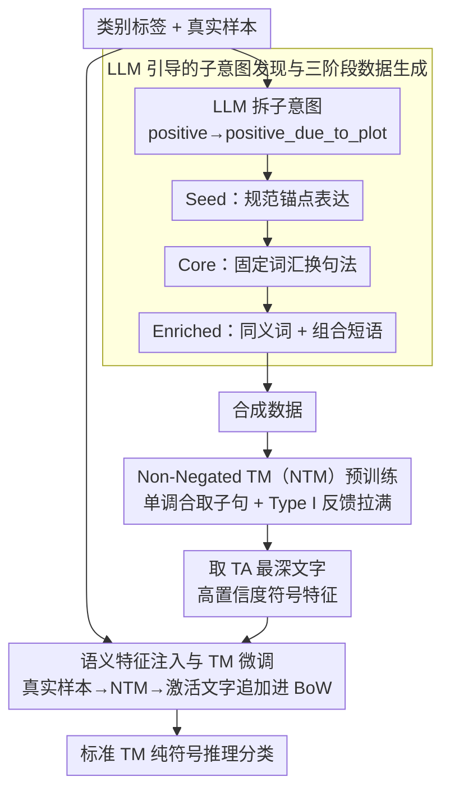

# LLM-Guided Semantic Bootstrapping for Interpretable Text Classification with Tsetlin Machines

**会议**: ACL 2026  
**arXiv**: [2604.12223](https://arxiv.org/abs/2604.12223)  
**代码**: 无  
**领域**: 可解释性 / 文本分类  
**关键词**: Tsetlin Machine, 语义引导, 符号学习, 子意图发现, 可解释分类

## 一句话总结

本文提出 LLM 引导的语义引导框架，通过 LLM 生成子意图和三阶段课程式合成数据训练非否定 Tsetlin Machine（NTM），提取高置信度符号特征注入真实数据，使标准 TM 在保持完全可解释性的同时逼近 BERT 的分类性能。

## 研究背景与动机

**领域现状**：Tsetlin Machine（TM）因其子句级透明性在可解释 NLP 中受到关注，已应用于文档分类、情感分析等任务。而 BERT 等预训练语言模型提供强大的语义表示但成本高且不透明。

**现有痛点**：(1) TM 基于布尔词袋（BoW）表示，无法泛化语义相近但词形不同的表达——除非训练数据中明确出现；(2) 用 Word2Vec/GloVe 增强 TM 输入只能提供有限的语义对齐；(3) BERT 虽然表现好但在法律、医疗等高风险领域中缺乏决策可追溯性。

**核心矛盾**：符号可解释性与语义泛化能力之间存在根本矛盾——BoW 表示保证了透明性但牺牲了语义理解，嵌入表示捕获了语义但失去了可解释性。

**本文目标**：在不引入嵌入层或运行时 LLM 调用的前提下，将 LLM 的语义知识以符号形式转移到 TM 中。

**切入角度**：利用 LLM 生成可解释的子意图（如 positive_due_to_plot）和对应的合成数据，通过符号增强而非嵌入增强来桥接语义鸿沟。

**核心 idea**：LLM 不参与分类推理，而是在离线训练阶段作为"语义教师"，通过子意图分解和课程式数据生成为 TM 提供符号化的语义先验。

## 方法详解

### 整体框架

这篇要化解的矛盾是：Tsetlin Machine（TM）靠布尔词袋（BoW）子句获得逐条可读的透明性，却无法泛化训练数据里没出现过的近义表达；BERT 语义强但不可追溯。作者让 LLM 只在离线训练阶段当"语义教师"，分三步把语义知识以符号形式搬进 TM：先用 LLM 把类别拆成子意图并三阶段（Seed→Core→Enriched）生成合成数据，再在合成数据上预训练一个 Non-Negated TM（NTM）提取高置信度符号特征，最后把这些特征注入真实数据的 BoW 表示、在增强表示上微调标准 TM。推理时全程纯符号计算，不调 LLM、不用嵌入。

### 关键设计

**1. LLM 引导的子意图发现与三阶段数据生成：把粗标签拆成可读的语义驱动因素**

TM 的 BoW 表示对"语义相近但词形不同"的表达束手无策，除非训练数据里恰好出现过。为此 LLM 先把每个类别分解成细粒度子意图（如 positive → positive_due_to_plot、positive_due_to_acting），再按课程学习的思路三阶段造数据：Seed 阶段生成 15–20 词的规范表达当锚点，Core 阶段保持词汇稳定但变换句法结构，Enriched 阶段引入同义词和组合短语扩展词汇空间。之所以要分三阶段而非一步生成，是因为单步 LLM 生成容易坍缩到高概率模板或泛化成空洞短语；逐级放开覆盖度、词汇多样性与语义忠实度，对布尔子句能否学到稳定可读的模式至关重要。

**2. Non-Negated Tsetlin Machine（NTM）：让合成数据里学出的符号特征单调可解释**

要从合成数据里提取"肯定相关"的语义指示词，作者对标准 TM 改两处：一是去掉否定文字，子句退化为纯单调合取 $C_\iota^\kappa = \bigwedge_{k \in I_\iota^\kappa} x_k$，这样每条规则反映的都是正向相关的词汇模式、没有"非某词"这类难解释的项；二是把 Type I 反馈拉满（$P_{\text{reward}}=1.0,\ P_{\text{penalty}}=0.0$），让 Tsetlin Automata 快速收敛到高置信度文字集，最后取 TA 状态最深的文字当语义指示器。增强反馈保证在合成数据上稳定收敛，单调合取保证抽出来的符号特征本身就可读。

**3. 语义特征注入与 TM 微调：把 LLM 衍生的符号知识接回真实数据**

光有 NTM 还不够，得把它学到的语义带回真实任务。做法是把真实样本喂给 NTM 预测子意图，收集被激活子句对应的高置信度文字，把这些文字的二进制存在指示器追加到原始 BoW 后面，再让标准 TM 在这种混合表示上微调。关键在于增强完全发生在离线阶段——最终模型仍是纯符号、推理不引入任何新组件，而注入的语义特征恰好补上了原始 BoW 缺失的跨词汇关联（如把 immunosuppression 关联到 immune、suppression）。

### 损失函数 / 训练策略

NTM 用修改后的 Type I/II 反馈训练（每个子意图 150 个子句，$T=5000$，$s=5$）；标准 TM 用整数加权变体在增强数据上微调。所有合成数据由 GPT-4o 生成（nucleus sampling，$p=0.9$，temperature $=0.7$）。

## 实验关键数据

### 主实验

**六个分类基准上的性能对比**

| 方法 | AG-News | R8 | R52 | IMDB | SST2 | HoC |
|------|---------|-----|-----|------|------|-----|
| TM | 88.34 | 96.16 | 84.62 | 90.62 | 75.61 | 77.42 |
| TM (GloVe) | 90.12 | 97.50 | 89.14 | 90.88 | 76.38 | 78.78 |
| BERT | 94.75 | 97.49 | 94.26 | 93.46 | 94.00 | 82.90 |
| **LLM-Guided TM** | **93.10** | **97.88** | **94.45** | **92.10** | **85.24** | **81.90** |

### 消融实验

**各数据集上 TM 变体提升幅度**

| 数据集 | TM→LLM-TM 提升 | vs BERT 差距 |
|--------|----------------|-------------|
| AG-News | +4.76% | -1.65% |
| R8 | +1.72% | +0.39% |
| R52 | +9.83% | +0.19% |
| SST2 | +9.63% | -8.76% |
| HoC | +4.48% | -1.00% |

### 关键发现

- LLM-Guided TM 在 R8 和 R52 上超越 BERT，同时保持完全符号可解释性
- SST2 上提升最大（+9.63%）但与 BERT 差距也最大（-8.76%），说明短文本情感分析仍需上下文理解
- 在 HoC 生物医学数据集上接近 BERT（81.90% vs 82.90%），语义分解有效恢复了复合词（如 immunosuppression→immune+suppression）
- 符号特征组语义连贯：如 politics 子意图提取 {parliament, election, results}
- 整个推理管道保持纯符号性——无嵌入、无运行时 LLM 调用

## 亮点与洞察

- "LLM 作为语义教师而非分类器"的理念优雅——利用 LLM 的世界知识但完全避免其推理时开销
- 子意图分解使得增强特征本身就是可解释的，不像嵌入增强那样引入黑箱
- 三阶段课程生成策略对布尔符号模型的子句学习特别重要——词汇稳定性和多样性的平衡是关键

## 局限与展望

- 依赖 LLM 生成质量——在复杂或类别重叠的领域中子意图可能不准确
- 去除否定文字提高了可解释性但降低了表达能力，无法捕获否定逻辑
- 未进行系统的超参数消融（子句数、合成样本数、加权方案等）
- SST2 上与 BERT 差距较大，说明对短文本上下文理解仍有瓶颈

## 相关工作与启发

- **vs TM (GloVe)**: GloVe 增强提供静态词向量对齐，本文的子意图引导提供结构化语义关联，在 R52 上提升 +5.31%
- **vs BERT**: BERT 在所有任务上仍有优势（除 R8/R52），但以牺牲可解释性为代价。本文在保持符号透明性的同时缩小了大部分差距
- **vs 符号蒸馏方法**: 现有方法通常蒸馏为决策树或线性规则，本文首次蒸馏到子句逻辑中

## 评分

- 新颖性: ⭐⭐⭐⭐ 将 LLM 语义知识符号化转移到 Tsetlin Machine 的思路新颖
- 实验充分度: ⭐⭐⭐⭐ 6 个数据集覆盖多领域，但缺少消融实验
- 写作质量: ⭐⭐⭐⭐ 框架描述清楚，案例分析有说服力
- 价值: ⭐⭐⭐⭐ 为需要可解释性的高风险场景提供了实用方案

<!-- RELATED:START -->

## 相关论文

- [\[ACL 2026\] HCRE: LLM-based Hierarchical Classification for Cross-Document Relation Extraction](hcre_llm-based_hierarchical_classification_for_cross-document_relation_extractio.md)
- [\[ACL 2026\] MADE: A Living Benchmark for Multi-Label Text Classification with Uncertainty Quantification](made_a_living_benchmark_for_multi-label_text_classification_with_uncertainty_qua.md)
- [\[ACL 2026\] Reasoning-Based Refinement of Unsupervised Text Clusters with LLMs](reasoning-based_refinement_of_unsupervised_text_clusters_with_llms.md)
- [\[ACL 2025\] Rethinking Semantic Parsing for Large Language Models: Enhancing LLM Performance with Semantic Hints](../../ACL2025/nlp_understanding/rethinking_semantic_parsing_for_large_language_models_enhancing_llm_performance_.md)
- [\[ACL 2026\] BoundRL: Efficient Structured Text Segmentation through Reinforced Boundary Generation](boundrl_efficient_structured_text_segmentation_through_reinforced_boundary_gener.md)

<!-- RELATED:END -->
