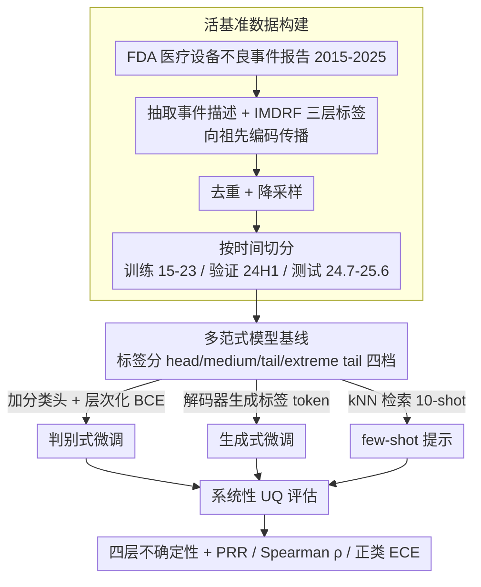

# MADE: A Living Benchmark for Multi-Label Text Classification with Uncertainty Quantification

**会议**: ACL 2026  
**arXiv**: [2604.15203](https://arxiv.org/abs/2604.15203)  
**代码**: [https://hhi.fraunhofer.de/aml-demonstrator/made-benchmark](https://hhi.fraunhofer.de/aml-demonstrator/made-benchmark)  
**领域**: LLM评测  
**关键词**: 多标签分类, 不确定性量化, 医疗设备, 活基准, 长尾分布

## 一句话总结

本文提出 MADE——一个基于 FDA 医疗设备不良事件报告的"活"多标签文本分类基准，包含 1,154 个层次化标签和严格的时间分割，系统评估了 20+ 编码器/解码器模型在判别式微调、生成式微调和 few-shot 提示下的预测性能和不确定性量化（UQ）能力，揭示了关键权衡：小型判别式微调解码器在头到尾准确率上最优，生成式微调的 UQ 最可靠，大型推理模型提升稀有标签但 UQ 意外较弱。

## 研究背景与动机

**领域现状**：多标签文本分类（MLTC）是医疗保健领域的核心任务（患者分类、临床编码、事件报告等），需要从大标签集中选择多个标签。现有基准（如 MIMIC-III、EUR-LEX）已趋于饱和，且可能被 LLM 预训练数据污染。

**现有痛点**：(1) 现有 MLTC 基准是静态的，容易因数据污染导致 zero-/few-shot 性能虚高；(2) 真实 MLTC 数据具有严重的类内/类间不平衡（少数常见类占多数样本，安全关键类位于长尾）；(3) 在高风险领域（医疗），模型不仅需要强预测性能，还需要可靠的不确定性量化（UQ）来支持人类监督，但 UQ 在 MLTC 上的研究几乎为零。

**核心矛盾**：实践者面临未解答的关键问题——应选择哪种模型架构（编码器 vs 解码器）？哪种学习范式（微调 vs in-context learning）对频繁类和稀有类的权衡最佳？预测的可靠性如何？缺乏统一的无污染基准来系统回答这些问题。

**本文目标**：(1) 创建一个持续更新的无污染 MLTC 基准；(2) 建立涵盖 20+ 模型的全面基线；(3) 系统评估多种 UQ 方法在 MLTC 上的效果。

**切入角度**：利用 FDA 定期发布的医疗设备不良事件报告作为持续更新的数据源，通过严格的时间分割确保测试数据不会泄露到未来模型的预训练中。

**核心 idea**：构建一个"活"的基准——随着 FDA 持续发布新报告，未来模型始终可以在训练后产生的数据上进行无污染评估。

## 方法详解

### 整体框架

MADE 基准包含三大组件：(1) 数据管线——从 FDA 不良事件报告中提取事件描述和 IMDRF 层次标签，经去重、降采样和时间分割后生成训练/验证/测试集；(2) 模型基线——涵盖判别式微调（编码器/解码器 + 分类头）、生成式微调（解码器生成标签 token）和 few-shot 提示（instruction/thinking 模型）三种范式；(3) UQ 评估——对比信息级（entropy、perplexity）、一致性级（graph Laplacian 特征值）、组合级和自述式不确定性四类方法。

### 关键设计

**1. 活基准数据构建：用持续更新的政府数据流堵住污染漏洞**

静态基准最致命的问题是测试集早晚会进到下一代模型的预训练里，zero-/few-shot 分数随之虚高。MADE 的破解办法是把数据源换成 FDA 每季度持续发布的医疗设备不良事件报告：从 2015-2025 年的报告中抽取事件描述和标签，每个报告的产品问题、患者问题标签映射到 IMDRF 三层层次编码，并向上传播到所有祖先编码。关键在于**按时间切分**——训练集取 2015-2023 年（298,825 样本）、验证集取 2024 上半年（71,271）、测试集取 2024.7-2025.6（118,177），保证测试数据产生在模型训练截止之后。最终标签集 1,154 个、平均每样本 8.79 个标签、长尾极重。因为 FDA 还在持续放新报告，未来任何新模型都能在它训练截止日之后的数据上被评估，污染问题从机制上被根除。

**2. 多范式模型基线：在同一条件下逼三种范式正面对决**

实践者真正想知道的是"该选编码器还是解码器、该微调还是 in-context learning"，但以往缺乏公平的同条件对比。MADE 把 20+ 模型铺成三条线：(a) 判别式微调——在 Llama 3.2-1B/3B、3.1-8B 和 Ettin 150M/400M/1B 上加分类头，用层次化 BCE 损失；(b) 生成式微调——让 Llama 和 Ettin 解码器直接生成标签 token，对比全参数与 LoRA；(c) few-shot 提示——对 Llama、DeepSeek-R1、Qwen3、GPT-4.1/5 等 10+ 模型做 kNN 检索的 10-shot 提示。为了把长尾问题量化，标签按训练集频率分成 head（>1%）、medium（0.1-1%）、tail（0.01-0.1%）、extreme tail（<0.01%）四档，从而能分别看出哪种范式在常见类和稀有类上各占什么便宜。

**3. 系统性 UQ 评估：给"模型有多不确定"一套可量化的标尺**

高风险医疗场景里，模型不光要预测准，还得能把没把握的样本路由给人审查，所以不确定性量化（UQ）的质量直接关系到系统安全。MADE 对判别式模型用 per-label entropy；对生成式模型则铺了四层：信息级 $U_{\text{info}}$（entropy、improbability、avg-log-prob、perplexity）、一致性级 $U_{\text{cons}}$（多次随机采样输出构图后 graph Laplacian 特征值之和，反映多次生成的内部一致性）、组合级 $U_{\text{combined}} = U_{\text{info}} \times U_{\text{cons}}$，以及自述式 $U_{\text{self}}$（直接提示模型输出置信度）。UQ 质量本身用三个指标衡量：PRR（预测拒绝率，按不确定性排序逐步拒答时性能曲线下面积，越高越好）、Spearman $\rho$（不确定性与误差的秩相关，越负说明越不确定的样本确实越容易错）和正类 ECE$_+$（正类预测的期望校准误差）。

### 损失函数 / 训练策略

判别式微调使用层次化二元交叉熵损失，在每个层次单独计算 BCE 后求和。使用 AdamW + 余弦学习率调度，batch size 512，20 epochs。每个标签的分类阈值在验证集上独立选择以最大化 F1。生成式微调使用标准自回归语言建模损失，4 epochs，支持全参数和 LoRA 微调。

## 实验关键数据

### 主实验

**不同范式的预测性能与 UQ 质量（截断测试集 n=10,288）**

| 范式/模型 | Macro F1 | Head F1 | Tail F1 | ET F1 | PRR↑ | ρ↓ |
|-----------|---------|---------|---------|-------|------|-----|
| 判别式 Llama-3.1-8B | **0.54** | **0.74** | **0.53** | 0.12 | 0.47 | -0.40 |
| 生成式 Llama-3.1-70B | 0.53 | 0.73 | 0.51 | 0.16 | 0.55 | -0.27 |
| 生成式 Llama-3.2-3B | 0.48 | 0.67 | 0.46 | 0.12 | **0.60** | **-0.46** |
| 提示 Qwen3-235B-Think | 0.49 | 0.62 | 0.48 | 0.33 | 0.34 | -0.09 |
| 提示 GPT-5 | 0.54 | 0.68 | 0.53 | **0.34** | N/A | N/A |
| 提示 DeepSeek-R1 | 0.48 | 0.62 | 0.47 | 0.30 | 0.24 | -0.09 |

### 消融实验

**UQ 方法对比（生成式微调 vs 提示）**

| UQ 指标 | 生成式微调 PRR | Instruct PRR | Thinking PRR |
|---------|-------------|-------------|-------------|
| Avg. Log-Prob | 0.54±0.05 | 0.37±0.25 | 0.18±0.12 |
| Entropy | **0.58±0.03** | **0.45±0.15** | 0.19±0.12 |
| Improbability | 0.54±0.05 | 0.43±0.15 | 0.17±0.12 |
| Perplexity | 0.54±0.06 | 0.37±0.25 | 0.18±0.11 |

### 关键发现

- 判别式微调在 head-tail 准确率上始终优于同等大小的生成式微调（Wilcoxon 检验 $p \leq 0.05$），且仅需 8B 参数即可达到最佳综合 F1
- 生成式微调在 UQ 上表现最优——Llama-3.2-3B 生成式获得最佳 PRR (0.60) 和 Spearman $\rho$ (-0.46)
- 推理模型（GPT-5、Qwen3-235B-Think）在 extreme tail 类上表现突出（F1=0.34），但 UQ 意外较弱（PRR 仅 0.21±0.10），且 head 类性能一致低于最佳微调模型
- 自述式置信度不是不确定性的可靠代理——与实际错误率的相关性很低
- Entropy 作为 $U_{\text{info}}$ 指标在生成式微调和 instruct 模型上都是最佳选择

## 亮点与洞察

- "活基准"概念精准解决了 LLM 时代基准污染的根本问题——利用政府持续发布的公开数据流构建永不过时的测试集
- 揭示了预测性能与 UQ 质量的反直觉权衡——推理模型在稀有类上表现优异但 UQ 最差，意味着在高风险场景中它的"高性能"可能不可信
- 发现判别式微调仅需 8B 参数就能达到甚至超越 GPT-5 的综合性能，为实践者提供了成本效益极高的方案

## 局限与展望

- FDA 标注一致性未经正式的标注者间一致性研究验证，标签可能存在噪声
- 自述式 UQ 仅测试了简单的提示策略，更精细的校准提示可能改善结果
- 测试集限于 10,288 个样本以控制推理成本，极端尾部标签的评估统计效力有限
- 未评估多模态输入（如设备图像）对分类的潜在增益

## 相关工作与启发

- **vs MIMIC-III ICD 编码**: MIMIC 是临床笔记的 ICD 编码基准，但已被广泛使用十余年，存在严重的污染风险；MADE 通过时间分割持续更新避免此问题
- **vs EUR-LEX**: EUR-LEX 是法律文档多标签分类基准，标签空间较小且领域不同；MADE 的 1,154 标签和 3 层层次结构更具挑战性
- **vs Ettin (Weller et al. 2025)**: Ettin 提供了匹配的编码器-解码器模型对比，但未在 MLTC 上评估；本文填补了这一空白

## 评分

- 新颖性: ⭐⭐⭐⭐ "活基准"概念新颖且实用，UQ 在 MLTC 上的系统评估填补空白
- 实验充分度: ⭐⭐⭐⭐⭐ 20+ 模型、4 种范式、多种 UQ 方法的全面对比，统计检验严谨
- 写作质量: ⭐⭐⭐⭐ 结构清晰，结论明确，但内容密度极高，部分细节需查阅附录
- 价值: ⭐⭐⭐⭐⭐ 为高风险 MLTC 实践提供了模型选择和 UQ 方法的实用指南

<!-- RELATED:START -->

## 相关论文

- [\[ACL 2026\] LLM-Guided Semantic Bootstrapping for Interpretable Text Classification with Tsetlin Machines](llm-guided_semantic_bootstrapping_for_interpretable_text_classification_with_tse.md)
- [\[ACL 2026\] MTSQL-R1: Towards Long-Horizon Multi-Turn Text-to-SQL via Agentic Training](mtsql-r1_towards_long-horizon_multi-turn_text-to-sql_via_agentic_training.md)
- [\[ACL 2026\] MSMO-ABSA: Multi-Scale and Multi-Objective Optimization for Cross-Lingual Aspect-Based Sentiment Analysis](msmo-absa_multi-scale_and_multi-objective_optimization_for_cross-lingual_aspect-.md)
- [\[ACL 2026\] Reasoning-Based Refinement of Unsupervised Text Clusters with LLMs](reasoning-based_refinement_of_unsupervised_text_clusters_with_llms.md)
- [\[ACL 2026\] HCRE: LLM-based Hierarchical Classification for Cross-Document Relation Extraction](hcre_llm-based_hierarchical_classification_for_cross-document_relation_extractio.md)

<!-- RELATED:END -->
