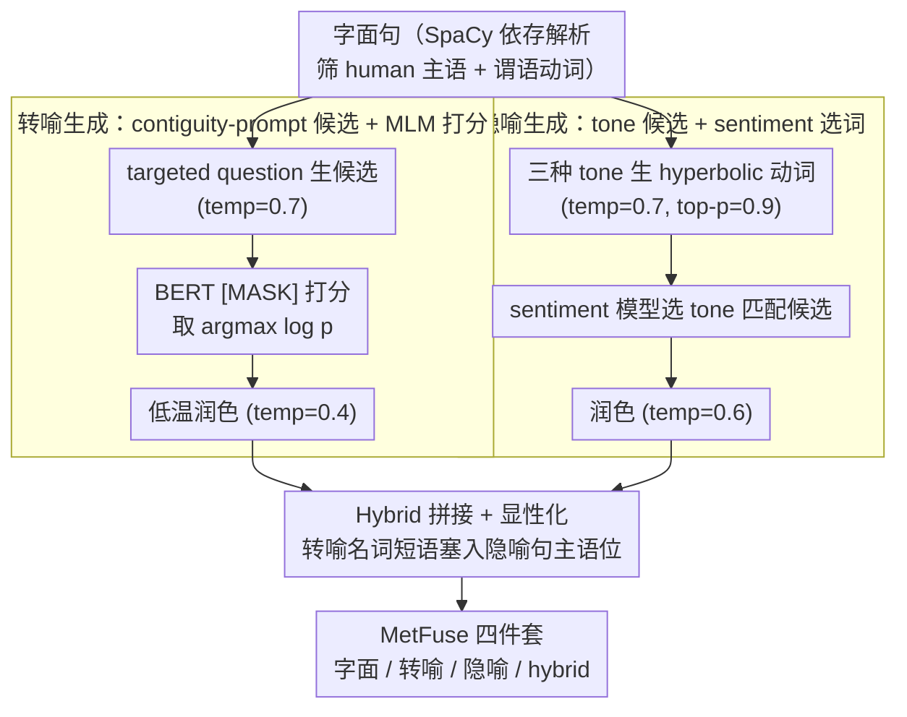

# MetFuse: Figurative Fusion between Metonymy and Metaphor

**会议**: ACL 2026  
**arXiv**: [2604.12919](https://arxiv.org/abs/2604.12919)  
**代码**: https://github.com/cincynlp/MetFuse (有)  
**领域**: 语言学 / 比喻语言 / 数据集构建  
**关键词**: 转喻、隐喻、figurative fusion、数据增强、LLM 生成

## 一句话总结
作者提出一个三阶段（候选生成 → MLM 打分挑选 → LLM 润色）流水线，把一句字面句子同时改写成转喻 / 隐喻 / 混合（hybrid）三种 figurative 变体，构造出首个 1000 quadruplet × 4000 句的 MetFuse 数据集，并实证发现"隐喻动词的出现会让同句中的转喻名词变得更显性"，在 8 个 metonymy/metaphor 分类基准上做数据增强一致涨点。

## 研究背景与动机

**领域现状**：转喻（metonymy，单域名词替换，如 "stadium" 指代 "fans"）和隐喻（metaphor，跨域映射，如 "fans erupted"）是 figurative language 的两大支柱，但 NLP 社区长期把它们当作两个独立任务做：转喻有 ConMeC / RelocaR / WiMCor，隐喻有 VUA / FLUTE / MOH-X，几乎没人把两者合在一起研究。

**现有痛点**：(i) 缺数据——理论语言学（Goossens 1990 的 metaphtonymy；Barcelona 2003）早就指出两者会共现，但没有任何 meaning-aligned 的数据集能支撑计算研究；(ii) 缺生成手段——直接 prompt LLM "把这句变成转喻" 只有 38.8% 成功率，原因是转喻必须遵守 intra-domain 约束，naive prompt 控不住；(iii) 缺交互分析——没人系统量化"隐喻与转喻共现"时彼此的可识别性会怎么变。

**核心矛盾**：转喻受 contiguity relation（部分-整体、容器-内容等）严格约束，候选空间小；隐喻则享受跨域映射的自由，候选空间大——这种不对称使得"统一框架同时生成两者"非常棘手。

**本文目标**：(a) 给定 literal 句子，可控生成语义对齐的 metonymy / metaphor / hybrid 三件套；(b) 用这个框架构造 MetFuse 数据集；(c) 实证回答"hybrid 句里的转喻 vs metonymy-only 句里的转喻，谁更容易被识别"。

**切入角度**：作者押宝两个不对称——一是生成阶段用"窄候选 + MLM 打分"约束转喻、用"宽自由 + 三种情感 tone + sentiment 选词"释放隐喻；二是分析阶段假设隐喻动词的强 selectional preference 会"逼迫" 读者把转喻名词解读为 animate agent，从而让转喻更显性。

**核心 idea**：用"LLM 生候选 + MLM/sentiment 打分挑选 + LLM 受控润色"的三段式流水线生成 figurative 变体，并通过 hybrid 数据增强 + 嵌入相似度 + LLM zero-shot 三套实验验证"metaphor strengthens metonymy"。

## 方法详解

### 整体框架
流水线只关心 SVO 结构中的"主语名词 + 谓语动词"对：先用 SpaCy 依存解析从 Wikipedia 中筛出"主语为 human entity 且与某动词存在依存关系"的字面句子，然后并行执行**转喻生成**和**隐喻生成**两条管线，最后通过"把转喻名词短语换进精炼后的隐喻句"零成本拼出 hybrid 句。两条生成管线本质上都是 "i) LLM 生候选 → ii) 外部打分器选最佳 → iii) LLM 受控润色" 三段式，但打分器（MLM 概率 vs sentiment）和温度策略截然不同；hybrid 不需要独立生成，是直接拼接出来的第三类变体。

### 关键设计

**1. 转喻生成：contiguity-prompt 出候选，MLM masked LM 打分挑词**

直接 prompt LLM"把这句改成转喻"只有 38.8% 成功率，根因是 LLM 压根不知道 contiguity（邻接关系）是什么，单域约束控不住。作者把它拆成"问对问题 + 概率打分"两步：先用 targeted questions 直接问目标名词的 location / occupants / salient parts（如 "Where does a judge work?"），以 temperature=0.7 拿一组候选 $c$；再把原句里的名词换成 `[MASK]` 喂 BERT，对每个候选算 $\log p(c \mid \text{context})$，取概率最高者 $c^* = \arg\max_c \log p_{\text{BERT}}(c)$。这一步把"单域约束"从难写的 prompt 工程问题转译成 token-level 的概率打分——out-of-domain 的候选会被自动淘汰（如把 "judge" 换成 "briefcase" 时 $\log p=-12.28$，直接出局）。最后用 temperature=0.4 做轻度润色，低温度是为了防止 LLM 二次改写又把转喻改没了。

**2. 隐喻生成：tone-conditioned 候选，sentiment 选词**

隐喻享受跨域映射的自由，但纯放开会出现"语气打架"——悲伤句里突然冒出狂喜动词。作者的折中是给自由度套一个"语气一致"的软边界：让 LLM 在 positive / negative / neutral 三种 tone 下各自生成 hyperbolic verb 候选（temperature=0.7, top-p=0.9），再用 TweetNLP 的 sentiment 模型给原句打 sentiment 标签，只保留 tone 匹配的候选动词，最后 temperature=0.6 润色通顺。这样既保住了 cross-domain 的灵活性，又不会破坏与原句的语义/情感对齐。

**3. Hybrid 零成本拼接，并验证"隐喻让转喻更显性"**

因为转喻生成几乎不动句法（只换名词），把"精炼后的转喻名词短语"直接替换进"精炼后的隐喻句"主语位置，就能零成本拼出 hybrid 句，无需任何额外 post-processing——这利用的正是"转喻不改句法、隐喻改谓语"的天然互补。验证侧用三条互证的证据支撑核心论断：(i) 4 个 LLM 在 zero-shot metonymy resolution 上，hybrid 比 metonymy-only 的 F1 高 1.4–4.3；(ii) BERT 上下文 embedding 上 $\text{sim}(N_{\text{lit}}, N_{\text{hyb}}) > \text{sim}(N_{\text{lit}}, N_{\text{mty}})$，说明 hybrid 里的名词嵌入更贴近字面用法、即更"显性"；(iii) 用 hybrid 子集做数据增强，BERT 在 4 个 metonymy 基准上一致优于 metonymy-only 增强。背后的认知语言学解释是：隐喻动词（如 "butchered"）带强 animate-agent selectional preference，会逼读者把 "newsroom" 这种 inanimate 名词解读成 "the journalists in the newsroom"，相当于用隐喻当 forcing device 来 disambiguate 转喻，把实验现象回扣到 Lakoff–Johnson 理论。

### 一个完整示例：从字面句到三件套

以字面句 "The newsroom reported the scandal" 为例走一遍流水线。**转喻管线**先问 "What does a newsroom contain?" 拿到 {journalists, editors, briefcase, …} 一组候选，BERT 给 "journalists" 打出最高 $\log p$、给 "briefcase" 打出 $-12.28$ 被淘汰，选定后润色得转喻句（"The newsroom" 已隐喻其中的记者）。**隐喻管线**对动词 "reported" 在三种 tone 下生成 hyperbolic 候选 {butchered, celebrated, whispered, …}，sentiment 模型判定原句偏 negative，于是选中 "butchered"，润色成 "The journalists butchered the scandal"。**Hybrid** 则把转喻名词短语 "The newsroom" 直接塞回隐喻句的主语位，得 "The newsroom butchered the scandal"——此时强 animate 动词 "butchered" 逼着读者把 "newsroom" 读成里面的记者，转喻反而比 metonymy-only 句更显性。

### 损失函数 / 训练策略
本文不训模型，主要是 prompting 流程。下游评测部分用 BERT-base fine-tune 3 epoch、lr=1e-5、batch=8，MetFuse 增强样本量固定为原训练集的 50%；LLM 评测全程 zero-shot，含 GPT-OSS-20B / Qwen3-30B / Llama-3.1-70B / Gemini-2.5-Flash。

## 实验关键数据

### 主实验
框架本身的人工评测（250 句样本）显示作者方法在三类 figurative 上全面碾压 general prompting baseline：

| 变体类型 | General prompt | 本文框架 | 提升 |
|----------|----------------|----------|------|
| Metonymy | 38.8% | 75.2% | +36.4 pp |
| Metaphor | 70.8% | 84.0% | +13.2 pp |
| Hybrid | 49.2% | 74.0% | +24.8 pp |

下游 metonymy 分类（70/30 split，BERT fine-tune），用 MetFuse 做数据增强：

| 数据集 | Baseline (Train) | +MetFuse Metonymy | +MetFuse Hybrid |
|--------|------------------|-------------------|------------------|
| ConMeC | 75.49 | 76.71 (+1.22) | **79.33 (+3.84)** |
| Pedinotti | 68.42 | 66.92 (-1.50) | **70.44 (+2.02)** |
| RelocaR | 67.33 | 69.99 (+2.66) | **70.67 (+3.34)** |
| WiMCor | 81.67 | 82.33 (+0.66) | **82.67 (+1.00)** |

→ 4 个数据集上 hybrid 增强一致超过 metonymy-only 增强，说明"隐喻共现"确实是更强的训练信号。

### 消融实验
LLM zero-shot metonymy resolution（hybrid vs metonymy-only positive 句）：

| 模型 | Metonymy-only F1 | Hybrid F1 | 提升 |
|------|------------------|------------|------|
| GPT-OSS-20B | 67.3 | 71.6 | +4.3 |
| Qwen3-30B | 85.4 | 87.3 | +1.9 |
| Llama-3.1-70B | 90.4 | 91.3 | +0.9 |
| Gemini-2.5 | 93.9 | 94.7 | +0.8 |

BERT 嵌入相似度（验证"hybrid 里转喻更显性"）：$\text{sim}(N_{\text{lit}}, N_{\text{hyb}}) > \text{sim}(N_{\text{lit}}, N_{\text{mty}})$ 在 4 个模型上一致成立，差距 0.20–1.86 pp，与人类 metonymicity 评分（hybrid 3.65 vs metonymy 3.47，5 分制）方向一致。

### 关键发现
- **不对称效应**：隐喻 → 转喻方向稳健（4 数据集 + 4 LLM + 人评全部一致），但转喻 → 隐喻方向不稳定（4 个 metaphor 数据集上 hybrid 增强只在 VUA Verb / MOH-X 赢，在 FLUTE / TroFi 输给纯 metaphor 增强）。
- **可解释机制**：surprisal score 显示 hybrid 句的名词 token surprisal=12.81 ≈ metonymy=12.79，动词 surprisal=12.66 ≈ metaphor=11.38，证明 hybrid 在两个维度都保留了 figurative 强度。
- **框架对 LLM 不敏感**：换 Llama-3.1-8B / GPT-OSS-20B / Qwen3-30B / Llama-3.1-70B / GPT-5 跑同一框架，metonymy 成功率全在 72-75%，说明流水线本身的结构性约束（contiguity prompt + MLM 打分）才是 carry 因素，不是 LLM 容量。

## 亮点与洞察
- **"用 MLM 当 domain gate"是个可复用的小聪明**：把 "单域约束" 这种难以 prompt 的语义约束，转译成 BERT 的 token-level log-likelihood，相当于免训练的 domain classifier，比 fine-tune 一个语义关系模型省事得多。
- **forcing-device 解释非常优雅**：用 selectional preference 把"为什么 hybrid 里转喻更显"从经验观察上升到认知语言学解释，这种"实验现象 + 理论闭环"是写作教科书级别。
- **零成本 hybrid 拼接**：利用了"转喻不改句法、隐喻改谓语"的天然互补性，省掉了 hybrid 的独立生成与对齐流程，可迁移到 sarcasm + irony、hyperbole + simile 等其他 figurative 组合。
- **数据增强 setting 干净**：固定 50% 增强比例 + 同一 BERT 超参 + 8 个基准，让"hybrid > metonymy-only"的结论几乎没有 cherry-pick 嫌疑。

## 局限与展望
- 作者承认只覆盖了 location-for-people / institution-for-people 这一种主语 metonymy，object metonymy / part-whole 等都没涉及；hybrid 比例（74%）也意味着 26% 的生成是失败的，质量天花板被 LLM 流水线绑住。
- 评测里隐喻一侧的"metonymy → metaphor"方向不一致没有给出令人信服的解释，仅在 Appendix B 留了 "deeper semantic complexities" 的占位结论。
- 没有显式 domain mapping 标注，无法支撑后续"哪些 domain pair 更容易触发 figurative fusion"的细粒度研究。改进方向：加 conceptual domain ontology、扩展到 object metonymy、把流水线扩到非英语（隐喻 / 转喻在语言间差异很大）。

## 相关工作与启发
- **vs PRINCIPLES / MERMAID（隐喻生成）**：MERMAID 用 symbolism + discriminative decoding 控制 metaphoricity，但只做隐喻单向；本文把这种"受控 + 自由"的思路同时应用到 metonymy 和 metaphor 两侧。
- **vs ChainNet (Maudslay et al. 2024)**：ChainNet 把 metonymy/metaphor 编入 WordNet 关系链，本文给出 sentence-level 的 quadruplet 数据，二者互补。
- **vs ConMeC (Ghosh & Jiang 2025)**：同一作者去年的工作只做 common-noun metonymy 分类基准，本文升级为"生成 + 分析 + 增强"三位一体，把这套基础设施完整化。

## 评分
- 新颖性: ⭐⭐⭐⭐ 首个 metonymy + metaphor 联合数据集 + forcing-device 假设的实证验证，但流水线本身（候选 + 打分 + 润色）思路在 figurative generation 文献里已有先例。
- 实验充分度: ⭐⭐⭐⭐⭐ 8 个 downstream 基准 + 4 个 LLM zero-shot + 5 个 LLM 框架泛化 + cross-domain 实验 + surprisal/embedding 多角度验证，非常扎实。
- 写作质量: ⭐⭐⭐⭐⭐ "实验现象 → 认知语言学解释"的闭环结构很漂亮，错误分析（Table 10）也写得诚恳。
- 价值: ⭐⭐⭐⭐ 数据集 + 框架开源，对 figurative language NLP 是个新基础设施；但只覆盖 location metonymy 限制了直接落地范围。

<!-- RELATED:START -->

## 相关论文

- [\[ACL 2026\] Exploring Concreteness Through a Figurative Lens](exploring_concreteness_through_a_figurative_lens.md)
- [\[ICCV 2025\] Balancing Task-Invariant Interaction and Task-Specific Adaptation for Unified Image Fusion](../../ICCV2025/nlp_understanding/balancing_task-invariant_interaction_and_task-specific_adaptation_for_unified_im.md)
- [\[ACL 2026\] LexRel: Benchmarking Legal Relation Extraction for Chinese Civil Cases](lexrel_benchmarking_legal_relation_extraction_for_chinese_civil_cases.md)
- [\[ACL 2026\] AdapTime: Enabling Adaptive Temporal Reasoning in Large Language Models](adaptime_enabling_adaptive_temporal_reasoning_in_large_language_models.md)
- [\[ACL 2026\] Knowledge-driven Augmentation and Retrieval for Integrative Temporal Adaptation](knowledge-driven_augmentation_and_retrieval_for_integrative_temporal_adaptation.md)

<!-- RELATED:END -->
