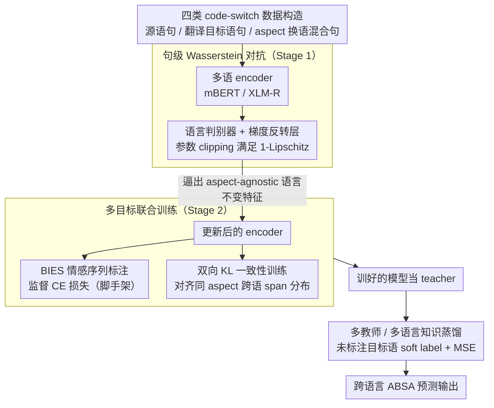

# MSMO-ABSA: Multi-Scale and Multi-Objective Optimization for Cross-Lingual Aspect-Based Sentiment Analysis

**会议**: ACL 2026  
**arXiv**: [2502.13718](https://arxiv.org/abs/2502.13718)  
**代码**: https://github.com/swaggy66/MSMO  
**领域**: 多语言 / 跨语言 ABSA / 情感分析  
**关键词**: Cross-lingual ABSA, 对抗训练, 一致性训练, 代码切换, 多目标优化

## 一句话总结
针对跨语言 aspect-based 情感分析提出 MSMO 框架——句级用 Wasserstein 对抗训练 + 代码切换数据做语言判别器对齐，aspect 级用双向 KL 一致性训练对齐同情感 aspect 的预测分布，再叠加多教师知识蒸馏，在 SemEval-2016 4 个目标语言 + mBERT/XLM-R 上稳定刷出新 SOTA，并显著超过 GPT-4o / Qwen2.5-7B-LoRA 等 LLM 方案。

## 研究背景与动机

**领域现状**：ABSA（aspect 抽取 + 情感分类联合任务）在英文已成熟，但真实社交场景多语言并存，跨语言 ABSA（XABSA）变得急迫。低资源语言无法靠人工标注，主流路线是：（1）translation-based（如 BILINGUAL-TA）；（2）code-switch（如 ACS 把 aspect term 替换成目标语）；（3）对比学习（CL-XABSA）。

**现有痛点**：（1）现有 XABSA 方法的"对齐"基本只在句子级或词嵌入级做，aspect term 自身（也就是任务的核心 anchor）的对齐反而粗糙；（2）单一目标（如纯 CE 或纯 contrastive）容易让模型偏向 source 语言的语义空间，忽略 aspect 的细粒度跨语对应；（3）对抗训练在 NLP 里多用 Domain-Adversarial GRL，对 XABSA 来说稳定性差且没用上 code-switch 的扰动信号。

**核心矛盾**：句级对齐保证整体分布相近，但同一 aspect 在不同语言不同上下文里的"细粒度语义"还是飘的；反过来只做 aspect 级对齐又会忽略整段句子的语言风格差异。两个粒度必须**同时**对齐，但目前 XABSA 方法只挑一个。

**本文目标**：设计一个"多尺度（sentence + aspect） × 多目标（supervised + consistency）"的统一框架，让 code-switch 数据同时驱动两个粒度的对齐，并把它扩展到多语言、再叠加知识蒸馏。

**切入角度**：作者注意到——code-switch 数据天然在"句子里换 aspect term"的扰动信号上既能让 language discriminator 学到"忽略 aspect 只看语言风格"的不变特征（句级），又能让 consistency 模块学到"换了语言但 aspect 同情感→预测分布应一致"（aspect 级）。同一份数据可以喂两个粒度的训练目标。

**核心 idea**：用 code-switch bilingual 数据作为"扰动锚"，同时驱动（i）Wasserstein 距离对抗训练（句级语言判别器要学到 aspect-agnostic 的 language feature），与（ii）双向 KL 一致性训练（aspect 级跨语预测分布要对齐），两者通过共享的 multilingual encoder 联合更新。

## 方法详解

### 整体框架

MSMO 的核心判断是：跨语言 ABSA 必须**同时**在句子级和 aspect 级对齐，而一份 code-switch（aspect-swap）数据恰好能同时喂这两个粒度的目标。它走两阶段顺序训练：Stage 1 用 multilingual encoder（mBERT/XLM-R）配一个带梯度反转层的语言判别器，靠 Wasserstein 对抗把整句表示压成语言不变特征；Stage 2 用更新过的 encoder 一路做 BIES 情感序列标注（CE）、一路用双向 KL 把"同一 aspect 在源语 / 换语后"的预测分布对齐。训完的模型还能当 teacher，用未标注目标语数据做单/多教师蒸馏进一步提分。

### 关键设计

**1. Code-switch 数据驱动的句级 Wasserstein 对抗：逼出 aspect-agnostic 的语言不变特征**

以往 XABSA 的对抗对齐（如 ADAN-GRL）只用 bilingual parallel 数据、缺 aspect 扰动，且 GRL 对抗稳定性差。MSMO 先构造四类数据——源语 $D_S$、翻译目标语 $D_T$，以及把 aspect term 换成另一语的混合句 $D_{S_T}$ / $D_{T_S}$——再让语言判别器 $Q$ 把 $D_S \cup D_{S_T}$ 判为 source、$D_T \cup D_{T_S}$ 判为 target，目标函数 $J_q = \max_{\theta_q} \mathbb{E}[Q(P(h_i))] - \mathbb{E}[Q(P(h_i'))]$，并对 $Q$ 的参数 clipping 到 $[-c, c]$ 以满足 1-Lipschitz（用 Wasserstein 距离替代标准 GAN，避免训练震荡）。关键在于混入 $D_{S_T}/D_{T_S}$ 后，判别器必须学会"无论句中 aspect 是哪国语言，都只凭整句风格判语言"，通过 GRL 反传，encoder 就被迫交出真正 aspect-agnostic 的不变特征，为下一步 aspect 级细粒度对齐铺好地基。

**2. 双向 KL 一致性训练：把"同情感 aspect 跨语应一致"约束在 span 分布上**

句级对齐只能让整体分布靠近，但"food 与 nourriture 同 POS、service 与 service 同 NEG"这种细粒度对应飘忽不定，得直接在 aspect 上约束。作者把源句 $X$ 经 transformation $\phi$（翻译 / aspect swap）得到 $X'$ 及对应 aspect span $(s, s')$，把 span 概率定义为构成它的 token 概率之积，再用对称化 KL 拉齐两个分布：

$$\mathcal{L}_{\text{cons}} = \frac{1}{m} \sum \frac{1}{2}\big[\mathrm{KL}(P(y'|s') \,\|\, P(y|s)) + \mathrm{KL}(P(y|s) \,\|\, P(y'|s'))\big]$$

在 span 而非 token 上算 KL，是为了绕开 BIES 标签序列内部 token 不对齐的问题，让一致性约束正好落在 aspect 这个任务核心单元上；双向对称化则避免单向 KL 的偏置。

**3. 多教师 / 多语言知识蒸馏：用未标注目标语数据当放大器**

MSMO 自身的 teacher 比 CL-XABSA 更强，soft label 更准，于是再叠一层蒸馏来榨取未标注目标语文本。用 3 个 teacher（来自不同源语言或不同随机种子）各自预测未标注目标语文本，加权得 soft label $p_t = \sum_{k=1}^{3} w_k g_{t_k}$（$w_k = 1/3$）；student 只保留 encoder + sentiment classifier，用 $\mathcal{L}_{KD} = \frac{1}{|D_{NL}|} \sum \frac{1}{L} \sum_i \mathrm{MSE}(p_{t_i}, p_{s_i})$ 对齐软标签。多教师把不同语言对的优势平均进来，降低单 teacher 的过拟合偏差，实验里 multi-teacher 一致优于 single-teacher。

### 损失函数 / 训练策略
- **Stage 1**：$J_q$（Wasserstein 对抗，$Q$ 参数 clipping $[-c, c]$ 保证 1-Lipschitz）；GRL 系数 $\lambda = 1$。
- **Stage 2**：$\mathcal{L}_{\text{total}} = \sum \mathcal{L}_{\text{CE}} + \beta \sum \mathcal{L}_{\text{cons}}$，$\beta$ 按目标语言网格搜索：mBERT 取 $\{4.5, 2.5, 2.5, 3.5\} \times 10^{-4}$、XLM-R 取 $\{2.5, 1.5, 1.5, 3.5\} \times 10^{-3}$（对应 FR/ES/NL/RU）。
- **超参**：mBERT lr=5e-5 / bs=16 / 2000 steps；XLM-R lr=2e-5 / bs=8 / 2500 steps；Stage 1 GPU 占用 ≈ 27 GB (XLM-R)；5 random seeds 平均。
- **蒸馏阶段**：student 初始化用翻译目标语训练，再用 MSE 蒸馏 unlabeled target。

## 实验关键数据

### 主实验
SemEval-2016 ABSA, 源语 = English, 目标语 = FR/ES/NL/RU, Micro-F1 评价：

| 方法 | FR | ES | NL | RU | Avg (mBERT) | Avg (XLM-R) |
|------|----|----|----|----|-------------|-------------|
| Zero-shot baseline | 45.60 / 56.43 | 57.32 / 67.10 | 42.68 / 59.03 | 36.01 / 56.80 | 45.40 | 59.84 |
| Translation-TA (Li et al. 2021) | 40.76 / 47.00 | 50.74 / 58.10 | 47.13 / 56.19 | 41.67 / 50.34 | 45.08 | 52.91 |
| ACS (Zhang et al. 2021a, code-switch) | 49.65 / 59.39 | 59.99 / 67.32 | 51.19 / 62.83 | 52.09 / 60.81 | 53.23 | 62.59 |
| CL-XABSA (TL, Lin et al. 2023) | 50.55 / 59.47 | 60.09 / 64.63 | 52.45 / 59.40 | 50.73 / 61.13 | 53.46 | 61.16 |
| Equi-XABSA (Lin et al. 2024) | 50.08 / 60.68 | 63.08 / 69.56 | 51.85 / 61.31 | 52.59 / 62.34 | 54.40 | 63.47 |
| **MSMO (本文)** | **51.42 / 61.01** | **63.26 / 69.74** | **52.68 / 63.26** | **53.45 / 62.52** | **55.20** | **64.13** |
| ACS-Distill-M | 52.25 / 59.90 | 62.91 / 69.24 | 53.40 / 63.74 | 54.58 / 62.02 | 55.79 | 63.73 |
| CL-XABSA-Distill-M | 52.99 / 62.10 | 63.54 / 69.37 | 53.52 / 64.27 | 53.98 / 62.29 | 56.01 | 64.51 |
| **MSMO-Distill-M (本文)** | **54.39 / 63.89** | **64.59 / 69.93** | **54.14 / 65.15** | **54.89 / 63.20** | **56.94** | **65.54** |
| Supervised (oracle 全量目标语训练) | 61.80 / 67.44 | 67.88 / 71.93 | 56.80 / 64.28 | 58.87 / 64.93 | 61.34 | 67.15 |

**vs LLM zero-shot / LoRA**：

| LLM 配置 | FR | ES | NL | RU | Avg |
|----------|----|----|----|----|-----|
| GPT-4o (zero-shot) | 48.43 | 49.91 | 49.94 | 45.15 | 48.36 |
| Qwen2.5-7B + LoRA | 63.01 | 68.95 | 60.84 | 53.50 | 61.58 |
| **MTL-MSMO-Distill (XLM-R, 本文)** | **63.23** | **70.95** | **66.24** | **64.36** | **66.20** |

### 消融实验

| 配置 | FR | ES | NL | RU | Avg (mBERT) | Avg (XLM-R) |
|------|----|----|----|----|-------------|-------------|
| MSMO (full) | 51.42 / 61.01 | 63.26 / 69.47 | 52.68 / 63.26 | 53.45 / 62.52 | 55.20 | 64.13 |
| w/o Language Discriminator | 49.70 / 59.82 | 60.61 / 68.10 | 51.57 / 62.41 | 52.21 / 60.99 | 53.52 (-1.68) | 62.83 (-1.30) |
| w/o Consistency Training | 50.59 / 59.51 | 60.40 / 67.96 | 51.30 / 62.91 | 52.25 / 61.82 | 53.63 (-1.57) | 63.05 (-1.08) |
| Stage 1 GPU 占用 (XLM-R) | – | – | – | – | – | -3 GB vs full |

$\beta$ 敏感性：太小→退化为纯 supervised，跨语泛化差；太大→consistency 主导，语言特异性丢失；Spanish 在更小 $\beta$ 上最优（因与 EN 同语系，语义空间易对齐）。

### 关键发现
- **两个模块都不可或缺**：去掉语言判别器或一致性训练，均掉 1-1.7 F1；判别器贡献略大于一致性，说明先把语言整体分布对齐再做 aspect 细粒度对齐是正确顺序。
- **XLM-R 始终优于 mBERT**：因 XLM-R 用更大跨语预训练；MSMO 的相对增益在两个 backbone 上一致，说明方法是 backbone-agnostic 的。
- **Spanish 提升最大 (+3.14% mBERT / +4.89% XLM-R vs CL-XABSA)**：因 ES 与 EN 同 Indo-European Romance，语义空间易对齐，MSMO 的细粒度对齐发挥出更大杠杆。
- **Multi-teacher > single-teacher**：蒸馏阶段 multi-teacher 普遍 +0.5-1.0 F1，soft label 平均化降低了单 teacher 偏差。
- **MSMO 完胜 LLM**：MTL-MSMO-Distill on XLM-R (66.20) 显著超过 Qwen2.5-7B-LoRA (61.58) 与 GPT-4o zero-shot (48.36)——验证"专门 finetune 的小模型在 token-level 标注任务上仍优于通用 LLM"。
- **MSMO 离 supervised 上限只剩 ~1-3 F1**：MSMO-Distill-M XLM-R Avg 65.54 vs Supervised 67.15，几乎追平用全量目标语标签训练。

## 亮点与洞察
- **"code-switch 数据驱动双粒度对齐"是干净的多任务设计**：同一份扰动数据既给语言判别器做 invariant feature 学习，又给一致性模块做 aspect 分布对齐——这种"一份数据撑两个 loss"的复用思路在低资源 NLP 框架里非常值得借鉴。
- **Wasserstein + 1-Lipschitz 取代标准 GAN 对抗**：避免了 ADAN-GRL 的训练不稳定，参数 clipping 比 gradient penalty 实现更简洁；对小数据 sequence labeling 任务很合适。
- **Span 概率定义为 token 概率之积**：把 BIES 序列标注的 aspect 看作 span-level 单元，让 KL 散度可以直接作用在 aspect 单位上而非 token 上——避开了 BIES 标签内部 token 顺序问题，是把 sequence labeling 与 distribution alignment 缝合的关键 trick。
- **小模型 + 任务专属方法仍能打败大 LLM**：MTL-MSMO-Distill XLM-R 66.20 vs Qwen2.5-7B-LoRA 61.58，提醒大家——结构化输出任务（特别是 BIES 序列）不要全押 LLM，特定方法 + 多教师蒸馏的小模型仍是性价比之选。

## 局限与展望
- **作者承认**：（1）aspect 跨语对齐对高度 idiomatic 表达（如俚语 / 文化梗）仍弱，因为 code-switch 数据本身假设 aspect 可一一对应翻译；（2）仅在 SemEval-2016 一个数据集 4 个目标语上验证，generalizability 未知。
- **自己发现**：（1）依赖 machine translation 构造 $D_T$，翻译质量直接限制了 ceiling——对低资源语言（如非洲语 / 东南亚语）这条路并不容易复制；（2）$\beta$ 必须按每个目标语单独调，4 个超参在实际部署中是负担，没给自适应 $\beta$ 的探索；（3）span 概率取 token 概率乘积假设 token 独立，长 aspect 会让概率指数级缩小，KL 信号会被极少数 token dominate；（4）多教师蒸馏要训多个 teacher，实际计算成本是 single teacher 的 3 倍，论文没给 cost-vs-gain 的明确分析；（5）只与 GPT-4o / Qwen 等通用 LLM 比，没有与同样为序列标注定制 prompt 的 LLM（如 instructions with BIO output 严格约束）对比，可能高估了 LLM 的劣势。
- **改进思路**：把 hard code-switch 换成 mixup 风格的"软 token swap"以扩展到无法翻译的 aspect；把 $\beta$ 改为 learnable scalar 或 per-language adaptive；尝试在 LLM 上用 GRPO 直接优化 span-level F1 看是否能追上 MSMO。

## 相关工作与启发
- **vs ACS (Zhang et al. 2021a)**: ACS 首次引入 aspect code-switch，但只用一个粒度的对齐；MSMO 在此基础上加 Wasserstein 对抗 + 一致性 KL，让同一份 code-switch 数据驱动两个粒度。
- **vs CL-XABSA (Lin et al. 2023)**: CL-XABSA 用 contrastive learning 在 token 与 sentiment 两层做对齐；MSMO 改用对抗 + KL 一致性，并增加 sentence-level 对齐，在所有语言上稳定胜出 0.5-2 F1。
- **vs Equi-XABSA (Lin et al. 2024)**: 该方法关注类别不平衡 + 语言表示差异；MSMO 关注双粒度对齐，两者目标互补，可以叠加但本文未尝试。
- **vs Wang & Pan (2018) Adversarial XABSA**: 早期对抗 XABSA 只用 GRL 做 source/target 分类，对抗稳定性差；MSMO 用 Wasserstein + 1-Lipschitz + code-switch 扰动，训练更稳。
- **vs Consistency training in NER (Zhou et al. 2022, ConNER)**: ConNER 在跨语 NER 用 token-level consistency；MSMO 适配到 ABSA 的 span 单位（aspect term），是该思路在 ABSA 任务上的首次系统实现。
- **vs GPT-NER / 通用 LLM**: 序列标注任务上 LoRA fine-tune 的 7B LLM 仍输 5 个 F1，说明 BIES tag 与 sentiment 联合预测对 LLM 还是较难——MSMO 验证了 task-specific architecture 不可被 LLM 一并取代。

## 评分
- 新颖性: ⭐⭐⭐⭐ "双粒度对齐 + code-switch 共享数据 + Wasserstein 对抗 + span KL"是干净的多任务设计；单点创新不爆炸但缝合得很自然。
- 实验充分度: ⭐⭐⭐⭐ 4 个目标语 × 2 个 backbone × 7 个 baseline + 3 模式蒸馏 + 与 5 个 LLM 比较 + 消融 + $\beta$ 敏感性，覆盖到位。
- 写作质量: ⭐⭐⭐⭐ 公式 / 数据流 / 两阶段训练顺序讲得很清晰；唯一遗憾是 main paper 缺一个统一的 cost-performance 图。
- 价值: ⭐⭐⭐⭐ 给跨语言 NLP 序列标注社区直接可用的 backbone-agnostic 框架；MSMO-Distill on XLM-R 66.20 几乎逼近 supervised 上限 67.15，且代码已开源。

<!-- RELATED:START -->

## 相关论文

- [\[ACL 2026\] DimABSA: Building Multilingual and Multidomain Datasets for Dimensional Aspect-Based Sentiment Analysis](dimabsa_building_multilingual_and_multidomain_datasets_for_dimensional_aspect-ba.md)
- [\[ACL 2025\] Dynamic Order Template Prediction for Generative Aspect-Based Sentiment Analysis](../../ACL2025/nlp_understanding/dot_absa_template.md)
- [\[ACL 2026\] MADE: A Living Benchmark for Multi-Label Text Classification with Uncertainty Quantification](made_a_living_benchmark_for_multi-label_text_classification_with_uncertainty_qua.md)
- [\[ACL 2026\] MTSQL-R1: Towards Long-Horizon Multi-Turn Text-to-SQL via Agentic Training](mtsql-r1_towards_long-horizon_multi-turn_text-to-sql_via_agentic_training.md)
- [\[ACL 2026\] HCRE: LLM-based Hierarchical Classification for Cross-Document Relation Extraction](hcre_llm-based_hierarchical_classification_for_cross-document_relation_extractio.md)

<!-- RELATED:END -->
